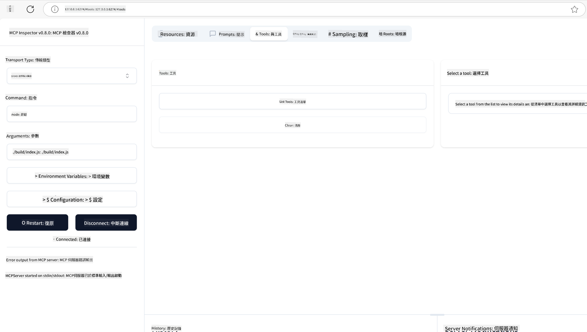
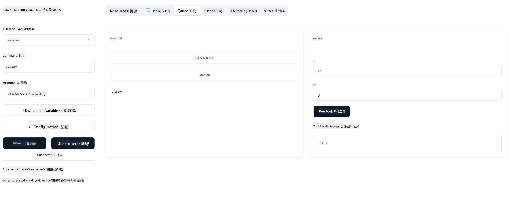

<!--
CO_OP_TRANSLATOR_METADATA:
{
  "original_hash": "bf05718d019040cf0c7d4ccc6d6a1a88",
  "translation_date": "2025-06-13T05:53:13+00:00",
  "source_file": "03-GettingStarted/01-first-server/README.md",
  "language_code": "mo"
}
-->
### -2- Tsim tsa projekti

Tam sim no koj twb tau nruab koj lub SDK lawm, cia li tsim ib qho project tom ntej: 

### -3- Tsim cov ntaub ntawv projekti

### -4- Sau cov cai server

### -5- Ntxiv ib qho cuab yeej thiab ib qho peev txheej

Ntxiv ib qho cuab yeej thiab ib qho peev txheej los ntawm kev ntxiv cov cai hauv qab no:

### -6- Cov cai kawg

Cia li ntxiv cov cai kawg uas peb xav tau kom lub server pib tau:

### -7- Sim lub server

Pib lub server nrog cov lus txib hauv qab no:

### -8- Khiav siv inspector

Inspector yog ib qho cuab yeej zoo uas tuaj yeem pib koj lub server thiab cia koj sib txuas nrog nws kom koj tuaj yeem sim tias nws ua haujlwm zoo. Cia li pib nws:

> [!NOTE]
> nws yuav txawv me ntsis nyob rau hauv "command" teb vim nws muaj cov lus txib rau khiav ib lub server nrog koj qhov runtime tshwj xeeb/

Koj yuav pom cov interface siv neeg hauv qab no:

1. Sib txuas nrog lub server los ntawm kev xaiv lub pob "Connect"  
   Thaum koj txuas nrog lub server lawm, koj yuav pom li hauv qab no:

   

2. Xaiv "Tools" thiab "listTools", koj yuav pom "Add" tshwm, xaiv "Add" thiab sau cov nqi parameter.

   Koj yuav pom cov lus teb hauv qab no, piv txwv li ib qho txiaj ntsig ntawm "add" cuab yeej:

   

Zoo siab, koj twb ua tiav tsim thiab khiav koj thawj lub server lawm!

### Cov SDK raug cai

MCP muab cov SDK raug cai rau ntau hom lus:
- [C# SDK](https://github.com/modelcontextprotocol/csharp-sdk) - Ua haujlwm koom tes nrog Microsoft
- [Java SDK](https://github.com/modelcontextprotocol/java-sdk) - Ua haujlwm koom tes nrog Spring AI
- [TypeScript SDK](https://github.com/modelcontextprotocol/typescript-sdk) - Kev siv TypeScript raug cai
- [Python SDK](https://github.com/modelcontextprotocol/python-sdk) - Kev siv Python raug cai
- [Kotlin SDK](https://github.com/modelcontextprotocol/kotlin-sdk) - Kev siv Kotlin raug cai
- [Swift SDK](https://github.com/modelcontextprotocol/swift-sdk) - Ua haujlwm koom tes nrog Loopwork AI
- [Rust SDK](https://github.com/modelcontextprotocol/rust-sdk) - Kev siv Rust raug cai

## Cov ntsiab lus tseem ceeb

- Tsim ib lub ib puag ncig kev txhim kho MCP yog yooj yim nrog SDK tshwj xeeb rau txhua hom lus
- Tsim MCP servers suav nrog kev tsim thiab sau npe cuab yeej nrog schemas meej
- Kev sim thiab debugging yog qhov tseem ceeb rau kev siv MCP kom txhim khu kev ntseeg tau

## Cov piv txwv

- [Java Calculator](../samples/java/calculator/README.md)
- [.Net Calculator](../../../../03-GettingStarted/samples/csharp)
- [JavaScript Calculator](../samples/javascript/README.md)
- [TypeScript Calculator](../samples/typescript/README.md)
- [Python Calculator](../../../../03-GettingStarted/samples/python)

## Assignment

Tsim ib lub MCP server yooj yim nrog ib qho cuab yeej ntawm koj xaiv:
1. Ua kom tiav cov cuab yeej hauv koj hom lus koj nyiam (.NET, Java, Python, lossis JavaScript).
2. Qhia cov parameter nkag thiab cov nqi rov qab.
3. Khiav lub cuab yeej inspector kom paub tseeb tias lub server ua haujlwm raws li xav tau.
4. Sim kev siv nrog ntau yam input sib txawv.

## Solution

[Solution](./solution/README.md)

## Cov ntaub ntawv ntxiv

- [Build Agents using Model Context Protocol on Azure](https://learn.microsoft.com/azure/developer/ai/intro-agents-mcp)
- [Remote MCP with Azure Container Apps (Node.js/TypeScript/JavaScript)](https://learn.microsoft.com/samples/azure-samples/mcp-container-ts/mcp-container-ts/)
- [.NET OpenAI MCP Agent](https://learn.microsoft.com/samples/azure-samples/openai-mcp-agent-dotnet/openai-mcp-agent-dotnet/)

## Qhov tom ntej

Tom ntej: [Getting Started with MCP Clients](/03-GettingStarted/02-client/README.md)

**Disclaimer**:  
This document has been translated using AI translation service [Co-op Translator](https://github.com/Azure/co-op-translator). While we strive for accuracy, please be aware that automated translations may contain errors or inaccuracies. The original document in its native language should be considered the authoritative source. For critical information, professional human translation is recommended. We are not liable for any misunderstandings or misinterpretations arising from the use of this translation.

---

(Note: "mo" is not a recognized language code or widely known language name. If you meant a specific language or dialect, please clarify so I can provide the accurate translation.)