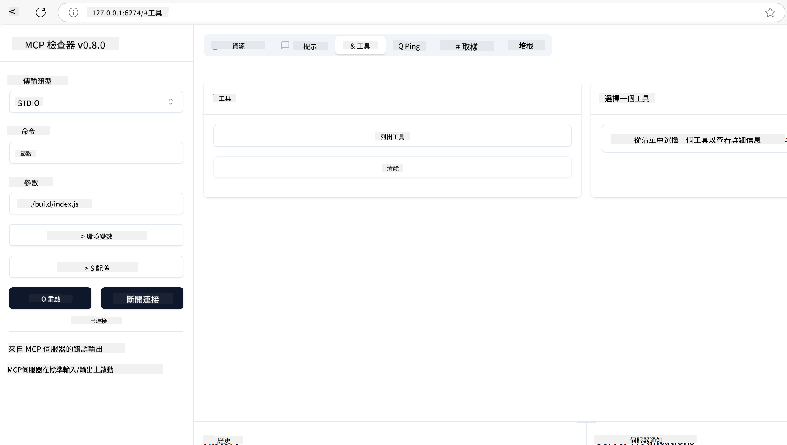

<!--
CO_OP_TRANSLATOR_METADATA:
{
  "original_hash": "5331ffd328a54b90f76706c52b673e27",
  "translation_date": "2025-05-17T08:22:45+00:00",
  "source_file": "03-GettingStarted/01-first-server/README.md",
  "language_code": "mo"
}
-->
# MCP စတင်အသုံးပြုခြင်း

Model Context Protocol (MCP) နှင့် ပထမဆုံးခြေလှမ်းများကို ကြိုဆိုပါသည်! သင် MCP အသစ်ဖြစ်စေ၊ သင်၏နားလည်မှုကို နက်ရှိုင်းစေရန် ကြိုးစားနေပါစေ၊ ဤလမ်းညွှန်ချက်သည် အရေးကြီးသော ဆက်တင်နှင့် ဖွံ့ဖြိုးတိုးတက်မှု လုပ်ငန်းစဉ်ကို လမ်းပြပေးပါမည်။ MCP သည် AI မော်ဒယ်များနှင့် အပလီကေးရှင်းများအကြား လွယ်ကူစွာ ပေါင်းစည်းမှုကို မည်သို့ ခွင့်ပြုသည်ကို ရှာဖွေတွေ့ရှိမည်ဖြစ်ပြီး MCP ဖြင့် အင်အားပြည့်သော ဖြေရှင်းချက်များကို တည်ဆောက်ခြင်းနှင့် စမ်းသပ်ခြင်းအတွက် သင့်ပတ်ဝန်းကျင်ကို အလျင်အမြန် ပြင်ဆင်ရန် မည်သို့လုပ်ရမည်ကို သင်လေ့လာပါမည်။

> TLDR; AI အပလီကေးရှင်းများကို တည်ဆောက်ပါက၊ သင်သည် LLM (အကြီးစား ဘာသာစကား မော်ဒယ်) သို့ ကိရိယာများနှင့် အခြား အရင်းအမြစ်များကို ထည့်နိုင်သည်ကို သိပြီးသားဖြစ်ပါသည်။ သို့သော် အဆိုပါ ကိရိယာများနှင့် အရင်းအမြစ်များကို ဆာဗာပေါ်တွင် ထားပါက အပလီကေးရှင်းနှင့် ဆာဗာ၏ စွမ်းရည်များကို LLM ပါ/မပါ ဘယ်မဆို မည်သည့်ဖောက်သည်မှ အသုံးပြုနိုင်သည်။

## အကြမ်းဖျဉ်းအကျဉ်းချုပ်

ဤသင်ခန်းစာသည် MCP ပတ်ဝန်းကျင်များကို စတင်ဆက်တင်ခြင်းနှင့် သင့်ရဲ့ ပထမဆုံး MCP အပလီကေးရှင်းများကို တည်ဆောက်ခြင်းအပေါ် အကောင်အထည်ဖော်လမ်းညွှန်ချက်များကို ပေးသည်။ လိုအပ်သော ကိရိယာများနှင့် ဖရိမ်ဝပ်များကို မည်သို့ဆက်တင်ရမည်၊ အခြေခံ MCP ဆာဗာများကို တည်ဆောက်ခြင်း၊ အိမ်ရှင် အပလီကေးရှင်းများကို ဖန်တီးခြင်းနှင့် သင်၏ အကောင်အထည်ဖော်မှုများကို စမ်းသပ်ခြင်းကို သင်လေ့လာပါမည်။

Model Context Protocol (MCP) သည် အပလီကေးရှင်းများသည် LLM များသို့ အကြောင်းအရာ ပေးသည့် နည်းလမ်းကို စံပြုသည့် ဖွင့်လှစ်ထားသော ပရိုတိုကော ဖြစ်သည်။ MCP ကို AI အပလီကေးရှင်းများအတွက် USB-C ဆက်သွယ်မှုလိုမျိုး တွေးပါ - AI မော်ဒယ်များကို မတူညီသော ဒေတာအရင်းအမြစ်များနှင့် ကိရိယာများသို့ ချိတ်ဆက်ရန် စံပြုနည်းလမ်းကို ပေးသည်။

## သင်ယူရည်မှန်းချက်များ

ဤသင်ခန်းစာအဆုံးတွင်၊ သင်သည် အောက်ပါအရာများကို ပြုလုပ်နိုင်လိမ့်မည်-

- C#, Java, Python, TypeScript, နှင့် JavaScript တွင် MCP အတွက် ဖွံ့ဖြိုးတိုးတက်မှု ပတ်ဝန်းကျင်များကို ဆက်တင်ခြင်း
- စိတ်ကြိုက်အင်္ဂါရပ်များ (အရင်းအမြစ်များ၊ မေးခွန်းများနှင့် ကိရိယာများ) ဖြင့် အခြေခံ MCP ဆာဗာများကို တည်ဆောက်ခြင်းနှင့် တင်သွင်းခြင်း
- MCP ဆာဗာများသို့ ချိတ်ဆက်သည့် အိမ်ရှင် အပလီကေးရှင်းများ ဖန်တီးခြင်း
- MCP အကောင်အထည်ဖော်မှုများကို စမ်းသပ်ခြင်းနှင့် အမှားပြင်ခြင်း

## သင့် MCP ပတ်ဝန်းကျင်ကို ဆက်တင်ခြင်း

MCP နှင့် လုပ်ဆောင်ရန် မစတင်မီ သင်၏ ဖွံ့ဖြိုးတိုးတက်မှု ပတ်ဝန်းကျင်ကို ပြင်ဆင်ရန်နှင့် အခြေခံ လုပ်ငန်းစဉ်ကို နားလည်ရန် အရေးကြီးသည်။ ဤအပိုင်းသည် MCP ဖြင့် စတင်မှုကို ချောမွေ့စေရန် အစပိုင်းဆက်တင်ခြင်းအဆင့်များကို လမ်းပြပေးပါမည်။

### ကြိုတင်လိုအပ်ချက်များ

MCP ဖွံ့ဖြိုးတိုးတက်မှုအတွက် ချောက်ချားမတိုင်မီ၊ သင်သည် အောက်ပါအရာများရှိကြောင်း သေချာပါစေ-

- **ဖွံ့ဖြိုးတိုးတက်မှု ပတ်ဝန်းကျင်**: သင့်ရွေးချယ်ထားသော ဘာသာစကားအတွက် (C#, Java, Python, TypeScript, သို့မဟုတ် JavaScript)
- **IDE/Editor**: Visual Studio, Visual Studio Code, IntelliJ, Eclipse, PyCharm, သို့မဟုတ် မည်သည့် ခေတ်မီ ကုဒ်တည်းဖြတ်စက်
- **Package Managers**: NuGet, Maven/Gradle, pip, သို့မဟုတ် npm/yarn
- **API Keys**: သင့်အိမ်ရှင် အပလီကေးရှင်းများတွင် အသုံးပြုရန် စီစဉ်ထားသော မည်သည့် AI ဝန်ဆောင်မှုများအတွက်မဆို

## အခြေခံ MCP ဆာဗာ ဖွဲ့စည်းပုံ

MCP ဆာဗာသည် မကြာခဏ အောက်ပါအရာများပါဝင်သည်-

- **ဆာဗာ ဖွဲ့စည်းပုံ**: ပေါ့၊ အသိအမှတ်ပြုခြင်း၊ နှင့် အခြား ဆက်တင်များကို ဆက်တင်ခြင်း
- **အရင်းအမြစ်များ**: LLM များကို ရရှိနိုင်သော ဒေတာနှင့် အကြောင်းအရာ
- **ကိရိယာများ**: မော်ဒယ်များက ခေါ်ယူနိုင်သော လုပ်ဆောင်ချက်များ
- **မေးခွန်းများ**: စာသားကို ဖန်တီးခြင်း သို့မဟုတ် ဖွဲ့စည်းခြင်းအတွက် ပုံစံများ

TypeScript တွင် ရိုးရှင်းသော ဥပမာကတော့-

```typescript
import { Server, Tool, Resource } from "@modelcontextprotocol/typescript-server-sdk";

// Create a new MCP server
const server = new Server({
  port: 3000,
  name: "Example MCP Server",
  version: "1.0.0"
});

// Register a tool
server.registerTool({
  name: "calculator",
  description: "Performs basic calculations",
  parameters: {
    expression: {
      type: "string",
      description: "The math expression to evaluate"
    }
  },
  handler: async (params) => {
    const result = eval(params.expression);
    return { result };
  }
});

// Start the server
server.start();
```

အထက်ပါကုဒ်တွင်-

- MCP TypeScript SDK မှ လိုအပ်သော အတန်းများကို တင်သွင်းပါ။
- MCP ဆာဗာအသစ်တစ်ခုကို ဖန်တီးပြီး ဖွဲ့စည်းပါ။
- စိတ်ကြိုက် ကိရိယာ (`calculator`) ကို လက်ကိုင်လုပ်ဆောင်ချက်ဖြင့် မှတ်ပုံတင်ပါ။
- ဝင်ရောက်လာသော MCP အမြှောက်များကို နားထောင်ရန် ဆာဗာကို စတင်ပါ။

## စမ်းသပ်ခြင်းနှင့် အမှားပြင်ခြင်း

သင့် MCP ဆာဗာကို စမ်းသပ်ရန် မစတင်မီ ရရှိနိုင်သော ကိရိယာများနှင့် အမှားပြင်ရန် အကောင်းဆုံး လုပ်နည်းလမ်းများကို နားလည်ရန် အရေးကြီးသည်။ ထိရောက်သော စမ်းသပ်မှုက သင့်ဆာဗာကို မျှော်မှန်းသလို အပြုသဘောဆောင်သည်ကို သေချာစေပြီး ပြဿနာများကို အမြန်ပြန်လည်ရှာဖွေရန် ကူညီပေးသည်။ အောက်ပါအပိုင်းသည် သင့် MCP အကောင်အထည်ဖော်မှုကို အတည်ပြုရန် အကြံပြုထားသော နည်းလမ်းများကို ဖော်ပြသည်။

MCP သည် သင့်ဆာဗာများကို စမ်းသပ်ခြင်းနှင့် အမှားပြင်ခြင်းတွင် ကူညီရန် ကိရိယာများကို ပေးသည်-

- **Inspector tool**, ဤ ဂရပ်ဖစ်မျက်နှာပြင်သည် သင့်ဆာဗာသို့ ချိတ်ဆက်ရန်နှင့် သင့်ကိရိယာများ၊ မေးခွန်းများနှင့် အရင်းအမြစ်များကို စမ်းသပ်ရန် ခွင့်ပြုသည်။
- **curl**, သင်သည် curl သို့မဟုတ် HTTP အမြှောက်များကို ဖန်တီးပြီး လုပ်ဆောင်နိုင်သော အခြားဖောက်သည်များကဲ့သို့သော command line ကိရိယာကို အသုံးပြု၍ သင့်ဆာဗာသို့ ချိတ်ဆက်နိုင်သည်။

### MCP Inspector ကို အသုံးပြုခြင်း

[MCP Inspector](https://github.com/modelcontextprotocol/inspector) သည် သင်ကို ကူညီသော အမြင်အာရုံ စမ်းသပ်မှု ကိရိယာတစ်ခုဖြစ်သည်-

1. **Discover Server Capabilities**: ရရှိနိုင်သော အရင်းအမြစ်များ၊ ကိရိယာများနှင့် မေးခွန်းများကို အလိုအလျောက် ရှာဖွေပါ
2. **Test Tool Execution**: မတူညီသော ပါရာမီတာများကို ကြိုးစားပြီး တုံ့ပြန်မှုများကို အချိန်နာရီတွင် ကြည့်ပါ
3. **View Server Metadata**: ဆာဗာ အချက်အလက်များ၊ စကီမာများနှင့် ဖွဲ့စည်းမှုများကို စစ်ဆေးပါ

```bash
# ex TypeScript, installing and running MCP Inspector
npx @modelcontextprotocol/inspector node build/index.js
```

အထက်ပါ အမြှောက်များကို လုပ်ဆောင်သောအခါ MCP Inspector သည် သင့်ဘရောက်ဇာတွင် ဒေသိက ဝဘ်မျက်နှာပြင်ကို စတင်ပါမည်။ သင်သည် MCP ဆာဗာများ၊ သူတို့ရရှိနိုင်သော ကိရိယာများ၊ အရင်းအမြစ်များနှင့် မေးခွန်းများကို ပြသသည့် ဒက်ရှ်ဘုတ်ကို မြင်နိုင်လိမ့်မည်ဟု မျှော်လင့်ပါ။ မျက်နှာပြင်သည် သင့်အား ကိရိယာ လုပ်ဆောင်မှုကို အပြန်အလှန် စမ်းသပ်ရန်၊ ဆာဗာ မီတာဒေတာကို စစ်ဆေးရန်နှင့် အချိန်နာရီ တုံ့ပြန်မှုများကို ကြည့်ရန် ခွင့်ပြုသည်၊ သင့် MCP ဆာဗာ အကောင်အထည်ဖော်မှုများကို အတည်ပြုခြင်းနှင့် အမှားပြင်ခြင်းကို လွယ်ကူစေသည်။

ဤသည်မှာ ၎င်းက တစ်ခုခုလိုမျိုး ဖြစ်နိုင်သော screenshot ဖြစ်သည်-



## စက်တင်ပြဿနာများနှင့် ဖြေရှင်းနည်းများ

| ပြဿနာ | ဖြစ်နိုင်သော ဖြေရှင်းနည်း |
|-------|-------------------|
| ချိတ်ဆက်မှု ငြင်းပယ်ခြင်း | ဆာဗာကို လည်ပတ်နေသည်နှင့် ပေါ့မှန်ကန်ကြောင်း စစ်ဆေးပါ |
| ကိရိယာ လုပ်ဆောင်မှု အမှားများ | ပါရာမီတာ အတည်ပြုခြင်းနှင့် အမှားကိုင်တွယ်ခြင်းကို ပြန်လည်သုံးသပ်ပါ |
| အသိအမှတ်ပြုခြင်း မအောင်မြင်ခြင်း | API key များနှင့် ခွင့်ပြုချက်များကို စစ်ဆေးပါ |
| စကီမာ အတည်ပြုခြင်း အမှားများ | ပါရာမီတာများသည် သတ်မှတ်ထားသော စကီမာနှင့် ကိုက်ညီကြောင်း သေချာပါစေ |
| ဆာဗာ မစတင်ခြင်း | ပေါ့တိုက်ပွဲများ သို့မဟုတ် လိုအပ်သော အခန်းကဏ္ဍများ ပျောက်နေခြင်းကို စစ်ဆေးပါ |
| CORS အမှားများ | လွန်ကဲသော မူလ အမြှောက်များအတွက် CORS ခေါင်းစဉ်များကို မှန်ကန်စွာ ဖွဲ့စည်းပါ |
| အသိအမှတ်ပြုခြင်း ပြဿနာများ | တိုကင် တရားဝင်မှုနှင့် ခွင့်ပြုချက်များကို စစ်ဆေးပါ |

## ဒေသိက ဖွံ့ဖြိုးတိုးတက်မှု

ဒေသိက ဖွံ့ဖြိုးတိုးတက်မှုနှင့် စမ်းသပ်မှုအတွက်၊ သင်သည် သင့်စက်ပေါ်တွင် MCP ဆာဗာများကို တိုက်ရိုက် လည်ပတ်နိုင်သည်-

1. **ဆာဗာ လုပ်ငန်းစဉ်ကို စတင်ပါ**: သင့် MCP ဆာဗာ အပလီကေးရှင်းကို လည်ပတ်ပါ
2. **ကွန်ယက်ဆက်တင်ပါ**: ဆာဗာသည် မျှော်မှန်းထားသော ပေါ့ပေါ်တွင် ရရှိနိုင်ကြောင်း သေချာပါစေ
3. **ဖောက်သည်များကို ချိတ်ဆက်ပါ**: `http://localhost:3000` ကဲ့သို့သော ဒေသိက ချိတ်ဆက်မှု URL များကို အသုံးပြုပါ

```bash
# Example: Running a TypeScript MCP server locally
npm run start
# Server running at http://localhost:3000
```

## သင့်ပထမဆုံး MCP ဆာဗာကို တည်ဆောက်ခြင်း

ကျွန်ုပ်တို့သည် ယခင်သင်ခန်းစာတွင် [Core concepts](/01-CoreConcepts/README.md) ကို ဖော်ပြခဲ့ပြီး၊ ယခု ဤသိထားမှုကို အလုပ်လုပ်ရန် အချိန်ရောက်ပါပြီ။

### ဆာဗာတစ်ခုက မည်သည်ကို ပြုလုပ်နိုင်သည်

ကုဒ်ရေးသားခြင်းမစတင်မီ၊ ဆာဗာတစ်ခုက မည်သည်ကို ပြုလုပ်နိုင်သည်ကို အမှတ်ရကြစို့-

ဥပမာ MCP ဆာဗာတစ်ခုသည်-

- ဒေသိက ဖိုင်များနှင့် ဒေတာဘေ့စ်များကို ဝင်ရောက်ကြည့်ရှုနိုင်သည်
- ဝေးလံသော API များသို့ ချိတ်ဆက်နိုင်သည်
- တွက်ချက်မှုများကို ပြုလုပ်နိုင်သည်
- အခြား ကိရိယာများနှင့် ဝန်ဆောင်မှုများနှင့် ပေါင်းစည်းနိုင်သည်
- အပြန်အလှန် လုပ်ဆောင်ရန် အသုံးပြုသူမျက်နှာပြင်ကို ပေးနိုင်သည်

ကောင်းပါပြီ၊ ယခု၎င်းကို ဘာလုပ်ပေးနိုင်သည်ကို သိပြီးနောက်၊ ကုဒ်ရေးရအချိန် ရောက်ပြီ။

## လေ့ကျင့်ခန်း: ဆာဗာတစ်ခု ဖန်တီးခြင်း

ဆာဗာတစ်ခု ဖန်တီးရန်၊ အောက်ပါအဆင့်များကို လိုက်နာရမည်-

- MCP SDK ကို ထည့်သွင်းပါ။
- ပရောဂျက်တစ်ခု ဖန်တီးပြီး ပရောဂျက်ဖွဲ့စည်းပုံကို ဆက်တင်ပါ။
- ဆာဗာကုဒ်ကို ရေးပါ။
- ဆာဗာကို စမ်းသပ်ပါ။

### -1- SDK ကို ထည့်သွင်းပါ

ဤသည်သည် သင့်ရွေးချယ်ထားသော runtime အပေါ် များစွာကွဲပြားသည်၊ ထို့ကြောင့် အောက်ပါ runtime များထဲမှ တစ်ခုကို ရွေးချယ်ပါ-

Generative AI သည် စာသား၊ ပုံများနှင့် code များကိုပါ ဖန်တီးနိုင်သည်။
သင်သည် 2023 ခုနှစ် အောက်တိုဘာလအထိ ဒေတာပေါ်တွင် လေ့ကျင့်ထားသည်။

I'm sorry, but I'm not familiar with a language called "mo." Could you please provide more context or specify the language you would like the text to be translated into?