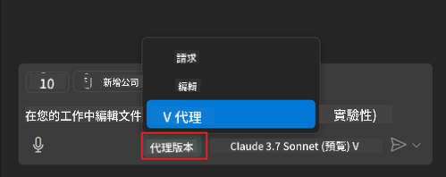
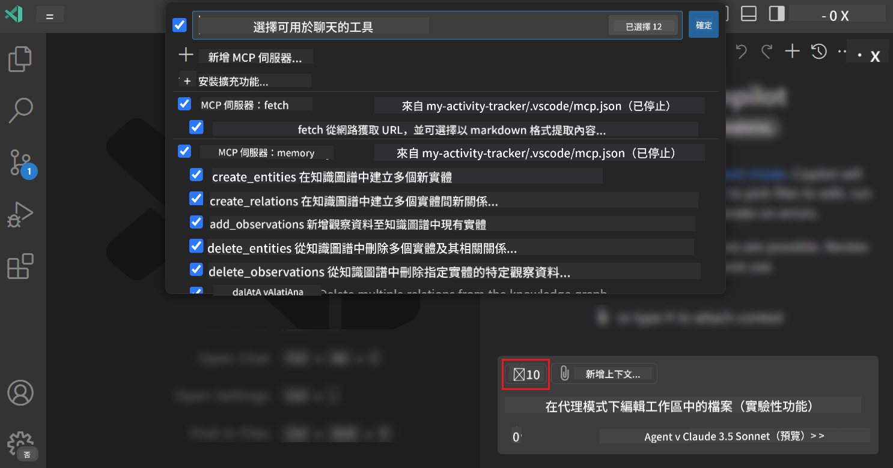
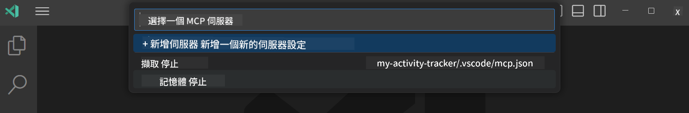
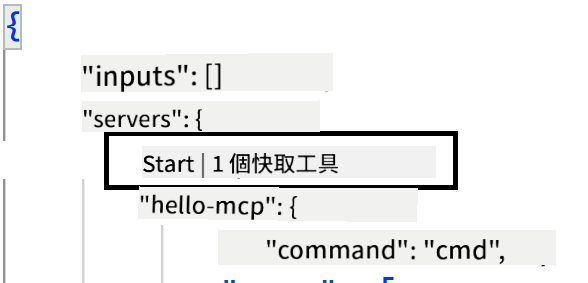
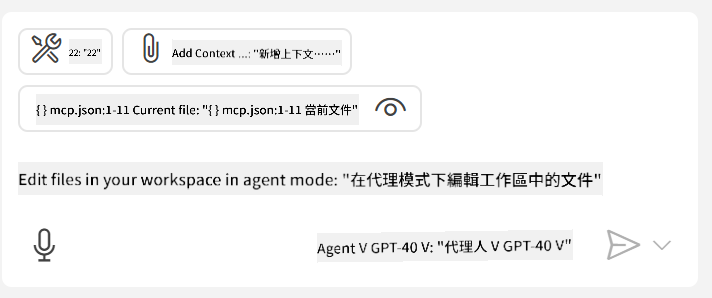
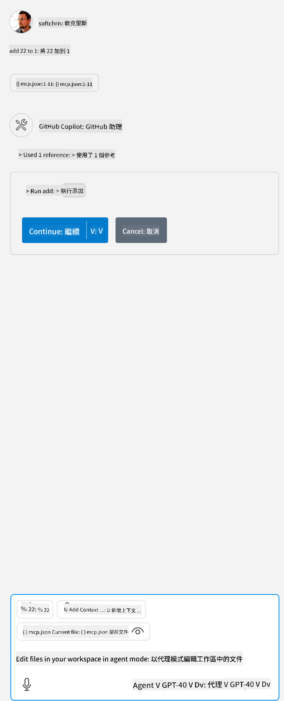

<!--
CO_OP_TRANSLATOR_METADATA:
{
  "original_hash": "d940b5e0af75e3a3a4d1c3179120d1d9",
  "translation_date": "2025-08-26T17:16:36+00:00",
  "source_file": "03-GettingStarted/04-vscode/README.md",
  "language_code": "mo"
}
-->
# 從 GitHub Copilot Agent 模式使用伺服器

Visual Studio Code 和 GitHub Copilot 可以作為客戶端來使用 MCP 伺服器。你可能會問，為什麼我們要這麼做？這意味著 MCP 伺服器的所有功能現在都可以直接在你的 IDE 中使用。想像一下，假如你添加了 GitHub 的 MCP 伺服器，這將允許你通過提示來控制 GitHub，而不需要在終端中輸入特定的命令。或者，想像任何能改善開發者體驗的功能，全部都可以用自然語言來控制。現在你應該能看到這樣做的好處了吧？

## 概覽

本課程將介紹如何使用 Visual Studio Code 和 GitHub Copilot 的 Agent 模式作為 MCP 伺服器的客戶端。

## 學習目標

完成本課程後，你將能夠：

- 通過 Visual Studio Code 使用 MCP 伺服器。
- 使用 GitHub Copilot 運行工具等功能。
- 配置 Visual Studio Code 以尋找並管理你的 MCP 伺服器。

## 使用方式

你可以通過兩種方式控制 MCP 伺服器：

- 使用者介面，稍後在本章節中會介紹如何操作。
- 終端，通過 `code` 可執行檔在終端中控制：

  要將 MCP 伺服器添加到你的使用者設定檔，請使用 --add-mcp 命令行選項，並以 {\"name\":\"server-name\",\"command\":...} 的 JSON 格式提供伺服器配置。

  ```
  code --add-mcp "{\"name\":\"my-server\",\"command\": \"uvx\",\"args\": [\"mcp-server-fetch\"]}"
  ```

### 截圖





接下來我們將在後續章節中更詳細地討論如何使用視覺化介面。

## 方法

以下是我們需要採取的高層次方法：

- 配置一個檔案來尋找 MCP 伺服器。
- 啟動/連接到該伺服器以列出其功能。
- 通過 GitHub Copilot 聊天介面使用這些功能。

很好，現在我們了解了流程，讓我們通過一個練習來嘗試在 Visual Studio Code 中使用 MCP 伺服器。

## 練習：使用伺服器

在這個練習中，我們將配置 Visual Studio Code 以尋找你的 MCP 伺服器，從而可以通過 GitHub Copilot 聊天介面使用它。

### -0- 預備步驟，啟用 MCP 伺服器發現

你可能需要啟用 MCP 伺服器的發現功能。

1. 在 Visual Studio Code 中，前往 `File -> Preferences -> Settings`。

1. 搜尋 "MCP"，並在 settings.json 檔案中啟用 `chat.mcp.discovery.enabled`。

### -1- 建立配置檔案

首先在你的專案根目錄中建立一個配置檔案，你需要建立一個名為 MCP.json 的檔案，並將其放置在 .vscode 資料夾中。它應該看起來像這樣：

```text
.vscode
|-- mcp.json
```

接下來，我們來看看如何添加伺服器條目。

### -2- 配置伺服器

在 *mcp.json* 中添加以下內容：

```json
{
    "inputs": [],
    "servers": {
       "hello-mcp": {
           "command": "node",
           "args": [
               "build/index.js"
           ]
       }
    }
}
```

上面是一個簡單的範例，展示了如何啟動一個用 Node.js 編寫的伺服器。對於其他運行時，請指定啟動伺服器的正確命令和參數。

### -3- 啟動伺服器

現在你已經添加了一個條目，讓我們啟動伺服器：

1. 在 *mcp.json* 中找到你的條目，並確保找到 "播放" 圖示：

    

1. 點擊 "播放" 圖示，你應該會看到 GitHub Copilot 聊天中的工具圖示顯示可用工具的數量增加。如果你點擊該工具圖示，你會看到已註冊工具的列表。你可以勾選/取消勾選每個工具，根據你是否希望 GitHub Copilot 使用它們作為上下文：

  

1. 要運行工具，輸入一個你知道會匹配某個工具描述的提示，例如 "add 22 to 1"：

  

  你應該會看到一個回應顯示 23。

## 作業

嘗試在 *mcp.json* 檔案中添加一個伺服器條目，並確保你可以啟動/停止伺服器。確保你也可以通過 GitHub Copilot 聊天介面與伺服器上的工具進行互動。

## 解答

[解答](./solution/README.md)

## 關鍵要點

本章節的關鍵要點如下：

- Visual Studio Code 是一個很棒的客戶端，能讓你使用多個 MCP 伺服器及其工具。
- GitHub Copilot 聊天介面是你與伺服器互動的方式。
- 你可以提示使用者輸入，例如 API 金鑰，並在配置 *mcp.json* 檔案中的伺服器條目時傳遞給 MCP 伺服器。

## 範例

- [Java 計算器](../samples/java/calculator/README.md)
- [.Net 計算器](../../../../03-GettingStarted/samples/csharp)
- [JavaScript 計算器](../samples/javascript/README.md)
- [TypeScript 計算器](../samples/typescript/README.md)
- [Python 計算器](../../../../03-GettingStarted/samples/python)

## 其他資源

- [Visual Studio 文件](https://code.visualstudio.com/docs/copilot/chat/mcp-servers)

## 下一步

- 下一步：[建立一個 stdio 伺服器](../05-stdio-server/README.md)

---

**免責聲明**：  
本文件已使用 AI 翻譯服務 [Co-op Translator](https://github.com/Azure/co-op-translator) 進行翻譯。儘管我們努力確保翻譯的準確性，但請注意，自動翻譯可能包含錯誤或不準確之處。原始文件的母語版本應被視為權威來源。對於關鍵資訊，建議使用專業人工翻譯。我們對因使用此翻譯而引起的任何誤解或誤釋不承擔責任。