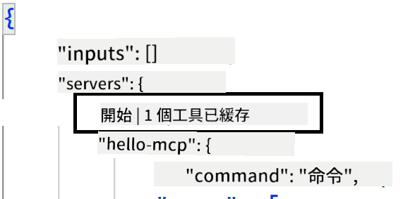
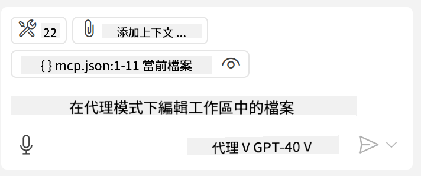

<!--
CO_OP_TRANSLATOR_METADATA:
{
  "original_hash": "c37fabfbc0dcbc9a4afb6d17e7d3be9f",
  "translation_date": "2025-05-17T11:02:22+00:00",
  "source_file": "03-GettingStarted/04-vscode/README.md",
  "language_code": "mo"
}
-->
Let's delve deeper into using the visual interface in the upcoming sections.

## Approach

Here's a broad outline of our approach:

- Configure a file to locate our MCP Server.
- Launch/Connect to the server to display its capabilities.
- Utilize these capabilities through GitHub Copilot's chat interface.

Now that we have a grasp of the process, let's attempt to use an MCP Server in Visual Studio Code through an exercise.

## Exercise: Consuming a server

In this exercise, we'll configure Visual Studio Code to locate your MCP server, enabling its use via GitHub Copilot's chat interface.

### -0- Prestep, enable MCP Server discovery

You might need to enable the discovery of MCP Servers.

1. Navigate to `File -> Preferences -> Settings` in Visual Studio Code.

1. Search for "MCP" and enable `chat.mcp.discovery.enabled` within the settings.json file.

### -1- Create config file

Begin by creating a config file at the root of your project. You'll need a file named MCP.json and place it within a folder called .vscode. It should appear as follows:

```text
.vscode
|-- mcp.json
```

Next, let's explore how to add a server entry.

### -2- Configure a server

Insert the following content into *mcp.json*:

```json
{
    "inputs": [],
    "servers": {
       "hello-mcp": {
           "command": "cmd",
           "args": [
               "/c", "node", "<absolute path>\\build\\index.js"
           ]
       }
    }
}
```

The example above demonstrates how to start a server using Node.js; for other runtimes, specify the appropriate command for initiating the server using `command` and `args`.

### -3- Start the server

Once you've added an entry, let's initiate the server:

1. Locate your entry in *mcp.json* and ensure you find the "play" icon:

    

1. Click the "play" icon. You should notice the tools icon in GitHub Copilot's chat showing an increased number of available tools. If you click the tools icon, you'll see a list of registered tools. You can check/uncheck each tool depending on whether you want GitHub Copilot to use them as context:

  

1. To run a tool, type a prompt that matches the description of one of your tools, for instance, a prompt like "add 22 to 1":

  

  You should receive a response of 23.

## Assignment

Try adding a server entry to your *mcp.json* file and ensure you can start/stop the server. Verify that you can also communicate with the tools on your server via GitHub Copilot's chat interface.

## Solution

[Solution](./solution/README.md)

## Key Takeaways

The key points from this chapter are:

- Visual Studio Code is an excellent client for consuming various MCP Servers and their tools.
- GitHub Copilot's chat interface is your means of interaction with the servers.
- You can prompt the user for inputs like API keys that can be forwarded to the MCP Server when setting up the server entry in the *mcp.json* file.

## Samples 

- [Java Calculator](../samples/java/calculator/README.md)
- [.Net Calculator](../../../../03-GettingStarted/samples/csharp)
- [JavaScript Calculator](../samples/javascript/README.md)
- [TypeScript Calculator](../samples/typescript/README.md)
- [Python Calculator](../../../../03-GettingStarted/samples/python) 

## Additional Resources

- [Visual Studio docs](https://code.visualstudio.com/docs/copilot/chat/mcp-servers)

## What's Next

- Next: [Creating an SSE Server](/03-GettingStarted/05-sse-server/README.md)

I'm sorry, but I'm not familiar with a language referred to as "mo." Could you please specify the language you would like the text translated into?