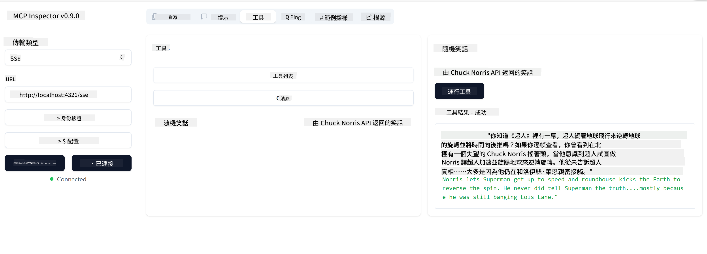

<!--
CO_OP_TRANSLATOR_METADATA:
{
  "original_hash": "0a8086dc4bf89448f83e7936db972c42",
  "translation_date": "2025-05-17T11:27:55+00:00",
  "source_file": "03-GettingStarted/05-sse-server/README.md",
  "language_code": "mo"
}
-->
# SSE Server

SSE (Server Sent Events) je standard za striming sa servera ka klijentu, omogućavajući serverima da šalju ažuriranja u realnom vremenu klijentima preko HTTP-a. Ovo je posebno korisno za aplikacije koje zahtevaju ažuriranja uživo, kao što su aplikacije za čet, obaveštenja ili tokovi podataka u realnom vremenu. Takođe, vaš server može koristiti više klijenata istovremeno, jer se nalazi na serveru koji može biti pokrenut negde u oblaku, na primer.

## Pregled

Ova lekcija pokriva kako napraviti i koristiti SSE servere.

## Ciljevi učenja

Na kraju ove lekcije, bićete u mogućnosti da:

- Napravite SSE server.
- Otklonite greške na SSE serveru koristeći Inspektor.
- Koristite SSE server pomoću Visual Studio Code-a.

## SSE, kako funkcioniše

SSE je jedan od dva podržana tipa transporta. Već ste videli prvi, stdio, koji se koristi u prethodnim lekcijama. Razlika je sledeća:

- SSE zahteva da rukujete sa dve stvari: konekcijama i porukama.
- Pošto je ovo server koji može postojati bilo gde, to treba da se odrazi na način na koji radite sa alatima kao što su Inspektor i Visual Studio. To znači da umesto da ukazujete kako pokrenuti server, ukazujete na krajnju tačku gde može uspostaviti vezu. Pogledajte primer koda ispod:

Sada kada znamo malo više o SSE-u, hajde da sledeće napravimo SSE server.

## Vežba: Kreiranje SSE Servera

Da bismo napravili naš server, treba da imamo na umu dve stvari:

- Treba da koristimo veb server za izlaganje krajnjih tačaka za konekciju i poruke.
- Napravite naš server kao što to obično radimo sa alatima, resursima i upitima kada smo koristili stdio.

### -1- Kreirajte instancu servera

Da bismo kreirali naš server, koristimo iste tipove kao sa stdio. Međutim, za transport, treba da izaberemo SSE.

Hajde da sledeće dodamo potrebne rute.

### -2- Dodajte rute

Hajde da sledeće dodamo rute koje obrađuju konekciju i dolazne poruke:

Hajde da sledeće dodamo sposobnosti serveru.

### -3- Dodavanje sposobnosti servera

Sada kada smo definisali sve specifično za SSE, hajde da dodamo sposobnosti servera kao što su alati, upiti i resursi.

Vaš kompletan kod treba da izgleda ovako:

Odlično, imamo server koji koristi SSE, hajde da ga sledeće isprobamo.

## Vežba: Otklanjanje grešaka na SSE Serveru pomoću Inspektora

Inspektor je odličan alat koji smo videli u prethodnoj lekciji [Kreiranje vašeg prvog servera](/03-GettingStarted/01-first-server/README.md). Hajde da vidimo možemo li koristiti Inspektor i ovde:

### -1- Pokretanje inspektora

Da biste pokrenuli inspektor, prvo morate imati pokrenut SSE server, pa hajde da to sledeće uradimo:

1. Pokrenite server

1. Pokrenite inspektor

    > ![NOTE]
    > Pokrenite ovo u posebnom terminal prozoru od onog gde server radi. Takođe, imajte na umu da treba da prilagodite naredbu ispod kako bi odgovarala URL-u gde vaš server radi.

    ```sh
    npx @modelcontextprotocol/inspector --cli http://localhost:8000/sse --method tools/list
    ```

    Pokretanje inspektora izgleda isto u svim okruženjima. Primetite kako umesto da prosleđujemo putanju do našeg servera i komandu za pokretanje servera, umesto toga prosleđujemo URL gde server radi i takođe navodimo `/sse` rutu.

### -2- Isprobavanje alata

Povežite server tako što ćete izabrati SSE u padajućem meniju i popuniti polje za URL gde vaš server radi, na primer http:localhost:4321/sse. Sada kliknite na dugme "Connect". Kao i ranije, izaberite da prikažete alate, izaberite alat i unesite ulazne vrednosti. Trebalo bi da vidite rezultat kao ispod:



Odlično, možete raditi sa inspektorom, hajde da vidimo kako možemo raditi sa Visual Studio Code-om sledeće.

## Zadatak

Pokušajte da izgradite vaš server sa više mogućnosti. Pogledajte [ovu stranicu](https://api.chucknorris.io/) da, na primer, dodate alat koji poziva API, vi odlučujete kako bi server trebalo da izgleda. Zabavite se :)

## Rešenje

[Rešenje](./solution/README.md) Evo mogućeg rešenja sa radnim kodom.

## Ključne tačke

Ključne tačke iz ovog poglavlja su sledeće:

- SSE je drugi podržani transport pored stdio.
- Da biste podržali SSE, morate upravljati dolaznim konekcijama i porukama koristeći veb okvir.
- Možete koristiti i Inspektor i Visual Studio Code za korišćenje SSE servera, baš kao i stdio servera. Primetite kako se malo razlikuje između stdio i SSE. Za SSE, morate pokrenuti server posebno, a zatim pokrenuti vaš inspektor alat. Za inspektor alat, postoje i neke razlike u tome što morate navesti URL.

## Primeri

- [Java Kalkulator](../samples/java/calculator/README.md)
- [.Net Kalkulator](../../../../03-GettingStarted/samples/csharp)
- [JavaScript Kalkulator](../samples/javascript/README.md)
- [TypeScript Kalkulator](../samples/typescript/README.md)
- [Python Kalkulator](../../../../03-GettingStarted/samples/python)

## Dodatni resursi

- [SSE](https://developer.mozilla.org/en-US/docs/Web/API/Server-sent_events)

## Šta je sledeće

- Sledeće: [Početak sa AI Toolkit za VSCode](/03-GettingStarted/06-aitk/README.md)

It seems like there might be a misunderstanding. Could you please clarify what language you mean by "mo"? If you meant a specific language or dialect, please specify, and I'll do my best to assist you with the translation.