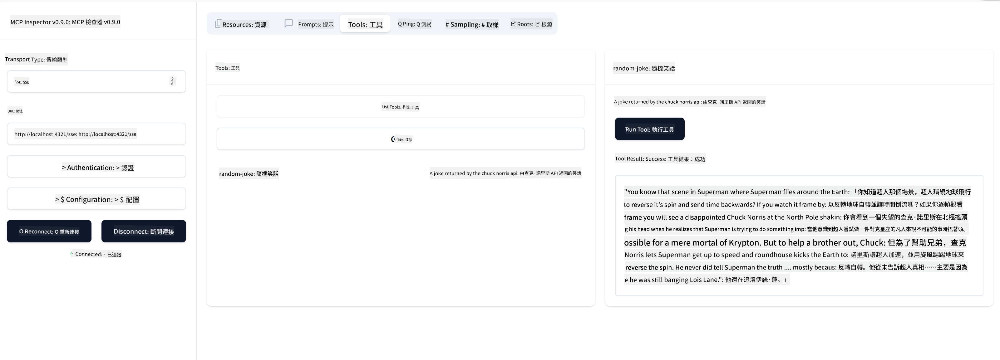

<!--
CO_OP_TRANSLATOR_METADATA:
{
  "original_hash": "64645691bf0985f1760b948123edf269",
  "translation_date": "2025-06-13T10:43:27+00:00",
  "source_file": "03-GettingStarted/05-sse-server/README.md",
  "language_code": "mo"
}
-->
Nauz saññi SSE a buste, leñu defar SSE server benn ci kaw.

## Jàngalekat: Defar SSE Server

Ngir defar server bii, ñu am nañu ci xel ñetti bëgg:

- Ñu am nañu web server ngir jëfandikoo endpoints ngir jàppale ak messages.
- Defal server bii ni ñu defar ci tool yi, resources ak prompts bi ñu jëfandikoo ci jamono ju ñu jàppante ak stdio.

### -1- Defar instance server

Ngir defar server bii, nu jëfandikoo lu mel ni ci stdio. Waaye, ngir transport, nu jëfandikoo SSE.

Jëfandikoo SSE.

### -2- Jëfandikoo routes

Jëfandikoo routes yu jàppale ci connection ak messages yu gën a am solo:

### -3- Jëfandikoo capabilties ci server

Bii ngay am SSE ci diggante, jëfandikoo capabilties ci server ni tools, prompts ak resources.

Code bi ngay am itam dina mel ni lu ëpp solo:

Jàmm rekk, amna SSE server, ñu jàngal ci defar.

## Jàngalekat: Jàppale SSE Server ak Inspector

Inspector mooy tool bu baax, nu gis ci jàngalekat bu njëkk [Defar server bu njëkk](/03-GettingStarted/01-first-server/README.md). Naka nu jëfandikoo Inspector ci SSE server bii:

### -1- Jàppale inspector

Ngir jàppale inspector, ci kanam server SSE am nañu. Jàmm, defal li ci kanam:

1. Jàppale server

1. Jàppale inspector

    > ![NOTE]
    > Jàppale ci window terminal bu bari ci kanam server bi. Jàmm, am nañu defar ci command bi ngir jàppale server bi ci URL bi server bi am.

    ```sh
    npx @modelcontextprotocol/inspector --cli http://localhost:8000/sse --method tools/list
    ```

    Jàppale inspector mooy ni ci runtime yu nekk. Xam ne ñu amul jafe-jafe ci wàllu ci jëfandikoo path ngir jàppale server bi, nu jëfandikoo URL bi server bi am ak nu jëfandikoo route `/sse`.

### -2- Jàppale tool bi

Jàppale server bi ngir jàppale SSE ci droplist bi, te jëfandikoo url bi server bi am, ni http:localhost:4321/sse. Jàppale button bi "Connect". Ni ci kanam, jëfandikoo list tools, jëfandikoo tool ak jëfandikoo input values. Ñu gis li ci nekk ci suuf bii:



Jàmm, nga am SSE server, jàngal naka nu jëfandikoo Visual Studio Code ci kanam.

## Jàmm

Jàppale defar server bi ak capabilties yu bari. Jàng ci [bii](https://api.chucknorris.io/) ngir jëfandikoo tool bu jëfandikoo API, nga xam ni server bi dina am lu mel ni. Am na jàmm :)

## Jàmm ci bopp

[Jàmm ci bopp](./solution/README.md) Bii moo tax server bi jëfandikoo code bu am solo.

## Li muy wone

Li nu jàng ci biir chapter bii:

- SSE mooy transport bu ñetti bu am ci kaw stdio.
- Ngir jëfandikoo SSE, nga am nañu jàppale ci incoming connections ak messages ci web framework.
- Nga jëfandikoo Inspector ak Visual Studio Code ngir jàppale SSE server, ni ci stdio servers. Xam ne am nañu ndigal yu am solo ci wàllu ci stdio ak SSE. Ngir SSE, nga am nañu defar server bi ci kanam te jàppale inspector tool bi. Ci inspector tool bi, am nañu ndigal yu am solo ngir jëfandikoo URL bi.

## Samples 

- [Java Calculator](../samples/java/calculator/README.md)
- [.Net Calculator](../../../../03-GettingStarted/samples/csharp)
- [JavaScript Calculator](../samples/javascript/README.md)
- [TypeScript Calculator](../samples/typescript/README.md)
- [Python Calculator](../../../../03-GettingStarted/samples/python) 

## Resources yu bari

- [SSE](https://developer.mozilla.org/en-US/docs/Web/API/Server-sent_events)

## Li ngay defar ci kanam

- Li ngay defar ci kanam: [HTTP Streaming with MCP (Streamable HTTP)](/03-GettingStarted/06-http-streaming/README.md)

**Disclaimer**:  
This document has been translated using AI translation service [Co-op Translator](https://github.com/Azure/co-op-translator). While we strive for accuracy, please be aware that automated translations may contain errors or inaccuracies. The original document in its native language should be considered the authoritative source. For critical information, professional human translation is recommended. We are not liable for any misunderstandings or misinterpretations arising from the use of this translation.

---

If by "mo" you meant a specific language or code, please clarify so I can provide the correct translation.