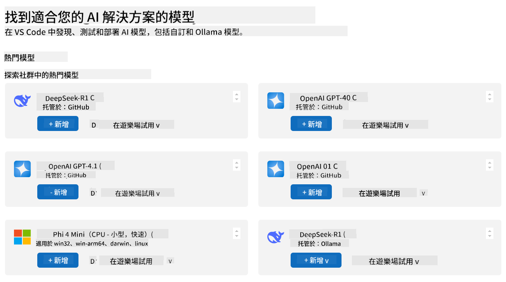
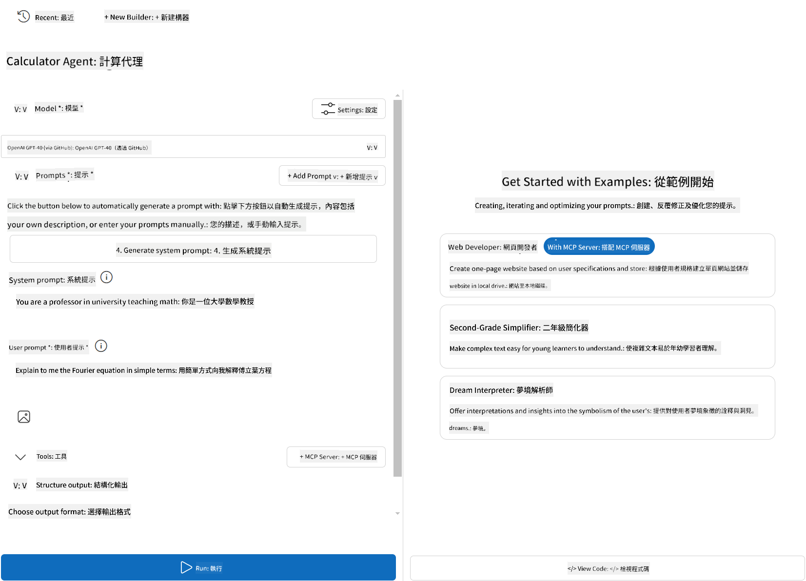
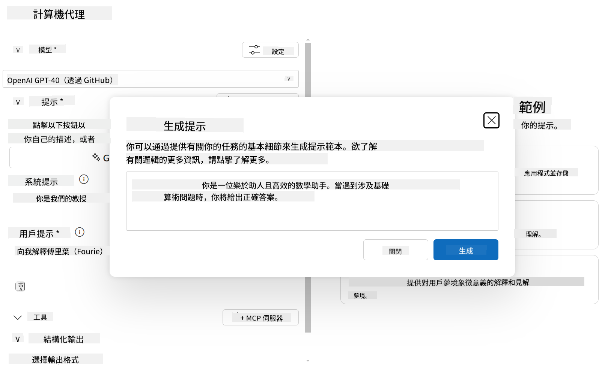

<!--
CO_OP_TRANSLATOR_METADATA:
{
  "original_hash": "98bcd044860716da5819e31c152813b7",
  "translation_date": "2025-08-18T14:41:03+00:00",
  "source_file": "03-GettingStarted/07-aitk/README.md",
  "language_code": "mo"
}
-->
# 使用 Visual Studio Code 的 AI Toolkit 擴展來消耗伺服器

當您在構建 AI 代理時，不僅僅是生成智能回應，還需要賦予代理採取行動的能力。這就是模型上下文協議（MCP）的作用所在。MCP 使代理能夠以一致的方式訪問外部工具和服務。可以將其想像成將代理連接到一個它能夠真正使用的工具箱。

假設您將代理連接到計算器 MCP 伺服器。突然間，您的代理只需接收到像「47 乘以 89 是多少？」這樣的提示，就能執行數學運算——無需硬編碼邏輯或構建自定義 API。

## 概述

本課程涵蓋如何使用 Visual Studio Code 的 [AI Toolkit](https://aka.ms/AIToolkit) 擴展將計算器 MCP 伺服器連接到代理，從而使代理能夠通過自然語言執行加法、減法、乘法和除法等數學運算。

AI Toolkit 是 Visual Studio Code 的一個強大擴展，簡化了代理的開發過程。AI 工程師可以輕鬆地通過本地或雲端開發和測試生成式 AI 模型來構建 AI 應用程序。該擴展支持當前大多數主流生成模型。

*注意*：AI Toolkit 目前支持 Python 和 TypeScript。

## 學習目標

完成本課程後，您將能夠：

- 通過 AI Toolkit 消耗 MCP 伺服器。
- 配置代理設定，使其能夠發現並使用 MCP 伺服器提供的工具。
- 通過自然語言使用 MCP 工具。

## 方法

以下是我們需要採取的高層次方法：

- 創建代理並定義其系統提示。
- 創建具有計算器工具的 MCP 伺服器。
- 將代理構建器連接到 MCP 伺服器。
- 通過自然語言測試代理的工具調用。

很好，現在我們已經了解了流程，讓我們配置一個 AI 代理來通過 MCP 利用外部工具，增強其能力！

## 先決條件

- [Visual Studio Code](https://code.visualstudio.com/)
- [Visual Studio Code 的 AI Toolkit](https://aka.ms/AIToolkit)

## 練習：消耗伺服器

> [!WARNING]
> macOS 使用者注意。我們目前正在調查影響 macOS 上依賴項安裝的問題。因此，macOS 使用者目前無法完成本教程。我們會在修復可用後更新指導。感謝您的耐心和理解！

在本練習中，您將使用 AI Toolkit 在 Visual Studio Code 中構建、運行並增強具有 MCP 伺服器工具的 AI 代理。

### -0- 預備步驟，將 OpenAI GPT-4o 模型添加到我的模型

本練習使用 **GPT-4o** 模型。在創建代理之前，應將該模型添加到 **我的模型**。



1. 從 **活動欄** 打開 **AI Toolkit** 擴展。
1. 在 **目錄** 部分，選擇 **模型** 以打開 **模型目錄**。選擇 **模型** 會在新的編輯器標籤中打開 **模型目錄**。
1. 在 **模型目錄** 搜索欄中輸入 **OpenAI GPT-4o**。
1. 點擊 **+ 添加** 將模型添加到您的 **我的模型** 列表。確保您選擇的是 **GitHub 托管** 的模型。
1. 在 **活動欄** 中確認 **OpenAI GPT-4o** 模型出現在列表中。

### -1- 創建代理

**代理（提示）構建器** 使您能夠創建和自定義自己的 AI 驅動代理。在本節中，您將創建一個新代理並分配一個模型來支持對話。



1. 從 **活動欄** 打開 **AI Toolkit** 擴展。
1. 在 **工具** 部分，選擇 **代理（提示）構建器**。選擇 **代理（提示）構建器** 會在新的編輯器標籤中打開 **代理（提示）構建器**。
1. 點擊 **+ 新代理** 按鈕。擴展將通過 **命令面板** 啟動設置向導。
1. 輸入名稱 **計算器代理** 並按 **Enter**。
1. 在 **代理（提示）構建器** 中，對於 **模型** 欄位，選擇 **OpenAI GPT-4o（通過 GitHub）** 模型。

### -2- 為代理創建系統提示

代理框架已搭建好，現在是時候定義其個性和目的了。在本節中，您將使用 **生成系統提示** 功能來描述代理的預期行為——在本例中是一個計算器代理——並讓模型為您撰寫系統提示。



1. 在 **提示** 部分，點擊 **生成系統提示** 按鈕。此按鈕會打開提示構建器，該構建器利用 AI 為代理生成系統提示。
1. 在 **生成提示** 窗口中，輸入以下內容：`您是一個有幫助且高效的數學助手。當遇到涉及基本算術的問題時，您會以正確的結果回應。`
1. 點擊 **生成** 按鈕。右下角會出現通知，確認正在生成系統提示。提示生成完成後，提示將出現在 **代理（提示）構建器** 的 **系統提示** 欄位中。
1. 查看 **系統提示** 並根據需要進行修改。

### -3- 創建 MCP 伺服器

現在您已經定義了代理的系統提示——指導其行為和回應——是時候為代理配備實際功能了。在本節中，您將創建一個具有加法、減法、乘法和除法計算工具的計算器 MCP 伺服器。此伺服器將使您的代理能夠根據自然語言提示執行實時數學運算。


AI Toolkit 配備了模板，便於創建自己的 MCP 伺服器。我們將使用 Python 模板來創建計算器 MCP 伺服器。

*注意*：AI Toolkit 目前支持 Python 和 TypeScript。

1. 在 **代理（提示）構建器** 的 **工具** 部分，點擊 **+ MCP 伺服器** 按鈕。擴展將通過 **命令面板** 啟動設置向導。
1. 選擇 **+ 添加伺服器**。
1. 選擇 **創建新 MCP 伺服器**。
1. 選擇 **python-weather** 作為模板。
1. 選擇 **默認文件夾** 保存 MCP 伺服器模板。
1. 為伺服器輸入以下名稱：**計算器**
1. 一個新的 Visual Studio Code 窗口將打開。選擇 **是，我信任作者**。
1. 使用終端（**終端** > **新終端**），創建虛擬環境：`python -m venv .venv`
1. 使用終端，激活虛擬環境：
    1. Windows - `.venv\Scripts\activate`
    1. macOS/Linux - `source .venv/bin/activate`
1. 使用終端，安裝依賴項：`pip install -e .[dev]`
1. 在 **活動欄** 的 **資源管理器** 視圖中，展開 **src** 目錄並選擇 **server.py** 以在編輯器中打開文件。
1. 將 **server.py** 文件中的代碼替換為以下內容並保存：

    ```python
    """
    Sample MCP Calculator Server implementation in Python.

    
    This module demonstrates how to create a simple MCP server with calculator tools
    that can perform basic arithmetic operations (add, subtract, multiply, divide).
    """
    
    from mcp.server.fastmcp import FastMCP
    
    server = FastMCP("calculator")
    
    @server.tool()
    def add(a: float, b: float) -> float:
        """Add two numbers together and return the result."""
        return a + b
    
    @server.tool()
    def subtract(a: float, b: float) -> float:
        """Subtract b from a and return the result."""
        return a - b
    
    @server.tool()
    def multiply(a: float, b: float) -> float:
        """Multiply two numbers together and return the result."""
        return a * b
    
    @server.tool()
    def divide(a: float, b: float) -> float:
        """
        Divide a by b and return the result.
        
        Raises:
            ValueError: If b is zero
        """
        if b == 0:
            raise ValueError("Cannot divide by zero")
        return a / b
    ```

### -4- 使用計算器 MCP 伺服器運行代理

現在您的代理已經有工具了，是時候使用它們了！在本節中，您將向代理提交提示以測試並驗證代理是否利用了計算器 MCP 伺服器中的適當工具。


您將通過 **代理構建器** 作為 MCP 客戶端在本地開發機器上運行計算器 MCP 伺服器。

1. 按 `F5` 開始調試 MCP 伺服器。**代理（提示）構建器** 將在新的編輯器標籤中打開。伺服器的狀態在終端中可見。
1. 在 **代理（提示）構建器** 的 **使用者提示** 欄位中，輸入以下提示：`我買了 3 件每件 25 美元的商品，然後用了 20 美元的折扣。我付了多少錢？`
1. 點擊 **運行** 按鈕生成代理的回應。
1. 查看代理輸出。模型應得出您支付了 **55 美元**。
1. 以下是應發生的情況：
    - 代理選擇 **乘法** 和 **減法** 工具來幫助計算。
    - 為 **乘法** 工具分配了相應的 `a` 和 `b` 值。
    - 為 **減法** 工具分配了相應的 `a` 和 `b` 值。
    - 每個工具的回應在相應的 **工具回應** 中提供。
    - 模型的最終輸出在 **模型回應** 中提供。
1. 提交其他提示以進一步測試代理。您可以通過點擊 **使用者提示** 欄位並替換現有提示來修改提示。
1. 測試代理完成後，您可以通過 **終端** 輸入 **CTRL/CMD+C** 停止伺服器。

## 作業

嘗試向您的 **server.py** 文件添加一個額外的工具條目（例如：返回一個數字的平方根）。提交需要代理利用新工具（或現有工具）的額外提示。請確保重新啟動伺服器以加載新添加的工具。

## 解決方案

[解決方案](./solution/README.md)

## 關鍵要點

本章的關鍵要點如下：

- AI Toolkit 擴展是一個很好的客戶端，可以消耗 MCP 伺服器及其工具。
- 您可以向 MCP 伺服器添加新工具，擴展代理的能力以滿足不斷變化的需求。
- AI Toolkit 包括模板（例如 Python MCP 伺服器模板），簡化了自定義工具的創建。

## 其他資源

- [AI Toolkit 文檔](https://aka.ms/AIToolkit/doc)

## 下一步
- 下一章：[測試與調試](../08-testing/README.md)

**免責聲明**：  
本文件使用 AI 翻譯服務 [Co-op Translator](https://github.com/Azure/co-op-translator) 進行翻譯。我們致力於提供準確的翻譯，但請注意，自動翻譯可能包含錯誤或不準確之處。應以原始語言的文件作為權威來源。對於關鍵資訊，建議尋求專業人工翻譯。我們對因使用此翻譯而引起的任何誤解或錯誤解讀概不負責。