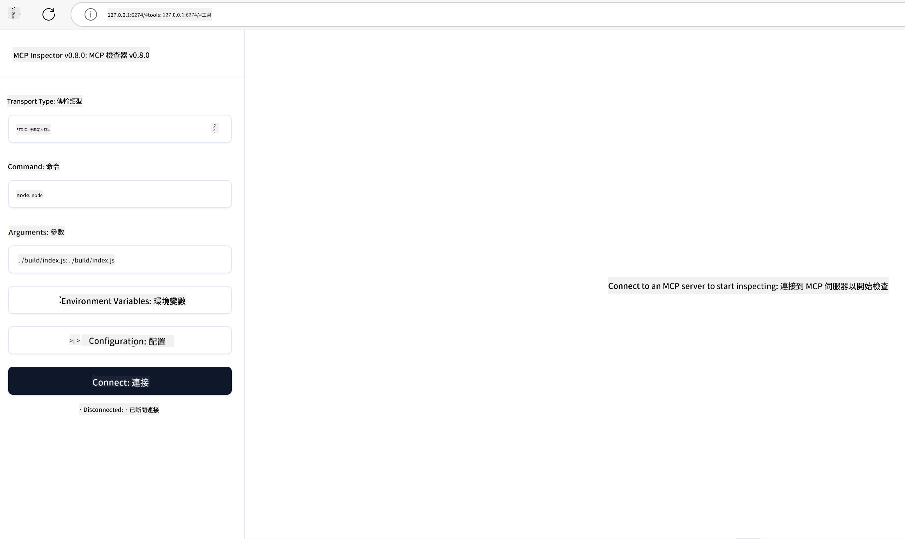

<!--
CO_OP_TRANSLATOR_METADATA:
{
  "original_hash": "4e34e34e84f013e73c7eaa6d09884756",
  "translation_date": "2025-07-13T21:57:42+00:00",
  "source_file": "03-GettingStarted/08-testing/README.md",
  "language_code": "mo"
}
-->
## 測試與除錯

在開始測試你的 MCP 伺服器之前，了解可用的工具和除錯的最佳實踐非常重要。有效的測試能確保你的伺服器如預期運作，並幫助你快速識別和解決問題。以下章節將說明驗證 MCP 實作的建議方法。

## 概述

本課程將介紹如何選擇合適的測試方法及最有效的測試工具。

## 學習目標

完成本課程後，你將能夠：

- 描述各種測試方法。
- 使用不同工具有效地測試你的程式碼。

## 測試 MCP 伺服器

MCP 提供工具協助你測試和除錯伺服器：

- **MCP Inspector**：一個可作為 CLI 工具或視覺化工具運行的命令列工具。
- **手動測試**：你可以使用 curl 這類工具發送網路請求，任何能執行 HTTP 的工具都適用。
- **單元測試**：你可以使用喜歡的測試框架來測試伺服器和客戶端的功能。

### 使用 MCP Inspector

我們在之前的課程中已介紹過此工具的使用，這裡簡單說明。它是用 Node.js 建置的工具，你可以透過執行 `npx` 指令來使用，該指令會暫時下載並安裝工具，執行完請求後會自動清理。

[MCP Inspector](https://github.com/modelcontextprotocol/inspector) 可協助你：

- **發現伺服器功能**：自動偵測可用的資源、工具和提示
- **測試工具執行**：嘗試不同參數並即時查看回應
- **檢視伺服器元資料**：檢查伺服器資訊、結構和設定

工具的典型執行方式如下：

```bash
npx @modelcontextprotocol/inspector node build/index.js
```

上述指令會啟動 MCP 及其視覺化介面，並在瀏覽器中開啟本地網頁介面。你會看到一個儀表板，顯示已註冊的 MCP 伺服器、可用的工具、資源和提示。介面允許你互動式測試工具執行、檢查伺服器元資料及即時查看回應，讓驗證和除錯 MCP 伺服器實作更為方便。

介面大致長這樣： 

你也可以在 CLI 模式下執行此工具，只需加上 `--cli` 參數。以下是以 CLI 模式執行，列出伺服器上所有工具的範例：

```sh
npx @modelcontextprotocol/inspector --cli node build/index.js --method tools/list
```

### 手動測試

除了使用 inspector 工具測試伺服器功能外，另一種類似方法是使用能執行 HTTP 的客戶端工具，例如 curl。

使用 curl，你可以直接透過 HTTP 請求測試 MCP 伺服器：

```bash
# Example: Test server metadata
curl http://localhost:3000/v1/metadata

# Example: Execute a tool
curl -X POST http://localhost:3000/v1/tools/execute \
  -H "Content-Type: application/json" \
  -d '{"name": "calculator", "parameters": {"expression": "2+2"}}'
```

從上述 curl 用法可見，你是用 POST 請求呼叫工具，並以包含工具名稱及參數的負載作為請求內容。請選擇最適合你的方式。一般來說，CLI 工具使用起來較快，且易於編寫腳本，這在 CI/CD 環境中特別有用。

### 單元測試

為你的工具和資源建立單元測試，確保它們如預期運作。以下是範例測試程式碼。

```python
import pytest

from mcp.server.fastmcp import FastMCP
from mcp.shared.memory import (
    create_connected_server_and_client_session as create_session,
)

# Mark the whole module for async tests
pytestmark = pytest.mark.anyio


async def test_list_tools_cursor_parameter():
    """Test that the cursor parameter is accepted for list_tools.

    Note: FastMCP doesn't currently implement pagination, so this test
    only verifies that the cursor parameter is accepted by the client.
    """

 server = FastMCP("test")

    # Create a couple of test tools
    @server.tool(name="test_tool_1")
    async def test_tool_1() -> str:
        """First test tool"""
        return "Result 1"

    @server.tool(name="test_tool_2")
    async def test_tool_2() -> str:
        """Second test tool"""
        return "Result 2"

    async with create_session(server._mcp_server) as client_session:
        # Test without cursor parameter (omitted)
        result1 = await client_session.list_tools()
        assert len(result1.tools) == 2

        # Test with cursor=None
        result2 = await client_session.list_tools(cursor=None)
        assert len(result2.tools) == 2

        # Test with cursor as string
        result3 = await client_session.list_tools(cursor="some_cursor_value")
        assert len(result3.tools) == 2

        # Test with empty string cursor
        result4 = await client_session.list_tools(cursor="")
        assert len(result4.tools) == 2
    
```

上述程式碼做了以下事情：

- 使用 pytest 框架，讓你能以函式形式建立測試並使用 assert 陳述式。
- 建立一個包含兩個不同工具的 MCP Server。
- 使用 `assert` 陳述式檢查特定條件是否成立。

你可以參考[完整檔案](https://github.com/modelcontextprotocol/python-sdk/blob/main/tests/client/test_list_methods_cursor.py)

根據上述檔案，你可以測試自己的伺服器，確保功能如預期建立。

所有主要 SDK 都有類似的測試章節，你可以依照所選的執行環境做調整。

## 範例

- [Java 計算機](../samples/java/calculator/README.md)
- [.Net 計算機](../../../../03-GettingStarted/samples/csharp)
- [JavaScript 計算機](../samples/javascript/README.md)
- [TypeScript 計算機](../samples/typescript/README.md)
- [Python 計算機](../../../../03-GettingStarted/samples/python)

## 其他資源

- [Python SDK](https://github.com/modelcontextprotocol/python-sdk)

## 接下來

- 下一步：[部署](../09-deployment/README.md)

**免責聲明**：  
本文件係使用 AI 翻譯服務 [Co-op Translator](https://github.com/Azure/co-op-translator) 進行翻譯。雖然我們致力於確保準確性，但請注意，自動翻譯可能包含錯誤或不準確之處。原始文件的母語版本應視為權威來源。對於重要資訊，建議採用專業人工翻譯。我們不對因使用本翻譯而產生的任何誤解或誤釋負責。