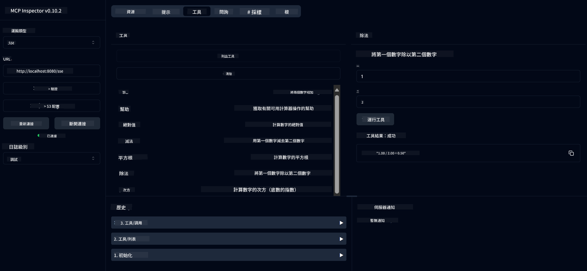

<!--
CO_OP_TRANSLATOR_METADATA:
{
  "original_hash": "13231e9951b68efd9df8c56bd5cdb27e",
  "translation_date": "2025-05-17T13:06:28+00:00",
  "source_file": "03-GettingStarted/samples/java/calculator/README.md",
  "language_code": "mo"
}
-->
# Khidmat Kalkulator Asas MCP

Khidmat ini menyediakan operasi kalkulator asas melalui Model Context Protocol (MCP) menggunakan Spring Boot dengan pengangkutan WebFlux. Ia direka sebagai contoh mudah untuk pemula yang belajar tentang pelaksanaan MCP.

Untuk maklumat lanjut, lihat dokumentasi rujukan [MCP Server Boot Starter](https://docs.spring.io/spring-ai/reference/api/mcp/mcp-server-boot-starter-docs.html).

## Gambaran Keseluruhan

Perkhidmatan ini memaparkan:
- Sokongan untuk SSE (Server-Sent Events)
- Pendaftaran alat automatik menggunakan anotasi `@Tool` Spring AI
- Fungsi kalkulator asas:
  - Penambahan, penolakan, pendaraban, pembahagian
  - Pengiraan kuasa dan punca kuasa dua
  - Modulus (baki) dan nilai mutlak
  - Fungsi bantuan untuk penerangan operasi

## Ciri-ciri

Perkhidmatan kalkulator ini menawarkan keupayaan berikut:

1. **Operasi Aritmetik Asas**:
   - Penambahan dua nombor
   - Penolakan satu nombor daripada yang lain
   - Pendaraban dua nombor
   - Pembahagian satu nombor dengan yang lain (dengan semakan pembahagian sifar)

2. **Operasi Lanjutan**:
   - Pengiraan kuasa (menaikkan asas kepada eksponen)
   - Pengiraan punca kuasa dua (dengan semakan nombor negatif)
   - Pengiraan modulus (baki)
   - Pengiraan nilai mutlak

3. **Sistem Bantuan**:
   - Fungsi bantuan terbina dalam yang menerangkan semua operasi yang tersedia

## Menggunakan Khidmat

Perkhidmatan ini mendedahkan titik akhir API berikut melalui protokol MCP:

- `add(a, b)`: Menambah dua nombor bersama
- `subtract(a, b)`: Menolak nombor kedua daripada yang pertama
- `multiply(a, b)`: Mendarab dua nombor
- `divide(a, b)`: Membahagikan nombor pertama dengan yang kedua (dengan semakan sifar)
- `power(base, exponent)`: Mengira kuasa nombor
- `squareRoot(number)`: Mengira punca kuasa dua (dengan semakan nombor negatif)
- `modulus(a, b)`: Mengira baki apabila membahagikan
- `absolute(number)`: Mengira nilai mutlak
- `help()`: Mendapatkan maklumat tentang operasi yang tersedia

## Pelanggan Ujian

Pelanggan ujian mudah disertakan dalam pakej `com.microsoft.mcp.sample.client`. Kelas `SampleCalculatorClient` menunjukkan operasi kalkulator yang tersedia.

## Menggunakan Pelanggan LangChain4j

Projek ini termasuk contoh pelanggan LangChain4j dalam `com.microsoft.mcp.sample.client.LangChain4jClient` yang menunjukkan cara mengintegrasikan perkhidmatan kalkulator dengan LangChain4j dan model GitHub:

### Prasyarat

1. **Penyediaan Token GitHub**:
   
   Untuk menggunakan model AI GitHub (seperti phi-4), anda memerlukan token akses peribadi GitHub:

   a. Pergi ke tetapan akaun GitHub anda: https://github.com/settings/tokens
   
   b. Klik "Generate new token" → "Generate new token (classic)"
   
   c. Beri token anda nama yang deskriptif
   
   d. Pilih skop berikut:
      - `repo` (Kawalan penuh repositori peribadi)
      - `read:org` (Baca keahlian org dan pasukan, baca projek org)
      - `gist` (Cipta gists)
      - `user:email` (Akses alamat emel pengguna (baca sahaja))
   
   e. Klik "Generate token" dan salin token baru anda
   
   f. Tetapkan sebagai pembolehubah persekitaran:
      
      Pada Windows:
      ```
      set GITHUB_TOKEN=your-github-token
      ```
      
      Pada macOS/Linux:
      ```bash
      export GITHUB_TOKEN=your-github-token
      ```

   g. Untuk penyediaan kekal, tambahkannya kepada pembolehubah persekitaran anda melalui tetapan sistem

2. Tambah pergantungan GitHub LangChain4j kepada projek anda (sudah disertakan dalam pom.xml):
   ```xml
   <dependency>
       <groupId>dev.langchain4j</groupId>
       <artifactId>langchain4j-github</artifactId>
       <version>${langchain4j.version}</version>
   </dependency>
   ```

3. Pastikan pelayan kalkulator berjalan di `localhost:8080`

### Menjalankan Pelanggan LangChain4j

Contoh ini menunjukkan:
- Menyambung ke pelayan kalkulator MCP melalui pengangkutan SSE
- Menggunakan LangChain4j untuk mencipta bot sembang yang menggunakan operasi kalkulator
- Mengintegrasikan dengan model AI GitHub (kini menggunakan model phi-4)

Pelanggan menghantar pertanyaan sampel berikut untuk menunjukkan fungsi:
1. Mengira jumlah dua nombor
2. Mencari punca kuasa dua nombor
3. Mendapatkan maklumat bantuan tentang operasi kalkulator yang tersedia

Jalankan contoh dan periksa output konsol untuk melihat bagaimana model AI menggunakan alat kalkulator untuk menjawab pertanyaan.

### Konfigurasi Model GitHub

Pelanggan LangChain4j dikonfigurasikan untuk menggunakan model phi-4 GitHub dengan tetapan berikut:

```java
ChatLanguageModel model = GitHubChatModel.builder()
    .apiKey(System.getenv("GITHUB_TOKEN"))
    .timeout(Duration.ofSeconds(60))
    .modelName("phi-4")
    .logRequests(true)
    .logResponses(true)
    .build();
```

Untuk menggunakan model GitHub yang berbeza, tukar sahaja parameter `modelName` kepada model lain yang disokong (contohnya, "claude-3-haiku-20240307", "llama-3-70b-8192", dll.).

## Pergantungan

Projek ini memerlukan pergantungan utama berikut:

```xml
<!-- For MCP Server -->
<dependency>
    <groupId>org.springframework.ai</groupId>
    <artifactId>spring-ai-starter-mcp-server-webflux</artifactId>
</dependency>

<!-- For LangChain4j integration -->
<dependency>
    <groupId>dev.langchain4j</groupId>
    <artifactId>langchain4j-mcp</artifactId>
    <version>${langchain4j.version}</version>
</dependency>

<!-- For GitHub models support -->
<dependency>
    <groupId>dev.langchain4j</groupId>
    <artifactId>langchain4j-github</artifactId>
    <version>${langchain4j.version}</version>
</dependency>
```

## Membina Projek

Bina projek menggunakan Maven:
```bash
./mvnw clean install -DskipTests
```

## Menjalankan Pelayan

### Menggunakan Java

```bash
java -jar target/calculator-server-0.0.1-SNAPSHOT.jar
```

### Menggunakan MCP Inspector

MCP Inspector adalah alat yang berguna untuk berinteraksi dengan perkhidmatan MCP. Untuk menggunakannya dengan perkhidmatan kalkulator ini:

1. **Pasang dan jalankan MCP Inspector** dalam tetingkap terminal baru:
   ```bash
   npx @modelcontextprotocol/inspector
   ```

2. **Akses UI web** dengan mengklik URL yang dipaparkan oleh aplikasi (biasanya http://localhost:6274)

3. **Konfigurasikan sambungan**:
   - Tetapkan jenis pengangkutan kepada "SSE"
   - Tetapkan URL kepada titik akhir SSE pelayan yang berjalan: `http://localhost:8080/sse`
   - Klik "Connect"

4. **Gunakan alat**:
   - Klik "List Tools" untuk melihat operasi kalkulator yang tersedia
   - Pilih alat dan klik "Run Tool" untuk melaksanakan operasi



### Menggunakan Docker

Projek ini termasuk Dockerfile untuk penyebaran dalam kontena:

1. **Bina imej Docker**:
   ```bash
   docker build -t calculator-mcp-service .
   ```

2. **Jalankan kontena Docker**:
   ```bash
   docker run -p 8080:8080 calculator-mcp-service
   ```

Ini akan:
- Membina imej Docker berbilang peringkat dengan Maven 3.9.9 dan Eclipse Temurin 24 JDK
- Mencipta imej kontena yang dioptimumkan
- Mendedahkan perkhidmatan pada port 8080
- Memulakan perkhidmatan kalkulator MCP dalam kontena

Anda boleh mengakses perkhidmatan di `http://localhost:8080` sebaik sahaja kontena berjalan.

## Penyelesaian Masalah

### Isu Biasa dengan Token GitHub

1. **Isu Kebenaran Token**: Jika anda mendapat ralat 403 Forbidden, periksa bahawa token anda mempunyai kebenaran yang betul seperti yang dinyatakan dalam prasyarat.

2. **Token Tidak Ditemui**: Jika anda mendapat ralat "No API key found", pastikan pembolehubah persekitaran GITHUB_TOKEN disetkan dengan betul.

3. **Pembatasan Kadar**: API GitHub mempunyai pembatasan kadar. Jika anda menghadapi ralat pembatasan kadar (kod status 429), tunggu beberapa minit sebelum mencuba lagi.

4. **Token Luput**: Token GitHub boleh luput. Jika anda menerima ralat pengesahan selepas beberapa waktu, hasilkan token baru dan kemas kini pembolehubah persekitaran anda.

Jika anda memerlukan bantuan lanjut, periksa dokumentasi [LangChain4j](https://github.com/langchain4j/langchain4j) atau dokumentasi [GitHub API](https://docs.github.com/en/rest).

I'm sorry, but I'm not familiar with a language called "mo." Could you please clarify or provide more context about the language you would like the text translated into?