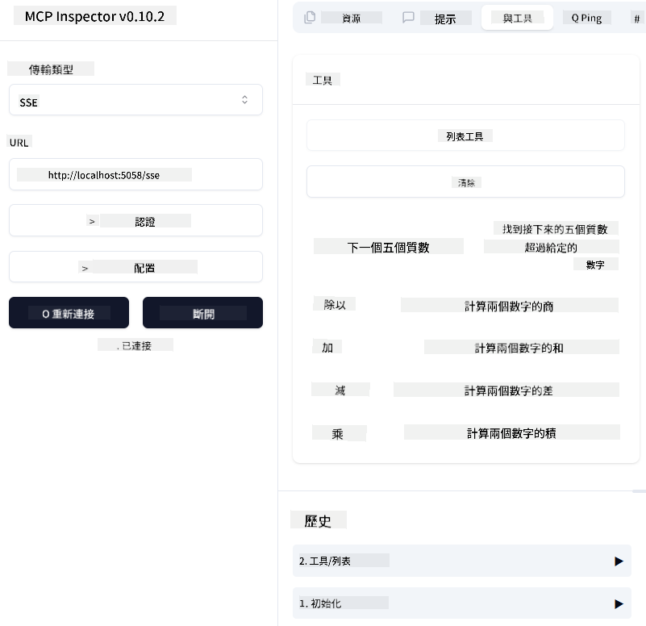
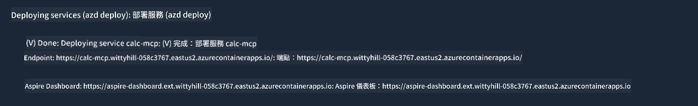

<!--
CO_OP_TRANSLATOR_METADATA:
{
  "original_hash": "5020a3e1a1c7f30c00f9e37f1fa208e3",
  "translation_date": "2025-05-17T14:05:54+00:00",
  "source_file": "04-PracticalImplementation/samples/csharp/README.md",
  "language_code": "mo"
}
-->
# Sample

The previous example demonstrates how to utilize a local .NET project with the `sdio` type and how to run the server locally in a container. This is a beneficial approach in many scenarios. However, it can be advantageous to have the server operating remotely, such as in a cloud environment. This is where the `http` type becomes relevant.

Examining the solution in the `04-PracticalImplementation` folder, it might appear more complex than the previous one. But in reality, it isn't. If you look closely at the project `src/mcpserver/mcpserver.csproj`, you'll notice that it's mostly the same code as the previous example. The only difference is that we are using a different library `ModelContextProtocol.AspNetCore` to manage the HTTP requests. Additionally, we modify the method `IsPrime` to make it private, just to illustrate that you can have private methods in your code. The rest of the code remains unchanged.

The other projects are from [.NET Aspire](https://learn.microsoft.com/dotnet/aspire/get-started/aspire-overview). Including .NET Aspire in the solution will enhance the developer's experience during development and testing and assist with observability. It is not necessary to run the server, but it's a good practice to include it in your solution.

## Start the server locally

1. From VS Code (with the C# DevKit extension), open the solution `04-PracticalImplementation\samples\csharp\src\Calculator-chap4.sln`.
2. Press `F5` to start the server. This should open a web browser with the .NET Aspire dashboard.

or

1. From a terminal, navigate to the folder `04-PracticalImplementation\samples\csharp\src`.
2. Execute the following command to start the server:
   ```bash
    dotnet run --project .\AppHost
   ```

3. From the Dashboard, note the `http` URL. It should resemble `http://localhost:5058/`.

## Test `SSE` with the ModelContext Protocol Inspector.

If you have Node.js 22.7.5 and higher, you can use the ModelContext Protocol Inspector to test your server.

Start the server and run the following command in a terminal:

```bash
npx @modelcontextprotocol/inspector@latest
```



- Select the `SSE` as the Transport type. SSE stand for Server-Sent Events. 
- In the Url field, enter the URL of the server noted earlier,and append `/sse`. It should be `http` (not `https`) something like `http://localhost:5058/sse`.
- select the Connect button.

A nice thing about the Inspector is that it provide a nice visibility on what is happening.

- Try listing the availables tools
- Try some of them, it should works just like before.


## Test `SSE` with Github Copilot Chat in VS Code

To use the `SSE` transport with Github Copilot Chat, change the configuration of the `mcp-calc` server created previously to look like this:

```json
"mcp-calc": {
    "type": "sse",
    "url": "http://localhost:5058/sse"
}
```

Conduct some tests:
- Request the 3 prime numbers following 6780. Note how Copilot will utilize the new tools `NextFivePrimeNumbers` and only return the first 3 prime numbers.
- Request the 7 prime numbers following 111 to observe the outcome.

# Deploy the server to Azure

Let's deploy the server to Azure to allow more users to access it.

From a terminal, navigate to the folder `04-PracticalImplementation\samples\csharp\src` and run the following command:

```bash
azd init
```

This will generate a few files locally to store the configuration of Azure resources and your Infrastructure as Code (IaC).

Then, run the following command to deploy the server to Azure:

```bash
azd up
```

Once the deployment is complete, you should see a message like this:



Navigate to the Aspire dashboard and note the `HTTP` URL to use it in the MCP Inspector and in the Github Copilot Chat.

## What's next?

We've experimented with different transport types, testing tools, and deployed our MCP server to Azure. But what if our server needs access to private resources? For instance, a database or a private API? In the next chapter, we'll explore how we can enhance the security of our server.

I'm sorry, but I need clarification on what you mean by "mo." Could you please specify the language you are referring to?