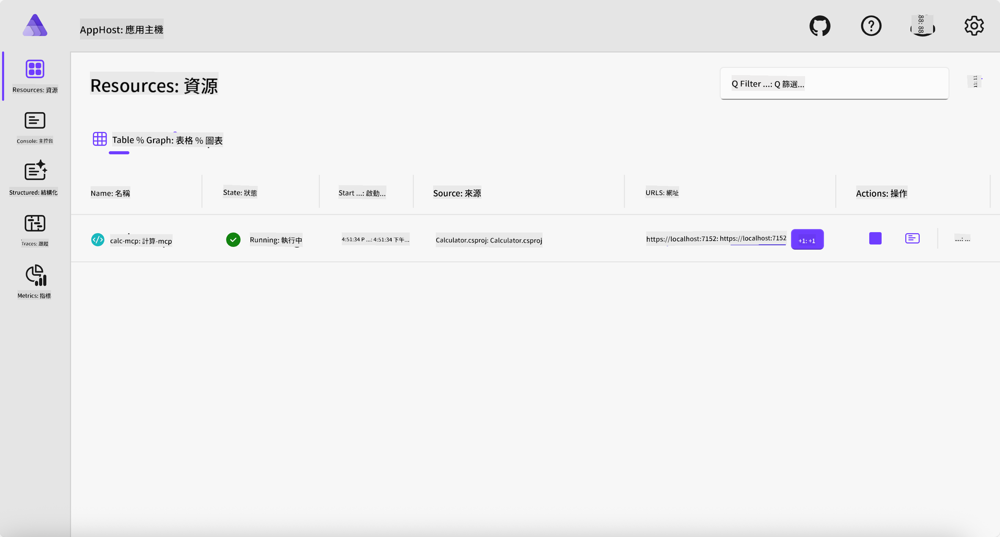
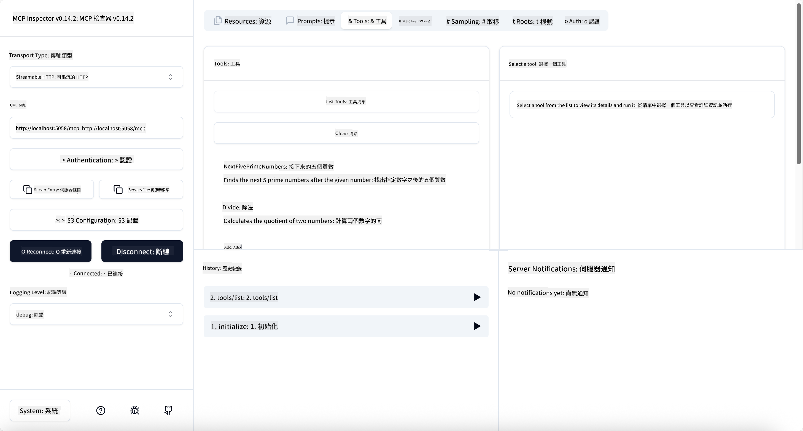

<!--
CO_OP_TRANSLATOR_METADATA:
{
  "original_hash": "0bc7bd48f55f1565f1d95ccb2c16f728",
  "translation_date": "2025-06-18T07:47:25+00:00",
  "source_file": "04-PracticalImplementation/samples/csharp/README.md",
  "language_code": "mo"
}
-->
# 範例

前面的範例展示了如何使用本地的 .NET 專案搭配 `stdio` 類型，並且如何在容器中本地執行伺服器。這在許多情況下都是不錯的解決方案。不過，有時候讓伺服器遠端運行（例如在雲端環境）會更有用，這時就會用到 `http` 類型。

看看 `04-PracticalImplementation` 資料夾裡的解決方案，可能看起來比前一個複雜許多，但實際上並非如此。如果仔細查看 `src/Calculator` 專案，你會發現它和前一個範例大致上是相同的程式碼。唯一的差別是我們使用了不同的函式庫 `ModelContextProtocol.AspNetCore` 來處理 HTTP 請求，並且將 `IsPrime` 方法改成 private，主要是為了示範你的程式碼中可以有私有方法。其餘程式碼都和之前一樣。

其他專案來自 [.NET Aspire](https://learn.microsoft.com/dotnet/aspire/get-started/aspire-overview)。在解決方案中加入 .NET Aspire，可以提升開發和測試的體驗，並有助於可觀察性。雖然執行伺服器並非必須，但將它加入解決方案是個好習慣。

## 本地啟動伺服器

1. 在 VS Code（搭配 C# DevKit 擴充套件）中，切換到 `04-PracticalImplementation/samples/csharp` 目錄。
1. 執行以下指令以啟動伺服器：

   ```bash
    dotnet watch run --project ./src/AppHost
   ```

1. 當瀏覽器開啟 .NET Aspire 儀表板時，請注意 `http` 的 URL，應該會是類似 `http://localhost:5058/`。

   

## 使用 MCP Inspector 測試 Streamable HTTP

如果你安裝了 Node.js 22.7.5 或更新版本，可以使用 MCP Inspector 來測試你的伺服器。

啟動伺服器後，在終端機執行以下指令：

```bash
npx @modelcontextprotocol/inspector http://localhost:5058
```



- 選擇 `Streamable HTTP` as the Transport type.
- In the Url field, enter the URL of the server noted earlier, and append `/mcp`，它應該是 `http`（而不是 `https`) something like `http://localhost:5058/mcp`.
- select the Connect button.

A nice thing about the Inspector is that it provide a nice visibility on what is happening.

- Try listing the available tools
- Try some of them, it should works just like before.

## Test MCP Server with GitHub Copilot Chat in VS Code

To use the Streamable HTTP transport with GitHub Copilot Chat, change the configuration of the `calc-mcp`），先前建立的伺服器應該會長這樣：

```jsonc
// .vscode/mcp.json
{
  "servers": {
    "calc-mcp": {
      "type": "http",
      "url": "http://localhost:5058/mcp"
    }
  }
}
```

進行一些測試：

- 請求「6780 之後的 3 個質數」。注意 Copilot 會使用新工具 `NextFivePrimeNumbers`，並且只回傳前三個質數。
- 請求「111 之後的 7 個質數」，看看會發生什麼。
- 請求「John 有 24 顆棒棒糖，要分給他的 3 個孩子，每個孩子會有多少顆？」，看看結果如何。

## 部署伺服器到 Azure

讓我們把伺服器部署到 Azure，讓更多人可以使用。

在終端機中切換到 `04-PracticalImplementation/samples/csharp` 資料夾，執行以下指令：

```bash
azd up
```

部署完成後，你應該會看到類似這樣的訊息：


取得 URL，並在 MCP Inspector 以及 GitHub Copilot Chat 中使用。

```jsonc
// .vscode/mcp.json
{
  "servers": {
    "calc-mcp": {
      "type": "http",
      "url": "https://calc-mcp.gentleriver-3977fbcf.australiaeast.azurecontainerapps.io/mcp"
    }
  }
}
```

## 接下來呢？

我們嘗試不同的傳輸類型和測試工具，也將你的 MCP 伺服器部署到 Azure。但如果伺服器需要存取私有資源呢？例如資料庫或私有 API？下一章，我們將探討如何加強伺服器的安全性。

**免責聲明**：  
本文件由 AI 翻譯服務 [Co-op Translator](https://github.com/Azure/co-op-translator) 進行翻譯。雖然我們力求準確，但請注意，自動翻譯可能包含錯誤或不準確之處。原始文件的母語版本應被視為權威來源。對於重要資訊，建議採用專業人工翻譯。我們不對因使用此翻譯而產生的任何誤解或誤譯負責。