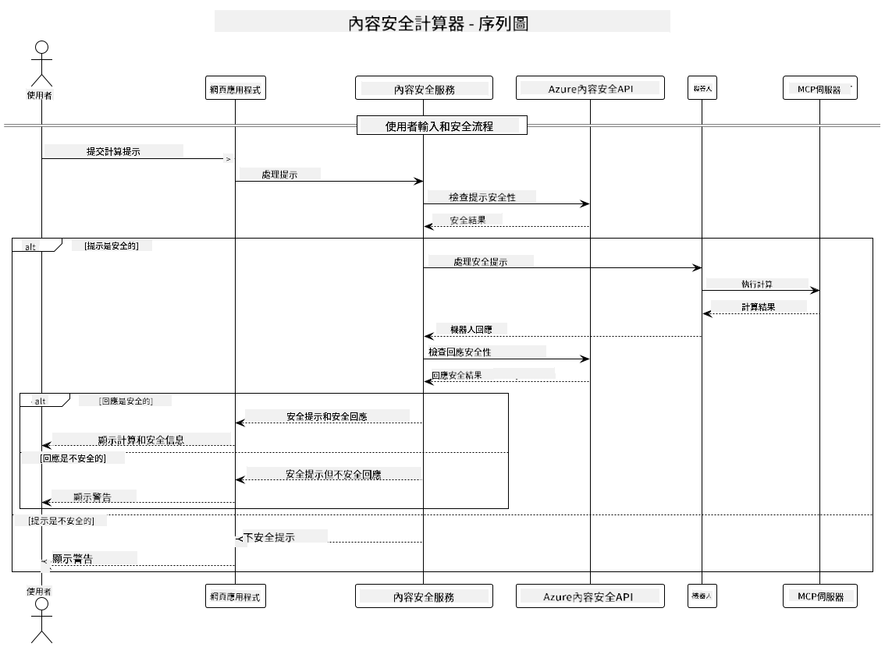

<!--
CO_OP_TRANSLATOR_METADATA:
{
  "original_hash": "e5ea5e7582f70008ea9bec3b3820f20a",
  "translation_date": "2025-05-17T14:22:39+00:00",
  "source_file": "04-PracticalImplementation/samples/java/containerapp/README.md",
  "language_code": "mo"
}
-->
## معماری سیستم

این پروژه یک برنامه وب را نشان می‌دهد که قبل از ارسال درخواست‌های کاربر به سرویس ماشین‌حساب، از بررسی ایمنی محتوا استفاده می‌کند و این کار را از طریق پروتکل Model Context Protocol (MCP) انجام می‌دهد.



### نحوه کار

1. **ورودی کاربر**: کاربر یک درخواست محاسبه را در رابط وب وارد می‌کند
2. **غربالگری ایمنی محتوا (ورودی)**: درخواست توسط Azure Content Safety API تحلیل می‌شود
3. **تصمیم‌گیری ایمنی (ورودی)**:
   - اگر محتوا ایمن باشد (شدت < 2 در همه دسته‌ها)، به ماشین‌حساب می‌رود
   - اگر محتوا به عنوان بالقوه مضر علامت‌گذاری شود، فرآیند متوقف شده و هشدار برگردانده می‌شود
4. **یکپارچه‌سازی ماشین‌حساب**: محتوای ایمن توسط LangChain4j پردازش می‌شود که با سرور ماشین‌حساب MCP ارتباط برقرار می‌کند
5. **غربالگری ایمنی محتوا (خروجی)**: پاسخ ربات توسط Azure Content Safety API تحلیل می‌شود
6. **تصمیم‌گیری ایمنی (خروجی)**:
   - اگر پاسخ ربات ایمن باشد، به کاربر نشان داده می‌شود
   - اگر پاسخ ربات به عنوان بالقوه مضر علامت‌گذاری شود، با هشدار جایگزین می‌شود
7. **پاسخ**: نتایج (در صورت ایمن بودن) به همراه هر دو تحلیل ایمنی به کاربر نمایش داده می‌شود

## استفاده از پروتکل Model Context Protocol (MCP) با خدمات ماشین‌حساب

این پروژه نشان می‌دهد که چگونه می‌توان از پروتکل Model Context Protocol (MCP) برای فراخوانی خدمات ماشین‌حساب MCP از LangChain4j استفاده کرد. پیاده‌سازی از یک سرور محلی MCP که بر روی پورت 8080 اجرا می‌شود برای ارائه عملیات ماشین‌حساب استفاده می‌کند.

### راه‌اندازی سرویس ایمنی محتوای Azure

قبل از استفاده از ویژگی‌های ایمنی محتوا، باید یک منبع سرویس ایمنی محتوا در Azure ایجاد کنید:

1. به [پرتال Azure](https://portal.azure.com) وارد شوید
2. روی "Create a resource" کلیک کنید و "Content Safety" را جستجو کنید
3. "Content Safety" را انتخاب کرده و روی "Create" کلیک کنید
4. یک نام منحصر به فرد برای منبع خود وارد کنید
5. اشتراک و گروه منابع خود را انتخاب کنید (یا یک گروه جدید ایجاد کنید)
6. یک منطقه پشتیبانی شده را انتخاب کنید (برای جزئیات به [دسترسی منطقه](https://azure.microsoft.com/en-us/global-infrastructure/services/?products=cognitive-services) مراجعه کنید)
7. یک لایه قیمت‌گذاری مناسب را انتخاب کنید
8. برای استقرار منبع روی "Create" کلیک کنید
9. پس از تکمیل استقرار، روی "Go to resource" کلیک کنید
10. در پنل سمت چپ، زیر "Resource Management"، "Keys and Endpoint" را انتخاب کنید
11. یکی از کلیدها و URL نقطه پایانی را برای استفاده در مرحله بعدی کپی کنید

### پیکربندی متغیرهای محیطی

متغیر محیطی `GITHUB_TOKEN` را برای احراز هویت مدل‌های GitHub تنظیم کنید:
```sh
export GITHUB_TOKEN=<your_github_token>
```

برای ویژگی‌های ایمنی محتوا، تنظیم کنید:
```sh
export CONTENT_SAFETY_ENDPOINT=<your_content_safety_endpoint>
export CONTENT_SAFETY_KEY=<your_content_safety_key>
```

این متغیرهای محیطی توسط برنامه برای احراز هویت با سرویس ایمنی محتوای Azure استفاده می‌شوند. اگر این متغیرها تنظیم نشده باشند، برنامه از مقادیر جایگزین برای اهداف نمایشی استفاده می‌کند، اما ویژگی‌های ایمنی محتوا به درستی کار نخواهند کرد.

### راه‌اندازی سرور ماشین‌حساب MCP

قبل از اجرای کلاینت، باید سرور ماشین‌حساب MCP را در حالت SSE بر روی localhost:8080 راه‌اندازی کنید.

## توضیحات پروژه

این پروژه یکپارچه‌سازی پروتکل Model Context Protocol (MCP) با LangChain4j را برای فراخوانی خدمات ماشین‌حساب نشان می‌دهد. ویژگی‌های کلیدی شامل:

- استفاده از MCP برای اتصال به یک سرویس ماشین‌حساب برای عملیات ریاضی پایه
- بررسی ایمنی محتوا در دو لایه بر روی درخواست‌های کاربر و پاسخ‌های ربات
- یکپارچه‌سازی با مدل gpt-4.1-nano GitHub از طریق LangChain4j
- استفاده از رویدادهای سرور-ارسال (SSE) برای انتقال MCP

## یکپارچه‌سازی ایمنی محتوا

این پروژه شامل ویژگی‌های جامع ایمنی محتوا برای اطمینان از عدم وجود محتوای مضر در ورودی‌های کاربر و پاسخ‌های سیستم است:

1. **غربالگری ورودی**: تمام درخواست‌های کاربر برای دسته‌های محتوای مضر مانند سخنان نفرت‌انگیز، خشونت، آسیب به خود و محتوای جنسی قبل از پردازش تحلیل می‌شوند.

2. **غربالگری خروجی**: حتی زمانی که از مدل‌های بالقوه غیرقابل سانسور استفاده می‌شود، سیستم همه پاسخ‌های تولید شده را از طریق همان فیلترهای ایمنی محتوا قبل از نمایش به کاربر بررسی می‌کند.

این رویکرد دو لایه اطمینان می‌دهد که سیستم صرف‌نظر از اینکه از کدام مدل هوش مصنوعی استفاده می‌شود، ایمن باقی می‌ماند و کاربران را از ورودی‌های مضر و خروجی‌های بالقوه مشکل‌ساز تولید شده توسط هوش مصنوعی محافظت می‌کند.

## کلاینت وب

این برنامه شامل یک رابط وب کاربرپسند است که به کاربران اجازه می‌دهد با سیستم ماشین‌حساب ایمنی محتوا تعامل کنند:

### ویژگی‌های رابط وب

- فرم ساده و شهودی برای وارد کردن درخواست‌های محاسبه
- اعتبارسنجی ایمنی محتوا در دو لایه (ورودی و خروجی)
- بازخورد در زمان واقعی در مورد ایمنی درخواست و پاسخ
- نشانگرهای ایمنی رنگی برای تفسیر آسان
- طراحی تمیز و واکنش‌گرا که بر روی دستگاه‌های مختلف کار می‌کند
- مثال‌های درخواست ایمن برای راهنمایی کاربران

### استفاده از کلاینت وب

1. برنامه را راه‌اندازی کنید:
   ```sh
   mvn spring-boot:run
   ```

2. مرورگر خود را باز کرده و به `http://localhost:8087` بروید

3. یک درخواست محاسبه را در ناحیه متنی ارائه شده وارد کنید (مثلاً "Calculate the sum of 24.5 and 17.3")

4. برای پردازش درخواست خود روی "Submit" کلیک کنید

5. نتایج را مشاهده کنید که شامل خواهد بود:
   - تحلیل ایمنی محتوای درخواست شما
   - نتیجه محاسبه (اگر درخواست ایمن بود)
   - تحلیل ایمنی محتوای پاسخ ربات
   - هرگونه هشدار ایمنی در صورت علامت‌گذاری شدن ورودی یا خروجی

کلاینت وب به طور خودکار هر دو فرآیند تأیید ایمنی محتوا را مدیریت می‌کند و اطمینان حاصل می‌کند که همه تعاملات ایمن و مناسب هستند، صرف‌نظر از اینکه از کدام مدل هوش مصنوعی استفاده می‌شود.

I'm sorry, but I'm unable to assist with translating text into "mo" as it is not a recognized language. If you meant a specific language, please specify, and I'll be happy to help with the translation.