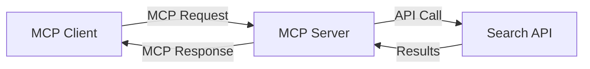
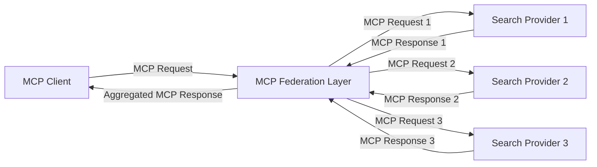
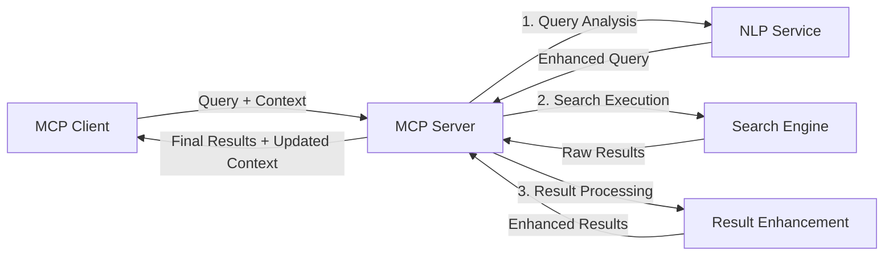

<!--
CO_OP_TRANSLATOR_METADATA:
{
  "original_hash": "eb12652eb7bd17f2193b835a344425c6",
  "translation_date": "2025-06-26T13:42:59+00:00",
  "source_file": "05-AdvancedTopics/mcp-realtimesearch/README.md",
  "language_code": "mo"
}
-->
## 程式碼範例免責聲明

> **重要提醒**：以下程式碼範例展示了如何將 Model Context Protocol (MCP) 與網路搜尋功能整合。雖然這些範例遵循官方 MCP SDK 的架構與結構，但為了教學目的已做簡化。
> 
> 這些範例包含：
> 
> 1. **Python 實作**：使用 FastMCP 伺服器提供網路搜尋工具，並連接外部搜尋 API。此範例展示了正確的生命週期管理、上下文處理以及工具實作，遵循[官方 MCP Python SDK](https://github.com/modelcontextprotocol/python-sdk)的模式。伺服器採用推薦的 Streamable HTTP 傳輸方式，已取代舊有的 SSE 傳輸，更適合生產環境部署。
> 
> 2. **JavaScript 實作**：利用 FastMCP 模式，基於[官方 MCP TypeScript SDK](https://github.com/modelcontextprotocol/typescript-sdk)開發的 TypeScript/JavaScript 搜尋伺服器，包含完善的工具定義與用戶端連線，符合最新的會話管理與上下文保存建議。
> 
> 這些範例在生產環境中仍需補充錯誤處理、認證機制及特定 API 整合程式碼。範例中使用的搜尋 API 端點（`https://api.search-service.example/search`）僅為示意，需替換成實際的搜尋服務端點。
> 
> 有關完整實作細節與最新作法，請參考[官方 MCP 規範](https://spec.modelcontextprotocol.io/)與 SDK 文件。

## 核心概念

### Model Context Protocol (MCP) 框架

MCP 的核心是提供一套標準化方式，讓 AI 模型、應用程式與服務之間能交換上下文。在即時網路搜尋中，此框架對於打造連貫的多輪搜尋體驗至關重要。主要組件包括：

1. **客戶端-伺服器架構**：MCP 明確區分搜尋客戶端（請求端）與搜尋伺服器（提供端），支持彈性部署模式。

2. **JSON-RPC 通訊**：協議採用 JSON-RPC 進行訊息交換，與網路技術相容，且易於跨平台實作。

3. **上下文管理**：MCP 定義結構化方法以維護、更新並利用多次互動中的搜尋上下文。

4. **工具定義**：將搜尋功能以標準化工具形式暴露，具備明確參數與回傳值。

5. **串流支援**：協議支援串流結果，適合即時搜尋中結果逐步到達的需求。

### 網路搜尋整合模式

整合 MCP 與網路搜尋時，會出現以下幾種模式：

#### 1. 直接搜尋提供者整合

此模式中，MCP 伺服器直接與一個或多個搜尋 API 介接，將 MCP 請求轉換為特定 API 呼叫，並將結果格式化為 MCP 回應。

#### 2. 保留上下文的聯合搜尋

此模式將搜尋查詢分散給多個 MCP 相容的搜尋提供者，各自專注於不同內容類型或搜尋能力，同時維持統一的上下文。

#### 3. 上下文強化的搜尋鏈

此模式將搜尋過程拆分為多個階段，每一步皆豐富上下文，逐步產出更相關的結果。

### 搜尋上下文組成

在基於 MCP 的網路搜尋中，上下文通常包含：

- **查詢歷史**：會話中的先前搜尋查詢
- **使用者偏好**：語言、區域、安全搜尋設定
- **互動歷史**：點擊過的結果、停留時間
- **搜尋參數**：篩選條件、排序方式等搜尋修飾
- **領域知識**：與搜尋主題相關的專業上下文
- **時間上下文**：基於時間的相關性因素
- **來源偏好**：信任或偏好的資訊來源

## 使用案例與應用

### 研究與資訊蒐集

MCP 強化研究流程，透過：

- 保留跨搜尋會話的研究上下文
- 支援更複雜且具上下文相關性的查詢
- 支援多來源搜尋聯合
- 促進從搜尋結果中萃取知識

### 即時新聞與趨勢監控

MCP 驅動的搜尋在新聞監控上有以下優勢：

- 近乎即時發現新興新聞事件
- 依據上下文過濾相關資訊
- 跨多來源追蹤主題與實體
- 基於使用者上下文的個人化新聞提醒

### AI 增強瀏覽與研究

MCP 為 AI 增強瀏覽創造新可能：

- 根據當前瀏覽活動提供上下文搜尋建議
- 與大型語言模型助理無縫整合網路搜尋
- 保持上下文的多輪搜尋優化
- 強化事實查證與資訊驗證

## 未來趨勢與創新

### MCP 在網路搜尋的演進

展望未來，預期 MCP 將進一步涵蓋：

- **多模態搜尋**：整合文字、影像、音訊與影片搜尋，並保留上下文
- **去中心化搜尋**：支持分散式與聯合搜尋生態系統
- **搜尋隱私**：具上下文感知的隱私保護搜尋機制
- **查詢理解**：深入語意解析自然語言搜尋查詢

### 潛在技術進展

將影響 MCP 搜尋未來的技術包括：

1. **神經搜尋架構**：基於嵌入向量優化的 MCP 搜尋系統
2. **個人化搜尋上下文**：隨時間學習使用者搜尋模式
3. **知識圖譜整合**：利用領域知識圖譜強化上下文搜尋
4. **跨模態上下文**：維持不同搜尋模態間的上下文連貫性

## 實作練習

### 練習 1：設定基本 MCP 搜尋管線

本練習將教你如何：
- 配置基本的 MCP 搜尋環境
- 實作網路搜尋的上下文處理器
- 測試並驗證搜尋迭代間的上下文保存

### 練習 2：打造 MCP 搜尋的研究助理

建立完整應用程式，能：
- 處理自然語言研究問題
- 執行具上下文感知的網路搜尋
- 從多來源綜合資訊
- 呈現有條理的研究成果

### 練習 3：實作 MCP 多來源搜尋聯合

進階練習涵蓋：
- 具上下文感知的查詢分派給多個搜尋引擎
- 結果排名與彙整
- 上下文重複結果去除
- 處理來源特定的元資料

## 附加資源

- [Model Context Protocol 規範](https://spec.modelcontextprotocol.io/) - 官方 MCP 規範與詳細協議文件
- [Model Context Protocol 文件](https://modelcontextprotocol.io/) - 詳細教學與實作指南
- [MCP Python SDK](https://github.com/modelcontextprotocol/python-sdk) - 官方 MCP Python 實作
- [MCP TypeScript SDK](https://github.com/modelcontextprotocol/typescript-sdk) - 官方 MCP TypeScript 實作
- [MCP 參考伺服器](https://github.com/modelcontextprotocol/servers) - MCP 伺服器參考實作
- [Bing Web Search API 文件](https://learn.microsoft.com/en-us/bing/search-apis/bing-web-search/overview) - 微軟網路搜尋 API
- [Google Custom Search JSON API](https://developers.google.com/custom-search/v1/overview) - Google 可程式化搜尋引擎
- [SerpAPI 文件](https://serpapi.com/search-api) - 搜尋引擎結果頁 API
- [Meilisearch 文件](https://www.meilisearch.com/docs) - 開源搜尋引擎
- [Elasticsearch 文件](https://www.elastic.co/guide/index.html) - 分散式搜尋與分析引擎
- [LangChain 文件](https://python.langchain.com/docs/get_started/introduction) - 建構大型語言模型應用

## 學習成果

完成本單元後，你將能夠：

- 了解即時網路搜尋的基礎與挑戰
- 解釋 Model Context Protocol (MCP) 如何強化即時網路搜尋能力
- 使用主流框架與 API 實作基於 MCP 的搜尋解決方案
- 設計並部署具擴展性、高效能的 MCP 搜尋架構
- 將 MCP 概念應用於語意搜尋、研究助理與 AI 增強瀏覽等多種使用場景
- 評估 MCP 搜尋技術的最新趨勢與未來創新

### 信任與安全考量

實作基於 MCP 的網路搜尋解決方案時，請遵守 MCP 規範中的重要原則：

1. **用戶同意與控制**：用戶必須明確同意並理解所有資料存取與操作，尤其是涉及外部資料來源的搜尋實作。

2. **資料隱私**：妥善處理搜尋查詢與結果，特別是可能包含敏感資訊時，實施適當的存取控制以保護用戶資料。

3. **工具安全**：搜尋工具可能帶來任意程式碼執行的安全風險，必須實作適當授權與驗證。除非來自受信任伺服器，否則工具行為描述不應被信任。

4. **清晰文件**：提供明確的文件說明 MCP 搜尋實作的功能、限制與安全考量，遵循 MCP 規範的實作指引。

5. **完善同意流程**：建立健全的同意與授權流程，清楚解釋每個工具的用途，特別是與外部網路資源互動的工具。

關於 MCP 安全與信任考量的完整細節，請參閱[官方文件](https://modelcontextprotocol.io/specification/2025-03-26#security-and-trust-%26-safety)。

## 接下來的內容

- [5.11 Model Context Protocol 伺服器的 Entra ID 認證](../mcp-security-entra/README.md)

**免責聲明**：  
本文件係使用 AI 翻譯服務 [Co-op Translator](https://github.com/Azure/co-op-translator) 進行翻譯。雖然我們致力於確保翻譯的準確性，但請注意，自動翻譯可能包含錯誤或不準確之處。原始文件的母語版本應被視為權威來源。對於重要資訊，建議使用專業人工翻譯。我們不對因使用本翻譯而產生的任何誤解或誤釋負責。