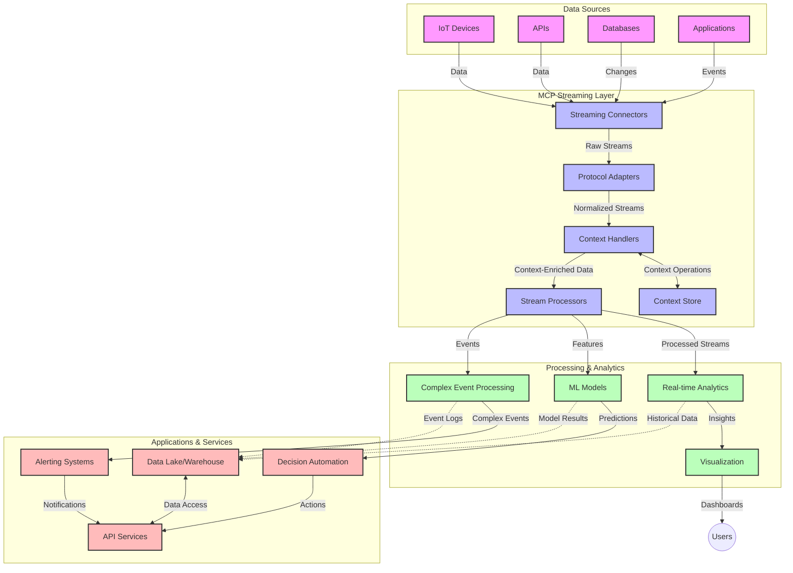

<!--
CO_OP_TRANSLATOR_METADATA:
{
  "original_hash": "68c518dbff8a3b127ed2aa934054c56c",
  "translation_date": "2025-06-11T17:00:49+00:00",
  "source_file": "05-AdvancedTopics/mcp-realtimestreaming/README.md",
  "language_code": "mo"
}
-->
# Model Context Protocol for Real-Time Data Streaming

## Overview

Real-time data streaming has become crucial in today’s data-driven world, where businesses and applications need instant access to information to make timely decisions. The Model Context Protocol (MCP) marks a major step forward in optimizing these real-time streaming workflows, boosting data processing efficiency, preserving contextual integrity, and enhancing overall system performance.

This module examines how MCP transforms real-time data streaming by offering a standardized way to manage context across AI models, streaming platforms, and applications.

## Introduction to Real-Time Data Streaming

Real-time data streaming is a technology approach that enables continuous transfer, processing, and analysis of data as it’s generated, allowing systems to respond immediately to new information. Unlike traditional batch processing that works on static datasets, streaming processes data in motion, delivering insights and actions with minimal delay.

### Core Concepts of Real-Time Data Streaming:

- **Continuous Data Flow**: Data is handled as an ongoing, never-ending stream of events or records.
- **Low Latency Processing**: Systems are designed to reduce the time between data creation and processing.
- **Scalability**: Streaming architectures must accommodate varying data volumes and speeds.
- **Fault Tolerance**: Systems need resilience against failures to maintain uninterrupted data flow.
- **Stateful Processing**: Keeping context across events is essential for meaningful analysis.

### The Model Context Protocol and Real-Time Streaming

The Model Context Protocol (MCP) tackles several key challenges in real-time streaming environments:

1. **Contextual Continuity**: MCP standardizes how context is preserved across distributed streaming components, ensuring AI models and processing nodes have access to relevant historical and environmental context.

2. **Efficient State Management**: By providing structured methods for context transmission, MCP lowers the overhead of managing state in streaming pipelines.

3. **Interoperability**: MCP establishes a common language for sharing context between diverse streaming technologies and AI models, enabling more flexible and extensible architectures.

4. **Streaming-Optimized Context**: MCP implementations can prioritize the most relevant context elements for real-time decision-making, optimizing both performance and accuracy.

5. **Adaptive Processing**: With effective context management through MCP, streaming systems can dynamically adjust processing based on evolving data conditions and patterns.

In modern applications—from IoT sensor networks to financial trading platforms—integrating MCP with streaming technologies enables smarter, context-aware processing that can respond aptly to complex, changing situations in real time.

## Learning Objectives

By the end of this lesson, you will be able to:

- Understand the fundamentals of real-time data streaming and its challenges
- Explain how the Model Context Protocol (MCP) enhances real-time data streaming
- Implement MCP-based streaming solutions using popular frameworks like Kafka and Pulsar
- Design and deploy fault-tolerant, high-performance streaming architectures with MCP
- Apply MCP concepts to IoT, financial trading, and AI-driven analytics use cases
- Evaluate emerging trends and future innovations in MCP-based streaming technologies

### Definition and Significance

Real-time data streaming involves the continuous generation, processing, and delivery of data with minimal delay. Unlike batch processing, where data is collected and handled in groups, streaming data is processed incrementally as it arrives, enabling immediate insights and actions.

Key features of real-time data streaming include:

- **Low Latency**: Processing and analyzing data within milliseconds to seconds
- **Continuous Flow**: Uninterrupted streams of data from multiple sources
- **Immediate Processing**: Analyzing data as it arrives rather than in batches
- **Event-Driven Architecture**: Reacting to events as they happen

### Challenges in Traditional Data Streaming

Traditional data streaming approaches face several limitations:

1. **Context Loss**: Difficulty in maintaining context across distributed systems
2. **Scalability Issues**: Challenges in scaling to handle large volumes and high-speed data
3. **Integration Complexity**: Problems with interoperability between different systems
4. **Latency Management**: Balancing throughput with processing time
5. **Data Consistency**: Ensuring data accuracy and completeness throughout the stream

## Understanding Model Context Protocol (MCP)

### What is MCP?

The Model Context Protocol (MCP) is a standardized communication protocol designed to enable efficient interaction between AI models and applications. In real-time data streaming, MCP provides a framework for:

- Preserving context throughout the data pipeline
- Standardizing data exchange formats
- Optimizing transmission of large datasets
- Enhancing communication between models and applications

### Core Components and Architecture

MCP architecture for real-time streaming includes several key components:

1. **Context Handlers**: Manage and maintain contextual information across the streaming pipeline
2. **Stream Processors**: Process incoming data streams using context-aware methods
3. **Protocol Adapters**: Convert between different streaming protocols while preserving context
4. **Context Store**: Efficiently store and retrieve contextual information
5. **Streaming Connectors**: Connect to various streaming platforms (Kafka, Pulsar, Kinesis, etc.)



### How MCP Improves Real-Time Data Handling

MCP addresses traditional streaming challenges by:

- **Contextual Integrity**: Maintaining relationships between data points across the entire pipeline
- **Optimized Transmission**: Reducing data redundancy through intelligent context management
- **Standardized Interfaces**: Offering consistent APIs for streaming components
- **Reduced Latency**: Minimizing processing overhead through efficient context handling
- **Enhanced Scalability**: Supporting horizontal scaling while preserving context

## Integration and Implementation

Real-time data streaming systems require thoughtful architectural design and implementation to maintain both performance and contextual integrity. The Model Context Protocol offers a standardized way to integrate AI models and streaming technologies, enabling more sophisticated, context-aware processing pipelines.

### Overview of MCP Integration in Streaming Architectures

Implementing MCP in real-time streaming involves several important considerations:

1. **Context Serialization and Transport**: MCP provides efficient methods for encoding contextual information within streaming data packets, ensuring essential context travels with data throughout the processing pipeline. This includes standardized serialization formats optimized for streaming transport.

2. **Stateful Stream Processing**: MCP enables smarter stateful processing by maintaining consistent context representation across processing nodes. This is especially valuable in distributed streaming architectures where managing state is traditionally difficult.

3. **Event-Time vs. Processing-Time**: MCP implementations must handle the common challenge of distinguishing when events occurred versus when they are processed. The protocol can include temporal context to preserve event time semantics.

4. **Backpressure Management**: By standardizing context handling, MCP helps manage backpressure in streaming systems, allowing components to communicate their processing capacity and adjust flow accordingly.

5. **Context Windowing and Aggregation**: MCP supports more advanced windowing operations by providing structured representations of temporal and relational contexts, enabling more meaningful aggregations across event streams.

6. **Exactly-Once Processing**: For streaming systems requiring exactly-once semantics, MCP can incorporate processing metadata to help track and verify processing status across distributed components.

Implementing MCP across various streaming technologies creates a unified approach to context management, reducing the need for custom integration code while improving the system’s ability to maintain meaningful context as data flows through the pipeline.

### MCP in Various Data Streaming Frameworks

MCP can be integrated with popular streaming frameworks such as:

#### Apache Kafka Integration

```python
from mcp_streaming import MCPKafkaConnector

# Initialize MCP Kafka connector
connector = MCPKafkaConnector(
    bootstrap_servers='localhost:9092',
    context_preservation=True
)

# Create a context-aware consumer
consumer = connector.create_consumer('input-topic')

# Process streaming data with context
for message in consumer:
    context = message.get_context()
    data = message.get_value()
    
    # Process with context awareness
    result = process_with_context(data, context)
    
    # Produce output with preserved context
    connector.produce('output-topic', result, context=context)
```

#### Apache Pulsar Implementation

```python
from mcp_streaming import MCPPulsarClient

# Initialize MCP Pulsar client
client = MCPPulsarClient('pulsar://localhost:6650')

# Subscribe with context awareness
consumer = client.subscribe('input-topic', 'subscription-name', 
                           context_enabled=True)

# Process messages with context preservation
while True:
    message = consumer.receive()
    context = message.get_context()
    
    # Process with context
    result = process_with_context(message.data(), context)
    
    # Acknowledge the message
    consumer.acknowledge(message)
    
    # Send result with preserved context
    producer = client.create_producer('output-topic')
    producer.send(result, context=context)
```

### Best Practices for Deployment

When implementing MCP for real-time streaming:

1. **Design for Fault Tolerance**:
   - Implement robust error handling
   - Use dead-letter queues for failed messages
   - Design idempotent processors

2. **Optimize for Performance**:
   - Configure appropriate buffer sizes
   - Use batching when suitable
   - Implement backpressure mechanisms

3. **Monitor and Observe**:
   - Track stream processing metrics
   - Monitor context propagation
   - Set up alerts for anomalies

4. **Secure Your Streams**:
   - Encrypt sensitive data
   - Use authentication and authorization
   - Apply proper access controls

### MCP in IoT and Edge Computing

MCP enhances IoT streaming by:

- Preserving device context throughout the processing pipeline
- Enabling efficient edge-to-cloud data streaming
- Supporting real-time analytics on IoT data streams
- Facilitating device-to-device communication with context

Example: Smart City Sensor Networks  
```
Sensors → Edge Gateways → MCP Stream Processors → Real-time Analytics → Automated Responses
```

### Role in Financial Transactions and High-Frequency Trading

MCP offers key benefits for financial data streaming:

- Ultra-low latency processing for trading decisions
- Maintaining transaction context throughout processing
- Supporting complex event processing with contextual awareness
- Ensuring data consistency across distributed trading systems

### Enhancing AI-Driven Data Analytics

MCP opens new possibilities for streaming analytics:

- Real-time model training and inference
- Continuous learning from streaming data
- Context-aware feature extraction
- Multi-model inference pipelines with preserved context

## Future Trends and Innovations

### Evolution of MCP in Real-Time Environments

Looking ahead, MCP is expected to evolve to address:

- **Quantum Computing Integration**: Preparing for quantum-based streaming systems
- **Edge-Native Processing**: Shifting more context-aware processing to edge devices
- **Autonomous Stream Management**: Self-optimizing streaming pipelines
- **Federated Streaming**: Distributed processing while preserving privacy

### Potential Advancements in Technology

Emerging technologies shaping the future of MCP streaming include:

1. **AI-Optimized Streaming Protocols**: Custom protocols designed specifically for AI workloads
2. **Neuromorphic Computing Integration**: Brain-inspired computing for stream processing
3. **Serverless Streaming**: Event-driven, scalable streaming without infrastructure management
4. **Distributed Context Stores**: Globally distributed yet highly consistent context management

## Hands-On Exercises

### Exercise 1: Setting Up a Basic MCP Streaming Pipeline

In this exercise, you’ll learn how to:  
- Configure a basic MCP streaming environment  
- Implement context handlers for stream processing  
- Test and validate context preservation

### Exercise 2: Building a Real-Time Analytics Dashboard

Create a complete application that:  
- Ingests streaming data using MCP  
- Processes the stream while maintaining context  
- Visualizes results in real time

### Exercise 3: Implementing Complex Event Processing with MCP

Advanced exercise covering:  
- Pattern detection in streams  
- Contextual correlation across multiple streams  
- Generating complex events with preserved context

## Additional Resources

- [Model Context Protocol Specification](https://github.com/microsoft/model-context-protocol) - Official MCP specification and documentation  
- [Apache Kafka Documentation](https://kafka.apache.org/documentation/) - Learn about Kafka for stream processing  
- [Apache Pulsar](https://pulsar.apache.org/) - Unified messaging and streaming platform  
- [Streaming Systems: The What, Where, When, and How of Large-Scale Data Processing](https://www.oreilly.com/library/view/streaming-systems/9781491983867/) - Comprehensive book on streaming architectures  
- [Microsoft Azure Event Hubs](https://learn.microsoft.com/en-us/azure/event-hubs/event-hubs-about) - Managed event streaming service  
- [MLflow Documentation](https://mlflow.org/docs/latest/index.html) - For ML model tracking and deployment  
- [Real-Time Analytics with Apache Storm](https://storm.apache.org/releases/current/index.html) - Processing framework for real-time computation  
- [Flink ML](https://nightlies.apache.org/flink/flink-ml-docs-master/) - Machine learning library for Apache Flink  
- [LangChain Documentation](https://python.langchain.com/docs/get_started/introduction) - Building applications with LLMs

## Learning Outcomes

By completing this module, you will be able to:

- Understand the fundamentals of real-time data streaming and its challenges  
- Explain how the Model Context Protocol (MCP) enhances real-time data streaming  
- Implement MCP-based streaming solutions using popular frameworks like Kafka and Pulsar  
- Design and deploy fault-tolerant, high-performance streaming architectures with MCP  
- Apply MCP concepts to IoT, financial trading, and AI-driven analytics use cases  
- Evaluate emerging trends and future innovations in MCP-based streaming technologies

## What's next 

- [6. Community Contributions](../../06-CommunityContributions/README.md)

**Disclaimer**:  
This document has been translated using AI translation service [Co-op Translator](https://github.com/Azure/co-op-translator). While we strive for accuracy, please be aware that automated translations may contain errors or inaccuracies. The original document in its native language should be considered the authoritative source. For critical information, professional human translation is recommended. We are not liable for any misunderstandings or misinterpretations arising from the use of this translation.

---

Could you please clarify what language or dialect "mo" refers to? There are several possibilities (e.g., Moldovan, a fictional language, or a shorthand), and I want to ensure an accurate translation.