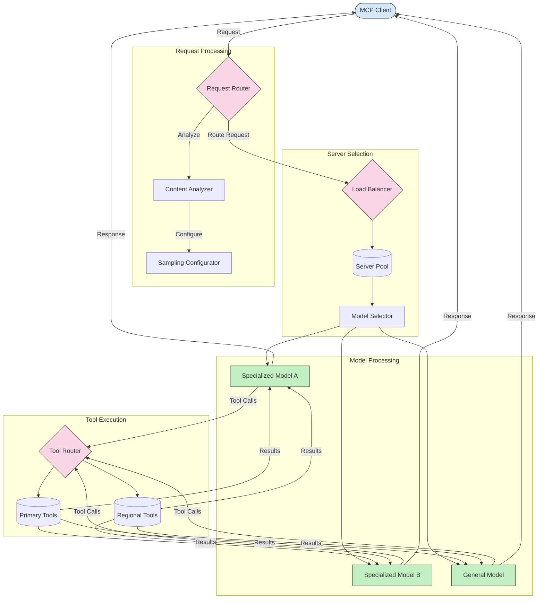

<!--
CO_OP_TRANSLATOR_METADATA:
{
  "original_hash": "af40eab7bd6ebf7e607f982a5506a5b5",
  "translation_date": "2025-07-14T02:10:27+00:00",
  "source_file": "05-AdvancedTopics/mcp-routing/README.md",
  "language_code": "mo"
}
-->
## 智能負載平衡

負載平衡能優化資源利用率並確保 MCP 服務的高可用性。實現負載平衡的方法有多種，例如輪詢、加權響應時間或內容感知策略。

以下範例實作使用了以下策略：

- **輪詢 (Round Robin)**：將請求均勻分配到可用的伺服器。
- **加權響應時間 (Weighted Response Time)**：根據伺服器的平均響應時間來路由請求。
- **內容感知 (Content-Aware)**：根據請求內容將請求路由到專門的伺服器。

## 動態工具路由

工具路由確保工具呼叫根據上下文被導向最合適的服務。例如，天氣工具呼叫可能需要根據使用者位置路由到區域端點，或計算器工具可能需要使用特定版本的 API。

以下範例展示了基於請求分析、區域端點和版本支援的動態工具路由實作。

## MCP 中的取樣與路由架構

取樣是 Model Context Protocol (MCP) 的關鍵組成部分，能有效處理和路由請求。它透過分析進來的請求，根據內容類型、使用者上下文和系統負載等多種條件，判斷最適合處理該請求的模型或服務。

取樣與路由結合，能打造出一個強健的架構，優化資源利用並確保高可用性。取樣過程用於分類請求，而路由則將請求導向適當的模型或服務。

下圖說明了取樣與路由如何在完整的 MCP 架構中協同運作：

## 接下來的內容

- [5.6 Sampling](../mcp-sampling/README.md)

**免責聲明**：  
本文件係使用 AI 翻譯服務 [Co-op Translator](https://github.com/Azure/co-op-translator) 進行翻譯。雖然我們致力於確保準確性，但請注意，自動翻譯可能包含錯誤或不準確之處。原始文件的母語版本應視為權威來源。對於重要資訊，建議採用專業人工翻譯。我們不對因使用本翻譯而產生的任何誤解或誤釋承擔責任。