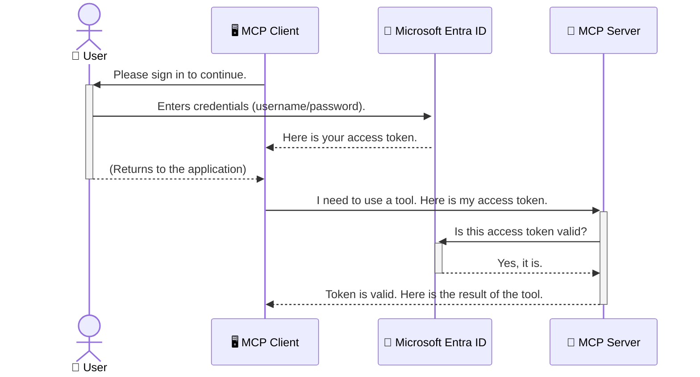

<!--
CO_OP_TRANSLATOR_METADATA:
{
  "original_hash": "9abe1d303ab126f9a8b87f03cebe5213",
  "translation_date": "2025-06-26T14:36:31+00:00",
  "source_file": "05-AdvancedTopics/mcp-security-entra/README.md",
  "language_code": "mo"
}
-->
# 保護 AI 工作流程：Model Context Protocol 伺服器的 Entra ID 認證

## 介紹  
保護您的 Model Context Protocol (MCP) 伺服器就像鎖好家門一樣重要。若將 MCP 伺服器開放，您的工具和資料就可能遭到未授權的存取，進而引發安全漏洞。Microsoft Entra ID 提供強大的雲端身份與存取管理解決方案，協助確保只有授權的使用者和應用程式能與您的 MCP 伺服器互動。本章將教您如何利用 Entra ID 認證來保護您的 AI 工作流程。

## 學習目標  
完成本節後，您將能夠：

- 了解保護 MCP 伺服器的重要性。  
- 說明 Microsoft Entra ID 與 OAuth 2.0 認證的基本概念。  
- 區分公開用戶端與機密用戶端的差異。  
- 在本地（公開用戶端）與遠端（機密用戶端）MCP 伺服器場景中實作 Entra ID 認證。  
- 在開發 AI 工作流程時應用安全最佳實務。

# 保護 AI 工作流程：Model Context Protocol 伺服器的 Entra ID 認證

就像您不會把家門隨意敞開一樣，也不應該讓 MCP 伺服器隨意開放。保護您的 AI 工作流程是打造強固、可信賴且安全應用程式的基礎。本章將介紹如何使用 Microsoft Entra ID 來保護 MCP 伺服器，確保只有授權的使用者與應用程式能夠存取您的工具和資料。

## 為何 MCP 伺服器的安全性至關重要

想像您的 MCP 伺服器擁有發送電子郵件或存取客戶資料庫的工具。若伺服器未加以保護，任何人都可能利用這些工具，導致未授權的資料存取、垃圾郵件或其他惡意行為。

透過實施認證，您可確保每一筆對伺服器的請求都經過驗證，確認提出請求的使用者或應用程式身份。這是保護 AI 工作流程的第一且最關鍵的步驟。

## Microsoft Entra ID 簡介

**Microsoft Entra ID** 是一項雲端身份與存取管理服務。可以把它想像成您應用程式的全方位安全守護者，負責驗證使用者身份（認證）及決定其權限（授權）。

利用 Entra ID，您可以：

- 啟用安全的使用者登入。  
- 保護 API 和服務。  
- 從集中位置管理存取政策。

對 MCP 伺服器而言，Entra ID 提供一套強大且廣受信賴的解決方案，幫助管理誰能存取伺服器功能。

---

## 了解原理：Entra ID 認證如何運作

Entra ID 採用開放標準如 **OAuth 2.0** 來處理認證。雖然細節較為複雜，但核心概念簡單，可以用類比來理解。

### OAuth 2.0 入門：代客鑰匙的比喻

想像 OAuth 2.0 就像代客泊車服務。當您到達餐廳時，不會交出車輛的主鑰匙，而是給代客鑰匙，這把鑰匙權限有限——能啟動車子和鎖門，但不能打開後車廂或手套箱。

在這個比喻中：

- **您** 是 **使用者**。  
- **您的車** 是擁有珍貴工具和資料的 **MCP 伺服器**。  
- **代客** 是 **Microsoft Entra ID**。  
- **泊車員** 是嘗試存取伺服器的 **MCP 用戶端**（應用程式）。  
- **代客鑰匙** 是 **存取權杖（Access Token）**。

存取權杖是 MCP 用戶端在您登入後，從 Entra ID 獲取的安全字串。用戶端每次向 MCP 伺服器發出請求時，都會帶上這個權杖。伺服器可驗證權杖，確保請求合法且用戶端擁有必要權限，且無需直接處理您的密碼等憑證。

### 認證流程

實際流程如下：



### 認識 Microsoft Authentication Library (MSAL)

在深入程式碼前，先介紹範例中常見的關鍵元件：**Microsoft Authentication Library (MSAL)**。

MSAL 是微軟開發的函式庫，讓開發者更輕鬆地處理認證。您不必自行撰寫複雜的安全權杖管理、登入流程及會話續期程式碼，MSAL 幫您完成這些繁重工作。

使用 MSAL 的好處包括：

- **安全性高**：採用業界標準協定和安全最佳實務，降低程式碼漏洞風險。  
- **簡化開發**：抽象化 OAuth 2.0 與 OpenID Connect 協定的複雜度，只需少量程式碼即可加入強健認證。  
- **持續維護**：微軟積極更新 MSAL，應對新興安全威脅與平台變動。

MSAL 支援多種語言與應用框架，包括 .NET、JavaScript/TypeScript、Python、Java、Go 以及 iOS、Android 等行動平台，讓您在整個技術堆疊中保持一致的認證模式。

欲了解更多 MSAL 資訊，請參考官方 [MSAL 概覽文件](https://learn.microsoft.com/entra/identity-platform/msal-overview)。

---

## 使用 Entra ID 保護 MCP 伺服器：逐步指南

接下來，我們將示範如何保護本地 MCP 伺服器（透過 `stdio` 通訊的場景）：

`AuthenticationService.cs` 中的 `CreateAsync` 方法是核心。它會先嘗試靜默取得權杖（若使用者已有有效會話，無需重新登入）。若無法靜默取得，則會提示使用者互動式登入。

```csharp
// Simplified for clarity
public static async Task<AuthenticationService> CreateAsync(ILogger<AuthenticationService> logger)
{
    var msalClient = PublicClientApplicationBuilder
        .Create(_clientId) // Your Application (client) ID
        .WithAuthority(AadAuthorityAudience.AzureAdMyOrg)
        .WithTenantId(_tenantId) // Your Directory (tenant) ID
        .WithBroker(new BrokerOptions(BrokerOptions.OperatingSystems.Windows))
        .Build();

    // ... cache registration ...

    return new AuthenticationService(logger, msalClient);
}

public async Task<string> AcquireTokenAsync()
{
    try
    {
        // Try silent authentication first
        var accounts = await _msalClient.GetAccountsAsync();
        var account = accounts.FirstOrDefault();

        AuthenticationResult? result = null;

        if (account != null)
        {
            result = await _msalClient.AcquireTokenSilent(_scopes, account).ExecuteAsync();
        }
        else
        {
            // If no account, or silent fails, go interactive
            result = await _msalClient.AcquireTokenInteractive(_scopes).ExecuteAsync();
        }

        return result.AccessToken;
    }
    catch (Exception ex)
    {
        _logger.LogError(ex, "An error occurred while acquiring the token.");
        throw; // Optionally rethrow the exception for higher-level handling
    }
}
```

在 `Program.cs` 中，透過 `AddSingleton<AuthenticationService>` 註冊服務，並使用 `authService.AcquireTokenAsync()` 取得有效存取權杖。認證成功後，利用此權杖呼叫 Microsoft Graph API，取得使用者資訊。

```csharp
// Simplified for clarity
[McpServerTool(Name = "GetUserDetailsFromGraph")]
public static async Task<string> GetUserDetailsFromGraph(
    AuthenticationService authService)
{
    try
    {
        // This will trigger the authentication flow
        var accessToken = await authService.AcquireTokenAsync();

        // Use the token to create a GraphServiceClient
        var graphClient = new GraphServiceClient(
            new BaseBearerTokenAuthenticationProvider(new TokenProvider(authService)));

        var user = await graphClient.Me.GetAsync();

        return System.Text.Json.JsonSerializer.Serialize(user);
    }
    catch (Exception ex)
    {
        return $"Error: {ex.Message}";
    }
}
```

#### 3. 整體運作流程說明

1. MCP 用戶端嘗試呼叫 `GetUserDetailsFromGraph` 工具，該工具透過 `AcquireTokenAsync` 取得權杖。  
2. 使用者完成登入後，Entra ID 將使用者導回 `/auth/callback` 端點。  
3. 該端點會交換授權碼換取存取權杖和更新權杖。  

```typescript
// Simplified for clarity
const app = express();
const { server } = createServer();
const provider = new EntraIdServerAuthProvider();

// Protect the SSE endpoint
app.get("/sse", requireBearerAuth({
  provider,
  requiredScopes: ["User.Read"]
}), async (req, res) => {
  // ... connect to the transport ...
});

// Protect the message endpoint
app.post("/message", requireBearerAuth({
  provider,
  requiredScopes: ["User.Read"]
}), async (req, res) => {
  // ... handle the message ...
});

// Handle the OAuth 2.0 callback
app.get("/auth/callback", (req, res) => {
  provider.handleCallback(req.query.code, req.query.state)
    .then(result => {
      // ... handle success or failure ...
    });
});
```

`Tools.ts` 中的 `getUserDetails` 工具與先前範例相似，但它從使用者會話中取得存取權杖。

```typescript
// Simplified for clarity
server.setRequestHandler(CallToolRequestSchema, async (request) => {
  const { name } = request.params;
  const context = request.params?.context as { token?: string } | undefined;
  const sessionToken = context?.token;

  if (name === ToolName.GET_USER_DETAILS) {
    if (!sessionToken) {
      throw new AuthenticationError("Authentication token is missing or invalid. Ensure the token is provided in the request context.");
    }

    // Get the Entra ID token from the session store
    const tokenData = tokenStore.getToken(sessionToken);
    const entraIdToken = tokenData.accessToken;

    const graphClient = Client.init({
      authProvider: (done) => {
        done(null, entraIdToken);
      }
    });

    const user = await graphClient.api('/me').get();

    // ... return user details ...
  }
});
```

在 `auth/EntraIdServerAuthProvider.ts` 中，當呼叫 `getUserDetails` 工具時，會使用會話中的存取權杖來呼叫 Microsoft Graph API。

此流程比公開用戶端流程複雜，但對於面向公網的遠端 MCP 伺服器而言，這是必要的安全措施，以防止未授權存取與潛在攻擊。

## 安全最佳實務

- **務必使用 HTTPS**：加密用戶端與伺服器間的通訊，防止權杖被攔截。  
- **實施基於角色的存取控制（RBAC）**：不僅確認使用者是否已認證，更要檢查其授權權限。可在 Entra ID 定義角色，並於 MCP 伺服器中檢查。  
- **監控與稽核**：記錄所有認證事件，及時偵測並回應可疑活動。  
- **處理速率限制與流量控管**：Microsoft Graph 及其他 API 會實施速率限制，避免濫用。請在 MCP 伺服器中實作指數退避與重試邏輯，妥善處理 HTTP 429（請求過多）回應。建議快取常用資料以減少 API 呼叫。  
- **安全存放權杖**：妥善保存存取權杖與更新權杖。本地應用可使用系統安全儲存機制，伺服器端則可考慮加密儲存或使用 Azure Key Vault 等安全金鑰管理服務。  
- **處理權杖過期**：存取權杖有效期限有限，應自動使用更新權杖續期，確保使用者體驗流暢且無需重新認證。  
- **考慮使用 Azure API Management**：直接在 MCP 伺服器實作安全雖然可細緻控管，但 API 閘道如 Azure API Management 可自動處理認證、授權、速率限制與監控，提供集中式安全層，位於用戶端與 MCP 伺服器之間。更多 MCP 與 API 閘道整合詳情，請參閱我們的 [Azure API Management Your Auth Gateway For MCP Servers](https://techcommunity.microsoft.com/blog/integrationsonazureblog/azure-api-management-your-auth-gateway-for-mcp-servers/4402690)。

## 重要重點總結

- 保護 MCP 伺服器是保障資料與工具安全的關鍵。  
- Microsoft Entra ID 提供強大且可擴充的認證與授權解決方案。  
- 本地應用使用 **公開用戶端**，遠端伺服器使用 **機密用戶端**。  
- **授權碼流程（Authorization Code Flow）** 是網頁應用最安全的選擇。

## 練習題

1. 想想您可能會建立的 MCP 伺服器，是本地伺服器還是遠端伺服器？  
2. 根據您的答案，您會使用公開用戶端還是機密用戶端？  
3. 您的 MCP 伺服器會申請哪些 Microsoft Graph 權限來執行操作？

## 實作練習

### 練習 1：在 Entra ID 中註冊應用程式  
前往 Microsoft Entra 入口網站。  
註冊新的 MCP 伺服器應用程式。  
記錄應用程式（用戶端）ID 與目錄（租戶）ID。

### 練習 2：保護本地 MCP 伺服器（公開用戶端）  
參考範例程式碼，整合 MSAL（Microsoft Authentication Library）進行使用者認證。  
透過呼叫取得使用者詳細資料的 MCP 工具，測試認證流程。

### 練習 3：保護遠端 MCP 伺服器（機密用戶端）  
在 Entra ID 註冊機密用戶端並建立用戶端密鑰。  
設定 Express.js MCP 伺服器使用授權碼流程。  
測試受保護的端點，確認基於權杖的存取。

### 練習 4：應用安全最佳實務  
啟用本地或遠端伺服器的 HTTPS。  
在伺服器邏輯中實施基於角色的存取控制（RBAC）。  
新增權杖過期處理與安全的權杖儲存。

## 參考資源

1. **MSAL 概覽文件**  
   了解 Microsoft Authentication Library (MSAL) 如何跨平台安全取得權杖：  
   [MSAL Overview on Microsoft Learn](https://learn.microsoft.com/en-gb/entra/msal/overview)

2. **Azure-Samples/mcp-auth-servers GitHub 儲存庫**  
   MCP 伺服器認證流程的參考實作：  
   [Azure-Samples/mcp-auth-servers on GitHub](https://github.com/Azure-Samples/mcp-auth-servers)

3. **Azure 資源的受管身分概覽**  
   瞭解如何使用系統指派或使用者指派的受管身分來消除祕密管理：  
   [Managed Identities Overview on Microsoft Learn](https://learn.microsoft.com/en-us/entra/identity/managed-identities-azure-resources/)

4. **Azure API Management：您的 MCP 伺服器認證閘道**  
   深入探討使用 APIM 作為 MCP 伺服器安全 OAuth2 閘道：  
   [Azure API Management Your Auth Gateway For MCP Servers](https://techcommunity.microsoft.com/blog/integrationsonazureblog/azure-api-management-your-auth-gateway-for-mcp-servers/4402690)

5. **Microsoft Graph 權限參考**  
   Microsoft Graph 的委派與應用程式權限完整清單：  
   [Microsoft Graph Permissions Reference](https://learn.microsoft.com/zh-tw/graph/permissions-reference)

## 學習成果  
完成本節後，您將能夠：

- 清楚說明為何認證對 MCP 伺服器與 AI 工作流程至關重要。  
- 設定並配置 Entra ID 認證，適用於本地及遠端 MCP 伺服器場景。  
- 根據伺服器部署情境，選擇適合的用戶端類型（公開或機密）。  
- 實作安全編碼實務，包括權杖儲存與基於角色的授權。  
- 自信地保護 MCP 伺服器及其工具，避免未授權存取。

## 下一步  

- [6. 社群貢獻](../../06-CommunityContributions/README.md)

**免責聲明**：  
本文件係使用 AI 翻譯服務 [Co-op Translator](https://github.com/Azure/co-op-translator) 進行翻譯。雖然我們力求準確，但請注意，自動翻譯可能包含錯誤或不準確之處。原始文件的母語版本應被視為權威來源。對於重要資訊，建議採用專業人工翻譯。我們對因使用本翻譯而產生的任何誤解或誤釋不承擔任何責任。