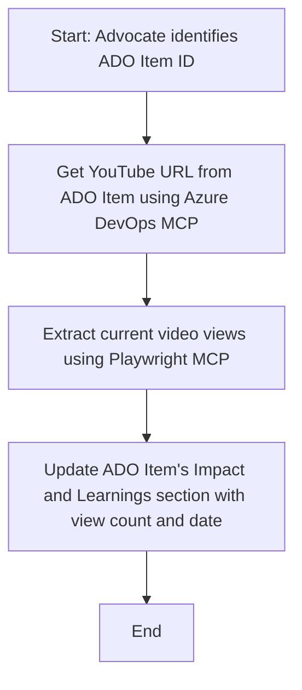

<!--
CO_OP_TRANSLATOR_METADATA:
{
  "original_hash": "14a2dfbea55ef735660a06bd6bdfe5f3",
  "translation_date": "2025-07-14T06:09:37+00:00",
  "source_file": "09-CaseStudy/UpdateADOItemsFromYT.md",
  "language_code": "mo"
}
-->
# 案例研究：使用 MCP 從 YouTube 資料更新 Azure DevOps 項目

> **免責聲明：** 市面上已有現成的線上工具和報告，可以自動化將 YouTube 等平台的資料更新至 Azure DevOps 項目的流程。以下情境僅作為示範用例，說明如何運用 MCP 工具進行自動化與整合任務。

## 概述

本案例展示了如何利用 Model Context Protocol (MCP) 及其工具，自動化將來自線上平台（如 YouTube）的資訊更新至 Azure DevOps (ADO) 工作項目。所描述的情境只是這些工具廣泛應用能力的一個範例，能夠靈活調整以符合其他類似的自動化需求。

在此範例中，一位 Advocate 使用 ADO 項目追蹤線上會議，每個項目包含一個 YouTube 影片網址。透過 MCP 工具，Advocate 能夠以可重複且自動化的方式，持續更新 ADO 項目中的最新影片數據，例如觀看次數。此方法同樣適用於其他需要將線上資訊整合至 ADO 或其他系統的情境。

## 情境說明

Advocate 負責追蹤線上會議及社群互動的影響力。每場會議皆以 ADO 工作項目記錄於 'DevRel' 專案中，且工作項目包含 YouTube 影片網址欄位。為了準確報告會議的觸及範圍，Advocate 需要將目前的影片觀看次數及資料擷取日期更新至 ADO 項目中。

## 使用工具

- [Azure DevOps MCP](https://github.com/microsoft/azure-devops-mcp)：透過 MCP 以程式化方式存取並更新 ADO 工作項目。
- [Playwright MCP](https://github.com/microsoft/playwright-mcp)：自動化瀏覽器操作，擷取網頁上的即時資料，如 YouTube 影片統計數據。

## 逐步工作流程

1. **識別 ADO 項目**：從 'DevRel' 專案中取得 ADO 工作項目 ID（例如 1234）。
2. **擷取 YouTube 網址**：使用 Azure DevOps MCP 工具從該工作項目取得 YouTube 影片網址。
3. **擷取影片觀看次數**：利用 Playwright MCP 工具前往該 YouTube 網址，擷取目前的觀看次數。
4. **更新 ADO 項目**：使用 Azure DevOps MCP 工具，將最新觀看次數及擷取日期寫入 ADO 工作項目的「Impact and Learnings」區塊。

## 範例提示

```bash
- Work with the ADO Item ID: 1234
- The project is '2025-Awesome'
- Get the YouTube URL for the ADO item
- Use Playwright to get the current views from the YouTube video
- Update the ADO item with the current video views and the updated date of the information
```

## Mermaid 流程圖



## 技術實作

- **MCP 編排**：整個流程由 MCP 伺服器負責編排，協調 Azure DevOps MCP 與 Playwright MCP 工具的使用。
- **自動化**：此流程可手動觸發，或設定定期排程以保持 ADO 項目資料最新。
- **擴充性**：同樣模式可延伸至更新 ADO 項目其他線上指標（如按讚數、留言數）或來自其他平台的資料。

## 成果與影響

- **效率提升**：透過自動擷取與更新影片數據，減少 Advocate 的手動工作量。
- **資料準確**：確保 ADO 項目反映線上來源的最新資訊。
- **可重複使用**：提供一套可重複利用的工作流程，適用於其他資料來源或指標的類似情境。

## 參考資料

- [Azure DevOps MCP](https://github.com/microsoft/azure-devops-mcp)
- [Playwright MCP](https://github.com/microsoft/playwright-mcp)
- [Model Context Protocol (MCP)](https://modelcontextprotocol.io/)

**免責聲明**：  
本文件係使用 AI 翻譯服務 [Co-op Translator](https://github.com/Azure/co-op-translator) 進行翻譯。雖然我們致力於確保準確性，但請注意，自動翻譯可能包含錯誤或不準確之處。原始文件的母語版本應視為權威來源。對於重要資訊，建議採用專業人工翻譯。我們不對因使用本翻譯而產生的任何誤解或誤釋負責。