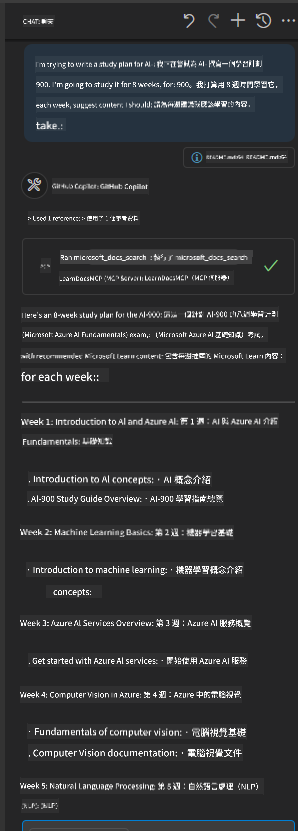

<!--
CO_OP_TRANSLATOR_METADATA:
{
  "original_hash": "4319d291c9d124ecafea52b3d04bfa0e",
  "translation_date": "2025-06-23T11:01:13+00:00",
  "source_file": "09-CaseStudy/docs-mcp/README.md",
  "language_code": "mo"
}
-->
> 有關帶有截圖和逐步指南的詳細操作說明，請參閱 [`README.md`](./solution/scenario3/README.md)。

這種方法非常適合正在構建技術課程、撰寫文件或開發需要頻繁參考的代碼的人士。

## 主要收穫

將文件直接整合到您的工具中不僅是方便——它是提高生產力的關鍵。通過從您的客戶端連接到 Microsoft Learn Docs MCP 伺服器，您可以：

- 消除在代碼與文件之間切換的困擾
- 即時檢索最新且具上下文感知的文件
- 建立更智能、更具互動性的開發者工具

這些技能將幫助您創建不僅高效而且令人愉快使用的解決方案。

## 額外資源

為了加深您的理解，請探索這些官方資源：

- [Microsoft Learn Docs MCP Server (GitHub)](https://github.com/MicrosoftDocs/mcp)
- [開始使用 Azure MCP Server (mcp-python)](https://learn.microsoft.com/en-us/azure/developer/azure-mcp-server/get-started#create-the-python-app)
- [什麼是 Azure MCP Server？](https://learn.microsoft.com/en-us/azure/developer/azure-mcp-server/)
- [模型上下文協議 (MCP) 簡介](https://modelcontextprotocol.io/introduction)
- [從 MCP 伺服器添加插件 (Python)](https://learn.microsoft.com/en-us/semantic-kernel/concepts/plugins/adding-mcp-plugins)

**免責聲明**：  
本文件由 AI 翻譯服務 [Co-op Translator](https://github.com/Azure/co-op-translator) 進行翻譯。雖然我們力求準確，但請注意自動翻譯可能包含錯誤或不準確之處。原始文件的母語版本應被視為權威來源。對於重要資訊，建議採用專業人工翻譯。我們不對因使用本翻譯而產生的任何誤解或誤譯負責。