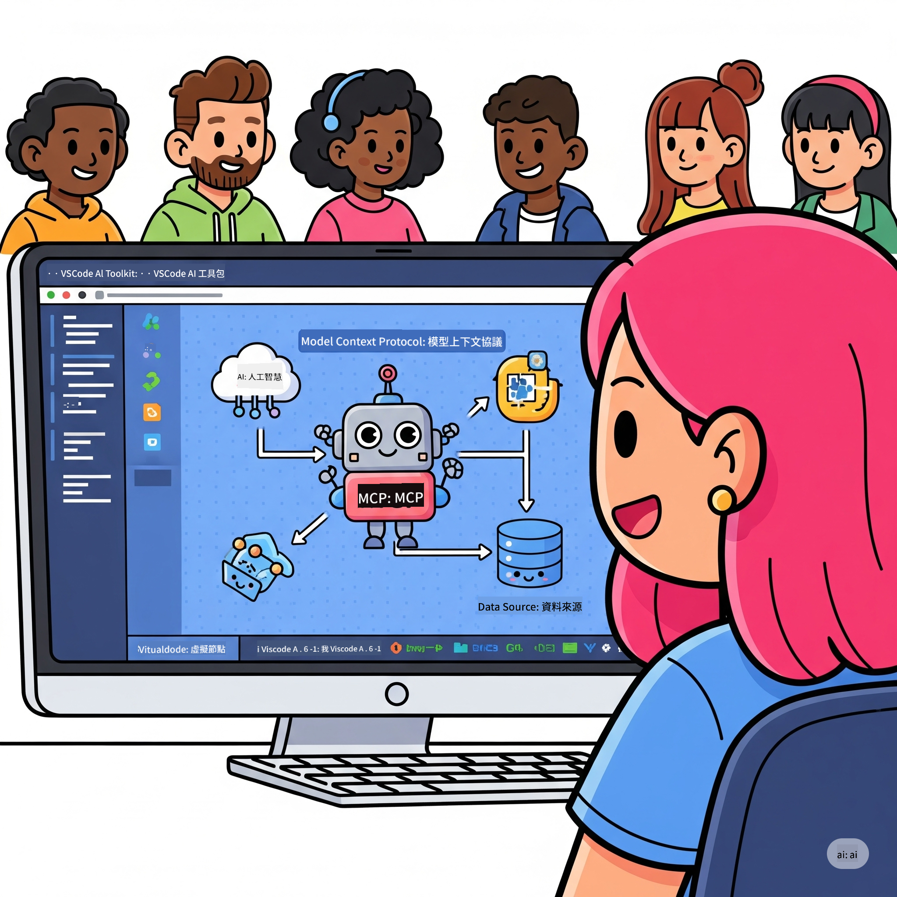

<!--
CO_OP_TRANSLATOR_METADATA:
{
  "original_hash": "787440926586cd064b0899fd1c514f52",
  "translation_date": "2025-07-14T07:01:11+00:00",
  "source_file": "10-StreamliningAIWorkflowsBuildingAnMCPServerWithAIToolkit/README.md",
  "language_code": "mo"
}
-->
# 精簡 AI 工作流程：使用 AI Toolkit 建立 MCP 伺服器

## 🎯 概覽

歡迎來到 **Model Context Protocol (MCP) 工作坊**！這個全面的實作工作坊結合了兩項尖端技術，徹底改變 AI 應用程式的開發方式：

- **🔗 Model Context Protocol (MCP)**：一個無縫整合 AI 工具的開放標準
- **🛠️ AI Toolkit for Visual Studio Code (AITK)**：微軟強大的 AI 開發擴充套件

### 🎓 你將學到什麼

完成本工作坊後，你將精通打造能將 AI 模型與現實工具和服務連結的智慧應用程式。從自動化測試到自訂 API 整合，你將獲得解決複雜商業挑戰的實務技能。

## 🏗️ 技術堆疊

### 🔌 Model Context Protocol (MCP)

MCP 是 AI 的 **「USB-C」** —— 一個連接 AI 模型與外部工具和資料來源的通用標準。

**✨ 主要特色：**
- 🔄 **標準化整合**：AI 與工具連接的通用介面
- 🏛️ **彈性架構**：支援本地與遠端伺服器，透過 stdio/SSE 傳輸
- 🧰 **豐富生態系**：工具、提示與資源整合於同一協議
- 🔒 **企業級準備**：內建安全性與可靠性

**🎯 MCP 的重要性：**
就像 USB-C 消除了線材混亂，MCP 也消除了 AI 整合的複雜性。一個協議，無限可能。

### 🤖 AI Toolkit for Visual Studio Code (AITK)

微軟的旗艦 AI 開發擴充套件，將 VS Code 轉變為 AI 強大平台。

**🚀 核心功能：**
- 📦 **模型目錄**：存取 Azure AI、GitHub、Hugging Face、Ollama 等模型
- ⚡ **本地推論**：ONNX 優化的 CPU/GPU/NPU 執行
- 🏗️ **代理建構器**：視覺化 AI 代理開發，支援 MCP 整合
- 🎭 **多模態支援**：文字、視覺與結構化輸出

**💡 開發優勢：**
- 零設定模型部署
- 視覺化提示工程
- 即時測試遊樂場
- 無縫 MCP 伺服器整合

## 📚 學習旅程

### [🚀 模組 1：AI Toolkit 基礎](./lab1/README.md)
**時長**：15 分鐘
- 🛠️ 安裝並設定 VS Code 的 AI Toolkit
- 🗂️ 探索模型目錄（超過 100 個來自 GitHub、ONNX、OpenAI、Anthropic、Google 的模型）
- 🎮 精通互動式遊樂場，進行即時模型測試
- 🤖 使用代理建構器打造你的第一個 AI 代理
- 📊 利用內建指標評估模型效能（F1、相關性、相似度、一致性）
- ⚡ 學習批次處理與多模態支援功能

**🎯 學習成果**：建立功能完整的 AI 代理，全面理解 AITK 功能

### [🌐 模組 2：MCP 與 AI Toolkit 基礎](./lab2/README.md)
**時長**：20 分鐘
- 🧠 掌握 Model Context Protocol (MCP) 架構與概念
- 🌐 探索微軟的 MCP 伺服器生態系
- 🤖 使用 Playwright MCP 伺服器建立瀏覽器自動化代理
- 🔧 將 MCP 伺服器整合至 AI Toolkit 代理建構器
- 📊 配置並測試代理中的 MCP 工具
- 🚀 匯出並部署 MCP 驅動的代理於生產環境

**🎯 學習成果**：部署一個透過 MCP 強化外部工具的 AI 代理

### [🔧 模組 3：進階 MCP 開發與 AI Toolkit](./lab3/README.md)
**時長**：20 分鐘
- 💻 使用 AI Toolkit 建立自訂 MCP 伺服器
- 🐍 設定並使用最新 MCP Python SDK (v1.9.3)
- 🔍 設置並運用 MCP Inspector 進行除錯
- 🛠️ 建立具專業除錯流程的天氣 MCP 伺服器
- 🧪 在代理建構器與 Inspector 環境中除錯 MCP 伺服器

**🎯 學習成果**：使用現代工具開發並除錯自訂 MCP 伺服器

### [🐙 模組 4：實務 MCP 開發 - 自訂 GitHub Clone 伺服器](./lab4/README.md)
**時長**：30 分鐘
- 🏗️ 建立真實世界的 GitHub Clone MCP 伺服器以支援開發流程
- 🔄 實作智慧型倉庫複製，包含驗證與錯誤處理
- 📁 創建智慧目錄管理與 VS Code 整合
- 🤖 使用 GitHub Copilot 代理模式搭配自訂 MCP 工具
- 🛡️ 應用生產級可靠性與跨平台相容性

**🎯 學習成果**：部署一個生產就緒的 MCP 伺服器，優化真實開發流程

## 💡 實際應用與影響

### 🏢 企業應用案例

#### 🔄 DevOps 自動化
以智慧自動化改造開發流程：
- **智慧倉庫管理**：AI 驅動的程式碼審查與合併決策
- **智慧 CI/CD**：根據程式碼變更自動優化管線
- **議題分流**：自動化錯誤分類與指派

#### 🧪 品質保證革新
以 AI 自動化提升測試品質：
- **智慧測試生成**：自動建立完整測試套件
- **視覺回歸測試**：AI 驅動的 UI 變更偵測
- **效能監控**：主動問題識別與解決

#### 📊 資料管線智慧化
打造更聰明的資料處理流程：
- **自適應 ETL 流程**：自我優化的資料轉換
- **異常偵測**：即時資料品質監控
- **智慧路由**：智能資料流管理

#### 🎧 客戶體驗提升
創造卓越的客戶互動：
- **情境感知支援**：AI 代理可存取客戶歷史
- **主動問題解決**：預測性客戶服務
- **多通路整合**：跨平台統一 AI 體驗

## 🛠️ 前置需求與設定

### 💻 系統需求

| 元件 | 需求 | 備註 |
|-----------|-------------|-------|
| **作業系統** | Windows 10+、macOS 10.15+、Linux | 任何現代作業系統 |
| **Visual Studio Code** | 最新穩定版 | AITK 必備 |
| **Node.js** | v18.0+ 及 npm | 用於 MCP 伺服器開發 |
| **Python** | 3.10+ | Python MCP 伺服器選用 |
| **記憶體** | 最少 8GB RAM | 本地模型建議 16GB |

### 🔧 開發環境

#### 推薦 VS Code 擴充套件
- **AI Toolkit** (ms-windows-ai-studio.windows-ai-studio)
- **Python** (ms-python.python)
- **Python 除錯器** (ms-python.debugpy)
- **GitHub Copilot** (GitHub.copilot) - 選用但有幫助

#### 選用工具
- **uv**：現代 Python 套件管理器
- **MCP Inspector**：MCP 伺服器視覺化除錯工具
- **Playwright**：用於網頁自動化範例

## 🎖️ 學習成果與認證路徑

### 🏆 技能掌握清單

完成本工作坊後，你將達成以下精通：

#### 🎯 核心能力
- [ ] **MCP 協議精通**：深入理解架構與實作模式
- [ ] **AITK 熟練度**：專家級 AI Toolkit 快速開發能力
- [ ] **自訂伺服器開發**：建置、部署與維護生產級 MCP 伺服器
- [ ] **工具整合卓越**：無縫連結 AI 與現有開發流程
- [ ] **問題解決應用**：將所學技能應用於實際商業挑戰

#### 🔧 技術技能
- [ ] 設定並配置 VS Code 中的 AI Toolkit
- [ ] 設計與實作自訂 MCP 伺服器
- [ ] 將 GitHub 模型整合至 MCP 架構
- [ ] 建立 Playwright 自動化測試流程
- [ ] 部署 AI 代理於生產環境
- [ ] 除錯並優化 MCP 伺服器效能

#### 🚀 進階能力
- [ ] 架構企業級 AI 整合方案
- [ ] 實施 AI 應用安全最佳實踐
- [ ] 設計可擴展的 MCP 伺服器架構
- [ ] 創建特定領域的自訂工具鏈
- [ ] 指導他人進行 AI 原生開發

## 📖 其他資源
- [MCP 規範](https://modelcontextprotocol.io/docs)
- [AI Toolkit GitHub 倉庫](https://github.com/microsoft/vscode-ai-toolkit)
- [範例 MCP 伺服器集合](https://github.com/modelcontextprotocol/servers)
- [最佳實踐指南](https://modelcontextprotocol.io/docs/best-practices)

---

**🚀 準備好革新你的 AI 開發流程了嗎？**

讓我們一起用 MCP 和 AI Toolkit 打造智慧應用的未來！

**免責聲明**：  
本文件係使用 AI 翻譯服務 [Co-op Translator](https://github.com/Azure/co-op-translator) 進行翻譯。雖然我們力求準確，但請注意，自動翻譯可能包含錯誤或不準確之處。原始文件的母語版本應視為權威來源。對於重要資訊，建議採用專業人工翻譯。我們不對因使用本翻譯而產生的任何誤解或誤譯承擔責任。