<!--
CO_OP_TRANSLATOR_METADATA:
{
  "original_hash": "a22b7dd11cd7690f99f9195877cafdc3",
  "translation_date": "2025-07-14T07:43:13+00:00",
  "source_file": "10-StreamliningAIWorkflowsBuildingAnMCPServerWithAIToolkit/lab2/README.md",
  "language_code": "mo"
}
-->
# 🌐 模組 2：MCP 與 AI Toolkit 基礎

[]()
[]()
[]()

## 📋 學習目標

完成本模組後，您將能夠：
- ✅ 了解 Model Context Protocol (MCP) 的架構與優勢
- ✅ 探索 Microsoft 的 MCP 伺服器生態系
- ✅ 將 MCP 伺服器整合至 AI Toolkit Agent Builder
- ✅ 使用 Playwright MCP 建立功能完整的瀏覽器自動化代理
- ✅ 在代理中設定並測試 MCP 工具
- ✅ 匯出並部署具 MCP 功能的代理以供生產使用

## 🎯 建立在模組 1 的基礎上

在模組 1 中，我們掌握了 AI Toolkit 的基礎並建立了第一個 Python 代理。現在，我們將透過革命性的 **Model Context Protocol (MCP)**，將您的代理升級，連接外部工具與服務。

可以把這比喻成從基本計算機升級到完整電腦——您的 AI 代理將具備以下能力：
- 🌐 瀏覽並互動網站
- 📁 存取與操作檔案
- 🔧 整合企業系統
- 📊 處理來自 API 的即時資料

## 🧠 了解 Model Context Protocol (MCP)

### 🔍 什麼是 MCP？

Model Context Protocol (MCP) 是 AI 應用的 **「USB-C」** —— 一個革命性的開放標準，將大型語言模型（LLM）連接到外部工具、資料來源與服務。就像 USB-C 消除線材混亂，提供一個通用連接器，MCP 以單一標準協議消除 AI 整合的複雜性。

### 🎯 MCP 解決的問題

**MCP 出現前：**
- 🔧 每個工具都需客製化整合
- 🔄 供應商鎖定，依賴專有解決方案
- 🔒 臨時連接帶來安全漏洞
- ⏱️ 基本整合需耗費數月開發時間

**有了 MCP：**
- ⚡ 即插即用的工具整合
- 🔄 供應商中立架構
- 🛡️ 內建安全最佳實踐
- 🚀 幾分鐘即可新增功能

### 🏗️ MCP 架構深入解析

MCP 採用 **客戶端-伺服器架構**，打造安全且可擴展的生態系：

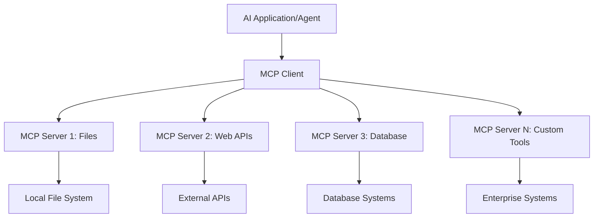

**🔧 核心元件：**

| 元件 | 角色 | 範例 |
|-----------|------|----------|
| **MCP Hosts** | 使用 MCP 服務的應用程式 | Claude Desktop、VS Code、AI Toolkit |
| **MCP Clients** | 協議處理器（與伺服器一對一） | 內建於 Host 應用程式中 |
| **MCP Servers** | 透過標準協議提供功能 | Playwright、Files、Azure、GitHub |
| **傳輸層** | 通訊方式 | stdio、HTTP、WebSockets |

## 🏢 Microsoft 的 MCP 伺服器生態系

Microsoft 領導 MCP 生態系，提供一套企業級伺服器，滿足真實商業需求。

### 🌟 Microsoft MCP 伺服器特色

#### 1. ☁️ Azure MCP Server
**🔗 倉庫**：[azure/azure-mcp](https://github.com/azure/azure-mcp)  
**🎯 目的**：結合 AI 的全面 Azure 資源管理

**✨ 主要功能：**
- 宣告式基礎架構配置
- 即時資源監控
- 成本優化建議
- 安全合規檢查

**🚀 使用案例：**
- AI 輔助的基礎架構即程式碼
- 自動資源擴展
- 雲端成本優化
- DevOps 工作流程自動化

#### 2. 📊 Microsoft Dataverse MCP
**📚 文件**：[Microsoft Dataverse Integration](https://go.microsoft.com/fwlink/?linkid=2320176)  
**🎯 目的**：商業資料的自然語言介面

**✨ 主要功能：**
- 自然語言資料庫查詢
- 商業情境理解
- 自訂提示範本
- 企業資料治理

**🚀 使用案例：**
- 商業智慧報告
- 客戶資料分析
- 銷售管道洞察
- 合規資料查詢

#### 3. 🌐 Playwright MCP Server
**🔗 倉庫**：[microsoft/playwright-mcp](https://github.com/microsoft/playwright-mcp)  
**🎯 目的**：瀏覽器自動化與網頁互動功能

**✨ 主要功能：**
- 跨瀏覽器自動化（Chrome、Firefox、Safari）
- 智能元素偵測
- 截圖與 PDF 產生
- 網路流量監控

**🚀 使用案例：**
- 自動化測試流程
- 網頁爬蟲與資料擷取
- UI/UX 監控
- 競爭分析自動化

#### 4. 📁 Files MCP Server
**🔗 倉庫**：[microsoft/files-mcp-server](https://github.com/microsoft/files-mcp-server)  
**🎯 目的**：智慧檔案系統操作

**✨ 主要功能：**
- 宣告式檔案管理
- 內容同步
- 版本控制整合
- 元資料擷取

**🚀 使用案例：**
- 文件管理
- 程式碼庫組織
- 內容發佈流程
- 資料管線檔案處理

#### 5. 📝 MarkItDown MCP Server
**🔗 倉庫**：[microsoft/markitdown](https://github.com/microsoft/markitdown)  
**🎯 目的**：進階 Markdown 處理與操作

**✨ 主要功能：**
- 豐富的 Markdown 解析
- 格式轉換（MD ↔ HTML ↔ PDF）
- 內容結構分析
- 範本處理

**🚀 使用案例：**
- 技術文件流程
- 內容管理系統
- 報告產生
- 知識庫自動化

#### 6. 📈 Clarity MCP Server
**📦 套件**：[@microsoft/clarity-mcp-server](https://www.npmjs.com/package/@microsoft/clarity-mcp-server)  
**🎯 目的**：網站分析與用戶行為洞察

**✨ 主要功能：**
- 熱點圖資料分析
- 用戶會話錄影
- 性能指標
- 轉換漏斗分析

**🚀 使用案例：**
- 網站優化
- 用戶體驗研究
- A/B 測試分析
- 商業智慧儀表板

### 🌍 社群生態系

除了 Microsoft 的伺服器外，MCP 生態系還包括：
- **🐙 GitHub MCP**：倉庫管理與程式碼分析
- **🗄️ 資料庫 MCP**：PostgreSQL、MySQL、MongoDB 整合
- **☁️ 雲端供應商 MCP**：AWS、GCP、Digital Ocean 工具
- **📧 通訊 MCP**：Slack、Teams、Email 整合

## 🛠️ 實作實驗：建立瀏覽器自動化代理

**🎯 專案目標**：使用 Playwright MCP 伺服器建立智能瀏覽器自動化代理，能瀏覽網站、擷取資訊並執行複雜網頁互動。

### 🚀 階段 1：代理基礎設定

#### 步驟 1：初始化您的代理
1. **開啟 AI Toolkit Agent Builder**
2. **建立新代理**，設定如下：
   - **名稱**：`BrowserAgent`
   - **模型**：選擇 GPT-4o

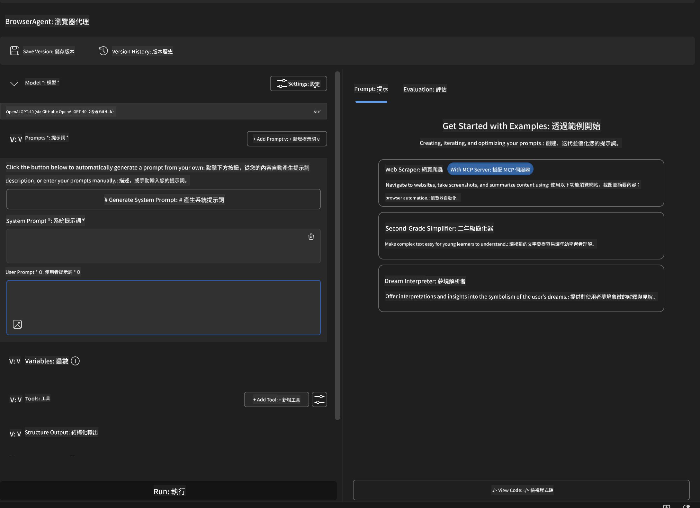

### 🔧 階段 2：MCP 整合流程

#### 步驟 3：新增 MCP 伺服器整合
1. **前往 Agent Builder 的工具區**
2. **點擊「Add Tool」** 開啟整合選單
3. **選擇「MCP Server」** 選項

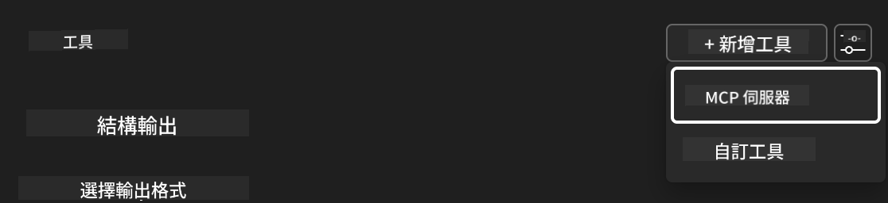

**🔍 了解工具類型：**
- **內建工具**：預設的 AI Toolkit 功能
- **MCP 伺服器**：外部服務整合
- **自訂 API**：您自己的服務端點
- **函式呼叫**：直接存取模型函式

#### 步驟 4：選擇 MCP 伺服器
1. **選擇「MCP Server」** 繼續
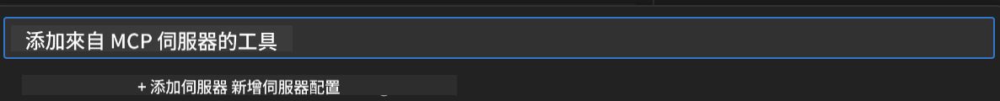

2. **瀏覽 MCP 目錄**，探索可用整合
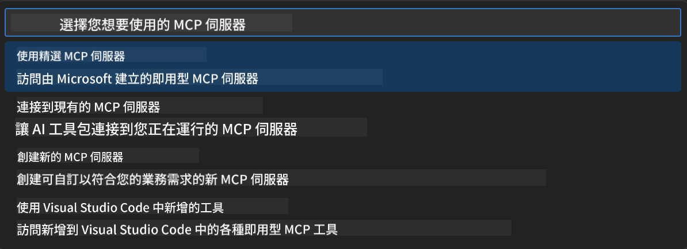

### 🎮 階段 3：Playwright MCP 設定

#### 步驟 5：選擇並設定 Playwright
1. **點擊「Use Featured MCP Servers」** 進入 Microsoft 驗證伺服器列表
2. **從特色清單中選擇「Playwright」**
3. **接受預設 MCP ID** 或依環境自訂

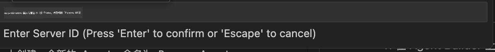

#### 步驟 6：啟用 Playwright 功能
**🔑 關鍵步驟**：選擇所有可用的 Playwright 方法以獲得最大功能

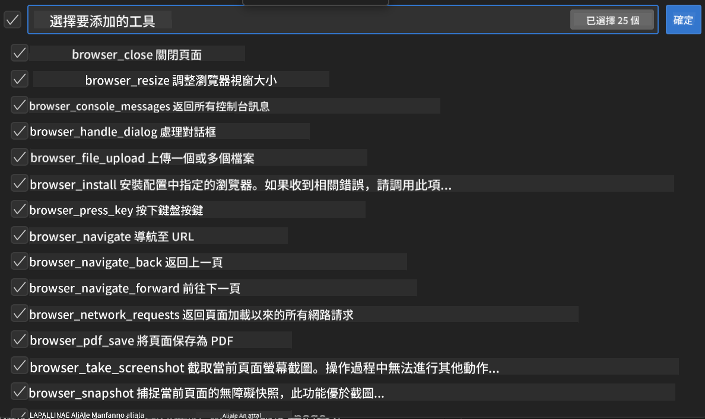

**🛠️ 重要 Playwright 工具：**
- **導航**：`goto`、`goBack`、`goForward`、`reload`
- **互動**：`click`、`fill`、`press`、`hover`、`drag`
- **擷取**：`textContent`、`innerHTML`、`getAttribute`
- **驗證**：`isVisible`、`isEnabled`、`waitForSelector`
- **擷取畫面**：`screenshot`、`pdf`、`video`
- **網路**：`setExtraHTTPHeaders`、`route`、`waitForResponse`

#### 步驟 7：確認整合成功
**✅ 成功指標：**
- 所有工具均顯示於 Agent Builder 介面
- 整合面板無錯誤訊息
- Playwright 伺服器狀態顯示「Connected」


**🔧 常見問題排解：**
- **連線失敗**：檢查網路連線與防火牆設定
- **工具缺失**：確認設定時已選擇所有功能
- **權限錯誤**：確認 VS Code 擁有必要系統權限

### 🎯 階段 4：進階提示工程

#### 步驟 8：設計智慧系統提示
建立能充分利用 Playwright 功能的複雜提示：

```markdown
# Web Automation Expert System Prompt

## Core Identity
You are an advanced web automation specialist with deep expertise in browser automation, web scraping, and user experience analysis. You have access to Playwright tools for comprehensive browser control.

## Capabilities & Approach
### Navigation Strategy
- Always start with screenshots to understand page layout
- Use semantic selectors (text content, labels) when possible
- Implement wait strategies for dynamic content
- Handle single-page applications (SPAs) effectively

### Error Handling
- Retry failed operations with exponential backoff
- Provide clear error descriptions and solutions
- Suggest alternative approaches when primary methods fail
- Always capture diagnostic screenshots on errors

### Data Extraction
- Extract structured data in JSON format when possible
- Provide confidence scores for extracted information
- Validate data completeness and accuracy
- Handle pagination and infinite scroll scenarios

### Reporting
- Include step-by-step execution logs
- Provide before/after screenshots for verification
- Suggest optimizations and alternative approaches
- Document any limitations or edge cases encountered

## Ethical Guidelines
- Respect robots.txt and rate limiting
- Avoid overloading target servers
- Only extract publicly available information
- Follow website terms of service
```

#### 步驟 9：建立動態使用者提示
設計展示多種功能的提示範例：

**🌐 網頁分析範例：**
```markdown
Navigate to github.com/kinfey and provide a comprehensive analysis including:
1. Repository structure and organization
2. Recent activity and contribution patterns  
3. Documentation quality assessment
4. Technology stack identification
5. Community engagement metrics
6. Notable projects and their purposes

Include screenshots at key steps and provide actionable insights.
```

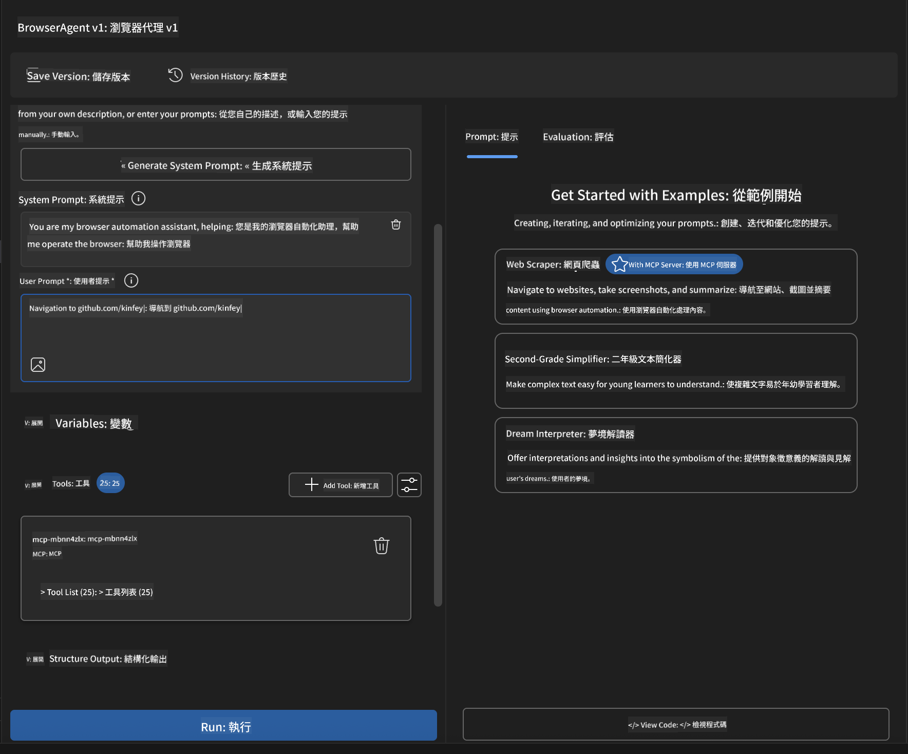

### 🚀 階段 5：執行與測試

#### 步驟 10：執行您的第一個自動化
1. **點擊「Run」** 啟動自動化流程
2. **監控即時執行狀態**：
   - 自動啟動 Chrome 瀏覽器
   - 代理導覽至目標網站
   - 每個主要步驟截圖保存
   - 分析結果即時串流

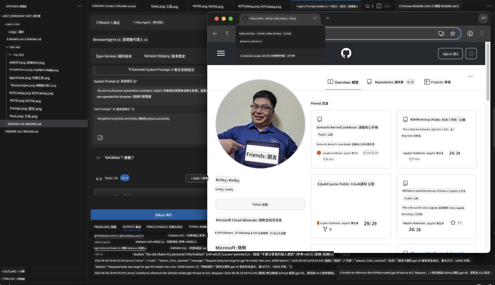

#### 步驟 11：分析結果與洞察
在 Agent Builder 介面檢視完整分析報告：

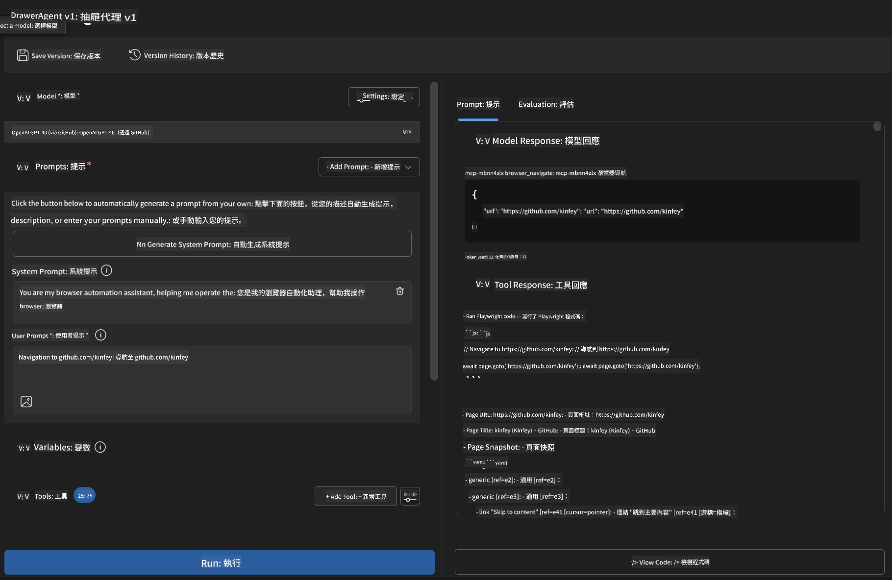

### 🌟 階段 6：進階功能與部署

#### 步驟 12：匯出與生產部署
Agent Builder 支援多種部署選項：

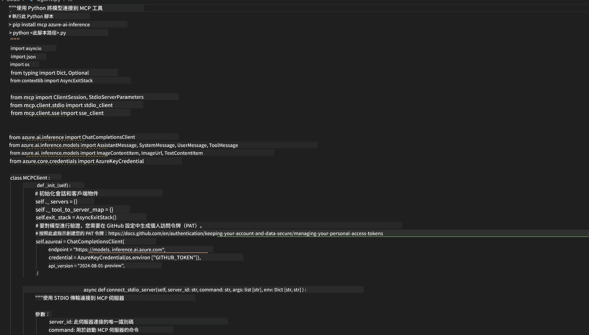

## 🎓 模組 2 總結與後續步驟

### 🏆 成就解鎖：MCP 整合大師

**✅ 掌握技能：**
- [ ] 了解 MCP 架構與優勢
- [ ] 探索 Microsoft MCP 伺服器生態系
- [ ] 將 Playwright MCP 整合至 AI Toolkit
- [ ] 建立複雜的瀏覽器自動化代理
- [ ] 進階網頁自動化提示工程

### 📚 其他資源

- **🔗 MCP 規範**：[官方協議文件](https://modelcontextprotocol.io/)
- **🛠️ Playwright API**：[完整方法參考](https://playwright.dev/docs/api/class-playwright)
- **🏢 Microsoft MCP 伺服器**：[企業整合指南](https://github.com/microsoft/mcp-servers)
- **🌍 社群範例**：[MCP 伺服器展示](https://github.com/modelcontextprotocol/servers)

**🎉 恭喜！** 您已成功掌握 MCP 整合，現在可以打造具備外部工具能力的生產級 AI 代理！

### 🔜 繼續下一模組

準備好將 MCP 技能提升到更高層次了嗎？請前往 **[模組 3：使用 AI Toolkit 進階 MCP 開發](../lab3/README.md)**，您將學習如何：
- 建立自訂 MCP 伺服器
- 設定並使用最新 MCP Python SDK
- 配置 MCP Inspector 進行除錯
- 精通進階 MCP 伺服器開發流程
- 從零開始建立一個 Weather MCP 伺服器

**免責聲明**：  
本文件係使用 AI 翻譯服務 [Co-op Translator](https://github.com/Azure/co-op-translator) 進行翻譯。雖然我們致力於確保準確性，但請注意，自動翻譯可能包含錯誤或不準確之處。原始文件的母語版本應視為權威來源。對於重要資訊，建議採用專業人工翻譯。我們不對因使用本翻譯而產生的任何誤解或誤釋負責。