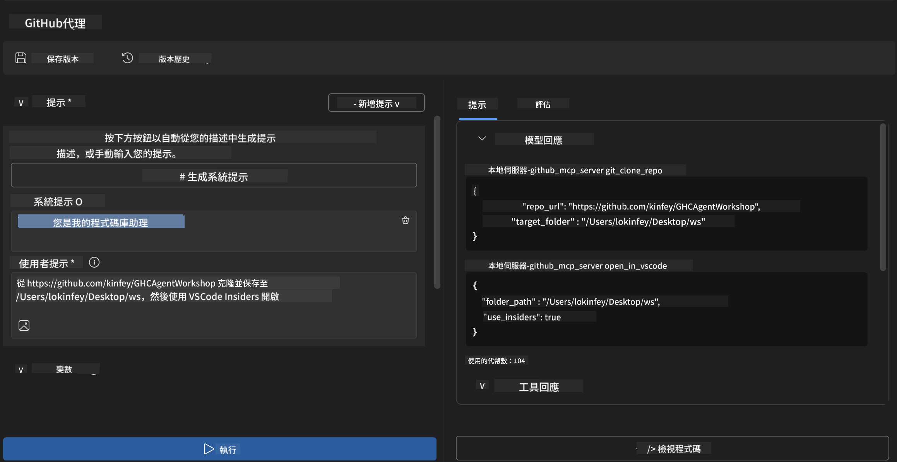
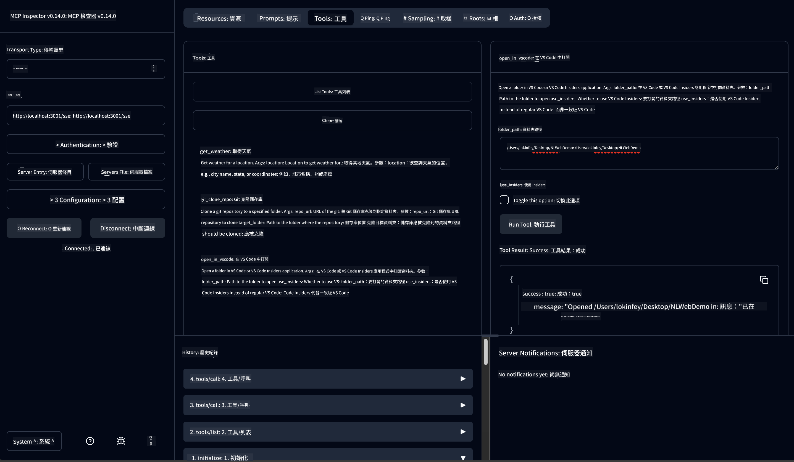

<!--
CO_OP_TRANSLATOR_METADATA:
{
  "original_hash": "f83bc722dc758efffd68667d6a1db470",
  "translation_date": "2025-07-14T08:37:19+00:00",
  "source_file": "10-StreamliningAIWorkflowsBuildingAnMCPServerWithAIToolkit/lab4/README.md",
  "language_code": "mo"
}
-->
# 🐙 模組 4：實戰 MCP 開發 - 自訂 GitHub 複製伺服器


> **⚡ 快速開始：** 在短短 30 分鐘內打造一個生產就緒的 MCP 伺服器，自動化 GitHub 倉庫複製並整合 VS Code！

## 🎯 學習目標

完成本實驗後，你將能夠：

- ✅ 建立符合實務開發流程的自訂 MCP 伺服器
- ✅ 透過 MCP 實作 GitHub 倉庫複製功能
- ✅ 將自訂 MCP 伺服器與 VS Code 及 Agent Builder 整合
- ✅ 使用 GitHub Copilot Agent Mode 搭配自訂 MCP 工具
- ✅ 在生產環境中測試並部署自訂 MCP 伺服器

## 📋 先決條件

- 完成實驗 1-3（MCP 基礎與進階開發）
- GitHub Copilot 訂閱（[可免費註冊](https://github.com/github-copilot/signup)）
- 安裝並啟用 AI Toolkit 與 GitHub Copilot 擴充功能的 VS Code
- 已安裝並設定 Git CLI

## 🏗️ 專案概述

### **真實開發挑戰**
作為開發者，我們經常使用 GitHub 複製倉庫並在 VS Code 或 VS Code Insiders 中開啟。這個手動流程包含：
1. 開啟終端機/命令提示字元
2. 切換到目標目錄
3. 執行 `git clone` 指令
4. 在複製的目錄中開啟 VS Code

**我們的 MCP 解決方案將這些步驟整合成一條智慧指令！**

### **你將打造的內容**
一個 **GitHub 複製 MCP 伺服器** (`git_mcp_server`)，提供：

| 功能 | 說明 | 優點 |
|---------|-------------|---------|
| 🔄 **智慧倉庫複製** | 複製 GitHub 倉庫並進行驗證 | 自動錯誤檢查 |
| 📁 **智慧目錄管理** | 安全檢查並建立目錄 | 避免覆寫 |
| 🚀 **跨平台 VS Code 整合** | 在 VS Code/Insiders 中開啟專案 | 流程無縫銜接 |
| 🛡️ **強健錯誤處理** | 處理網路、權限與路徑問題 | 生產環境可靠性 |

---

## 📖 逐步實作指南

### 步驟 1：在 Agent Builder 中建立 GitHub Agent

1. 透過 AI Toolkit 擴充功能啟動 Agent Builder
2. 使用以下設定 **建立新代理人**：
   ```
   Agent Name: GitHubAgent
   ```

3. **初始化自訂 MCP 伺服器：**
   - 前往 **工具** → **新增工具** → **MCP 伺服器**
   - 選擇 **「建立新的 MCP 伺服器」**
   - 選擇 **Python 範本** 以獲得最大彈性
   - **伺服器名稱：** `git_mcp_server`

### 步驟 2：設定 GitHub Copilot Agent Mode

1. 在 VS Code 中開啟 GitHub Copilot（Ctrl/Cmd + Shift + P → 輸入 "GitHub Copilot: Open"）
2. 在 Copilot 介面中選擇代理模型
3. 選擇具備強化推理能力的 Claude 3.7 模型
4. 啟用 MCP 整合以存取工具

> **💡 專家提示：** Claude 3.7 對開發流程與錯誤處理模式有更優秀的理解。

### 步驟 3：實作 MCP 伺服器核心功能

**使用以下詳細提示搭配 GitHub Copilot Agent Mode：**

```
Create two MCP tools with the following comprehensive requirements:

🔧 TOOL A: clone_repository
Requirements:
- Clone any GitHub repository to a specified local folder
- Return the absolute path of the successfully cloned project
- Implement comprehensive validation:
  ✓ Check if target directory already exists (return error if exists)
  ✓ Validate GitHub URL format (https://github.com/user/repo)
  ✓ Verify git command availability (prompt installation if missing)
  ✓ Handle network connectivity issues
  ✓ Provide clear error messages for all failure scenarios

🚀 TOOL B: open_in_vscode
Requirements:
- Open specified folder in VS Code or VS Code Insiders
- Cross-platform compatibility (Windows/Linux/macOS)
- Use direct application launch (not terminal commands)
- Auto-detect available VS Code installations
- Handle cases where VS Code is not installed
- Provide user-friendly error messages

Additional Requirements:
- Follow MCP 1.9.3 best practices
- Include proper type hints and documentation
- Implement logging for debugging purposes
- Add input validation for all parameters
- Include comprehensive error handling
```

### 步驟 4：測試你的 MCP 伺服器

#### 4a. 在 Agent Builder 中測試

1. 啟動 Agent Builder 的除錯設定
2. 使用以下系統提示設定你的代理人：

```
SYSTEM_PROMPT:
You are my intelligent coding repository assistant. You help developers efficiently clone GitHub repositories and set up their development environment. Always provide clear feedback about operations and handle errors gracefully.
```

3. 以真實使用情境進行測試：

```
USER_PROMPT EXAMPLES:

Scenario : Basic Clone and Open
"Clone {Your GitHub Repo link such as https://github.com/kinfey/GHCAgentWorkshop
 } and save to {The global path you specify}, then open it with VS Code Insiders"
```



**預期結果：**
- ✅ 成功複製並確認路徑
- ✅ 自動啟動 VS Code
- ✅ 對無效情境顯示清楚錯誤訊息
- ✅ 妥善處理邊界狀況

#### 4b. 在 MCP Inspector 中測試



---

**🎉 恭喜！** 你已成功打造一個實用且生產就緒的 MCP 伺服器，解決真實開發流程中的挑戰。你的自訂 GitHub 複製伺服器展現了 MCP 在自動化與提升開發者生產力上的強大能力。

### 🏆 成就解鎖：
- ✅ **MCP 開發者** - 建立自訂 MCP 伺服器
- ✅ **流程自動化專家** - 精簡開發流程  
- ✅ **整合高手** - 連接多種開發工具
- ✅ **生產就緒** - 打造可部署解決方案

---

## 🎓 工作坊結業：你的 Model Context Protocol 之旅

**親愛的工作坊參與者，**

恭喜你完成 Model Context Protocol 工作坊的全部四個模組！你已從理解 AI Toolkit 基礎概念，進階到打造生產就緒的 MCP 伺服器，解決真實開發挑戰。

### 🚀 你的學習路徑回顧：

**[模組 1](../lab1/README.md)**：你從探索 AI Toolkit 基礎、模型測試與建立第一個 AI 代理人開始。

**[模組 2](../lab2/README.md)**：你學習 MCP 架構，整合 Playwright MCP，並打造第一個瀏覽器自動化代理人。

**[模組 3](../lab3/README.md)**：你進階到自訂 MCP 伺服器開發，使用天氣 MCP 伺服器並精通除錯工具。

**[模組 4](../lab4/README.md)**：你將所學應用於打造實用的 GitHub 倉庫工作流程自動化工具。

### 🌟 你已精通：

- ✅ **AI Toolkit 生態系**：模型、代理人與整合模式
- ✅ **MCP 架構**：客戶端-伺服器設計、傳輸協定與安全性
- ✅ **開發工具**：從 Playground、Inspector 到生產部署
- ✅ **自訂開發**：建立、測試與部署自有 MCP 伺服器
- ✅ **實務應用**：用 AI 解決真實工作流程挑戰

### 🔮 你的下一步：

1. **打造自己的 MCP 伺服器**：運用所學自動化你的專屬流程
2. **加入 MCP 社群**：分享作品並向他人學習
3. **探索進階整合**：將 MCP 伺服器連接企業系統
4. **貢獻開源**：協助改進 MCP 工具與文件

請記得，這個工作坊只是開始。Model Context Protocol 生態系正快速演進，你已具備站在 AI 驅動開發工具前沿的能力。

**感謝你的參與與學習熱忱！**

我們希望這次工作坊激發你新的靈感，改變你在開發旅程中與 AI 工具互動的方式。

**祝你編碼愉快！**

---

**免責聲明**：  
本文件係使用 AI 翻譯服務 [Co-op Translator](https://github.com/Azure/co-op-translator) 進行翻譯。雖然我們致力於確保準確性，但請注意，自動翻譯可能包含錯誤或不準確之處。原始文件的母語版本應視為權威來源。對於重要資訊，建議採用專業人工翻譯。我們不對因使用本翻譯而產生的任何誤解或誤釋負責。