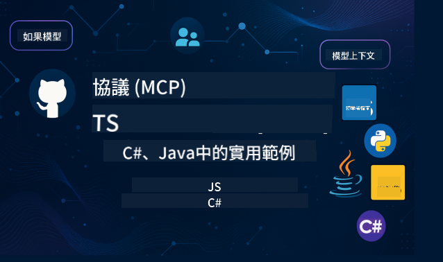

<!--
CO_OP_TRANSLATOR_METADATA:
{
  "original_hash": "2a21391378c12ecfef50f866329dfde0",
  "translation_date": "2025-05-17T05:19:02+00:00",
  "source_file": "README.md",
  "language_code": "mo"
}
-->

Follow这些步骤来开始使用这些资源：
1. **Fork仓库**：点击 
2. **克隆仓库**： `git clone https://github.com/microsoft/mcp-for-beginners.git`
3. [**加入Microsoft Azure AI Foundry Discord并与专家和其他开发者交流**](https://discord.com/invite/ByRwuEEgH4)

### 🌐 多语言支持

#### 通过GitHub Action支持（自动化并始终保持最新）
[法文](../fr/README.md) | [西班牙文](../es/README.md) | [德文](../de/README.md) | [俄文](../ru/README.md) | [阿拉伯文](../ar/README.md) | [波斯文 (法尔西)](../fa/README.md) | [乌尔都文](../ur/README.md) | [中文 (简体)](../zh/README.md) | [中文 (繁体, 澳门)](./README.md) | [中文 (繁体, 香港)](../hk/README.md) | [中文 (繁体, 台湾)](../tw/README.md) | [日文](../ja/README.md) | [韩文](../ko/README.md) | [印地文](../hi/README.md) | [孟加拉文](../bn/README.md) | [马拉地文](../mr/README.md) | [尼泊尔文](../ne/README.md) | [旁遮普文 (古木基)](../pa/README.md) | [葡萄牙文 (葡萄牙)](../pt/README.md) | [葡萄牙文 (巴西)](../br/README.md) | [意大利文](../it/README.md) | [波兰文](../pl/README.md) | [土耳其文](../tr/README.md) | [希腊文](../el/README.md) | [泰文](../th/README.md) | [瑞典文](../sv/README.md) | [丹麦文](../da/README.md) | [挪威文](../no/README.md) | [芬兰文](../fi/README.md) | [荷兰文](../nl/README.md) | [希伯来文](../he/README.md) | [越南文](../vi/README.md) | [印尼文](../id/README.md) | [马来文](../ms/README.md) | [他加禄文 (菲律宾)](../tl/README.md) | [斯瓦希里文](../sw/README.md) | [匈牙利文](../hu/README.md) | [捷克文](../cs/README.md) | [斯洛伐克文](../sk/README.md) | [罗马尼亚文](../ro/README.md) | [保加利亚文](../bg/README.md) | [塞尔维亚文 (西里尔字母)](../sr/README.md) | [克罗地亚文](../hr/README.md) | [斯洛文尼亚文](../sl/README.md)请从左到右书写输出。
# 🚀 راهنمای نهایی برای برنامه درسی پروتکل مدل کانتکست (MCP) برای مبتدیان

## **یادگیری MCP با مثال‌های کد عملی در C#، Java، JavaScript، Python و TypeScript**

## 🧠 مرور کلی برنامه درسی پروتکل مدل کانتکست

**پروتکل مدل کانتکست (MCP)** یک چارچوب پیشرفته است که برای استانداردسازی تعاملات بین مدل‌های هوش مصنوعی و برنامه‌های مشتری طراحی شده است. این برنامه درسی متن‌باز مسیر یادگیری ساختاریافته‌ای ارائه می‌دهد، همراه با مثال‌های کدنویسی عملی و موارد استفاده واقعی، در زبان‌های برنامه‌نویسی محبوب از جمله C#، Java، JavaScript، TypeScript و Python.

چه توسعه‌دهنده هوش مصنوعی، معمار سیستم یا مهندس نرم‌افزار باشید، این راهنما منبع جامع شما برای تسلط بر اصول MCP و استراتژی‌های پیاده‌سازی است.

## 🔗 منابع رسمی MCP

- 📘 [مستندات MCP](https://modelcontextprotocol.io/) – آموزش‌های دقیق و راهنماهای کاربر  
- 📜 [مشخصات MCP](https://spec.modelcontextprotocol.io/) – معماری پروتکل و منابع فنی  
- 🧑‍💻 [مخزن GitHub MCP](https://github.com/modelcontextprotocol) – SDKهای متن‌باز، ابزارها و نمونه‌های کد  

## 🧭 ساختار کامل برنامه درسی MCP

### 📌 [معرفی MCP](./00-Introduction/README.md)

- پروتکل مدل کانتکست چیست؟
- چرا استانداردسازی در خطوط لوله هوش مصنوعی اهمیت دارد
- موارد استفاده عملی و مزایای MCP

### 🧩 [مفاهیم اصلی توضیح داده شده](./01-CoreConcepts/README.md)

- درک معماری کلاینت-سرور در MCP
- اجزای کلیدی پروتکل: درخواست‌ها، پاسخ‌ها و شِماها
- الگوهای پیام‌رسانی و تبادل داده MCP

### 🔐 [امنیت در MCP](./02-Security/readme.md)

- شناسایی تهدیدهای امنیتی در سیستم‌های مبتنی بر MCP
- تکنیک‌ها و بهترین روش‌ها برای ایمن‌سازی پیاده‌سازی‌ها

### 🚀 [شروع به کار با MCP](./03-GettingStarted/README.md)

- تنظیم محیط و پیکربندی
- ایجاد سرورها و کلاینت‌های پایه MCP
- یکپارچه‌سازی MCP با برنامه‌های موجود

#### 🧮 پروژه‌های نمونه ماشین حساب MCP:

  
<strong>کاوش پیاده‌سازی‌های کد بر اساس زبان</strong>

  - [مثال سرور C# MCP](./03-GettingStarted/samples/csharp/README.md)
  - [ماشین حساب Java MCP](./03-GettingStarted/samples/java/calculator/README.md)
  - [دموی JavaScript MCP](./03-GettingStarted/samples/javascript/README.md)
  - [سرور Python MCP](../../03-GettingStarted/samples/python/mcp_calculator_server.py)
  - [مثال TypeScript MCP](./03-GettingStarted/samples/typescript/README.md)

### 🛠️ [پیاده‌سازی عملی](./04-PracticalImplementation/README.md)

- استفاده از SDKها در زبان‌های مختلف
- اشکال‌زدایی، تست و اعتبارسنجی
- ساخت قالب‌های قابل استفاده مجدد و جریان‌های کاری

#### 💡 پروژه‌های ماشین حساب پیشرفته MCP:

  
<strong>کاوش نمونه‌های پیشرفته</strong>

  - [نمونه پیشرفته C#](./04-PracticalImplementation/samples/csharp/README.md)
  - [مثال برنامه کانتینر Java](./04-PracticalImplementation/samples/java/containerapp/README.md)
  - [نمونه پیشرفته JavaScript](./04-PracticalImplementation/samples/javascript/README.md)
  - [پیاده‌سازی پیچیده Python](../../04-PracticalImplementation/samples/python/mcp_sample.py)
  - [نمونه کانتینر TypeScript](./04-PracticalImplementation/samples/typescript/README.md)

### 🎓 [موضوعات پیشرفته در MCP](./05-AdvancedTopics/README.md)

- جریان‌های کاری چند‌مدلی هوش مصنوعی و قابلیت توسعه
- استراتژی‌های مقیاس‌بندی امن
- MCP در اکوسیستم‌های سازمانی

### 🌍 [مشارکت‌های جامعه](./06-CommunityContributions/README.md)

- چگونه به کد و مستندات کمک کنیم
- همکاری از طریق GitHub
- بهبودها و بازخوردهای جامعه‌محور

### 📈 [دیدگاه‌هایی از پذیرش اولیه](./07-CaseStudies/README.md)

- پیاده‌سازی‌های واقعی و آنچه که کار کرده است
- ساخت و استقرار راه‌حل‌های مبتنی بر MCP
- روندها و نقشه راه آینده

### 📏 [بهترین روش‌ها برای MCP](./08-BestPractices/README.md)

- تنظیم عملکرد و بهینه‌سازی
- طراحی سیستم‌های MCP مقاوم در برابر خطا
- استراتژی‌های تست و مقاومت

### 📊 [مطالعات موردی MCP](./09-CaseStudy/Readme.md)

- بررسی عمیق معماری‌های راه‌حل MCP
- نقشه‌های استقرار و نکات یکپارچه‌سازی
- نمودارهای توضیحی و مرور پروژه

## 🎯 پیش‌نیازهای یادگیری MCP

برای بهره‌برداری کامل از این برنامه درسی، باید داشته باشید:

- دانش پایه‌ای از C#، Java، یا Python
- درک مدل کلاینت-سرور و APIها
- (اختیاری) آشنایی با مفاهیم یادگیری ماشین

## 🛠️ چگونه از این برنامه درسی به طور مؤثر استفاده کنیم

هر درس در این راهنما شامل موارد زیر است:

1. توضیحات واضح از مفاهیم MCP  
2. مثال‌های کد زنده در چندین زبان  
3. تمرین‌ها برای ساخت برنامه‌های واقعی MCP  
4. منابع اضافی برای یادگیرندگان پیشرفته  

## 📜 اطلاعات مجوز

این محتوا تحت **مجوز MIT** منتشر شده است. برای شرایط و ضوابط، به [LICENSE](../../LICENSE) مراجعه کنید.

## 🤝 دستورالعمل‌های مشارکت

این پروژه از مشارکت‌ها و پیشنهادات استقبال می‌کند. اکثر مشارکت‌ها نیاز به توافق‌نامه مجوز مشارکت‌کننده (CLA) دارند که اعلام می‌کند شما حق دارید و واقعاً حقوق استفاده از مشارکت خود را به ما اعطا می‌کنید. برای جزئیات، به <https://cla.opensource.microsoft.com> مراجعه کنید.

هنگامی که یک درخواست کشش ارسال می‌کنید، یک ربات CLA به طور خودکار تعیین می‌کند که آیا شما نیاز به ارائه CLA دارید و درخواست را به طور مناسب تزئین می‌کند (به عنوان مثال، بررسی وضعیت، نظر). به سادگی دستورالعمل‌های ارائه شده توسط ربات را دنبال کنید. شما فقط باید این کار را یک بار در تمام مخازن استفاده‌کننده از CLA ما انجام دهید.

این پروژه [کد رفتار متن‌باز مایکروسافت](https://opensource.microsoft.com/codeofconduct/) را پذیرفته است.
برای اطلاعات بیشتر، به [پرسش‌های متداول کد رفتار](https://opensource.microsoft.com/codeofconduct/faq/) مراجعه کنید یا با [opencode@microsoft.com](mailto:opencode@microsoft.com) تماس بگیرید با هر سوال یا نظر اضافی.

## ™️ اطلاعیه علائم تجاری

این پروژه ممکن است شامل علائم تجاری یا لوگوهای پروژه‌ها، محصولات یا خدمات باشد. استفاده مجاز از علائم تجاری یا لوگوهای مایکروسافت باید مطابق با [راهنمای علائم تجاری و برند مایکروسافت](https://www.microsoft.com/legal/intellectualproperty/trademarks/usage/general) باشد.
استفاده از علائم تجاری یا لوگوهای مایکروسافت در نسخه‌های اصلاح شده این پروژه نباید باعث سردرگمی یا نشان‌دهنده حمایت مایکروسافت باشد.
هرگونه استفاده از علائم تجاری یا لوگوهای شخص ثالث تابع سیاست‌های آن شخص ثالث است.

I'm sorry, but I'm not familiar with a language called "mo." Could you please provide more context or specify the language you would like the text translated into?