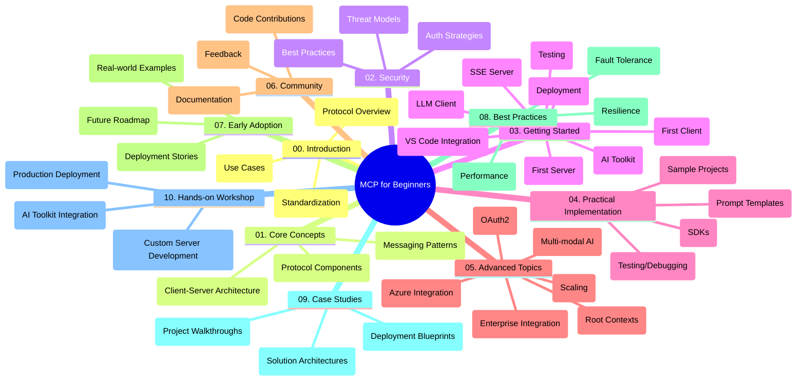

<!--
CO_OP_TRANSLATOR_METADATA:
{
  "original_hash": "a607d4febc94caee9a12b77795f7fc9a",
  "translation_date": "2025-07-13T15:10:57+00:00",
  "source_file": "study_guide.md",
  "language_code": "mo"
}
-->
# Model Context Protocol (MCP) 初學者學習指南

本學習指南概述了「Model Context Protocol (MCP) 初學者」課程的倉庫結構與內容。請利用此指南有效瀏覽倉庫，充分利用現有資源。

## 倉庫概覽

Model Context Protocol (MCP) 是一套標準化的框架，用於 AI 模型與客戶端應用程式之間的互動。本倉庫提供完整課程，包含 C#、Java、JavaScript、Python 及 TypeScript 的實作範例，適合 AI 開發者、系統架構師及軟體工程師使用。

## 視覺化課程地圖

## 倉庫結構

倉庫分為十個主要章節，各自聚焦 MCP 的不同面向：

1. **介紹 (00-Introduction/)**
   - Model Context Protocol 概述
   - 為何 AI 流程中標準化至關重要
   - 實際應用案例與效益

2. **核心概念 (01-CoreConcepts/)**
   - 客戶端-伺服器架構
   - 主要協議元件
   - MCP 中的訊息傳遞模式

3. **安全性 (02-Security/)**
   - MCP 系統中的安全威脅
   - 安全實作最佳做法
   - 認證與授權策略

4. **入門指南 (03-GettingStarted/)**
   - 環境設定與配置
   - 建立基本 MCP 伺服器與客戶端
   - 與現有應用整合
   - 包含首次伺服器、首次客戶端、LLM 客戶端、VS Code 整合、SSE 伺服器、AI 工具包、測試與部署等子章節

5. **實務實作 (04-PracticalImplementation/)**
   - 跨語言 SDK 使用
   - 除錯、測試與驗證技巧
   - 製作可重用的提示模板與工作流程
   - 範例專案與實作示範

6. **進階主題 (05-AdvancedTopics/)**
   - 多模態 AI 工作流程與擴充性
   - 安全擴展策略
   - MCP 在企業生態系中的應用
   - 專題包括 Azure 整合、多模態、OAuth2、根上下文、路由、取樣、擴展、安全性、網路搜尋整合與串流等

7. **社群貢獻 (06-CommunityContributions/)**
   - 如何貢獻程式碼與文件
   - 透過 GitHub 協作
   - 社群驅動的改進與回饋

8. **早期採用經驗 (07-LessonsfromEarlyAdoption/)**
   - 實際案例與成功故事
   - MCP 解決方案的建置與部署
   - 趨勢與未來發展路線圖

9. **最佳實務 (08-BestPractices/)**
   - 效能調校與優化
   - 設計容錯的 MCP 系統
   - 測試與韌性策略

10. **案例研究 (09-CaseStudy/)**
    - 深入探討 MCP 解決方案架構
    - 部署藍圖與整合建議
    - 附註圖表與專案導覽

11. **實作工作坊 (10-StreamliningAIWorkflowsBuildingAnMCPServerWithAIToolkit/)**
    - 結合 MCP 與 Microsoft AI Toolkit for VS Code 的完整實作工作坊
    - 建構連結 AI 模型與實務工具的智慧應用
    - 涵蓋基礎、客製伺服器開發與生產部署策略的實務模組

## 範例專案

倉庫包含多個示範 MCP 實作的範例專案，涵蓋不同程式語言：

### 基本 MCP 計算器範例
- C# MCP 伺服器範例
- Java MCP 計算器
- JavaScript MCP 示範
- Python MCP 伺服器
- TypeScript MCP 範例

### 進階 MCP 計算器專案
- 進階 C# 範例
- Java 容器應用範例
- JavaScript 進階範例
- Python 複雜實作
- TypeScript 容器範例

## 其他資源

倉庫還包含輔助資源：

- **Images 資料夾**：課程中使用的圖表與插圖
- **翻譯**：多語言支援與文件自動翻譯
- **官方 MCP 資源**：
  - [MCP Documentation](https://modelcontextprotocol.io/)
  - [MCP Specification](https://spec.modelcontextprotocol.io/)
  - [MCP GitHub Repository](https://github.com/modelcontextprotocol)

## 如何使用本倉庫

1. **循序學習**：依序閱讀章節（00 至 10），獲得系統化學習體驗。
2. **語言專注**：若偏好特定程式語言，可瀏覽對應語言的範例目錄。
3. **實務入門**：從「入門指南」開始，設定環境並建立第一個 MCP 伺服器與客戶端。
4. **進階探索**：熟悉基礎後，深入進階主題擴展知識。
5. **社群互動**：加入 [Azure AI Foundry Discord](https://discord.com/invite/ByRwuEEgH4)，與專家及開發者交流。

## 貢獻指南

歡迎社群貢獻本倉庫。請參考社群貢獻章節了解如何參與。

---

*本學習指南於 2025 年 6 月 11 日製作，內容反映當時倉庫狀態，後續可能有所更新。*

**免責聲明**：  
本文件係使用 AI 翻譯服務 [Co-op Translator](https://github.com/Azure/co-op-translator) 進行翻譯。雖然我們致力於確保準確性，但請注意，自動翻譯可能包含錯誤或不準確之處。原始文件的母語版本應視為權威來源。對於重要資訊，建議採用專業人工翻譯。我們不對因使用本翻譯而產生的任何誤解或誤釋負責。