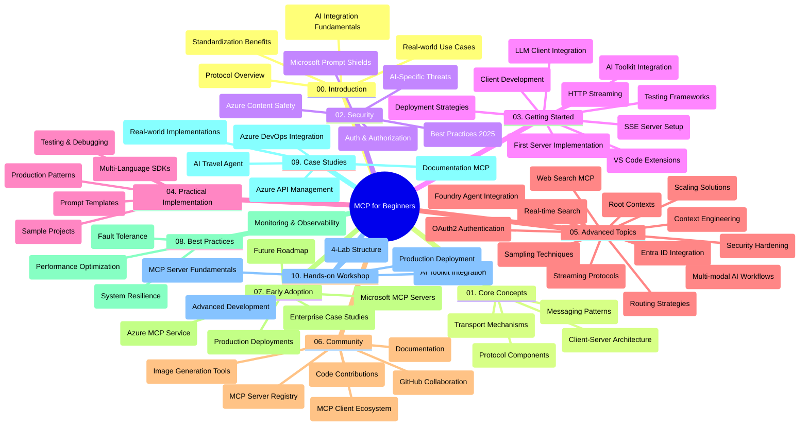

<!--
CO_OP_TRANSLATOR_METADATA:
{
  "original_hash": "e2c6ed897fa98fa08e0146101776c7ff",
  "translation_date": "2025-07-18T09:20:41+00:00",
  "source_file": "study_guide.md",
  "language_code": "mo"
}
-->
# Model Context Protocol (MCP) 初學者學習指南

本學習指南概述了「Model Context Protocol (MCP) 初學者」課程的倉庫結構與內容。請利用本指南有效瀏覽倉庫，充分利用現有資源。

## 倉庫概覽

Model Context Protocol (MCP) 是一套標準化的框架，用於 AI 模型與客戶端應用程式之間的互動。MCP 最初由 Anthropic 創建，現由更廣泛的 MCP 社群透過官方 GitHub 組織維護。本倉庫提供完整課程，包含 C#、Java、JavaScript、Python 及 TypeScript 的實作範例，適合 AI 開發者、系統架構師及軟體工程師使用。

## 視覺化課程地圖

## 倉庫結構

倉庫分為十個主要章節，各自聚焦 MCP 的不同面向：

1. **介紹 (00-Introduction/)**
   - Model Context Protocol 概述
   - 為何 AI 流程中標準化至關重要
   - 實際應用案例與效益

2. **核心概念 (01-CoreConcepts/)**
   - 客戶端-伺服器架構
   - 主要協議元件
   - MCP 中的訊息傳遞模式

3. **安全性 (02-Security/)**
   - MCP 系統中的安全威脅
   - 安全實作最佳做法
   - 認證與授權策略
   - **完整安全文件**：
     - MCP 2025 年安全最佳實務
     - Azure 內容安全實作指南
     - MCP 安全控管與技術
     - MCP 最佳實務快速參考
   - **重要安全議題**：
     - 提示注入與工具中毒攻擊
     - 會話劫持與混淆代理問題
     - 令牌穿透漏洞
     - 過度權限與存取控制
     - AI 元件供應鏈安全
     - Microsoft 提示防護整合

4. **入門指南 (03-GettingStarted/)**
   - 環境設定與配置
   - 建立基本 MCP 伺服器與客戶端
   - 與現有應用整合
   - 包含章節：
     - 首個伺服器實作
     - 客戶端開發
     - LLM 客戶端整合
     - VS Code 整合
     - Server-Sent Events (SSE) 伺服器
     - HTTP 串流
     - AI 工具包整合
     - 測試策略
     - 部署指引

5. **實務實作 (04-PracticalImplementation/)**
   - 跨語言 SDK 使用
   - 除錯、測試與驗證技巧
   - 製作可重用的提示模板與工作流程
   - 範例專案與實作示範

6. **進階主題 (05-AdvancedTopics/)**
   - 上下文工程技術
   - Foundry 代理整合
   - 多模態 AI 工作流程
   - OAuth2 認證示範
   - 即時搜尋功能
   - 即時串流
   - 根上下文實作
   - 路由策略
   - 取樣技術
   - 擴展方法
   - 安全性考量
   - Entra ID 安全整合
   - 網路搜尋整合

7. **社群貢獻 (06-CommunityContributions/)**
   - 如何貢獻程式碼與文件
   - 透過 GitHub 協作
   - 社群驅動的改進與回饋
   - 使用多種 MCP 客戶端（Claude Desktop、Cline、VSCode）
   - 使用熱門 MCP 伺服器，包括影像生成

8. **早期採用經驗 (07-LessonsfromEarlyAdoption/)**
   - 實際案例與成功故事
   - 建置與部署 MCP 解決方案
   - 趨勢與未來路線圖
   - **Microsoft MCP 伺服器指南**：涵蓋 10 個生產就緒的 Microsoft MCP 伺服器，包括：
     - Microsoft Learn Docs MCP 伺服器
     - Azure MCP 伺服器（15+ 專用連接器）
     - GitHub MCP 伺服器
     - Azure DevOps MCP 伺服器
     - MarkItDown MCP 伺服器
     - SQL Server MCP 伺服器
     - Playwright MCP 伺服器
     - Dev Box MCP 伺服器
     - Azure AI Foundry MCP 伺服器
     - Microsoft 365 Agents Toolkit MCP 伺服器

9. **最佳實務 (08-BestPractices/)**
   - 效能調校與優化
   - 設計容錯的 MCP 系統
   - 測試與韌性策略

10. **案例研究 (09-CaseStudy/)**
    - Azure API 管理整合範例
    - 旅遊代理實作範例
    - Azure DevOps 與 YouTube 更新整合
    - 文件 MCP 實作範例
    - 詳細文件的實作示範

11. **實作工作坊 (10-StreamliningAIWorkflowsBuildingAnMCPServerWithAIToolkit/)**
    - 結合 MCP 與 AI 工具包的完整實作工作坊
    - 建立連結 AI 模型與實務工具的智慧應用
    - 實務模組涵蓋基礎、客製伺服器開發與生產部署策略
    - **實驗室結構**：
      - 實驗室 1：MCP 伺服器基礎
      - 實驗室 2：進階 MCP 伺服器開發
      - 實驗室 3：AI 工具包整合
      - 實驗室 4：生產部署與擴展
    - 以實驗室為基礎的學習方式，逐步指導

## 附加資源

倉庫包含輔助資源：

- **Images 資料夾**：存放課程中使用的圖表與插圖
- **翻譯**：多語言支援，包含文件的自動翻譯
- **官方 MCP 資源**：
  - [MCP Documentation](https://modelcontextprotocol.io/)
  - [MCP Specification](https://spec.modelcontextprotocol.io/)
  - [MCP GitHub Repository](https://github.com/modelcontextprotocol)

## 如何使用本倉庫

1. **循序學習**：依序閱讀章節（00 至 10），獲得系統化學習體驗。
2. **語言專注**：若偏好特定程式語言，可瀏覽對應語言的範例目錄。
3. **實務操作**：從「入門指南」開始，設定環境並建立首個 MCP 伺服器與客戶端。
4. **進階探索**：熟悉基礎後，深入進階主題擴展知識。
5. **社群互動**：透過 GitHub 討論與 Discord 頻道加入 MCP 社群，與專家及開發者交流。

## MCP 客戶端與工具

課程涵蓋多種 MCP 客戶端與工具：

1. **官方客戶端**：
   - Visual Studio Code
   - Visual Studio Code 中的 MCP
   - Claude Desktop
   - VSCode 中的 Claude
   - Claude API

2. **社群客戶端**：
   - Cline（終端機介面）
   - Cursor（程式碼編輯器）
   - ChatMCP
   - Windsurf

3. **MCP 管理工具**：
   - MCP CLI
   - MCP Manager
   - MCP Linker
   - MCP Router

## 熱門 MCP 伺服器

倉庫介紹多款 MCP 伺服器，包括：

1. **官方 Microsoft MCP 伺服器**：
   - Microsoft Learn Docs MCP 伺服器
   - Azure MCP 伺服器（15+ 專用連接器）
   - GitHub MCP 伺服器
   - Azure DevOps MCP 伺服器
   - MarkItDown MCP 伺服器
   - SQL Server MCP 伺服器
   - Playwright MCP 伺服器
   - Dev Box MCP 伺服器
   - Azure AI Foundry MCP 伺服器
   - Microsoft 365 Agents Toolkit MCP 伺服器

2. **官方參考伺服器**：
   - Filesystem
   - Fetch
   - Memory
   - Sequential Thinking

3. **影像生成**：
   - Azure OpenAI DALL-E 3
   - Stable Diffusion WebUI
   - Replicate

4. **開發工具**：
   - Git MCP
   - Terminal Control
   - Code Assistant

5. **專用伺服器**：
   - Salesforce
   - Microsoft Teams
   - Jira & Confluence

## 貢獻

本倉庫歡迎社群貢獻。請參考社群貢獻章節，了解如何有效參與 MCP 生態系。

## 更新紀錄

| 日期 | 變更內容 |
|------|---------|
| 2025 年 7 月 18 日 | - 更新倉庫結構，新增 Microsoft MCP 伺服器指南 - 增加 10 個生產就緒 Microsoft MCP 伺服器清單 - 強化熱門 MCP 伺服器章節，加入官方 Microsoft MCP 伺服器 - 更新案例研究章節，加入實際檔案範例 - 新增實作工作坊的實驗室結構細節 |
| 2025 年 7 月 16 日 | - 更新倉庫結構以反映現有內容 - 新增 MCP 客戶端與工具章節 - 新增熱門 MCP 伺服器章節 - 更新視覺化課程地圖，涵蓋所有現有主題 - 強化進階主題章節，涵蓋所有專業領域 - 更新案例研究以反映實際範例 - 明確指出 MCP 由 Anthropic 創建 |
| 2025 年 6 月 11 日 | - 初版學習指南建立 - 新增視覺化課程地圖 - 概述倉庫結構 - 包含範例專案與附加資源 |

---

*本學習指南更新於 2025 年 7 月 18 日，內容反映該日期的倉庫狀態。倉庫內容可能於此後持續更新。*

**免責聲明**：  
本文件係使用 AI 翻譯服務 [Co-op Translator](https://github.com/Azure/co-op-translator) 進行翻譯。雖然我們致力於確保準確性，但請注意，自動翻譯可能包含錯誤或不準確之處。原始文件的母語版本應視為權威來源。對於重要資訊，建議採用專業人工翻譯。我們不對因使用本翻譯而產生的任何誤解或誤釋負責。