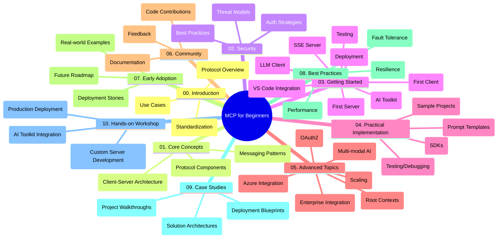

<!--
CO_OP_TRANSLATOR_METADATA:
{
  "original_hash": "a607d4febc94caee9a12b77795f7fc9a",
  "translation_date": "2025-06-11T16:38:24+00:00",
  "source_file": "study_guide.md",
  "language_code": "mo"
}
-->
# Model Context Protocol (MCP) for Beginners - Study Guide

This study guide offers an overview of the repository structure and contents for the "Model Context Protocol (MCP) for Beginners" course. Use it to navigate the repository effectively and make the most of the available resources.

## Repository Overview

The Model Context Protocol (MCP) is a standardized framework for interactions between AI models and client applications. This repository delivers a comprehensive curriculum with practical code examples in C#, Java, JavaScript, Python, and TypeScript, tailored for AI developers, system architects, and software engineers.

## Visual Curriculum Map

## Repository Structure

The repository is divided into ten main sections, each covering different aspects of MCP:

1. **Introduction (00-Introduction/)**
   - Overview of the Model Context Protocol
   - Why standardization is important in AI pipelines
   - Practical use cases and advantages

2. **Core Concepts (01-CoreConcepts/)**
   - Client-server architecture
   - Key protocol components
   - Messaging patterns in MCP

3. **Security (02-Security/)**
   - Security threats in MCP-based systems
   - Best practices for securing implementations
   - Authentication and authorization methods

4. **Getting Started (03-GettingStarted/)**
   - Environment setup and configuration
   - Creating basic MCP servers and clients
   - Integration with existing applications
   - Subsections for first server, first client, LLM client, VS Code integration, SSE server, AI Toolkit, testing, and deployment

5. **Practical Implementation (04-PracticalImplementation/)**
   - Using SDKs across different programming languages
   - Debugging, testing, and validation techniques
   - Designing reusable prompt templates and workflows
   - Sample projects with implementation examples

6. **Advanced Topics (05-AdvancedTopics/)**
   - Multi-modal AI workflows and extensibility
   - Secure scaling strategies
   - MCP in enterprise ecosystems
   - Specialized topics including Azure integration, multi-modality, OAuth2, root contexts, routing, sampling, scaling, security, web search integration, and streaming.

7. **Community Contributions (06-CommunityContributions/)**
   - How to contribute code and documentation
   - Collaborating via GitHub
   - Community-driven enhancements and feedback

8. **Lessons from Early Adoption (07-LessonsfromEarlyAdoption/)**
   - Real-world implementations and success stories
   - Building and deploying MCP-based solutions
   - Trends and future roadmap

9. **Best Practices (08-BestPractices/)**
   - Performance tuning and optimization
   - Designing fault-tolerant MCP systems
   - Testing and resilience strategies

10. **Case Studies (09-CaseStudy/)**
    - In-depth looks at MCP solution architectures
    - Deployment blueprints and integration tips
    - Annotated diagrams and project walkthroughs

11. **Hands-on Workshop (10-StreamliningAIWorkflowsBuildingAnMCPServerWithAIToolkit/)**
    - Comprehensive hands-on workshop combining MCP with Microsoft's AI Toolkit for VS Code
    - Building intelligent applications connecting AI models with real-world tools
    - Practical modules covering fundamentals, custom server development, and production deployment strategies

## Sample Projects

The repository includes multiple sample projects showcasing MCP implementation across various programming languages:

### Basic MCP Calculator Samples
- C# MCP Server Example
- Java MCP Calculator
- JavaScript MCP Demo
- Python MCP Server
- TypeScript MCP Example

### Advanced MCP Calculator Projects
- Advanced C# Sample
- Java Container App Example
- JavaScript Advanced Sample
- Python Complex Implementation
- TypeScript Container Sample

## Additional Resources

The repository also contains supporting materials:

- **Images folder**: Contains diagrams and illustrations used throughout the curriculum
- **Translations**: Multi-language support with automated documentation translations
- **Official MCP Resources**:
  - [MCP Documentation](https://modelcontextprotocol.io/)
  - [MCP Specification](https://spec.modelcontextprotocol.io/)
  - [MCP GitHub Repository](https://github.com/modelcontextprotocol)

## How to Use This Repository

1. **Sequential Learning**: Follow the chapters in order (00 through 10) for a structured learning experience.
2. **Language-Specific Focus**: If you prefer a particular programming language, explore the samples directories for implementations in your language of choice.
3. **Practical Implementation**: Start with the "Getting Started" section to set up your environment and build your first MCP server and client.
4. **Advanced Exploration**: Once you’re comfortable with the basics, dive into advanced topics to deepen your understanding.
5. **Community Engagement**: Join the [Azure AI Foundry Discord](https://discord.com/invite/ByRwuEEgH4) to connect with experts and fellow developers.

## Contributing

This repository welcomes community contributions. See the Community Contributions section for instructions on how to get involved.

---

*This study guide was created on June 11, 2025, and reflects the repository status as of that date. Content may have been updated since then.*

**Disclaimer**:  
Thiz documant haz bin translaited yusing AI translaiton serviz [Co-op Translator](https://github.com/Azure/co-op-translator). Whil wee stryve for akurasy, pleez bee awair that otomated translaitons may contain errurz or inakuratisez. The orijinal documant in its naytiv langwij shood bee considirred the authoritativ sourz. For kritikal informashun, profeshunal human translaiton is rekomended. Wee ar not layabl for eny misanderstandings or misinterpretashuns arizing from the yuse of this translaiton.