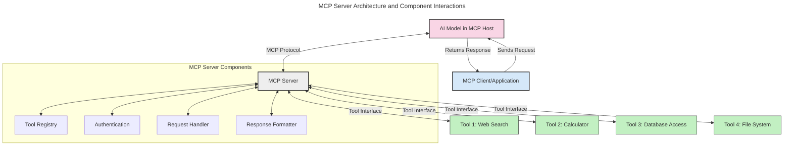
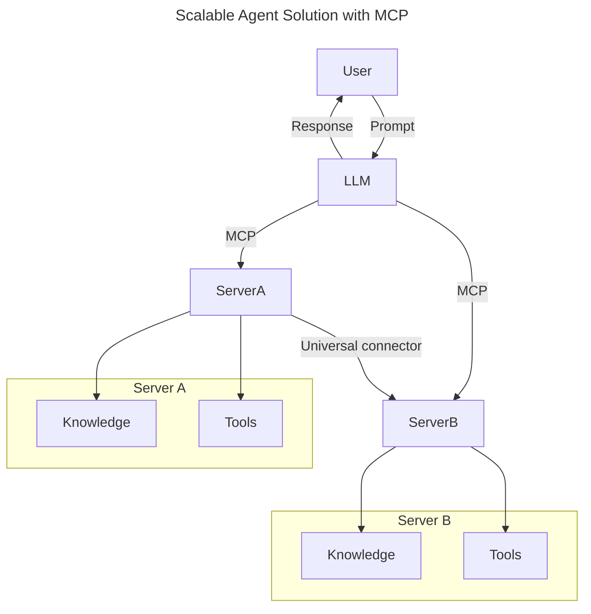
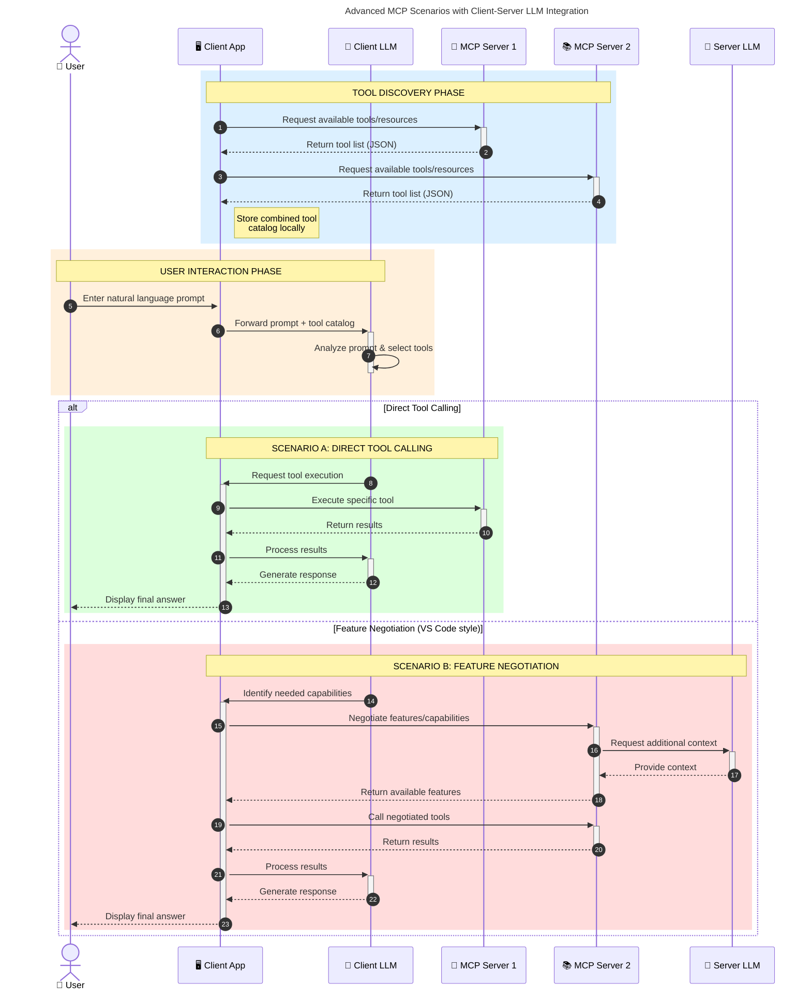

<!--
CO_OP_TRANSLATOR_METADATA:
{
  "original_hash": "1446979020432f512c883848d7eca144",
  "translation_date": "2025-05-29T21:45:12+00:00",
  "source_file": "00-Introduction/README.md",
  "language_code": "mr"
}
-->
# मॉडल संदर्भ प्रोटोकॉल (MCP) परिचय: स्केलेबल AI अनुप्रयोगांसाठी का महत्त्वाचे आहे

जनरेटिव्ह AI अनुप्रयोग हे मोठा पुढाकार आहेत कारण ते वापरकर्त्याला नैसर्गिक भाषेतील प्रॉम्प्ट्स वापरून अॅपशी संवाद साधण्याची मुभा देतात. मात्र, जेव्हा अशा अॅप्समध्ये अधिक वेळ आणि संसाधने गुंतवली जातात, तेव्हा तुम्हाला अशी खात्री करायची असते की तुम्ही फंक्शनॅलिटी आणि संसाधने सहजपणे एकत्र करू शकता, अॅप विस्तृत करण्यास सोपे आहे, एकापेक्षा जास्त मॉडेल वापरता येतील आणि विविध मॉडेलच्या वैशिष्ट्यांना हाताळता येईल. थोडक्यात, जन AI अॅप्स बनवणे सुरुवातीला सोपे असते, पण ते वाढत आणि जटिल होत गेल्यावर तुम्हाला एक आर्किटेक्चर निश्चित करावी लागते आणि बहुधा एक मानक अवलंबावा लागतो जेणेकरून तुमचे अॅप्स सुसंगत पद्धतीने तयार होतील. यासाठी MCP येते जे गोष्टी सुव्यवस्थित करते आणि मानक पुरवते.

---

## **🔍 मॉडल संदर्भ प्रोटोकॉल (MCP) म्हणजे काय?**

**Model Context Protocol (MCP)** हा एक **खुला, मानकीकृत इंटरफेस** आहे जो मोठ्या भाषा मॉडेल्स (LLMs) ना बाह्य टूल्स, APIs आणि डेटा स्रोतांशी सहज संवाद साधण्याची मुभा देतो. हे एक सुसंगत आर्किटेक्चर पुरवते जे AI मॉडेलची कार्यक्षमता त्याच्या प्रशिक्षण डेटापलीकडे वाढवते, ज्यामुळे स्मार्ट, स्केलेबल आणि अधिक प्रतिसादक्षम AI सिस्टम्स तयार होतात.

---

## **🎯 AI मध्ये मानकीकरण का महत्त्वाचे आहे**

जनरेटिव्ह AI अनुप्रयोग अधिक जटिल होत असताना, असे मानके स्वीकारणे आवश्यक आहे जे **स्केलेबिलिटी, विस्तारयोग्यता**, आणि **देखभालयोग्यता** सुनिश्चित करतात. MCP हे गरजा पूर्ण करते:

- मॉडेल-टूल एकत्रिकरण एकसंध करते
- तुटलेले, एकदाच वापरले जाणारे सानुकूल उपाय कमी करते
- एकाच पर्यावरणात अनेक मॉडेल्स coexist होऊ शकतात

---

## **📚 शिकण्याचे उद्दिष्ट**

या लेखाच्या शेवटी, तुम्ही:

- **Model Context Protocol (MCP)** आणि त्याचे उपयोग समजून घेऊ शकाल
- MCP कसे मॉडेल-टूल संवाद मानकीकृत करते हे समजून घेऊ शकाल
- MCP आर्किटेक्चरचे मुख्य घटक ओळखू शकाल
- एंटरप्राइज आणि विकास संदर्भातील MCP चे प्रत्यक्ष उपयोग पाहू शकाल

---

## **💡 मॉडल संदर्भ प्रोटोकॉल (MCP) कसा क्रांतिकारक आहे**

### **🔗 MCP AI संवादातील तुटलेपणा दूर करते**

MCP आधी, मॉडेल्सना टूल्सशी जोडण्यासाठी लागायचे:

- प्रत्येक टूल-मॉडेल जोड्यांसाठी सानुकूल कोड
- प्रत्येक विक्रेत्यासाठी गैर-मानकीकृत API
- अपडेट्समुळे वारंवार तुटणे
- अधिक टूल्ससह खराब स्केलेबिलिटी

### **✅ MCP मानकीकरणाचे फायदे**

| **फायदा**               | **वर्णन**                                                                      |
|--------------------------|--------------------------------------------------------------------------------|
| इंटरऑपरेबिलिटी         | LLMs विविध विक्रेत्यांच्या टूल्ससह सुरळीत काम करतात                         |
| सुसंगतता                | प्लॅटफॉर्म आणि टूल्समध्ये एकसारखे वर्तन                                      |
| पुनर्वापरयोग्यता         | एकदा तयार केलेले टूल्स अनेक प्रकल्पांमध्ये वापरता येतात                    |
| वेगवान विकास            | मानकीकृत, प्लग-एंड-प्ले इंटरफेस वापरून विकास वेळ कमी होतो                   |

---

## **🧱 MCP आर्किटेक्चरचा उच्च-स्तरीय आढावा**

MCP एक **क्लायंट-सर्व्हर मॉडेल** वापरते, जिथे:

- **MCP Hosts** AI मॉडेल चालवतात
- **MCP Clients** विनंत्या सुरू करतात
- **MCP Servers** संदर्भ, टूल्स, आणि क्षमता पुरवतात

### **मुख्य घटक:**

- **Resources** – मॉडेलसाठी स्थिर किंवा गतिशील डेटा  
- **Prompts** – मार्गदर्शित जनरेशनसाठी पूर्वनिर्धारित कार्यप्रवाह  
- **Tools** – शोध, गणना यांसारखे कार्यान्वित फंक्शन्स  
- **Sampling** – पुनरावृत्ती संवादाद्वारे एजंट वर्तन

---

## MCP सर्व्हर कसे काम करतात

MCP सर्व्हर खालीलप्रमाणे कार्य करतात:

- **विनंती प्रवाह**:  
    1. MCP क्लायंट AI मॉडेल चालवणाऱ्या MCP होस्टला विनंती पाठवतो.  
    2. AI मॉडेलला बाह्य टूल्स किंवा डेटा आवश्यक असल्याचे लक्षात येते.  
    3. मॉडेल मानकीकृत प्रोटोकॉल वापरून MCP सर्व्हरशी संवाद साधते.

- **MCP सर्व्हर कार्यक्षमता**:  
    - टूल रजिस्ट्री: उपलब्ध टूल्स आणि त्यांच्या क्षमतांची सूची ठेवते.  
    - प्रमाणीकरण: टूल वापरासाठी परवानग्या तपासते.  
    - विनंती हँडलर: मॉडेलकडून येणाऱ्या टूल विनंत्या प्रक्रिया करते.  
    - प्रतिसाद स्वरूपक: टूल आउटपुट मॉडेल समजेल अशा स्वरूपात तयार करते.

- **टूल कार्यान्वयन**:  
    - सर्व्हर विनंत्या योग्य बाह्य टूल्सकडे मार्गदर्शित करतो  
    - टूल्स त्यांचे विशेष फंक्शन्स (शोध, गणना, डेटाबेस क्वेरीज वगैरे) पार पाडतात  
    - निकाल मॉडेलला सुसंगत स्वरूपात परत पाठवले जातात

- **प्रतिक्रिया पूर्णता**:  
    - AI मॉडेल टूल आउटपुट प्रतिसादात समाविष्ट करते  
    - अंतिम प्रतिसाद क्लायंट अॅप्लिकेशनला परत पाठवला जातो

## 👨‍💻 MCP सर्व्हर कसा तयार करावा (उदाहरणांसह)

MCP सर्व्हर तुम्हाला LLM क्षमता वाढवण्यासाठी डेटा आणि फंक्शनॅलिटी पुरवतात.

तयार आहात का? वेगवेगळ्या भाषांमध्ये साधा MCP सर्व्हर तयार करण्याची उदाहरणे येथे आहेत:

- **Python उदाहरण**: https://github.com/modelcontextprotocol/python-sdk

- **TypeScript उदाहरण**: https://github.com/modelcontextprotocol/typescript-sdk

- **Java उदाहरण**: https://github.com/modelcontextprotocol/java-sdk

- **C#/.NET उदाहरण**: https://github.com/modelcontextprotocol/csharp-sdk

## 🌍 MCP चे प्रत्यक्ष उपयोग

MCP AI क्षमता वाढवून विविध अनुप्रयोगांना सक्षम करते:

| **अनुप्रयोग**               | **वर्णन**                                                                      |
|------------------------------|--------------------------------------------------------------------------------|
| एंटरप्राइज डेटा एकत्रीकरण    | LLMs ना डेटाबेस, CRM, किंवा अंतर्गत टूल्सशी जोडणे                              |
| एजंटिक AI सिस्टम्स           | टूल्स वापरून स्वायत्त एजंट्सना निर्णय घेण्याची कार्यप्रवाह सक्षम करणे         |
| मल्टी-मॉडल अनुप्रयोग         | एकाच AI अॅपमध्ये मजकूर, प्रतिमा, आणि ऑडिओ टूल्स एकत्र करणे                   |
| रिअल-टाइम डेटा एकत्रीकरण    | AI संवादात ताजी माहिती आणून अधिक अचूक आणि वर्तमान निकाल देणे                 |

### 🧠 MCP = AI संवादांसाठी सार्वत्रिक मानक

Model Context Protocol (MCP) हा AI संवादांसाठी सार्वत्रिक मानक म्हणून कार्य करतो, जसे USB-C ने उपकरणांसाठी भौतिक कनेक्शन मानकीकृत केले. AI च्या जगात, MCP एक सुसंगत इंटरफेस पुरवतो, ज्यामुळे मॉडेल्स (क्लायंट्स) बाह्य टूल्स आणि डेटा पुरवठादारांशी (सर्व्हर) सहज एकत्र येऊ शकतात. यामुळे प्रत्येक API किंवा डेटा स्रोतासाठी वेगवेगळे, सानुकूल प्रोटोकॉल वापरण्याची गरज नाहीशी होते.

MCP अंतर्गत, MCP-योग्य टूल (जे MCP सर्व्हर म्हणतात) एकसंध मानक पाळते. हे सर्व्हर्स त्यांच्या टूल्स किंवा क्रियांची यादी करतात आणि AI एजंटच्या विनंतीवर ती क्रिया पार पाडतात. MCP समर्थित AI एजंट प्लॅटफॉर्म्स सर्व्हरमधील उपलब्ध टूल्स शोधू शकतात आणि या मानक प्रोटोकॉलद्वारे त्यांना कॉल करू शकतात.

### 💡 ज्ञानापर्यंत प्रवेश सुलभ करतो

टूल्स पुरवण्यापलीकडे, MCP ज्ञानापर्यंत प्रवेश देखील सुलभ करते. हे अनुप्रयोगांना मोठ्या भाषा मॉडेल्सना (LLMs) विविध डेटा स्रोतांशी जोडून संदर्भ पुरवण्याची मुभा देते. उदाहरणार्थ, एखादा MCP सर्व्हर कंपनीच्या दस्तऐवज संचाचे प्रतिनिधित्व करू शकतो, ज्यामुळे एजंट्स आवश्यक माहिती मागणीवर मिळवू शकतात. दुसरा सर्व्हर विशिष्ट क्रिया जसे ईमेल पाठवणे किंवा नोंदी अपडेट करणे हाताळू शकतो. एजंटच्या दृष्टीने, हे फक्त वापरता येणारे टूल्स आहेत—काही टूल्स डेटा (ज्ञान संदर्भ) परत करतात, तर काही क्रिया पार पाडतात. MCP दोन्ही प्रभावीपणे हाताळतो.

एजंट जेव्हा MCP सर्व्हरशी जोडतो, तेव्हा तो त्या सर्व्हरच्या उपलब्ध क्षमता आणि प्रवेशयोग्य डेटाची माहिती मानक स्वरूपात आपोआप शिकतो. ही मानकीकरण गतिशील टूल उपलब्धता सक्षम करते. उदाहरणार्थ, एजंटच्या प्रणालीत नवीन MCP सर्व्हर जोडल्यावर त्याच्या फंक्शन्स लगेच वापरता येतात, एजंटच्या सूचनांमध्ये कोणतीही अतिरिक्त सानुकूलता न करता.

ही सुलभ एकत्रीकरण mermaid आकृतीत दाखविलेल्या प्रवाहाशी जुळते, जिथे सर्व्हर्स टूल्स आणि ज्ञान दोन्ही पुरवतात, ज्यामुळे प्रणालींमधील सुरळीत सहकार्य सुनिश्चित होते.

### 👉 उदाहरण: स्केलेबल एजंट सोल्यूशन

### 🔄 क्लायंट-साइड LLM समाकलनासह प्रगत MCP परिस्थिती

मूलभूत MCP आर्किटेक्चरपलीकडे, अशी प्रगत परिस्थिती आहेत जिथे क्लायंट आणि सर्व्हर दोघांमध्ये LLMs असतात, ज्यामुळे अधिक सुस्पष्ट संवाद शक्य होतो:

## 🔐 MCP चे व्यावहारिक फायदे

MCP वापरण्याचे व्यावहारिक फायदे:

- **ताजेपणा**: मॉडेल्सना त्यांच्या प्रशिक्षण डेटापलीकडे अद्ययावत माहिती मिळते  
- **क्षमता विस्तार**: मॉडेल्स अशा कार्यांसाठी विशेष टूल्स वापरू शकतात ज्यासाठी ते प्रशिक्षित नव्हते  
- **कमी भ्रम**: बाह्य डेटा स्रोत तथ्यात्मक आधार पुरवतात  
- **गोपनीयता**: संवेदनशील डेटा सुरक्षित वातावरणात राहू शकतो, प्रॉम्प्टमध्ये न ठेवता

## 📌 मुख्य मुद्दे

MCP वापरण्याचे मुख्य मुद्दे:

- **MCP** AI मॉडेल्स आणि टूल्स/डेटा यांच्यातील संवाद मानकीकृत करते  
- **विस्तारयोग्यता, सुसंगतता, आणि इंटरऑपरेबिलिटी** प्रोत्साहित करते  
- MCP विकास वेळ कमी करते, विश्वासार्हता वाढवते, आणि मॉडेल क्षमतांचा विस्तार करते  
- क्लायंट-सर्व्हर आर्किटेक्चर लवचिक, विस्तारयोग्य AI अनुप्रयोगांना सक्षम करते

## 🧠 सराव

तुम्हाला ज्याचा AI अॅप तयार करायचा आहे त्याचा विचार करा.

- कोणते **बाह्य टूल्स किंवा डेटा** त्याच्या क्षमतांना वाढवू शकतात?  
- MCP कसे एकत्रीकरण **सोपं आणि अधिक विश्वासार्ह** करू शकतो?

## अतिरिक्त स्रोत

- [MCP GitHub Repository](https://github.com/modelcontextprotocol)

## पुढे काय

पुढे: [Chapter 1: Core Concepts](/01-CoreConcepts/README.md)

**अस्वीकरण**:  
हा दस्तऐवज AI अनुवाद सेवा [Co-op Translator](https://github.com/Azure/co-op-translator) वापरून अनुवादित केला आहे. आम्ही अचूकतेसाठी प्रयत्न करतो, तरी कृपया लक्षात ठेवा की स्वयंचलित अनुवादांमध्ये चुका किंवा अचूकतेची कमतरता असू शकते. मूळ दस्तऐवज त्याच्या स्थानिक भाषेत अधिकृत स्रोत मानला जावा. महत्त्वाच्या माहितीसाठी व्यावसायिक मानवी अनुवादाची शिफारस केली जाते. या अनुवादाचा वापर केल्यामुळे उद्भवलेल्या कोणत्याही गैरसमजुती किंवा चुकीसाठी आम्ही जबाबदार नाही.