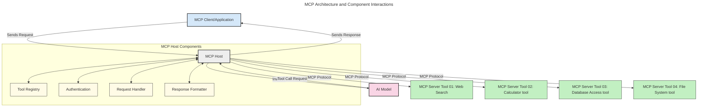

<!--
CO_OP_TRANSLATOR_METADATA:
{
  "original_hash": "0df1ee78a6dd8300f3a040ca5b411c2e",
  "translation_date": "2025-08-18T15:50:48+00:00",
  "source_file": "00-Introduction/README.md",
  "language_code": "mr"
}
-->
# मॉडेल कॉन्टेक्स्ट प्रोटोकॉल (MCP) ची ओळख: स्केलेबल AI अनुप्रयोगांसाठी याचे महत्त्व

_(वरील प्रतिमेवर क्लिक करून या धड्याचा व्हिडिओ पाहा)_

जनरेटिव्ह AI अनुप्रयोग हे एक मोठे पाऊल आहे कारण ते वापरकर्त्याला नैसर्गिक भाषेतील प्रॉम्प्ट्सद्वारे अॅपशी संवाद साधण्याची परवानगी देतात. मात्र, अशा अॅप्समध्ये अधिक वेळ आणि संसाधने गुंतवल्यानंतर, तुम्हाला खात्री करायची आहे की तुम्ही कार्यक्षमता आणि संसाधनांचे एकत्रीकरण सहजतेने करू शकता, अॅपला एकापेक्षा जास्त मॉडेल्ससाठी उपयुक्त बनवू शकता आणि विविध मॉडेल्सच्या गुंतागुंती हाताळू शकता. थोडक्यात, जनरेटिव्ह AI अॅप्स तयार करणे सुरुवातीला सोपे असते, पण ते वाढत जातात आणि अधिक गुंतागुंतीचे होतात तेव्हा तुम्हाला आर्किटेक्चरची व्याख्या करावी लागते आणि तुमचे अॅप्स सुसंगत पद्धतीने तयार होण्यासाठी एका मानकावर अवलंबून राहावे लागते. याच ठिकाणी MCP गोष्टी व्यवस्थित करते आणि एक मानक प्रदान करते.

---

## **🔍 मॉडेल कॉन्टेक्स्ट प्रोटोकॉल (MCP) म्हणजे काय?**

**मॉडेल कॉन्टेक्स्ट प्रोटोकॉल (MCP)** हा एक **मुक्त, मानकीकृत इंटरफेस** आहे जो मोठ्या भाषा मॉडेल्सना (LLMs) बाह्य साधने, API आणि डेटा स्रोतांसोबत अखंडपणे संवाद साधण्याची परवानगी देतो. हे एक सुसंगत आर्किटेक्चर प्रदान करते जे AI मॉडेल्सच्या कार्यक्षमतेला त्यांच्या प्रशिक्षण डेटाच्या पलीकडे वाढवते, अधिक हुशार, स्केलेबल आणि प्रतिसादक्षम AI प्रणाली सक्षम करते.

---

## **🎯 AI मध्ये मानकीकरण का महत्त्वाचे आहे**

जनरेटिव्ह AI अनुप्रयोग अधिक गुंतागुंतीचे होत असताना, **स्केलेबिलिटी, विस्तारक्षमता, देखभालक्षमता** आणि **विक्रेता-लॉक-इन टाळणे** याची खात्री करण्यासाठी मानक स्वीकारणे आवश्यक आहे. MCP या गरजा पूर्ण करते:

- मॉडेल-टूल एकत्रीकरण統 एकत्र करणे
- नाजूक, एकदाच वापरल्या जाणाऱ्या सानुकूल उपायांना कमी करणे
- विविध विक्रेत्यांकडून एकाच परिसंस्थेत एकाधिक मॉडेल्स सह-अस्तित्वात ठेवणे

**टीप:** MCP स्वतःला एक मुक्त मानक म्हणून सादर करत असले तरी, IEEE, IETF, W3C, ISO किंवा इतर कोणत्याही मानक संस्थांद्वारे MCP चे मानकीकरण करण्याची कोणतीही योजना नाही.

---

## **📚 शिकण्याची उद्दिष्टे**

या लेखाच्या शेवटी, तुम्ही हे करू शकाल:

- **मॉडेल कॉन्टेक्स्ट प्रोटोकॉल (MCP)** आणि त्याचे उपयोग समजावून सांगणे
- MCP कसे मॉडेल-टूल संवादाचे मानकीकरण करते हे समजून घेणे
- MCP आर्किटेक्चरचे मुख्य घटक ओळखणे
- एंटरप्राइझ आणि विकास संदर्भातील MCP चे वास्तविक-जगातील अनुप्रयोग शोधणे

---

## **💡 मॉडेल कॉन्टेक्स्ट प्रोटोकॉल (MCP) का गेम-चेंजर आहे**

### **🔗 MCP AI संवादांमधील तुकड्यांना सोडवते**

MCP पूर्वी, मॉडेल्सना साधनांसोबत एकत्रित करण्यासाठी:

- प्रत्येक टूल-मॉडेल जोडीसाठी सानुकूल कोड
- प्रत्येक विक्रेत्यासाठी नॉन-स्टँडर्ड API
- अद्यतनांमुळे वारंवार तुटणे
- अधिक साधनांसह खराब स्केलेबिलिटी

### **✅ MCP मानकीकरणाचे फायदे**

| **फायदा**                | **वर्णन**                                                                      |
|--------------------------|--------------------------------------------------------------------------------|
| इंटरऑपरेबिलिटी           | LLMs विविध विक्रेत्यांच्या साधनांसोबत अखंडपणे कार्य करतात                     |
| सुसंगतता                 | प्लॅटफॉर्म्स आणि साधनांमध्ये एकसमान वर्तन                                     |
| पुनर्वापरयोग्यता         | एकदा तयार केलेली साधने प्रकल्प आणि प्रणालींमध्ये वापरता येतात                  |
| जलद विकास                | मानकीकृत, प्लग-अँड-प्ले इंटरफेस वापरून विकासाचा वेळ कमी करा                   |

---

## **🧱 MCP आर्किटेक्चरचा उच्च-स्तरीय आढावा**

MCP **क्लायंट-सर्व्हर मॉडेल**चे अनुसरण करते, जिथे:

- **MCP होस्ट्स** AI मॉडेल्स चालवतात
- **MCP क्लायंट्स** विनंत्या सुरू करतात
- **MCP सर्व्हर्स** संदर्भ, साधने आणि क्षमता प्रदान करतात

### **मुख्य घटक:**

- **संसाधने** – मॉडेल्ससाठी स्थिर किंवा गतिशील डेटा  
- **प्रॉम्प्ट्स** – मार्गदर्शित निर्मितीसाठी पूर्वनिर्धारित कार्यप्रवाह  
- **साधने** – शोध, गणना यांसारख्या कार्यक्षम फंक्शन्स  
- **सॅम्पलिंग** – पुनरावृत्ती संवादांद्वारे एजंटिक वर्तन  

---

## MCP सर्व्हर्स कसे कार्य करतात

MCP सर्व्हर्स खालीलप्रमाणे कार्य करतात:

- **विनंती प्रवाह**:
    1. अंतिम वापरकर्ता किंवा त्यांच्या वतीने कार्य करणारे सॉफ्टवेअर विनंती सुरू करते.
    2. **MCP क्लायंट** ही विनंती **MCP होस्ट**कडे पाठवतो, जो AI मॉडेल रनटाइम व्यवस्थापित करतो.
    3. **AI मॉडेल** वापरकर्त्याच्या प्रॉम्प्टला प्राप्त करतो आणि एक किंवा अधिक टूल कॉल्सद्वारे बाह्य साधने किंवा डेटाचा प्रवेश मागू शकतो.
    4. **MCP होस्ट**, मॉडेल थेट नाही, मानकीकृत प्रोटोकॉल वापरून योग्य **MCP सर्व्हर(स)** सोबत संवाद साधतो.
- **MCP होस्ट कार्यक्षमता**:
    - **टूल रजिस्ट्री**: उपलब्ध साधने आणि त्यांच्या क्षमतांची सूची ठेवते.
    - **प्रमाणीकरण**: टूल प्रवेशासाठी परवानग्या सत्यापित करते.
    - **विनंती हँडलर**: मॉडेलकडून येणाऱ्या टूल विनंत्या प्रक्रिया करते.
    - **प्रतिसाद स्वरूपक**: टूल आउटपुट मॉडेलला समजेल अशा स्वरूपात संरचित करते.
- **MCP सर्व्हर अंमलबजावणी**:
    - **MCP होस्ट** टूल कॉल्स एका किंवा अधिक **MCP सर्व्हर्स**कडे रूट करतो, जे विशिष्ट कार्ये उघड करतात (उदा. शोध, गणना, डेटाबेस क्वेरी).
    - **MCP सर्व्हर्स** त्यांच्या संबंधित ऑपरेशन्स करतात आणि **MCP होस्ट**कडे सुसंगत स्वरूपात निकाल परत करतात.
    - **MCP होस्ट** हे निकाल स्वरूपित करतो आणि **AI मॉडेल**कडे पाठवतो.
- **प्रतिसाद पूर्णता**:
    - **AI मॉडेल** टूल आउटपुट अंतिम प्रतिसादात समाविष्ट करते.
    - **MCP होस्ट** हा प्रतिसाद **MCP क्लायंट**कडे पाठवतो, जो तो अंतिम वापरकर्ता किंवा कॉलिंग सॉफ्टवेअरला वितरीत करतो.

## 👨‍💻 MCP सर्व्हर कसे तयार करावे (उदाहरणांसह)

MCP सर्व्हर्स LLM क्षमतांना डेटा आणि कार्यक्षमता प्रदान करून विस्तारित करतात.

तयार आहात का? येथे विविध भाषा/स्टॅकसाठी SDKs आणि सोप्या MCP सर्व्हर्स तयार करण्याची उदाहरणे आहेत:

- **Python SDK**: https://github.com/modelcontextprotocol/python-sdk

- **TypeScript SDK**: https://github.com/modelcontextprotocol/typescript-sdk

- **Java SDK**: https://github.com/modelcontextprotocol/java-sdk

- **C#/.NET SDK**: https://github.com/modelcontextprotocol/csharp-sdk

---

## 🌍 MCP चे वास्तविक-जगातील उपयोग

MCP AI क्षमतांना विस्तारित करून विविध अनुप्रयोग सक्षम करते:

| **अनुप्रयोग**                | **वर्णन**                                                                      |
|------------------------------|--------------------------------------------------------------------------------|
| एंटरप्राइझ डेटा एकत्रीकरण    | LLMsना डेटाबेस, CRMs किंवा अंतर्गत साधनांशी कनेक्ट करा                        |
| एजंटिक AI प्रणाली            | टूल प्रवेश आणि निर्णय घेण्याच्या कार्यप्रवाहांसह स्वायत्त एजंट सक्षम करा       |
| मल्टी-मोडल अनुप्रयोग         | एकाच AI अॅपमध्ये मजकूर, प्रतिमा आणि ऑडिओ साधने एकत्र करा                      |
| रिअल-टाइम डेटा एकत्रीकरण     | अधिक अचूक, वर्तमान आउटपुटसाठी AI संवादांमध्ये थेट डेटा आणा                     |

### 🧠 MCP = AI संवादांसाठी सार्वत्रिक मानक

मॉडेल कॉन्टेक्स्ट प्रोटोकॉल (MCP) AI संवादांसाठी सार्वत्रिक मानक म्हणून कार्य करते, जसे USB-C ने डिव्हाइस कनेक्शनसाठी भौतिक मानक केले. AI च्या जगात, MCP एक सुसंगत इंटरफेस प्रदान करते, ज्यामुळे मॉडेल्स (क्लायंट्स) बाह्य साधने आणि डेटा प्रदात्यांसोबत अखंडपणे एकत्रित होऊ शकतात. यामुळे प्रत्येक API किंवा डेटा स्रोतासाठी विविध, सानुकूल प्रोटोकॉलची गरज संपते.

MCP अंतर्गत, MCP-सुसंगत टूल (MCP सर्व्हर म्हणून ओळखले जाते) एकसंध मानकाचे अनुसरण करते. हे सर्व्हर्स ते ऑफर करत असलेल्या साधनांची किंवा क्रियांची यादी करू शकतात आणि AI एजंटने विनंती केल्यावर त्या क्रिया अंमलात आणू शकतात. MCP ला समर्थन देणारे AI एजंट प्लॅटफॉर्म्स उपलब्ध साधने शोधण्यास आणि या मानक प्रोटोकॉलद्वारे त्यांना कॉल करण्यास सक्षम असतात.

### 💡 ज्ञानाचा प्रवेश सुलभ करतो

साधने ऑफर करण्याच्या पलीकडे, MCP ज्ञानाचा प्रवेश सुलभ करते. हे मोठ्या भाषा मॉडेल्सना (LLMs) विविध डेटा स्रोतांशी जोडून संदर्भ प्रदान करण्यास सक्षम करते. उदाहरणार्थ, MCP सर्व्हर कंपनीच्या दस्तऐवज संग्रहाचे प्रतिनिधित्व करू शकतो, एजंट्सना मागणीनुसार संबंधित माहिती पुनर्प्राप्त करण्याची परवानगी देतो. आणखी एक सर्व्हर विशिष्ट क्रिया हाताळू शकतो, जसे की ईमेल पाठवणे किंवा रेकॉर्ड अपडेट करणे. एजंटच्या दृष्टिकोनातून, ही फक्त साधने आहेत जी ती वापरू शकते—काही साधने डेटा परत करतात (ज्ञान संदर्भ), तर काही क्रिया करतात. MCP दोन्ही कार्ये कार्यक्षमतेने व्यवस्थापित करते.

---

## 📌 मुख्य मुद्दे

- **MCP** AI मॉडेल्सना साधने आणि डेटाशी संवाद साधण्याचे मानकीकरण करते
- **विस्तारक्षमता, सुसंगतता, आणि इंटरऑपरेबिलिटी**ला प्रोत्साहन देते
- MCP **विकासाचा वेळ कमी करते, विश्वासार्हता सुधारते, आणि मॉडेल क्षमतांना विस्तारित करते**
- क्लायंट-सर्व्हर आर्किटेक्चर **लवचिक, विस्तारक्षम AI अनुप्रयोग सक्षम करते**

## 🧠 सराव

तुम्हाला तयार करायचा असलेल्या AI अनुप्रयोगाचा विचार करा.

- कोणती **बाह्य साधने किंवा डेटा** त्याच्या क्षमतांना वाढवू शकतात?
- MCP एकत्रीकरण **सोपे आणि अधिक विश्वासार्ह** कसे बनवू शकते?

## अतिरिक्त संसाधने

- [MCP GitHub Repository](https://github.com/modelcontextprotocol)

## पुढे काय

पुढे: [प्रकरण 1: मुख्य संकल्पना](../01-CoreConcepts/README.md)

**अस्वीकरण**:  
हा दस्तऐवज AI भाषांतर सेवा [Co-op Translator](https://github.com/Azure/co-op-translator) वापरून भाषांतरित करण्यात आला आहे. आम्ही अचूकतेसाठी प्रयत्नशील असलो तरी, कृपया लक्षात ठेवा की स्वयंचलित भाषांतरे त्रुटी किंवा अचूकतेच्या अभावाने युक्त असू शकतात. मूळ भाषेतील दस्तऐवज हा अधिकृत स्रोत मानला जावा. महत्त्वाच्या माहितीसाठी, व्यावसायिक मानवी भाषांतराची शिफारस केली जाते. या भाषांतराचा वापर करून उद्भवलेल्या कोणत्याही गैरसमज किंवा चुकीच्या अर्थासाठी आम्ही जबाबदार राहणार नाही.