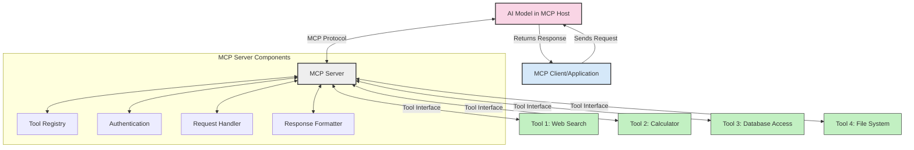
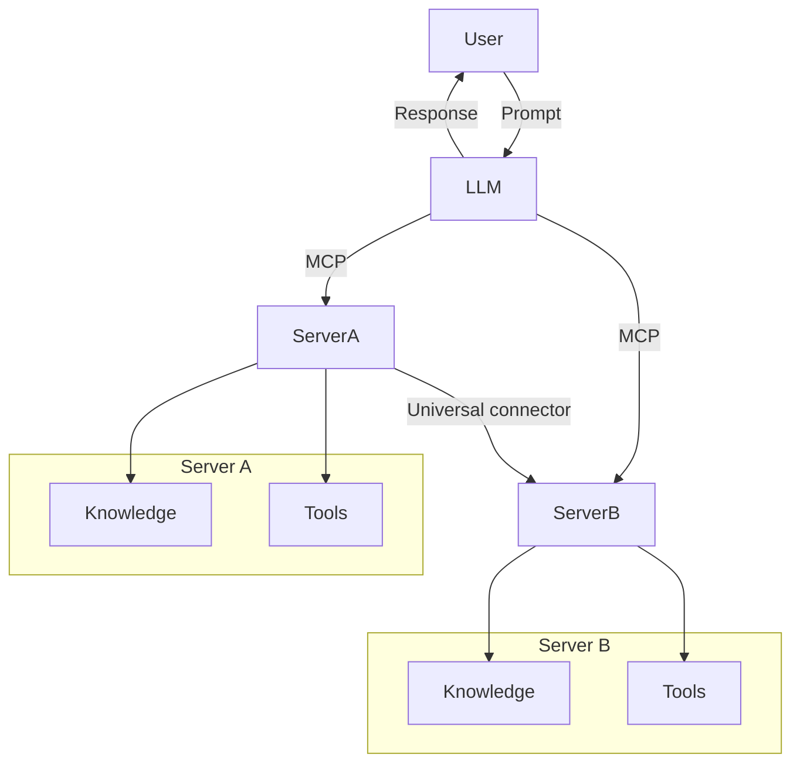

<!--
CO_OP_TRANSLATOR_METADATA:
{
  "original_hash": "1d88dee994dcbb3fa52c271d0c0817b5",
  "translation_date": "2025-05-20T21:00:26+00:00",
  "source_file": "00-Introduction/README.md",
  "language_code": "mr"
}
-->
# मॉडल संदर्भ प्रोटोकॉल (MCP) परिचय: स्केलेबल AI अनुप्रयोगांसाठी का महत्त्वाचा आहे

जनरेटिव्ह AI अनुप्रयोग एक मोठा टप्पा आहेत कारण ते वापरकर्त्याला नैसर्गिक भाषेतील प्रॉम्प्ट वापरून संवाद साधण्याची मुभा देतात. मात्र, जेव्हा अशा अनुप्रयोगांमध्ये अधिक वेळ आणि संसाधने गुंतवली जातात, तेव्हा तुम्हाला खात्री करायची असते की तुम्ही फंक्शनॅलिटी आणि संसाधने अशा प्रकारे सहजपणे एकत्र करू शकता की ती विस्तारण्यास सोपी असतील, तुमचा अनुप्रयोग एकापेक्षा जास्त मॉडेल वापरू शकेल आणि विविध मॉडेलच्या गुंतागुंती हाताळू शकेल. थोडक्यात, जनरेटिव्ह AI अनुप्रयोग सुरू करणे सोपे असले तरी, ते वाढत आणि जास्त क्लिष्ट होत असताना, तुम्हाला एक आर्किटेक्चर निश्चित करायला लागेल आणि शक्यतो एक मानक वापरावा लागेल ज्यामुळे तुमचे अनुप्रयोग सुसंगत पद्धतीने तयार होतील. यासाठी MCP मदत करते, जे गोष्टी संघटित करते आणि एक मानक पुरवते.

---

## **🔍 मॉडल संदर्भ प्रोटोकॉल (MCP) म्हणजे काय?**

**Model Context Protocol (MCP)** हे एक **खुला, मानकीकृत इंटरफेस** आहे जे मोठ्या भाषा मॉडेल्स (LLMs) ना बाह्य टूल्स, API आणि डेटा स्रोतांसोबत सहज संवाद साधण्याची परवानगी देते. हे AI मॉडेलची कार्यक्षमता त्यांच्या प्रशिक्षण डेटेपलीकडे वाढवण्यासाठी एक सुसंगत आर्किटेक्चर प्रदान करते, ज्यामुळे स्मार्ट, स्केलेबल आणि अधिक प्रतिसादक्षम AI सिस्टम्स तयार होतात.

---

## **🎯 AI मध्ये मानकीकरण का महत्त्वाचे आहे**

जनरेटिव्ह AI अनुप्रयोग अधिक क्लिष्ट होत असल्याने, असे मानके स्वीकारणे आवश्यक आहे जे **स्केलेबिलिटी, विस्तारयोग्यता** आणि **देखभाल सुलभता** सुनिश्चित करतात. MCP हे गरजा पूर्ण करते:

- मॉडेल-टूल एकत्रीकरण एकत्रित करून
- तुटलेल्या, एकदाच वापरल्या जाणाऱ्या सानुकूल सोल्यूशन्स कमी करून
- एकाच पर्यावरणात अनेक मॉडेल्स coexist करण्याची परवानगी देऊन

---

## **📚 शिकण्याचे उद्दिष्ट**

या लेखाच्या शेवटी, तुम्ही करू शकाल:

- **Model Context Protocol (MCP)** आणि त्याचे वापर केस समजून घेणे
- MCP कसे मॉडेल-टूल संवाद मानकीकृत करते हे समजून घेणे
- MCP आर्किटेक्चरचे मुख्य घटक ओळखणे
- उद्योग आणि विकास संदर्भात MCP चे प्रत्यक्ष वापर पाहणे

---

## **💡 मॉडल संदर्भ प्रोटोकॉल (MCP) का गेम-चेंजर आहे**

### **🔗 MCP AI संवादातील विखुरलेपणा सोडवते**

MCP आधी, मॉडेल्सना टूल्ससोबत जोडण्यासाठी:

- प्रत्येक टूल-मॉडेल जोडणीसाठी सानुकूल कोड लिहावा लागायचा
- प्रत्येक विक्रेत्यासाठी मानक नसलेले API वापरावे लागायचे
- अपडेट्समुळे वारंवार ब्रेक होायचे
- अधिक टूल्स वाढल्यावर स्केलेबिलिटी कमी होत असे

### **✅ MCP मानकीकरणाचे फायदे**

| **फायदा**              | **वर्णन**                                                                |
|------------------------|-------------------------------------------------------------------------|
| इंटरऑपरेबिलिटी        | LLMs विविध विक्रेत्यांच्या टूल्ससह सुरळीत काम करतात                   |
| सुसंगतता               | प्लॅटफॉर्म्स आणि टूल्समध्ये एकसारखे वर्तन                             |
| पुनर्वापरयोग्यता        | एकदा तयार केलेले टूल्स अनेक प्रोजेक्ट्स आणि सिस्टम्समध्ये वापरता येतात|
| विकास गती वाढवणे       | मानकीकृत, प्लग-एंड-प्ले इंटरफेस वापरून विकास वेळ कमी होतो             |

---

## **🧱 उच्च-स्तरीय MCP आर्किटेक्चर आढावा**

MCP एक **क्लायंट-सर्व्हर मॉडेल** वापरते, ज्यामध्ये:

- **MCP Hosts** AI मॉडेल चालवतात  
- **MCP Clients** विनंत्या सुरू करतात  
- **MCP Servers** संदर्भ, टूल्स आणि क्षमता पुरवतात  

### **मुख्य घटक:**

- **Resources** – मॉडेलसाठी स्थिर किंवा गतिशील डेटा  
- **Prompts** – मार्गदर्शित जनरेशनसाठी पूर्वनिर्धारित वर्कफ्लोज  
- **Tools** – शोध, गणना सारखे कार्यान्वित फंक्शन्स  
- **Sampling** – पुनरावृत्ती संवादाद्वारे एजंटसारखे वर्तन

---

## MCP सर्व्हर कसे कार्य करतात

MCP सर्व्हर खालील प्रकारे कार्य करतात:

- **विनंती प्रवाह**:  
    1. MCP Client AI मॉडेल चालवणाऱ्या MCP Host कडे विनंती पाठवतो.  
    2. AI मॉडेल ओळखतो की बाह्य टूल्स किंवा डेटाची गरज आहे.  
    3. मॉडेल मानकीकृत प्रोटोकॉल वापरून MCP Server शी संवाद साधतो.  

- **MCP Server ची कार्ये**:  
    - टूल रजिस्ट्री: उपलब्ध टूल्स आणि त्यांची क्षमता सांभाळते.  
    - प्रमाणीकरण: टूल प्रवेशासाठी परवानग्या तपासते.  
    - विनंती हाताळणी: मॉडेलकडून येणाऱ्या टूल विनंत्या प्रक्रिया करते.  
    - प्रतिसाद फॉरमॅटर: टूल आउटपुट मॉडेलला समजेल अशा स्वरूपात बनवते.  

- **टूल कार्यान्वयन**:  
    - सर्व्हर विनंत्या योग्य बाह्य टूल्सकडे पाठवतो  
    - टूल्स त्यांचे विशेष कार्य (शोध, गणना, डेटाबेस क्वेरीज इ.) पार पाडतात  
    - निकाल मॉडेलकडे सुसंगत स्वरूपात परत पाठवले जातात  

- **प्रतिक्रिया पूर्णता**:  
    - AI मॉडेल टूल आउटपुट त्याच्या प्रतिसादात समाविष्ट करतो  
    - अंतिम प्रतिसाद क्लायंट अनुप्रयोगाला पाठवला जातो  

## 👨‍💻 MCP सर्व्हर कसा तयार करावा (उदाहरणांसह)

MCP सर्व्हर LLM क्षमता वाढवण्यासाठी डेटा आणि फंक्शनॅलिटी पुरवतात.

प्रयत्न करायचा आहे का? वेगवेगळ्या भाषांमध्ये सोपा MCP सर्व्हर तयार करण्याची उदाहरणे येथे आहेत:

- **Python उदाहरण**: https://github.com/modelcontextprotocol/python-sdk

- **TypeScript उदाहरण**: https://github.com/modelcontextprotocol/typescript-sdk

- **Java उदाहरण**: https://github.com/modelcontextprotocol/java-sdk

- **C#/.NET उदाहरण**: https://github.com/modelcontextprotocol/csharp-sdk

## 🌍 MCP चे प्रत्यक्ष वापर

MCP AI क्षमतांना विस्तारून अनेक अनुप्रयोग शक्य करतो:

| **अनुप्रयोग**               | **वर्णन**                                                                |
|-----------------------------|-------------------------------------------------------------------------|
| एंटरप्राइज डेटा इंटिग्रेशन | LLMs ना डेटाबेस, CRM किंवा अंतर्गत टूल्सशी जोडणे                        |
| एजंटिक AI सिस्टम्स          | टूल्स प्रवेश आणि निर्णय प्रक्रियांसह स्वायत्त एजंट सक्षम करणे          |
| मल्टी-मोडल अनुप्रयोग       | एकत्रित AI अॅपमध्ये मजकूर, प्रतिमा, आणि ऑडिओ टूल्स एकत्र करणे          |
| रिअल-टाइम डेटा इंटिग्रेशन | AI संवादात ताजी माहिती आणून अधिक अचूक, वर्तमान निकाल देणे             |

### 🧠 MCP = AI संवादांसाठी सार्वत्रिक मानक

Model Context Protocol (MCP) AI संवादांसाठी एक सार्वत्रिक मानक म्हणून कार्य करते, जसे USB-C उपकरणांसाठी भौतिक कनेक्शन मानकीकृत करते. AI च्या जगात, MCP एक सुसंगत इंटरफेस पुरवतो, ज्यामुळे मॉडेल्स (क्लायंट्स) बाह्य टूल्स आणि डेटा पुरवठादारांशी (सर्व्हर्स) सहजपणे जोडले जातात. यामुळे प्रत्येक API किंवा डेटा स्रोतासाठी वेगवेगळ्या, सानुकूल प्रोटोकॉलची गरज नाहीशी होते.

MCP अंतर्गत, MCP-सुसंगत टूल (ज्याला MCP सर्व्हर म्हणतात) एकसारखा मानक वापरतो. हे सर्व्हर्स त्यांच्या टूल्स किंवा क्रियांची यादी देऊ शकतात आणि AI एजंटच्या विनंतीवर त्या क्रिया पार पाडू शकतात. MCP समर्थित AI एजंट प्लॅटफॉर्म्स सर्व्हर्सकडून उपलब्ध टूल्स शोधू शकतात आणि या मानक प्रोटोकॉलद्वारे त्यांना कॉल करू शकतात.

### 💡 ज्ञान प्रवेश सुलभ करतो

फक्त टूल्स पुरवण्यापलीकडे, MCP ज्ञान प्रवेशही सुलभ करतो. तो अनुप्रयोगांना मोठ्या भाषा मॉडेल्सना (LLMs) विविध डेटा स्रोतांशी जोडून संदर्भ पुरवण्याची परवानगी देतो. उदाहरणार्थ, एक MCP सर्व्हर कंपनीच्या दस्तऐवज संचाचे प्रतिनिधित्व करू शकतो, ज्यामुळे एजंट्स गरजेनुसार संबंधित माहिती मिळवू शकतात. दुसरा सर्व्हर विशिष्ट क्रिया जसे ईमेल पाठवणे किंवा रेकॉर्ड अपडेट करणे हाताळू शकतो. एजंटच्या दृष्टीने, हे फक्त वापरायची टूल्स आहेत—काही टूल्स डेटा (ज्ञान संदर्भ) परत करतात तर काही क्रिया पार पाडतात. MCP दोन्ही गोष्टी प्रभावीपणे व्यवस्थापित करतो.

एजंट जेव्हा MCP सर्व्हरशी जोडतो, तेव्हा तो सर्व्हरच्या उपलब्ध क्षमतांची आणि प्रवेशयोग्य डेटाची माहिती मानक स्वरूपात आपोआप शिकतो. हे मानकीकरण डायनॅमिक टूल उपलब्धता सक्षम करते. उदाहरणार्थ, एजंटच्या सिस्टममध्ये नवीन MCP सर्व्हर जोडल्यावर त्याचे फंक्शन्स लगेच वापरता येतात, अजून एजंटच्या सूचना सानुकूल करण्याची गरज नाही.

ही सुलभ एकत्रीकरण mermaid आकृतीत दर्शविलेल्या प्रवाहाशी सुसंगत आहे, जिथे सर्व्हर्स टूल्स आणि ज्ञान दोन्ही पुरवतात, ज्यामुळे सिस्टम्समध्ये अखंड सहकार्य सुनिश्चित होते.

### 👉 उदाहरण: स्केलेबल एजंट सोल्यूशन

## 🔐 MCP चे व्यावहारिक फायदे

MCP वापरण्याचे व्यावहारिक फायदे:

- **ताजेपणा**: मॉडेल्सना त्यांच्या प्रशिक्षण डेटेपलीकडील ताजी माहिती मिळू शकते  
- **क्षमता विस्तार**: मॉडेल्सना त्यांच्या प्रशिक्षणाबाहेरील कार्यांसाठी विशेष टूल्स वापरण्याची मुभा  
- **भ्रम कमी होणे**: बाह्य डेटा स्रोतांनी तथ्यात्मक आधार पुरवतो  
- **गोपनीयता**: संवेदनशील डेटा सुरक्षित वातावरणात राहू शकतो, प्रॉम्प्टमध्ये समाविष्ट न करता  

## 📌 मुख्य मुद्दे

MCP वापरण्याचे मुख्य मुद्दे:

- **MCP** AI मॉडेल्स आणि टूल्स व डेटाशी संवाद कसा करायचा हे मानकीकृत करते  
- **विस्तारयोग्यता, सुसंगतता, आणि इंटरऑपरेबिलिटी** प्रोत्साहित करते  
- MCP विकास वेळ कमी करतो, विश्वसनीयता वाढवतो, आणि मॉडेल क्षमतांचा विस्तार करतो  
- क्लायंट-सर्व्हर आर्किटेक्चर लवचिक, विस्तारयोग्य AI अनुप्रयोग सक्षम करते  

## 🧠 सराव

तुम्ही ज्याप्रकारे AI अनुप्रयोग तयार करू इच्छिता त्याबद्दल विचार करा.

- कोणते **बाह्य टूल्स किंवा डेटा** त्याच्या क्षमतांना वाढवू शकतात?  
- MCP कसे एकत्रीकरण **सोपे आणि अधिक विश्वासार्ह** करू शकते?  

## अतिरिक्त संसाधने

- [MCP GitHub Repository](https://github.com/modelcontextprotocol)

## पुढे काय

पुढे: [Chapter 1: Core Concepts](/01-CoreConcepts/README.md)

**अस्वीकरण**:  
हा दस्तऐवज AI अनुवाद सेवा [Co-op Translator](https://github.com/Azure/co-op-translator) वापरून अनुवादित केला आहे. आम्ही अचूकतेसाठी प्रयत्न करतो, तरी कृपया लक्षात घ्या की स्वयंचलित अनुवादांमध्ये चुका किंवा अचूकतेची कमतरता असू शकते. मूळ दस्तऐवज त्याच्या स्थानिक भाषेत अधिकृत स्रोत मानला जावा. महत्त्वाची माहिती असल्यास, व्यावसायिक मानवी अनुवादाची शिफारस केली जाते. या अनुवादाच्या वापरामुळे झालेल्या कोणत्याही गैरसमजुती किंवा चुकीच्या अर्थसंग्रहासाठी आम्ही जबाबदार नाही.