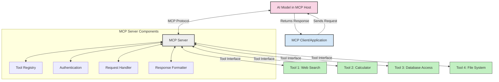
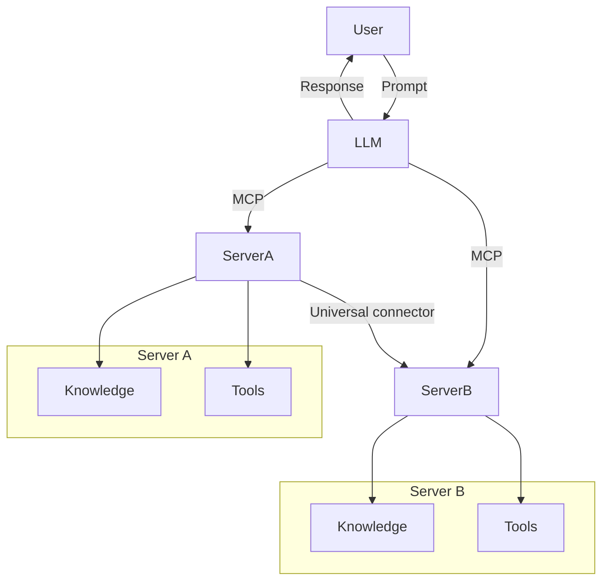

<!--
CO_OP_TRANSLATOR_METADATA:
{
  "original_hash": "cf84f987e1b771d2201408e110dfd2db",
  "translation_date": "2025-05-20T16:34:20+00:00",
  "source_file": "00-Introduction/README.md",
  "language_code": "mr"
}
-->
# मॉडल संदर्भ प्रोटोकॉल (MCP) परिचय: स्केलेबल AI अनुप्रयोगांसाठी का महत्त्वाचे आहे

जनरेटिव्ह AI अनुप्रयोग हे मोठा पुढाकार आहे कारण ते वापरकर्त्याला नैसर्गिक भाषेच्या प्रॉम्प्ट्सचा वापर करून अॅपशी संवाद साधण्याची परवानगी देतात. मात्र, जसे जास्त वेळ आणि संसाधने अशा अॅपमध्ये गुंतवली जातात, तसे तुम्हाला खात्री करायची असते की तुम्ही कार्यक्षमता आणि संसाधने सहजपणे एकत्र करू शकता, ज्यामुळे त्याचा विस्तार सोपा होईल, तुमचा अॅप एकाहून अधिक मॉडेल वापरू शकेल आणि त्याच्या गुंतागुंती सांभाळता येतील. साधारणपणे, जन AI अॅप्स तयार करणे सुरुवातीला सोपे असते पण ते वाढत आणि अधिक जटिल होत गेल्यावर तुम्हाला आर्किटेक्चर ठरवायला लागते आणि बहुधा एखाद्या मानकावर अवलंबून राहावे लागते जेणेकरून तुमचे अॅप्स सुसंगत पद्धतीने तयार होतील. यासाठी MCP येते, जे गोष्टी आयोजित करते आणि एक मानक पुरवते.

---

## **🔍 मॉडल संदर्भ प्रोटोकॉल (MCP) म्हणजे काय?**

**मॉडेल संदर्भ प्रोटोकॉल (MCP)** हा एक **उघडा, मानकीकृत इंटरफेस** आहे जो मोठ्या भाषा मॉडेल्स (LLMs) ला बाह्य टूल्स, API आणि डेटास्रोतांशी सुरळीत संवाद साधण्याची परवानगी देतो. हे AI मॉडेलच्या कार्यक्षमतेत त्याच्या प्रशिक्षण डेटाच्या पलीकडे वाढ करण्यासाठी एक सुसंगत आर्किटेक्चर पुरवते, ज्यामुळे स्मार्ट, स्केलेबल आणि अधिक प्रतिसादक्षम AI सिस्टम्स तयार होतात.

---

## **🎯 AI मध्ये मानकीकरण का महत्त्वाचे आहे**

जनरेटिव्ह AI अनुप्रयोग अधिक जटिल होत असताना, **स्केलेबिलिटी, विस्तारक्षमतेची** आणि **देखभालयोग्यता** सुनिश्चित करणारे मानक स्वीकारणे आवश्यक आहे. MCP हे गरजा पूर्ण करते:

- मॉडेल-टूल एकत्रीकरण एकसंध करते
- तुटक, वेगळ्या सानुकूल उपाययोजनांना कमी करते
- एकाच पर्यावरणात अनेक मॉडेल्स coexist होऊ देतो

---

## **📚 शिकण्याचे उद्दिष्ट**

या लेखाच्या शेवटी, तुम्ही खालील गोष्टी करू शकाल:

- **मॉडेल संदर्भ प्रोटोकॉल (MCP)** आणि त्याचे वापर समजून घेणे
- MCP कसे मॉडेल-टूल संवाद मानकीकृत करते हे समजून घेणे
- MCP आर्किटेक्चरच्या मुख्य घटकांची ओळख
- एंटरप्राइज आणि विकास संदर्भातील MCP चे प्रत्यक्ष उपयोग पाहणे

---

## **💡 मॉडल संदर्भ प्रोटोकॉल (MCP) का गेम-चेंजर आहे**

### **🔗 MCP AI संवादातील तुटलेपणा दूर करते**

MCP आधी, मॉडेल्सना टूल्सशी जोडण्यासाठी लागणारे:

- प्रत्येक टूल-मॉडेल जोडप्यासाठी सानुकूल कोड
- प्रत्येक विक्रेत्यासाठी वेगळे API
- अपडेट्समुळे वारंवार ब्रेक होणे
- अधिक टूल्ससह कमी स्केलेबिलिटी

### **✅ MCP मानकीकरणाचे फायदे**

| **फायदा**                | **स्पष्टीकरण**                                                               |
|--------------------------|-------------------------------------------------------------------------------|
| इंटरऑपरेबिलिटी          | LLMs वेगवेगळ्या विक्रेत्यांच्या टूल्ससह सुरळीत काम करतात                     |
| सुसंगतता                 | प्लॅटफॉर्म्स आणि टूल्समध्ये एकसारखे वर्तन                                   |
| पुनर्वापर क्षमता          | एकदा तयार केलेले टूल्स प्रोजेक्ट्स आणि सिस्टम्समध्ये वापरता येतात             |
| वेगवान विकास             | मानकीकृत, प्लग-एंड-प्ले इंटरफेसेस वापरून विकासाचा वेळ कमी होतो               |

---

## **🧱 MCP आर्किटेक्चरचा उच्च-स्तरीय आढावा**

MCP एक **क्लायंट-सर्व्हर मॉडेल** अनुसरतो, ज्यामध्ये:

- **MCP Hosts** AI मॉडेल चालवतात
- **MCP Clients** विनंत्या सुरू करतात
- **MCP Servers** संदर्भ, टूल्स आणि क्षमता पुरवतात

### **मुख्य घटक:**

- **Resources** – मॉडेलसाठी स्थिर किंवा डायनॅमिक डेटा  
- **Prompts** – मार्गदर्शित जनरेशनसाठी पूर्वनिर्धारित वर्कफ्लोज  
- **Tools** – शोध, गणना यांसारखे कार्यान्वित फंक्शन्स  
- **Sampling** – पुनरावृत्ती संवादाद्वारे एजंटसारखे वर्तन

---

## MCP Servers कसे कार्य करतात

MCP सर्व्हर खालील प्रकारे कार्य करतात:

- **विनंती प्रवाह**:  
    1. MCP Client AI मॉडेल चालवणाऱ्या MCP Host ला विनंती पाठवतो.  
    2. AI मॉडेल बाह्य टूल्स किंवा डेटाची गरज ओळखतो.  
    3. मॉडेल मानकीकृत प्रोटोकॉल वापरून MCP Server शी संवाद साधतो.

- **MCP Server कार्ये**:  
    - टूल रजिस्ट्री: उपलब्ध टूल्स आणि त्याच्या क्षमतांची यादी ठेवतो.  
    - प्रमाणीकरण: टूल प्रवेशासाठी परवानग्या तपासतो.  
    - विनंती हाताळणी: मॉडेलकडून येणाऱ्या टूल विनंत्या प्रक्रिया करतो.  
    - प्रतिसाद फॉरमॅटर: टूल आउटपुट्स मॉडेल समजू शकणाऱ्या स्वरूपात तयार करतो.

- **टूल कार्यान्वयन**:  
    - सर्व्हर योग्य बाह्य टूल्सकडे विनंत्या पाठवतो  
    - टूल्स त्यांच्या विशेष कार्ये पार पाडतात (शोध, गणना, डेटाबेस क्वेरी इ.)  
    - निकाल मॉडेलला सुसंगत स्वरूपात परत दिले जातात.

- **प्रतिसाद पूर्णता**:  
    - AI मॉडेल टूल आउटपुट्स त्याच्या प्रतिसादात समाविष्ट करतो.  
    - अंतिम प्रतिसाद क्लायंट अॅप्लिकेशनला परत पाठवला जातो.

## 👨‍💻 MCP Server कसे तयार करावे (उदाहरणांसह)

MCP सर्व्हर्स LLM क्षमता वाढवण्यासाठी डेटा आणि कार्यक्षमता पुरवतात.

तयार आहात का? वेगवेगळ्या भाषांमध्ये साधा MCP सर्व्हर तयार करण्याची उदाहरणे:

- **Python उदाहरण**: https://github.com/modelcontextprotocol/python-sdk

- **TypeScript उदाहरण**: https://github.com/modelcontextprotocol/typescript-sdk

- **Java उदाहरण**: https://github.com/modelcontextprotocol/java-sdk

- **C#/.NET उदाहरण**: https://github.com/modelcontextprotocol/csharp-sdk

## 🌍 MCP चे प्रत्यक्ष वापर

MCP AI क्षमतांना वाढवून अनेक प्रकारच्या अनुप्रयोगांना सक्षम करतो:

| **अनुप्रयोग**               | **स्पष्टीकरण**                                                               |
|------------------------------|-------------------------------------------------------------------------------|
| एंटरप्राइज डेटा एकत्रीकरण  | LLMs ला डेटाबेस, CRM किंवा अंतर्गत टूल्सशी जोडणे                              |
| एजंट AI सिस्टम्स            | टूल प्रवेश आणि निर्णय प्रक्रियांसह स्वायत्त एजंट सक्षम करणे                   |
| मल्टी-मोडल अनुप्रयोग       | टेक्स्ट, प्रतिमा, ऑडिओ टूल्स एकत्रित करून एकाच AI अॅपमध्ये वापरणे             |
| रिअल-टाइम डेटा एकत्रीकरण  | AI संवादांमध्ये ताजे डेटा आणून अधिक अचूक आणि वर्तमान निकाल देणे               |

### 🧠 MCP = AI संवादांसाठी सार्वत्रिक मानक

मॉडेल संदर्भ प्रोटोकॉल (MCP) AI संवादांसाठी सार्वत्रिक मानक म्हणून कार्य करतो, जसे USB-C उपकरणांसाठी भौतिक कनेक्शन मानकीकृत करते. AI च्या जगात, MCP एक सुसंगत इंटरफेस पुरवतो, ज्यामुळे मॉडेल (क्लायंट्स) बाह्य टूल्स आणि डेटाप्रदाता (सर्व्हर्स) सोबत सहजपणे एकत्र येऊ शकतात. त्यामुळे प्रत्येक API किंवा डेटास्रोतासाठी वेगवेगळ्या, सानुकूल प्रोटोकॉलची गरज नाहीशी होते.

MCP अंतर्गत, MCP-समर्थित टूल (ज्याला MCP सर्व्हर म्हणतात) एकसंध मानक पाळतो. हे सर्व्हर त्यांच्या टूल्स किंवा क्रिया यादी करतात आणि AI एजंटच्या विनंतीवर त्या क्रिया पार पाडतात. MCP समर्थित AI एजंट प्लॅटफॉर्म्स सर्व्हर्सकडून उपलब्ध टूल्स शोधू शकतात आणि या मानक प्रोटोकॉलद्वारे त्यांचा वापर करू शकतात.

### 💡 ज्ञानापर्यंत प्रवेश सुलभ करतो

टूल्स पुरवण्याबरोबरच, MCP ज्ञानापर्यंत प्रवेश सुलभ करतो. हे अॅप्लिकेशन्सना मोठ्या भाषा मॉडेल्सना (LLMs) विविध डेटास्रोतांशी जोडून संदर्भ पुरवण्यास सक्षम करतो. उदाहरणार्थ, एखादा MCP सर्व्हर कंपनीच्या दस्तऐवज संचाचे प्रतिनिधित्व करू शकतो, ज्यामुळे एजंट आवश्यक माहिती मागवू शकतो. दुसरा सर्व्हर विशिष्ट क्रिया जसे ईमेल पाठवणे किंवा नोंदी अपडेट करणे हाताळू शकतो. एजंटच्या दृष्टीने, हे फक्त वापरायची टूल्स आहेत—काही टूल्स डेटा (ज्ञान संदर्भ) परत करतात, तर काही क्रिया पार पाडतात. MCP दोन्ही प्रभावीपणे व्यवस्थापित करतो.

एखादा एजंट MCP सर्व्हरशी जोडल्यावर, तो सर्व्हरच्या उपलब्ध क्षमतांची आणि प्रवेशयोग्य डेटाची माहिती मानक स्वरूपात आपोआप शिकतो. हे मानकीकरण डायनॅमिक टूल उपलब्धता शक्य करते. उदाहरणार्थ, नवीन MCP सर्व्हर एजंटच्या सिस्टममध्ये जोडल्यावर त्याचे फंक्शन्स त्वरित वापरता येतात, एजंटच्या सूचना वेगळ्या सानुकूलनाशिवाय.

ही सुलभ एकत्रीकरण mermaid आकृतीत दाखवलेल्या प्रवाहाशी सुसंगत आहे, जिथे सर्व्हर्स टूल्स आणि ज्ञान दोन्ही पुरवतात, ज्यामुळे प्रणालींमध्ये अखंड सहकार्य सुनिश्चित होते.

### 👉 उदाहरण: स्केलेबल एजंट सोल्यूशन

## 🔐 MCP चे व्यावहारिक फायदे

MCP वापरण्याचे व्यावहारिक फायदे:

- **ताजेपणा**: मॉडेल्सना त्यांच्या प्रशिक्षण डेटाच्या पलीकडे अद्ययावत माहिती मिळते  
- **क्षमता विस्तार**: मॉडेल्स अशा कार्यांसाठी खास टूल्स वापरू शकतात ज्यासाठी ते प्रशिक्षित नव्हते  
- **भ्रम कमी होणे**: बाह्य डेटास्रोत तथ्यात्मक आधार पुरवतात  
- **गोपनीयता**: संवेदनशील डेटा सुरक्षित वातावरणात राहू शकतो, प्रॉम्प्टमध्ये समाविष्ट न करता

## 📌 मुख्य मुद्दे

MCP वापरण्याचे मुख्य मुद्दे:

- **MCP** AI मॉडेल्स आणि टूल्स व डेटाशी संवाद कसा करावा हे मानकीकृत करते  
- विस्तारक्षमता, सुसंगतता आणि इंटरऑपरेबिलिटीला प्रोत्साहन देते  
- MCP विकास वेळ कमी करतो, विश्वासार्हता वाढवतो आणि मॉडेल क्षमता वाढवतो  
- क्लायंट-सर्व्हर आर्किटेक्चर लवचिक, विस्तारक्षम AI अनुप्रयोग सक्षम करतो

## 🧠 सराव

तुम्हाला स्वारस्य असलेला एखादा AI अनुप्रयोग विचार करा.

- कोणते **बाह्य टूल्स किंवा डेटा** त्याच्या क्षमतांना वाढवू शकतात?  
- MCP एकत्रीकरण कसे **सोपे आणि अधिक विश्वासार्ह** करू शकतो?

## अतिरिक्त संसाधने

- [MCP GitHub Repository](https://github.com/modelcontextprotocol)

## पुढे काय

पुढे: [Chapter 1: Core Concepts](/01-CoreConcepts/README.md)

**अस्वीकरण**:  
हा दस्तऐवज AI अनुवाद सेवा [Co-op Translator](https://github.com/Azure/co-op-translator) वापरून अनुवादित केला आहे. आम्ही अचूकतेसाठी प्रयत्न करतो, तरी कृपया लक्षात घ्या की स्वयंचलित अनुवादांमध्ये चुका किंवा अचूकतेच्या त्रुटी असू शकतात. मूळ दस्तऐवज त्याच्या स्थानिक भाषेत अधिकृत स्रोत मानला जावा. महत्त्वाच्या माहितीसाठी व्यावसायिक मानवी अनुवाद शिफारसीय आहे. या अनुवादाचा वापर करून झालेल्या गैरसमजुती किंवा चुकीच्या अर्थनिर्णयाबद्दल आम्ही जबाबदार नाही.