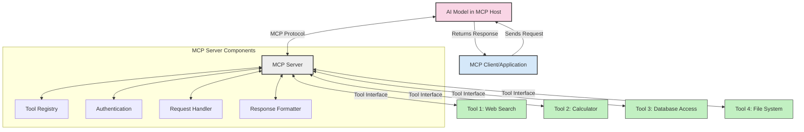
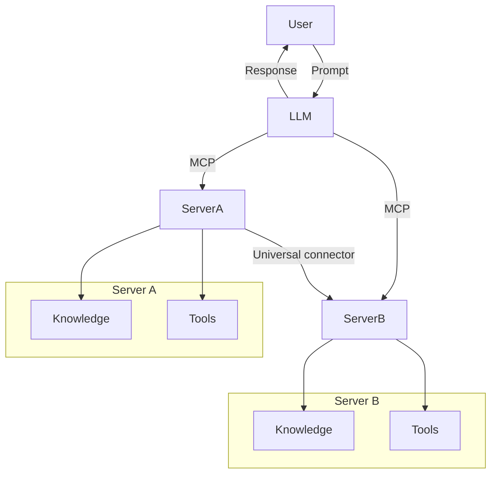

<!--
CO_OP_TRANSLATOR_METADATA:
{
  "original_hash": "02301140adbd807ecf0f17720fa307bc",
  "translation_date": "2025-05-17T05:56:55+00:00",
  "source_file": "00-Introduction/README.md",
  "language_code": "mr"
}
-->
# मॉडेल कॉन्टेक्स्ट प्रोटोकॉल (MCP) ची ओळख: स्केलेबल AI अनुप्रयोगांसाठी का महत्त्वपूर्ण आहे

जनरेटिव्ह AI अनुप्रयोग एक मोठे पाऊल पुढे आहेत कारण ते वापरकर्त्याला नैसर्गिक भाषेच्या प्रॉम्प्ट्सद्वारे अॅपशी संवाद साधू देतात. तथापि, जसे की अधिक वेळ आणि संसाधने अशा अॅप्समध्ये गुंतवली जातात, तुम्हाला खात्री करायची आहे की तुम्ही कार्यक्षमता आणि संसाधनांना अशा प्रकारे समाकलित करू शकता की ती वाढवणे सोपे आहे, तुमचे अॅप एकापेक्षा जास्त मॉडेल वापरण्याची क्षमता ठेवू शकते आणि त्याच्या गुंतागुंतीचे व्यवस्थापन करू शकते. थोडक्यात, जन AI अॅप्स तयार करणे सोपे आहे, परंतु जसजसे ते वाढते आणि अधिक जटिल होते, तसतसे तुम्हाला आर्किटेक्चरची व्याख्या करण्यास सुरुवात करावी लागेल आणि बहुधा तुमची अॅप्स सुसंगत पद्धतीने तयार केली जातील याची खात्री करण्यासाठी मानकावर अवलंबून राहावे लागेल. MCP येथे गोष्टींचे आयोजन करण्यासाठी, एक मानक प्रदान करण्यासाठी येतो.

---

## **🔍 मॉडेल कॉन्टेक्स्ट प्रोटोकॉल (MCP) म्हणजे काय?**

**मॉडेल कॉन्टेक्स्ट प्रोटोकॉल (MCP)** हा एक **उघड, मानकीकृत इंटरफेस** आहे जो मोठ्या भाषिक मॉडेल्सना (LLMs) बाह्य साधने, API आणि डेटा स्रोतांसह सहज संवाद साधण्यास अनुमती देतो. हे त्यांच्या प्रशिक्षण डेटाच्या पलीकडे AI मॉडेल कार्यक्षमता वाढवण्यासाठी सुसंगत आर्किटेक्चर प्रदान करते, अधिक स्मार्ट, स्केलेबल आणि प्रतिसादक्षम AI प्रणाली सक्षम करते.

---

## **🎯 AI मध्ये मानकीकरण का महत्त्वाचे आहे**

जनरेटिव्ह AI अनुप्रयोग अधिक जटिल होत असताना, **स्केलेबिलिटी, विस्तारता** आणि **देखभालक्षमता** सुनिश्चित करणारे मानके स्वीकारणे आवश्यक आहे. MCP या गरजा पूर्ण करते:

- मॉडेल-टूल एकत्रीकरण एकत्र करणे
- नाजूक, एक-वेळ सानुकूल उपाय कमी करणे
- एकाच पर्यावरणात अनेक मॉडेल्सला सहअस्तित्वाची परवानगी देणे

---

## **📚 शिकण्याची उद्दिष्टे**

या लेखाच्या शेवटी, तुम्ही हे करू शकाल:

- **मॉडेल कॉन्टेक्स्ट प्रोटोकॉल (MCP)** आणि त्याचे उपयोग प्रकरणे परिभाषित करा
- MCP कसे मॉडेल-टू-टूल संवाद मानकीकृत करते ते समजून घ्या
- MCP आर्किटेक्चरचे मुख्य घटक ओळखा
- एंटरप्राइझ आणि विकास संदर्भातील MCP चे वास्तविक-जगातील अनुप्रयोग एक्सप्लोर करा

---

## **💡 मॉडेल कॉन्टेक्स्ट प्रोटोकॉल (MCP) एक गेम-चेंजर का आहे**

### **🔗 MCP AI संवादांमध्ये विखंडन सोडवते**

MCP पूर्वी, साधनांसह मॉडेल्सचे एकत्रीकरण आवश्यक होते:

- प्रत्येक साधन-मॉडेल जोडण्यासाठी सानुकूल कोड
- प्रत्येक विक्रेत्यासाठी गैर-मानक API
- अद्यतनांमुळे वारंवार खंडित होणे
- अधिक साधनांसह खराब स्केलेबिलिटी

### **✅ MCP मानकीकरणाचे फायदे**

| **फायदा**                | **वर्णन**                                                                       |
|--------------------------|--------------------------------------------------------------------------------|
| इंटरऑपरेबिलिटी           | LLMs विविध विक्रेत्यांमधील साधनांसह अखंडपणे कार्य करतात                      |
| सुसंगतता                 | प्लॅटफॉर्म आणि साधनांमध्ये एकसमान वर्तन                                        |
| पुनर्वापरिता             | एकदा तयार केलेली साधने प्रकल्प आणि प्रणालींमध्ये वापरली जाऊ शकतात                |
| विकासाचा वेग             | मानकीकृत, प्लग-आणि-प्ले इंटरफेसचा वापर करून विकास वेळ कमी करा                 |

---

## **🧱 उच्च-स्तरीय MCP आर्किटेक्चर विहंगावलोकन**

MCP एक **क्लायंट-सर्व्हर मॉडेल** अनुसरण करते, जिथे:

- **MCP होस्ट्स** AI मॉडेल्स चालवतात
- **MCP क्लायंट्स** विनंत्या सुरू करतात
- **MCP सर्व्हर्स** संदर्भ, साधने आणि क्षमता प्रदान करतात

### **मुख्य घटक:**

- **संसाधने** – मॉडेल्ससाठी स्थिर किंवा गतिशील डेटा  
- **प्रॉम्प्ट्स** – मार्गदर्शित निर्मितीसाठी पूर्वनिर्धारित कार्यप्रवाह  
- **साधने** – शोध, गणना यांसारखी कार्यक्षम फंक्शन्स  
- **नमुना** – पुनरावृत्ती संवादांद्वारे एजेंटिक वर्तन

---

## MCP सर्व्हर्स कसे कार्य करतात

MCP सर्व्हर्स खालील प्रकारे कार्य करतात:

- **विनंती प्रवाह**: 
    1. MCP क्लायंट MCP होस्टमध्ये चालणाऱ्या AI मॉडेलला विनंती पाठवते.
    2. AI मॉडेलला बाह्य साधने किंवा डेटाची आवश्यकता असते तेव्हा ते ओळखते.
    3. मॉडेल MCP सर्व्हरसह मानकीकृत प्रोटोकॉल वापरून संवाद साधते.

- **MCP सर्व्हर कार्यक्षमता**:
    - साधन नोंदणी: उपलब्ध साधने आणि त्यांच्या क्षमतांचा कॅटलॉग राखतो.
    - प्रमाणीकरण: साधन प्रवेशासाठी परवानग्या सत्यापित करते.
    - विनंती हँडलर: मॉडेलमधून येणाऱ्या साधन विनंत्या प्रक्रिया करते.
    - प्रतिसाद फॉर्मॅटर: मॉडेल समजू शकतील अशा स्वरूपात साधन आउटपुट संरचित करते.

- **साधन कार्यान्वयन**: 
    - सर्व्हर योग्य बाह्य साधनांकडे विनंत्या मार्गित करते
    - साधने त्यांच्या विशेष फंक्शन्स (शोध, गणना, डेटाबेस क्वेरी, इ.) कार्यान्वित करतात
    - परिणाम मॉडेलला एकसमान स्वरूपात परत केले जातात.

- **प्रतिसाद पूर्णता**: 
    - AI मॉडेल त्याच्या प्रतिसादात साधन आउटपुट समाविष्ट करते.
    - अंतिम प्रतिसाद क्लायंट अनुप्रयोगाकडे परत पाठवला जातो.

## 👨‍💻 MCP सर्व्हर कसे तयार करावे (उदाहरणांसह)

MCP सर्व्हर्स डेटा आणि कार्यक्षमता प्रदान करून LLM क्षमतांचा विस्तार करण्यास अनुमती देतात.

ते वापरून पाहण्यासाठी तयार आहात? वेगवेगळ्या भाषांमध्ये साधा MCP सर्व्हर तयार करण्याची काही उदाहरणे येथे आहेत:

- **Python Example**: https://github.com/modelcontextprotocol/python-sdk

- **TypeScript Example**: https://github.com/modelcontextprotocol/typescript-sdk

- **Java Example**: https://github.com/modelcontextprotocol/java-sdk

- **C#/.NET Example**: https://github.com/modelcontextprotocol/csharp-sdk

## 🌍 वास्तविक-जगातील MCP साठी वापर केस

MCP AI क्षमतांचा विस्तार करून विविध अनुप्रयोग सक्षम करते:

| **अनुप्रयोग**                 | **वर्णन**                                                                       |
|-------------------------------|--------------------------------------------------------------------------------|
| एंटरप्राइझ डेटा एकत्रीकरण    | LLMsना डेटाबेस, CRM किंवा अंतर्गत साधनांशी कनेक्ट करा                          |
| एजेंटिक AI प्रणाली           | साधन प्रवेश आणि निर्णय घेण्याच्या कार्यप्रवाहासह स्वायत्त एजंट सक्षम करा         |
| मल्टी-मोडल अनुप्रयोग         | एकच एकत्रित AI अॅपमध्ये मजकूर, प्रतिमा आणि ऑडिओ साधने एकत्र करा                |
| रिअल-टाइम डेटा एकत्रीकरण     | अधिक अचूक, वर्तमान आउटपुटसाठी AI संवादांमध्ये लाइव्ह डेटा आणा                  |

### 🧠 MCP = AI संवादांसाठी सार्वत्रिक मानक

मॉडेल कॉन्टेक्स्ट प्रोटोकॉल (MCP) AI संवादांसाठी सार्वत्रिक मानक म्हणून कार्य करते, जसे की USB-C डिव्हाइससाठी भौतिक कनेक्शन मानकीकृत करते. AI च्या जगात, MCP एक सुसंगत इंटरफेस प्रदान करते, ज्यामुळे मॉडेल्स (क्लायंट्स) बाह्य साधने आणि डेटा प्रदात्यांसह सहजपणे समाकलित होऊ शकतात. हे प्रत्येक API किंवा डेटा स्रोतासाठी विविध, सानुकूल प्रोटोकॉलची आवश्यकता दूर करते.

MCP अंतर्गत, MCP-सुसंगत साधन (MCP सर्व्हर म्हणून संदर्भित) एक एकत्रित मानक अनुसरण करते. हे सर्व्हर त्यांच्या ऑफर केलेल्या साधनांची किंवा क्रियांची यादी करू शकतात आणि AI एजंटद्वारे विनंती केल्यावर त्या क्रिया कार्यान्वित करू शकतात. MCP ला समर्थन देणाऱ्या AI एजंट प्लॅटफॉर्म्सना सर्व्हर्सकडून उपलब्ध साधने शोधण्याची आणि त्या मानक प्रोटोकॉलद्वारे त्यांना आमंत्रित करण्याची क्षमता असते.

### 💡 ज्ञानापर्यंत प्रवेश सुलभ करतो

साधने ऑफर करण्याच्या पलीकडे, MCP ज्ञानापर्यंत प्रवेश सुलभ करते. हे अनुप्रयोगांना विविध डेटा स्रोतांशी लिंक करून मोठ्या भाषिक मॉडेल्सना (LLMs) संदर्भ प्रदान करण्यास सक्षम करते. उदाहरणार्थ, MCP सर्व्हर कंपनीच्या दस्तऐवजांच्या संग्रहाचे प्रतिनिधित्व करू शकते, एजंट्सला मागणीनुसार संबंधित माहिती पुनर्प्राप्त करण्याची परवानगी देते. दुसरा सर्व्हर ईमेल पाठवणे किंवा रेकॉर्ड अपडेट करणे यासारख्या विशिष्ट क्रिया हाताळू शकतो. एजंटच्या दृष्टीकोनातून, ही फक्त साधने आहेत जी ते वापरू शकतात—काही साधने डेटा (ज्ञान संदर्भ) परत करतात, तर इतर क्रिया करतात. MCP दोन्हीचे कार्यक्षम व्यवस्थापन करते.

MCP सर्व्हरशी कनेक्ट होणारा एजंट स्वयंचलितपणे सर्व्हरच्या उपलब्ध क्षमतांचा आणि प्रवेशयोग्य डेटाचा मानक स्वरूपात शिकतो. हे मानकीकरण गतिशील साधन उपलब्धता सक्षम करते. उदाहरणार्थ, एजंटच्या प्रणालीमध्ये नवीन MCP सर्व्हर जोडणे त्याच्या कार्यांना त्वरित वापरण्यायोग्य बनवते, एजंटच्या सूचनांचे पुढील सानुकूलन आवश्यक नसते.

हे सुव्यवस्थित एकत्रीकरण मर्मेड आकृतीमध्ये दर्शविलेल्या प्रवाहाशी जुळते, जिथे सर्व्हर्स दोन्ही साधने आणि ज्ञान प्रदान करतात, प्रणालींमध्ये अखंड सहकार्य सुनिश्चित करतात.

### 👉 उदाहरण: स्केलेबल एजंट सोल्यूशन

## 🔐 MCP चे व्यावहारिक फायदे

MCP वापरण्याचे काही व्यावहारिक फायदे येथे आहेत:

- **ताजेपणा**: मॉडेल्स त्यांच्या प्रशिक्षण डेटाच्या पलीकडील अद्ययावत माहिती ऍक्सेस करू शकतात
- **क्षमता विस्तार**: मॉडेल्स अशा कार्यांसाठी विशेष साधनांचा लाभ घेऊ शकतात ज्यासाठी त्यांना प्रशिक्षित केले गेले नाही
- **गैर-वास्तविकता कमी करणे**: बाह्य डेटा स्रोत तथ्यात्मक आधार प्रदान करतात
- **गोपनीयता**: संवेदनशील डेटा प्रॉम्प्टमध्ये एम्बेड करण्याऐवजी सुरक्षित वातावरणात राहू शकतो

## 📌 मुख्य मुद्दे

MCP वापरण्यासाठी खालील मुख्य मुद्दे आहेत:

- **MCP** AI मॉडेल्स साधने आणि डेटासह कसे संवाद साधतात याचे मानकीकरण करते
- **विस्तारता, सुसंगतता आणि इंटरऑपरेबिलिटी**ला प्रोत्साहन देते
- MCP **विकासाचा वेळ कमी करण्यात, विश्वसनीयता सुधारण्यात आणि मॉडेल क्षमतांचा विस्तार करण्यात मदत करते**
- क्लायंट-सर्व्हर आर्किटेक्चर **लवचिक, विस्तारनीय AI अनुप्रयोग सक्षम करते**

## 🧠 व्यायाम

तुम्हाला तयार करण्यात स्वारस्य असलेल्या AI अनुप्रयोगाबद्दल विचार करा.

- कोणती **बाह्य साधने किंवा डेटा** त्याच्या क्षमतांचा विस्तार करू शकतात?
- MCP एकत्रीकरण **साधे आणि अधिक विश्वासार्ह** कसे बनवू शकते?

## अतिरिक्त संसाधने

- [MCP GitHub Repository](https://github.com/modelcontextprotocol)

## पुढे काय

पुढे: [अध्याय 1: कोर संकल्पना](/01-CoreConcepts/README.md)

**अस्वीकरण**:  
हा दस्तऐवज AI भाषांतर सेवा [Co-op Translator](https://github.com/Azure/co-op-translator) चा वापर करून भाषांतरित करण्यात आला आहे. आम्ही अचूकतेसाठी प्रयत्नशील असलो तरी कृपया लक्षात ठेवा की स्वयंचलित भाषांतरे त्रुटी किंवा अचूकतेचा अभाव असू शकतात. मूळ भाषेतील मूळ दस्तऐवज अधिकृत स्रोत म्हणून विचारात घेतला पाहिजे. महत्त्वाच्या माहितीसाठी, व्यावसायिक मानवी भाषांतराची शिफारस केली जाते. या भाषांतराचा वापर करून उद्भवणाऱ्या कोणत्याही गैरसमज किंवा चुकीच्या अर्थासाठी आम्ही जबाबदार नाही.