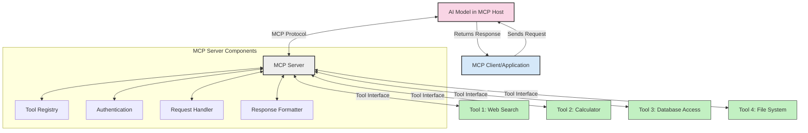
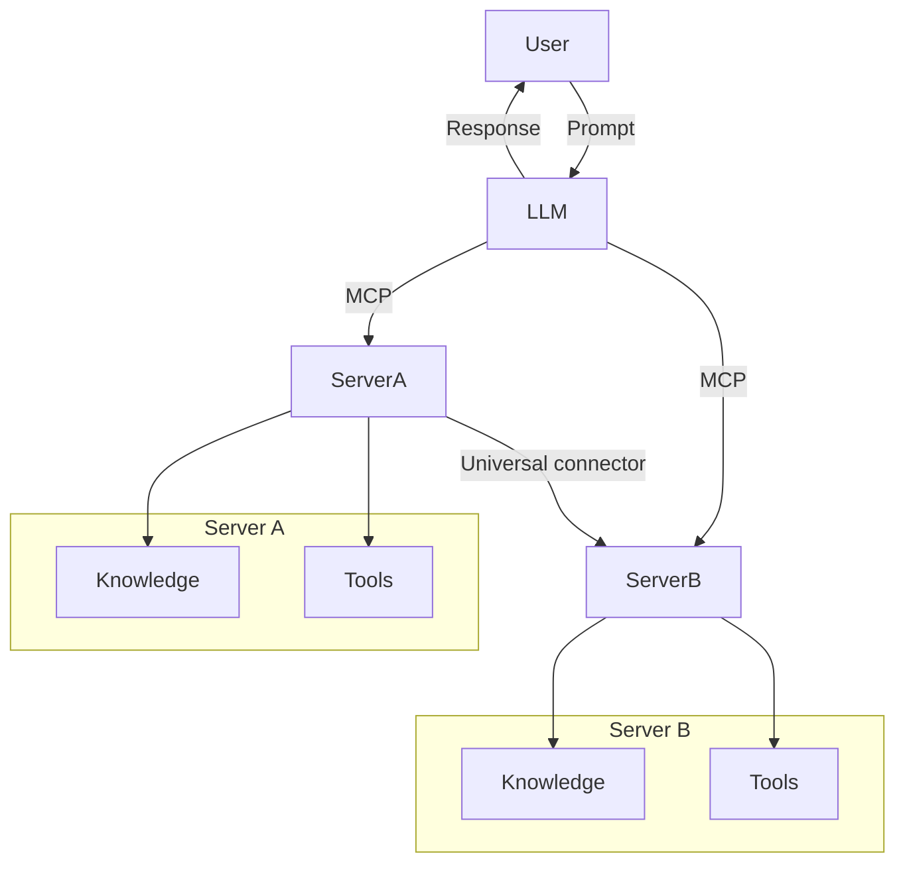
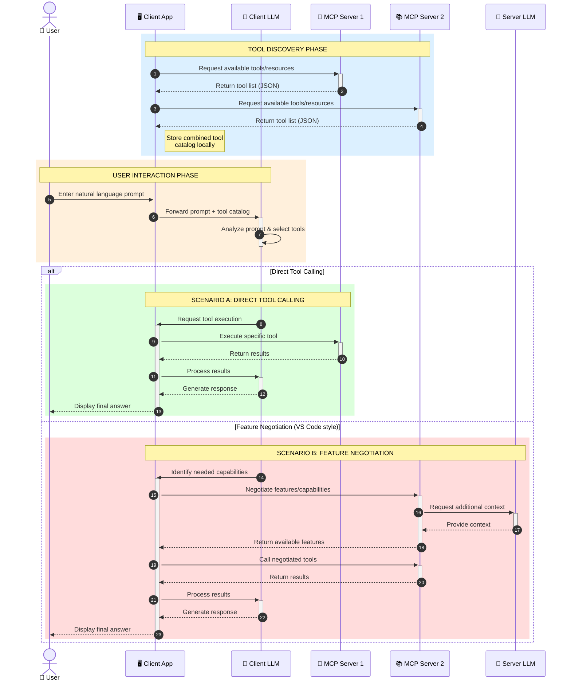

<!--
CO_OP_TRANSLATOR_METADATA:
{
  "original_hash": "25a94c681cf43612ff394d8cf78a74de",
  "translation_date": "2025-05-27T16:00:22+00:00",
  "source_file": "00-Introduction/README.md",
  "language_code": "mr"
}
-->
# मॉडेल कॉन्टेक्स्ट प्रोटोकॉल (MCP) परिचय: स्केलेबल AI अनुप्रयोगांसाठी का महत्त्वाचा आहे

जनरेटिव्ह AI अनुप्रयोग हा एक मोठा टप्पा आहे कारण ते वापरकर्त्याला नैसर्गिक भाषा प्रॉम्प्ट्स वापरून अ‍ॅपशी संवाद साधण्याची परवानगी देतात. मात्र, जसे जास्त वेळ आणि संसाधने अशा अ‍ॅप्समध्ये गुंतवली जातात, तसे तुम्हाला खात्री करायची असते की तुम्ही फंक्शनॅलिटी आणि संसाधने अशा प्रकारे एकत्र करू शकता की ते सहज वाढवता येतील, तुमचा अ‍ॅप एकाहून अधिक मॉडेल वापरू शकेल, आणि विविध मॉडेलच्या गुंतागुंती हाताळू शकेल. थोडक्यात, जन AI अ‍ॅप्स सुरू करणे सोपे आहे, पण ते वाढत गेल्यावर आणि अधिक गुंतागुंतीचे होत गेल्यावर, तुम्हाला आर्किटेक्चर निश्चित करावे लागेल आणि बहुधा एखाद्या स्टँडर्डवर अवलंबून राहावे लागेल जेणेकरून तुमचे अ‍ॅप्स सुसंगत पद्धतीने तयार होतील. यासाठी MCP महत्त्वाचा आहे, कारण तो गोष्टी आयोजित करतो आणि एक स्टँडर्ड पुरवतो.

---

## **🔍 मॉडेल कॉन्टेक्स्ट प्रोटोकॉल (MCP) म्हणजे काय?**

**मॉडेल कॉन्टेक्स्ट प्रोटोकॉल (MCP)** हा एक **उघडा, प्रमाणित इंटरफेस** आहे जो मोठ्या भाषा मॉडेल्स (LLMs) ला बाह्य टूल्स, API, आणि डेटा स्रोतांसोबत सहज संवाद साधण्याची परवानगी देतो. तो एक सुसंगत आर्किटेक्चर पुरवतो ज्यामुळे AI मॉडेलची कार्यक्षमता त्यांच्या प्रशिक्षण डेटाच्या पलीकडे वाढवता येते, ज्यामुळे अधिक हुशार, स्केलेबल आणि प्रतिसादक्षम AI सिस्टम्स तयार होतात.

---

## **🎯 AI मध्ये स्टँडर्डायझेशन का महत्त्वाचे आहे**

जनरेटिव्ह AI अनुप्रयोग अधिक गुंतागुंतीचे होत असताना, अशा स्टँडर्ड्सचा अवलंब करणे आवश्यक आहे जे **स्केलेबिलिटी, विस्तारयोग्यता**, आणि **देखभालयोग्यता** सुनिश्चित करतात. MCP हे आवश्यकतांचे निराकरण करते:

- मॉडेल-टूल इंटिग्रेशन्सचे एकत्रीकरण
- तुटक, सानुकूल सोल्यूशन्स कमी करणे
- एकाच परिसंस्थेमध्ये अनेक मॉडेल्सना coexist करण्याची परवानगी देणे

---

## **📚 शिकण्याचे उद्दिष्ट**

या लेखाच्या शेवटी, तुम्हाला खालील गोष्टी समजतील:

- **मॉडेल कॉन्टेक्स्ट प्रोटोकॉल (MCP)** काय आहे आणि त्याचे वापराचे प्रकार
- MCP कसे मॉडेल-टूल संवाद प्रमाणित करते हे समजून घेणे
- MCP आर्किटेक्चरची मुख्य घटक ओळखणे
- उद्योग आणि विकास संदर्भात MCP चे वास्तविक वापर पाहणे

---

## **💡 मॉडेल कॉन्टेक्स्ट प्रोटोकॉल (MCP) कसा गेम-चेंजर आहे**

### **🔗 MCP AI संवादातील विखुरलेपणा सोडवतो**

MCP आधी, मॉडेल्सना टूल्सशी जोडण्यासाठी:

- प्रत्येक टूल-मॉडेल जोडीसाठी सानुकूल कोड लिहावा लागे
- प्रत्येक विक्रेत्याचे वेगळे API वापरावे लागे
- अपडेट्समुळे वारंवार ब्रेक्स येत असत
- जास्त टूल्ससह स्केलेबिलिटी कमी होत असे

### **✅ MCP प्रमाणिकरणाचे फायदे**

| **फायदा**               | **वर्णन**                                                                    |
|-------------------------|------------------------------------------------------------------------------|
| इंटरऑपरेबिलिटी         | LLMs विविध विक्रेत्यांच्या टूल्सशी सहज काम करतात                           |
| सुसंगतता               | प्लॅटफॉर्म आणि टूल्समध्ये एकसारखे वर्तन                                    |
| पुनर्वापरयोग्यता         | एकदा तयार केलेले टूल्स अनेक प्रोजेक्ट्स आणि सिस्टम्समध्ये वापरता येतात     |
| विकास गती वाढवणे        | प्रमाणित, प्लग-अँड-प्ले इंटरफेस वापरून विकास वेळ कमी करणे                   |

---

## **🧱 MCP आर्किटेक्चरचा उच्च-स्तरीय आढावा**

MCP हे **क्लायंट-सर्व्हर मॉडेल**वर आधारित आहे, जिथे:

- **MCP Hosts** AI मॉडेल्स चालवतात
- **MCP Clients** विनंत्या सुरू करतात
- **MCP Servers** कॉन्टेक्स्ट, टूल्स, आणि क्षमता पुरवतात

### **मुख्य घटक:**

- **Resources** – मॉडेल्ससाठी स्थिर किंवा डायनॅमिक डेटा  
- **Prompts** – मार्गदर्शित जनरेशनसाठी पूर्वनिर्धारित वर्कफ्लोज  
- **Tools** – शोध, गणना यांसारखे कार्यक्षम फंक्शन्स  
- **Sampling** – पुनरावृत्ती संवादाद्वारे एजंटसारखे वर्तन

---

## MCP सर्व्हर्स कसे कार्य करतात

MCP सर्व्हर्स खालील प्रकारे कार्य करतात:

- **विनंती प्रवाह**:  
    1. MCP Client AI मॉडेलसह चालणाऱ्या MCP Host कडे विनंती पाठवतो.  
    2. AI मॉडेल बाह्य टूल्स किंवा डेटाची गरज ओळखतो.  
    3. मॉडेल प्रमाणित प्रोटोकॉल वापरून MCP Server शी संवाद साधतो.

- **MCP Server ची कार्यक्षमता**:  
    - टूल रजिस्ट्री: उपलब्ध टूल्स आणि त्यांची क्षमता यांची यादी ठेवते.  
    - प्रमाणीकरण: टूल प्रवेशासाठी परवानग्या तपासते.  
    - विनंती हँडलर: मॉडेलकडून येणाऱ्या टूल विनंत्या प्रक्रिया करतो.  
    - प्रतिसाद फॉर्मॅटर: टूल आउटपुट्स मॉडेल समजेल अशा स्वरूपात बनवतो.

- **टूल कार्यान्वयन**:  
    - सर्व्हर विनंत्या योग्य बाह्य टूल्सकडे मार्गदर्शन करतो  
    - टूल्स त्यांचे विशिष्ट फंक्शन्स (शोध, गणना, डेटाबेस क्वेरी इ.) पार पाडतात  
    - निकाल मॉडेलला सुसंगत स्वरूपात परत पाठवले जातात.

- **प्रतिक्रिया पूर्णता**:  
    - AI मॉडेल टूल आउटपुट्स त्याच्या प्रतिसादात समाविष्ट करतो.  
    - अंतिम प्रतिसाद क्लायंट अ‍ॅप्लिकेशनकडे पाठवला जातो.

## 👨‍💻 MCP सर्व्हर कसा तयार करावा (उदाहरणांसह)

MCP सर्व्हर्स तुम्हाला LLM क्षमता वाढवण्यासाठी डेटा आणि फंक्शनॅलिटी पुरवतात.

प्रयत्न करायचा आहे का? येथे विविध भाषांमध्ये सोपा MCP सर्व्हर तयार करण्याची उदाहरणे आहेत:

- **Python उदाहरण**: https://github.com/modelcontextprotocol/python-sdk

- **TypeScript उदाहरण**: https://github.com/modelcontextprotocol/typescript-sdk

- **Java उदाहरण**: https://github.com/modelcontextprotocol/java-sdk

- **C#/.NET उदाहरण**: https://github.com/modelcontextprotocol/csharp-sdk

## 🌍 MCP चे वास्तविक वापर

MCP AI क्षमतांना विस्तृत करण्यासाठी विविध अनुप्रयोगांना सक्षम करतो:

| **अनुप्रयोग**             | **वर्णन**                                                                     |
|---------------------------|-------------------------------------------------------------------------------|
| एंटरप्राइज डेटा इंटिग्रेशन | LLMs ला डेटाबेस, CRM, किंवा अंतर्गत टूल्सशी जोडणे                             |
| एजंटिक AI सिस्टम्स        | टूल प्रवेश आणि निर्णय घेण्याच्या वर्कफ्लोजसह स्वायत्त एजंट सक्षम करणे          |
| मल्टी-मोडल अनुप्रयोग     | एकाच AI अ‍ॅपमध्ये टेक्स्ट, इमेज, आणि ऑडिओ टूल्स एकत्र करणे                   |
| रिअल-टाइम डेटा इंटिग्रेशन | AI संवादांमध्ये ताजे डेटा आणणे ज्यामुळे अधिक अचूक, सध्याचे परिणाम मिळतात         |

### 🧠 MCP = AI संवादांसाठी सार्वत्रिक स्टँडर्ड

मॉडेल कॉन्टेक्स्ट प्रोटोकॉल (MCP) AI संवादांसाठी सार्वत्रिक स्टँडर्ड म्हणून काम करतो, जसे USB-C ने उपकरणांसाठी भौतिक कनेक्शन्स प्रमाणित केले. AI च्या जगात, MCP एक सुसंगत इंटरफेस पुरवतो, ज्यामुळे मॉडेल्स (क्लायंट्स) सहजपणे बाह्य टूल्स आणि डेटा पुरवठादारांशी (सर्व्हर्स) एकत्र काम करू शकतात. यामुळे प्रत्येक API किंवा डेटा स्रोतासाठी वेगवेगळ्या, सानुकूल प्रोटोकॉलची गरज नाहीशी होते.

MCP अंतर्गत, एक MCP-सुसंगत टूल (ज्याला MCP सर्व्हर म्हणतात) एकसंध स्टँडर्डचा अवलंब करतो. हे सर्व्हर्स त्यांच्या टूल्स किंवा क्रिया सूचीबद्ध करू शकतात आणि AI एजंटच्या विनंतीनुसार त्या क्रिया पार पाडू शकतात. MCP समर्थित AI एजंट प्लॅटफॉर्म्स या सर्व्हर्सकडून उपलब्ध टूल्स शोधू शकतात आणि या प्रमाणित प्रोटोकॉलद्वारे त्यांना वापरू शकतात.

### 💡 ज्ञान प्रवेश सुलभ करतो

टूल्स पुरवण्याबरोबरच, MCP ज्ञान प्रवेशही सुलभ करतो. तो अ‍ॅप्लिकेशन्सना मोठ्या भाषा मॉडेल्सना (LLMs) विविध डेटा स्रोतांशी जोडून संदर्भ पुरवण्याची सुविधा देतो. उदाहरणार्थ, एखादा MCP सर्व्हर कंपनीच्या दस्तऐवज संचाचे प्रतिनिधित्व करू शकतो, ज्यामुळे एजंट्सना आवश्यक माहिती मागणीवर मिळू शकते. दुसरा सर्व्हर विशिष्ट क्रिया जसे ईमेल पाठवणे किंवा नोंदी अपडेट करणे हाताळू शकतो. एजंटच्या दृष्टीने, हे फक्त वापरायचे टूल्स आहेत — काही टूल्स डेटा (ज्ञान संदर्भ) परत देतात, तर काही क्रिया पार पाडतात. MCP दोन्ही प्रभावीपणे व्यवस्थापित करतो.

एजंट जेव्हा MCP सर्व्हरशी जोडतो, तेव्हा तो सर्व्हरच्या उपलब्ध क्षमतांची आणि प्रवेशयोग्य डेटाची माहिती प्रमाणित स्वरूपात आपोआप शिकतो. ही प्रमाणिकरण प्रणाली डायनॅमिक टूल उपलब्धता सक्षम करते. उदाहरणार्थ, एखादा नवीन MCP सर्व्हर एजंटच्या सिस्टममध्ये जोडल्यावर त्याच्या फंक्शन्स त्वरित वापरता येतात, एजंटच्या सूचनांमध्ये अतिरिक्त सानुकूलन न करता.

हा सुलभ समाकलन mermaid आकृतीमध्ये दाखवलेल्या प्रवाहाशी सुसंगत आहे, जिथे सर्व्हर्स टूल्स आणि ज्ञान दोन्ही पुरवतात, यामुळे सिस्टम्समध्ये अखंड सहकार्य सुनिश्चित होते.

### 👉 उदाहरण: स्केलेबल एजंट सोल्यूशन

### 🔄 क्लायंट-साइड LLM समाकलनासह प्रगत MCP परिस्थिती

मूलभूत MCP आर्किटेक्चरच्या पलीकडे, असे प्रगत परिदृश्य आहेत जिथे क्लायंट आणि सर्व्हर दोघांमध्ये LLMs असतात, ज्यामुळे अधिक सखोल संवाद शक्य होतो:

## 🔐 MCP चे व्यावहारिक फायदे

MCP वापरल्याचे व्यावहारिक फायदे:

- **ताजेपणा**: मॉडेल्सना त्यांच्या प्रशिक्षण डेटाच्या पलीकडे अद्ययावत माहिती मिळू शकते  
- **क्षमता विस्तार**: मॉडेल्सना त्यांच्या प्रशिक्षणाबाहेरील कामांसाठी विशेष टूल्स वापरता येतात  
- **हॅल्युसिनेशन्स कमी करणे**: बाह्य डेटा स्रोतांनी तथ्यात्मक आधार पुरवला जातो  
- **गोपनीयता**: संवेदनशील डेटा सुरक्षित वातावरणात राहू शकतो, प्रॉम्प्टमध्ये न ठेवता

## 📌 मुख्य मुद्दे

MCP वापरासाठी मुख्य मुद्दे:

- **MCP** AI मॉडेल्सना टूल्स आणि डेटाशी संवाद कसा साधायचा हे प्रमाणित करतो  
- **विस्तारयोग्यता, सुसंगतता, आणि इंटरऑपरेबिलिटी** प्रोत्साहित करतो  
- MCP विकास वेळ कमी करतो, विश्वासार्हता वाढवतो, आणि मॉडेल क्षमतांचा विस्तार करतो  
- क्लायंट-सर्व्हर आर्किटेक्चर लवचिक, विस्तारयोग्य AI अनुप्रयोगांना सक्षम करते

## 🧠 व्यायाम

तुम्हाला ज्याचा AI अनुप्रयोग तयार करायचा आहे त्याबद्दल विचार करा.

- कोणते **बाह्य टूल्स किंवा डेटा** त्याच्या क्षमतांना वाढवू शकतात?  
- MCP कसे समाकलन **सोपे आणि अधिक विश्वासार्ह** बनवू शकते?

## अतिरिक्त संसाधने

- [MCP GitHub Repository](https://github.com/modelcontextprotocol)

## पुढे काय

पुढे: [Chapter 1: Core Concepts](/01-CoreConcepts/README.md)

**अस्वीकरण**:  
हा दस्तऐवज AI अनुवाद सेवा [Co-op Translator](https://github.com/Azure/co-op-translator) वापरून अनुवादित केला आहे. आम्ही अचूकतेसाठी प्रयत्न करतो, परंतु कृपया लक्षात घ्या की स्वयंचलित अनुवादांमध्ये चुका किंवा अचूकतेत कमतरता असू शकते. मूळ दस्तऐवज त्याच्या मूळ भाषेत अधिकृत स्रोत मानला पाहिजे. महत्त्वाच्या माहितीसाठी व्यावसायिक मानवी अनुवाद शिफारस केला जातो. या अनुवादाच्या वापरामुळे उद्भवलेल्या कोणत्याही गैरसमज किंवा चुकीसाठी आम्ही जबाबदार नाही.