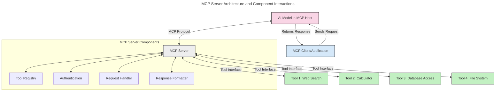
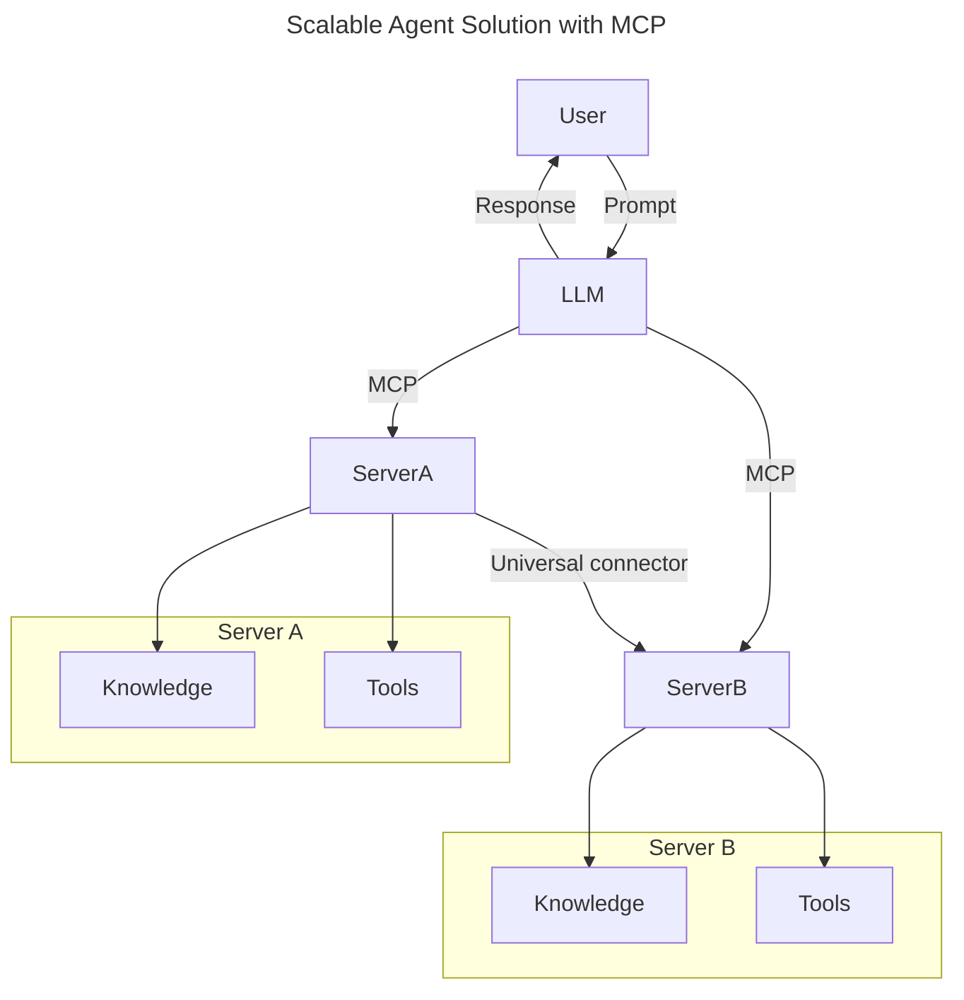
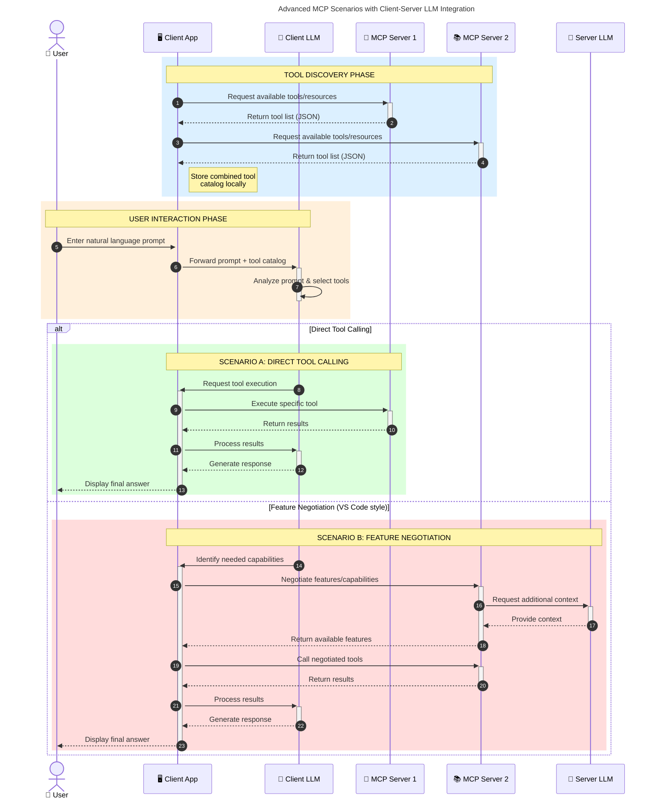

<!--
CO_OP_TRANSLATOR_METADATA:
{
  "original_hash": "105c2ddbb77bc38f7e9df009e1b06e45",
  "translation_date": "2025-07-13T15:29:58+00:00",
  "source_file": "00-Introduction/README.md",
  "language_code": "mr"
}
-->
# मॉडेल कॉन्टेक्स्ट प्रोटोकॉल (MCP) परिचय: स्केलेबल AI अनुप्रयोगांसाठी का महत्त्वाचे आहे

जनरेटिव्ह AI अनुप्रयोग हे मोठा टप्पा आहेत कारण ते वापरकर्त्याला नैसर्गिक भाषेतील प्रॉम्प्ट्स वापरून अॅपशी संवाद साधण्याची परवानगी देतात. मात्र, जेव्हा अशा अॅपमध्ये अधिक वेळ आणि संसाधने गुंतवली जातात, तेव्हा तुम्हाला खात्री करायची असते की तुम्ही फंक्शनॅलिटी आणि संसाधने अशा प्रकारे सहजपणे एकत्र करू शकता की ती सहज वाढवता येतील, तुमचा अॅप एकापेक्षा जास्त मॉडेल वापरू शकेल आणि विविध मॉडेलच्या गुंतागुंती हाताळू शकेल. थोडक्यात, जन AI अॅप तयार करणे सुरुवातीला सोपे असते, पण ते वाढत आणि अधिक क्लिष्ट होत गेल्यावर तुम्हाला आर्किटेक्चर निश्चित करायला लागते आणि बहुधा तुम्हाला एक मानक वापरावा लागतो जेणेकरून तुमचे अॅप्स सुसंगत पद्धतीने तयार होतील. यासाठी MCP येते, जे गोष्टी आयोजित करते आणि एक मानक पुरवते.

---

## **🔍 मॉडेल कॉन्टेक्स्ट प्रोटोकॉल (MCP) म्हणजे काय?**

**मॉडेल कॉन्टेक्स्ट प्रोटोकॉल (MCP)** हा एक **उघडा, मानकीकृत इंटरफेस** आहे जो मोठ्या भाषा मॉडेल्स (LLMs) ना बाह्य साधने, API आणि डेटा स्रोतांसोबत सुरळीत संवाद साधण्याची परवानगी देतो. हे AI मॉडेलच्या कार्यक्षमतेला त्यांच्या प्रशिक्षण डेटापलीकडे वाढवण्यासाठी एक सुसंगत आर्किटेक्चर पुरवते, ज्यामुळे अधिक हुशार, स्केलेबल आणि प्रतिसादक्षम AI प्रणाली तयार होतात.

---

## **🎯 AI मध्ये मानकीकरण का महत्त्वाचे आहे**

जनरेटिव्ह AI अनुप्रयोग जसे अधिक क्लिष्ट होतात, तसतसे **स्केलेबिलिटी, विस्तारयोग्यता** आणि **देखभालयोग्यता** सुनिश्चित करणारे मानक स्वीकारणे आवश्यक होते. MCP या गरजा पूर्ण करते:

- मॉडेल-टूल एकत्रीकरण एकसंध करते
- तुटक, एकदाच वापरल्या जाणाऱ्या सानुकूल उपायांना कमी करते
- एकाच परिसंस्थेत अनेक मॉडेल्सना सहअस्तित्वाची परवानगी देते

---

## **📚 शिकण्याचे उद्दिष्ट**

या लेखाच्या शेवटी तुम्ही करू शकाल:

- **मॉडेल कॉन्टेक्स्ट प्रोटोकॉल (MCP)** आणि त्याचे वापर समजून घेणे
- MCP कसे मॉडेल-टूल संवाद मानकीकृत करते हे समजून घेणे
- MCP आर्किटेक्चरचे मुख्य घटक ओळखणे
- एंटरप्राइझ आणि विकास संदर्भातील MCP चे प्रत्यक्ष उपयोग पाहणे

---

## **💡 मॉडेल कॉन्टेक्स्ट प्रोटोकॉल (MCP) का गेम-चेंजर आहे**

### **🔗 MCP AI संवादातील तुटलेपणा दूर करते**

MCP आधी, मॉडेल्सना साधनांसोबत जोडण्यासाठी:

- प्रत्येक टूल-मॉडेल जोडप्यासाठी सानुकूल कोड लिहावा लागायचा
- प्रत्येक विक्रेत्यासाठी गैर-मानकीकृत API वापरावे लागायचे
- अपडेट्समुळे वारंवार ब्रेक्स येत असत
- अधिक टूल्ससह स्केलेबिलिटी कमी होत असे

### **✅ MCP मानकीकरणाचे फायदे**

| **फायदा**               | **वर्णन**                                                                    |
|-------------------------|------------------------------------------------------------------------------|
| इंटरऑपरेबिलिटी         | LLMs विविध विक्रेत्यांच्या टूल्ससह सुरळीत काम करतात                        |
| सुसंगतता                | प्लॅटफॉर्म आणि टूल्समध्ये एकसंध वर्तन                                    |
| पुनर्वापरयोग्यता         | एकदा तयार केलेले टूल्स प्रकल्प आणि प्रणालींमध्ये पुन्हा वापरता येतात         |
| वेगवान विकास            | मानकीकृत, प्लग-एंड-प्ले इंटरफेस वापरून विकास वेळ कमी होतो                  |

---

## **🧱 MCP आर्किटेक्चरचा उच्चस्तरीय आढावा**

MCP एक **क्लायंट-सर्व्हर मॉडेल** वापरतो, जिथे:

- **MCP होस्ट्स** AI मॉडेल चालवतात
- **MCP क्लायंट्स** विनंत्या सुरू करतात
- **MCP सर्व्हर्स** संदर्भ, टूल्स आणि क्षमता पुरवतात

### **मुख्य घटक:**

- **Resources** – मॉडेलसाठी स्थिर किंवा गतिशील डेटा  
- **Prompts** – मार्गदर्शित जनरेशनसाठी पूर्वनिर्धारित वर्कफ्लोज  
- **Tools** – शोध, गणना यांसारखे कार्यान्वित फंक्शन्स  
- **Sampling** – पुनरावृत्ती संवादाद्वारे एजंटिक वर्तन

---

## MCP सर्व्हर्स कसे कार्य करतात

MCP सर्व्हर्स खालीलप्रमाणे काम करतात:

- **विनंती प्रवाह**:  
    1. MCP क्लायंट AI मॉडेल चालवणाऱ्या MCP होस्टला विनंती पाठवतो.  
    2. AI मॉडेलला बाह्य टूल्स किंवा डेटाची गरज भासते तेव्हा ते ओळखते.  
    3. मॉडेल मानकीकृत प्रोटोकॉल वापरून MCP सर्व्हरशी संवाद साधते.

- **MCP सर्व्हर कार्यक्षमता**:  
    - टूल रजिस्ट्री: उपलब्ध टूल्स आणि त्यांची क्षमता यांची यादी ठेवते.  
    - प्रमाणीकरण: टूल प्रवेशासाठी परवानग्या तपासते.  
    - विनंती हाताळणी: मॉडेलकडून येणाऱ्या टूल विनंत्या प्रक्रिया करते.  
    - प्रतिसाद स्वरूपन: टूल आउटपुट मॉडेल समजेल अशा स्वरूपात तयार करते.

- **टूल कार्यान्वयन**:  
    - सर्व्हर विनंत्या योग्य बाह्य टूल्सकडे मार्गदर्शित करतो  
    - टूल्स त्यांचे विशेष कार्य (शोध, गणना, डेटाबेस क्वेरी इ.) पार पाडतात  
    - निकाल मॉडेलला सुसंगत स्वरूपात परत पाठवले जातात

- **प्रतिसाद पूर्णता**:  
    - AI मॉडेल टूल आउटपुट आपल्या प्रतिसादात समाविष्ट करते  
    - अंतिम प्रतिसाद क्लायंट अॅप्लिकेशनला पाठवला जातो

## 👨‍💻 MCP सर्व्हर कसा तयार करावा (उदाहरणांसह)

MCP सर्व्हर्स LLM क्षमतांना डेटा आणि फंक्शनॅलिटी पुरवून वाढवतात.

तयार आहात का? वेगवेगळ्या भाषांमध्ये सोपा MCP सर्व्हर तयार करण्याची उदाहरणे येथे आहेत:

- **Python उदाहरण**: https://github.com/modelcontextprotocol/python-sdk

- **TypeScript उदाहरण**: https://github.com/modelcontextprotocol/typescript-sdk

- **Java उदाहरण**: https://github.com/modelcontextprotocol/java-sdk

- **C#/.NET उदाहरण**: https://github.com/modelcontextprotocol/csharp-sdk

## 🌍 MCP चे प्रत्यक्ष उपयोग

MCP AI क्षमतांना वाढवून विविध अनुप्रयोग शक्य करतो:

| **अनुप्रयोग**               | **वर्णन**                                                                    |
|-----------------------------|------------------------------------------------------------------------------|
| एंटरप्राइझ डेटा एकत्रीकरण  | LLMs ला डेटाबेस, CRM किंवा अंतर्गत टूल्सशी जोडणे                             |
| एजंटिक AI प्रणाली           | टूल प्रवेश आणि निर्णय प्रक्रियांसह स्वायत्त एजंट सक्षम करणे                 |
| मल्टी-मोडल अनुप्रयोग       | एकाच AI अॅपमध्ये मजकूर, प्रतिमा आणि ऑडिओ टूल्स एकत्र करणे                  |
| रिअल-टाइम डेटा एकत्रीकरण  | AI संवादात ताजे डेटा आणून अधिक अचूक आणि वर्तमान निकाल देणे                  |

### 🧠 MCP = AI संवादांसाठी सार्वत्रिक मानक

मॉडेल कॉन्टेक्स्ट प्रोटोकॉल (MCP) AI संवादांसाठी एक सार्वत्रिक मानक म्हणून कार्य करतो, जसे USB-C उपकरणांसाठी भौतिक कनेक्शन्ससाठी मानकीकृत आहे. AI च्या जगात, MCP एक सुसंगत इंटरफेस पुरवतो, ज्यामुळे मॉडेल्स (क्लायंट्स) बाह्य टूल्स आणि डेटा पुरवठादारांशी (सर्व्हर्स) सहजपणे एकत्र काम करू शकतात. यामुळे प्रत्येक API किंवा डेटा स्रोतासाठी वेगवेगळ्या, सानुकूल प्रोटोकॉलची गरज नाहीशी होते.

MCP अंतर्गत, MCP-सुसंगत टूल (MCP सर्व्हर म्हणतात) एकसंध मानक पाळतो. हे सर्व्हर्स त्यांच्या टूल्स किंवा क्रिया यादीत दाखवू शकतात आणि AI एजंटच्या विनंतीवर त्या क्रिया पार पाडू शकतात. MCP समर्थित AI एजंट प्लॅटफॉर्म्स सर्व्हर्सकडून उपलब्ध टूल्स शोधू शकतात आणि या मानक प्रोटोकॉलद्वारे त्यांना कॉल करू शकतात.

### 💡 ज्ञानापर्यंत प्रवेश सुलभ करतो

टूल्स पुरवण्याबरोबरच, MCP ज्ञानापर्यंत प्रवेशही सुलभ करतो. हे अॅप्लिकेशन्सना मोठ्या भाषा मॉडेल्सना (LLMs) विविध डेटा स्रोतांशी जोडून संदर्भ पुरवण्याची परवानगी देतो. उदाहरणार्थ, एखादा MCP सर्व्हर कंपनीच्या दस्तऐवज संचाचे प्रतिनिधित्व करू शकतो, ज्यामुळे एजंट्स आवश्यक माहिती मागवू शकतात. दुसरा सर्व्हर विशिष्ट क्रिया जसे ईमेल पाठवणे किंवा नोंदी अपडेट करणे हाताळू शकतो. एजंटच्या दृष्टीने, हे फक्त वापरता येणारी टूल्स आहेत—काही टूल्स डेटा (ज्ञान संदर्भ) परत करतात, तर काही क्रिया पार पाडतात. MCP दोन्ही प्रभावीपणे व्यवस्थापित करतो.

एजंट जेव्हा MCP सर्व्हरशी जोडतो, तेव्हा तो सर्व्हरच्या उपलब्ध क्षमतांची आणि प्रवेशयोग्य डेटाची माहिती मानक स्वरूपात स्वयंचलितपणे शिकतो. हे मानकीकरण डायनॅमिक टूल उपलब्धता सक्षम करते. उदाहरणार्थ, एजंटच्या प्रणालीत नवीन MCP सर्व्हर जोडल्यावर त्याच्या फंक्शन्स त्वरित वापरता येतात, एजंटच्या सूचनांमध्ये अधिक सानुकूलन न करता.

ही सुलभ एकत्रीकरण mermaid आकृतीत दाखवलेल्या प्रवाहाशी सुसंगत आहे, जिथे सर्व्हर्स टूल्स आणि ज्ञान दोन्ही पुरवतात, प्रणालींमध्ये सुरळीत सहकार्य सुनिश्चित करतात.

### 👉 उदाहरण: स्केलेबल एजंट सोल्यूशन

### 🔄 क्लायंट-साइड LLM एकत्रीकरणासह प्रगत MCP परिस्थिती

मूलभूत MCP आर्किटेक्चरच्या पलीकडे, असे प्रगत परिस्थिती आहेत जिथे क्लायंट आणि सर्व्हर दोघांमध्ये LLMs असतात, ज्यामुळे अधिक प्रगत संवाद शक्य होतात:

## 🔐 MCP चे व्यावहारिक फायदे

MCP वापरण्याचे व्यावहारिक फायदे:

- **ताजेपणा**: मॉडेल्सना त्यांच्या प्रशिक्षण डेटापलीकडे अद्ययावत माहिती मिळू शकते  
- **क्षमता विस्तार**: मॉडेल्सना त्यांच्या प्रशिक्षणाबाहेरील कार्यांसाठी विशेष टूल्स वापरता येतात  
- **हॅलुसिनेशन कमी होणे**: बाह्य डेटा स्रोत तथ्यात्मक आधार पुरवतात  
- **गोपनीयता**: संवेदनशील डेटा सुरक्षित वातावरणात राहू शकतो, प्रॉम्प्टमध्ये समाविष्ट न करता

## 📌 मुख्य मुद्दे

MCP वापरण्याचे मुख्य मुद्दे:

- **MCP** AI मॉडेल्स आणि टूल्स व डेटाशी संवाद मानकीकृत करते  
- **विस्तारयोग्यता, सुसंगतता आणि इंटरऑपरेबिलिटी** प्रोत्साहित करते  
- MCP विकास वेळ कमी करते, विश्वासार्हता वाढवते आणि मॉडेल क्षमतांचा विस्तार करते  
- क्लायंट-सर्व्हर आर्किटेक्चर लवचिक, विस्तारयोग्य AI अनुप्रयोग सक्षम करते

## 🧠 सराव

तुम्ही तयार करू इच्छित असलेल्या AI अनुप्रयोगाबद्दल विचार करा.

- कोणती **बाह्य टूल्स किंवा डेटा** त्याच्या क्षमतांना वाढवू शकतात?  
- MCP कसे एकत्रीकरण **सोपे आणि अधिक विश्वासार्ह** करू शकते?

## अतिरिक्त संसाधने

- [MCP GitHub Repository](https://github.com/modelcontextprotocol)

## पुढे काय

पुढे: [अध्याय 1: मुख्य संकल्पना](../01-CoreConcepts/README.md)

**अस्वीकरण**:  
हा दस्तऐवज AI अनुवाद सेवा [Co-op Translator](https://github.com/Azure/co-op-translator) वापरून अनुवादित केला आहे. आम्ही अचूकतेसाठी प्रयत्नशील असलो तरी, कृपया लक्षात घ्या की स्वयंचलित अनुवादांमध्ये चुका किंवा अचूकतेची कमतरता असू शकते. मूळ दस्तऐवज त्याच्या स्थानिक भाषेत अधिकृत स्रोत मानला जावा. महत्त्वाच्या माहितीसाठी व्यावसायिक मानवी अनुवाद करण्याची शिफारस केली जाते. या अनुवादाच्या वापरामुळे उद्भवणाऱ्या कोणत्याही गैरसमजुती किंवा चुकीच्या अर्थलागी आम्ही जबाबदार नाही.