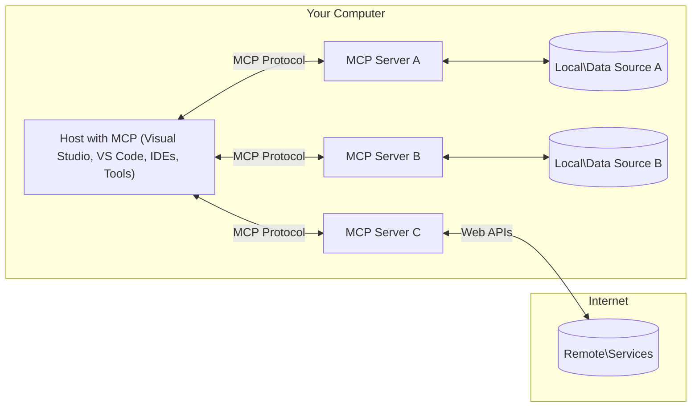

<!--
CO_OP_TRANSLATOR_METADATA:
{
  "original_hash": "0a6a7bcb289c024a91289e0444cb370b",
  "translation_date": "2025-08-18T15:25:19+00:00",
  "source_file": "01-CoreConcepts/README.md",
  "language_code": "mr"
}
-->
# MCP मुख्य संकल्पना: AI एकत्रीकरणासाठी मॉडेल कॉन्टेक्स्ट प्रोटोकॉलमध्ये प्रावीण्य मिळवा

[](https://youtu.be/earDzWGtE84)

_(वरील प्रतिमेवर क्लिक करून या धड्याचा व्हिडिओ पहा)_

[Model Context Protocol (MCP)](https://gi- **स्पष्ट वापरकर्ता संमती**: सर्व डेटा प्रवेश आणि ऑपरेशन्ससाठी स्पष्ट वापरकर्ता मंजुरी आवश्यक आहे. वापरकर्त्यांना कोणता डेटा प्रवेश केला जाईल आणि कोणती कृती केली जाईल याची स्पष्ट समज असावी, तसेच परवानग्या आणि अधिकृततेवर सखोल नियंत्रण असावे.

- **डेटा गोपनीयता संरक्षण**: वापरकर्त्याचा डेटा फक्त स्पष्ट संमतीने उघड केला जातो आणि संपूर्ण संवाद जीवनचक्रात मजबूत प्रवेश नियंत्रणाद्वारे संरक्षित केला पाहिजे. अनधिकृत डेटा प्रसारण टाळण्यासाठी आणि गोपनीयतेच्या कडक सीमा राखण्यासाठी अंमलबजावणी आवश्यक आहे.

- **साधन कार्यान्वयन सुरक्षा**: प्रत्येक साधनाची अंमलबजावणी स्पष्ट वापरकर्ता संमतीसह आवश्यक आहे, ज्यामध्ये साधनाची कार्यक्षमता, पॅरामीटर्स आणि संभाव्य परिणाम याची स्पष्ट समज असावी. अनपेक्षित, असुरक्षित किंवा दुर्भावनायुक्त साधन अंमलबजावणी टाळण्यासाठी मजबूत सुरक्षा सीमा आवश्यक आहेत.

- **ट्रान्सपोर्ट लेयर सुरक्षा**: सर्व संवाद चॅनेल योग्य एन्क्रिप्शन आणि प्रमाणीकरण यंत्रणा वापरावीत. रिमोट कनेक्शनसाठी सुरक्षित ट्रान्सपोर्ट प्रोटोकॉल आणि योग्य क्रेडेन्शियल व्यवस्थापन लागू करावे.

#### अंमलबजावणी मार्गदर्शक तत्त्वे:

- **परवानगी व्यवस्थापन**: वापरकर्त्यांना कोणते सर्व्हर, साधने आणि संसाधने प्रवेशयोग्य आहेत हे नियंत्रित करण्यासाठी सूक्ष्म-स्तरीय परवानगी प्रणाली अंमलात आणा  
- **प्रमाणीकरण आणि अधिकृतता**: योग्य टोकन व्यवस्थापन आणि कालबाह्यता असलेल्या सुरक्षित प्रमाणीकरण पद्धती (OAuth, API कीज) वापरा  
- **इनपुट व्हॅलिडेशन**: इंजेक्शन हल्ले टाळण्यासाठी परिभाषित स्कीमांनुसार सर्व पॅरामीटर्स आणि डेटा इनपुट्सची पडताळणी करा  
- **ऑडिट लॉगिंग**: सुरक्षा निरीक्षण आणि अनुपालनासाठी सर्व ऑपरेशन्सचे व्यापक लॉग्स राखा  

## आढावा

या धड्यात मॉडेल कॉन्टेक्स्ट प्रोटोकॉल (MCP) इकोसिस्टम बनवणाऱ्या मूलभूत आर्किटेक्चर आणि घटकांचा अभ्यास केला जाईल. MCP संवादांना चालना देणाऱ्या क्लायंट-सर्व्हर आर्किटेक्चर, प्रमुख घटक आणि संवाद यंत्रणा याबद्दल तुम्ही शिकाल.

## मुख्य शिक्षण उद्दिष्टे

या धड्याच्या शेवटी, तुम्ही:

- MCP क्लायंट-सर्व्हर आर्किटेक्चर समजून घ्याल.  
- होस्ट्स, क्लायंट्स आणि सर्व्हर्सच्या भूमिका आणि जबाबदाऱ्या ओळखाल.  
- MCP ला एक लवचिक एकत्रीकरण स्तर बनवणाऱ्या मुख्य वैशिष्ट्यांचे विश्लेषण कराल.  
- MCP इकोसिस्टममधील माहितीचा प्रवाह कसा होतो हे शिकाल.  
- .NET, Java, Python, आणि JavaScript मधील कोड उदाहरणांद्वारे व्यावहारिक अंतर्दृष्टी मिळवाल.  

## MCP आर्किटेक्चर: सखोल अभ्यास

MCP इकोसिस्टम क्लायंट-सर्व्हर मॉडेलवर आधारित आहे. या मॉड्युलर संरचनेमुळे AI अनुप्रयोगांना साधने, डेटाबेस, API आणि संदर्भ संसाधनांशी कार्यक्षमतेने संवाद साधता येतो. चला या आर्किटेक्चरचे मुख्य घटकांमध्ये विघटन करूया.

MCP च्या केंद्रस्थानी क्लायंट-सर्व्हर आर्किटेक्चर आहे जिथे होस्ट अनुप्रयोग अनेक सर्व्हर्सशी कनेक्ट होऊ शकतो:



- **MCP होस्ट्स**: VSCode, Claude Desktop, IDEs किंवा MCP द्वारे डेटा प्रवेश करू इच्छिणारे AI साधने यांसारखी प्रोग्राम्स  
- **MCP क्लायंट्स**: सर्व्हर्ससह 1:1 कनेक्शन राखणारे प्रोटोकॉल क्लायंट्स  
- **MCP सर्व्हर्स**: प्रत्येक MCP द्वारे मानकित मॉडेल कॉन्टेक्स्ट प्रोटोकॉलद्वारे विशिष्ट क्षमता उघड करणारे हलके प्रोग्राम्स  
- **स्थानिक डेटा स्रोत**: MCP सर्व्हर्स सुरक्षितपणे प्रवेश करू शकणाऱ्या तुमच्या संगणकाचे फायली, डेटाबेस आणि सेवा  
- **रिमोट सेवा**: इंटरनेटवर उपलब्ध बाह्य प्रणाली ज्या MCP सर्व्हर्स API द्वारे कनेक्ट करू शकतात  

MCP प्रोटोकॉल एक विकसित मानक आहे जे तारीख-आधारित आवृत्तीकरण (YYYY-MM-DD स्वरूप) वापरते. सध्याचा प्रोटोकॉल आवृत्ती **2025-06-18** आहे. [प्रोटोकॉल तपशील](https://modelcontextprotocol.io/specification/2025-06-18/) मधील नवीनतम अद्यतने तुम्ही पाहू शकता.

### 1. होस्ट्स

मॉडेल कॉन्टेक्स्ट प्रोटोकॉल (MCP) मध्ये, **होस्ट्स** हे AI अनुप्रयोग आहेत जे प्रोटोकॉलशी संवाद साधण्यासाठी प्राथमिक इंटरफेस म्हणून काम करतात. होस्ट्स अनेक MCP सर्व्हर्सशी कनेक्शन तयार करून समर्पित MCP क्लायंट्स तयार करतात आणि व्यवस्थापित करतात. होस्ट्सचे उदाहरणे:

- **AI अनुप्रयोग**: Claude Desktop, Visual Studio Code, Claude Code  
- **विकसन वातावरण**: MCP एकत्रीकरणासह IDEs आणि कोड एडिटर्स  
- **कस्टम अनुप्रयोग**: उद्देशपूर्ण AI एजंट्स आणि साधने  

**होस्ट्स** हे AI मॉडेल संवाद समन्वयित करणारे अनुप्रयोग आहेत. ते:

- **AI मॉडेल्सचे समन्वय**: प्रतिसाद निर्माण करण्यासाठी किंवा AI वर्कफ्लो समन्वयित करण्यासाठी LLMs अंमलात आणा किंवा संवाद साधा  
- **क्लायंट कनेक्शन व्यवस्थापित करा**: प्रत्येक MCP सर्व्हर कनेक्शनसाठी एक MCP क्लायंट तयार करा आणि राखा  
- **वापरकर्ता इंटरफेस नियंत्रित करा**: संभाषण प्रवाह, वापरकर्ता संवाद आणि प्रतिसाद सादरीकरण हाताळा  
- **सुरक्षा अंमलबजावणी करा**: परवानग्या, सुरक्षा मर्यादा आणि प्रमाणीकरण नियंत्रित करा  
- **वापरकर्ता संमती हाताळा**: डेटा शेअरिंग आणि साधन अंमलबजावणीसाठी वापरकर्ता मंजुरी व्यवस्थापित करा  

### 2. क्लायंट्स

**क्लायंट्स** हे महत्त्वाचे घटक आहेत जे होस्ट्स आणि MCP सर्व्हर्स दरम्यान समर्पित एक-ते-एक कनेक्शन राखतात. प्रत्येक MCP क्लायंट होस्टद्वारे विशिष्ट MCP सर्व्हरशी कनेक्ट होण्यासाठी तयार केला जातो, ज्यामुळे आयोजित आणि सुरक्षित संवाद चॅनेल सुनिश्चित होतात. अनेक क्लायंट्स होस्ट्सला एकाच वेळी अनेक सर्व्हर्सशी कनेक्ट होण्यास सक्षम करतात.

**क्लायंट्स** हे होस्ट अनुप्रयोगातील कनेक्टर घटक आहेत. ते:

- **प्रोटोकॉल संवाद**: सर्व्हर्सना JSON-RPC 2.0 विनंत्या पाठवा ज्यामध्ये प्रॉम्प्ट्स आणि सूचना असतात  
- **क्षमता वाटाघाटी**: प्रारंभादरम्यान सर्व्हर्ससह समर्थित वैशिष्ट्ये आणि प्रोटोकॉल आवृत्त्यांवर वाटाघाटी करा  
- **साधन अंमलबजावणी**: मॉडेल्समधून साधन अंमलबजावणी विनंत्या व्यवस्थापित करा आणि प्रतिसाद प्रक्रिया करा  
- **रिअल-टाइम अद्यतने**: सर्व्हर्सकडून सूचना आणि रिअल-टाइम अद्यतने हाताळा  
- **प्रतिसाद प्रक्रिया**: वापरकर्त्यांना प्रदर्शित करण्यासाठी सर्व्हर प्रतिसाद प्रक्रिया करा आणि स्वरूपित करा  

### 3. सर्व्हर्स

**सर्व्हर्स** हे MCP क्लायंट्सना संदर्भ, साधने आणि क्षमता प्रदान करणारे प्रोग्राम्स आहेत. ते स्थानिक (होस्टसारख्या मशीनवर) किंवा रिमोट (बाह्य प्लॅटफॉर्मवर) अंमलात आणले जाऊ शकतात आणि क्लायंट विनंत्या हाताळण्यासाठी आणि संरचित प्रतिसाद प्रदान करण्यासाठी जबाबदार असतात. सर्व्हर्स MCP च्या मानकित मॉडेल कॉन्टेक्स्ट प्रोटोकॉलद्वारे विशिष्ट कार्यक्षमता उघड करतात.

**सर्व्हर्स** हे संदर्भ आणि क्षमता प्रदान करणाऱ्या सेवा आहेत. ते:

- **वैशिष्ट्य नोंदणी**: उपलब्ध प्रिमिटिव्ह्स (संसाधने, प्रॉम्प्ट्स, साधने) क्लायंट्ससाठी नोंदणी करा आणि उघड करा  
- **विनंती प्रक्रिया**: क्लायंट्सकडून साधन कॉल्स, संसाधन विनंत्या आणि प्रॉम्प्ट विनंत्या प्राप्त करा आणि अंमलात आणा  
- **संदर्भ प्रदान करा**: मॉडेल प्रतिसाद सुधारण्यासाठी संदर्भात्मक माहिती आणि डेटा प्रदान करा  
- **स्थिती व्यवस्थापन**: सत्र स्थिती राखा आणि आवश्यक असल्यास स्थितीपूर्ण संवाद हाताळा  
- **रिअल-टाइम सूचना**: क्षमता बदल आणि कनेक्टेड क्लायंट्ससाठी अद्यतने पाठवा  

सर्व्हर्स कोणालाही विशेष कार्यक्षमता असलेल्या मॉडेल क्षमतांचा विस्तार करण्यासाठी विकसित करता येतात आणि ते स्थानिक आणि रिमोट दोन्ही अंमलबजावणी परिदृश्यांना समर्थन देतात.  

### 4. सर्व्हर प्रिमिटिव्ह्स

मॉडेल कॉन्टेक्स्ट प्रोटोकॉल (MCP) मधील सर्व्हर्स तीन मुख्य **प्रिमिटिव्ह्स** प्रदान करतात जे क्लायंट्स, होस्ट्स आणि भाषा मॉडेल्स दरम्यान समृद्ध संवादासाठी मूलभूत घटक परिभाषित करतात. हे प्रिमिटिव्ह्स प्रोटोकॉलद्वारे उपलब्ध संदर्भात्मक माहिती आणि कृतींचे प्रकार निर्दिष्ट करतात.

MCP सर्व्हर्स खालील तीन मुख्य प्रिमिटिव्ह्सपैकी कोणत्याही संयोजनाचा उघडपणे वापर करू शकतात:

#### संसाधने

**संसाधने** हे डेटा स्रोत आहेत जे AI अनुप्रयोगांना संदर्भात्मक माहिती प्रदान करतात. ते मॉडेल समज आणि निर्णय घेण्यास सुधारणा करणारे स्थिर किंवा गतिशील सामग्री दर्शवतात:

- **संदर्भात्मक डेटा**: AI मॉडेल वापरासाठी संरचित माहिती आणि संदर्भ  
- **ज्ञान तळे**: दस्तऐवज संग्रह, लेख, मॅन्युअल्स आणि संशोधन पेपर्स  
- **स्थानिक डेटा स्रोत**: फायली, डेटाबेस आणि स्थानिक प्रणाली माहिती  
- **बाह्य डेटा**: API प्रतिसाद, वेब सेवा आणि रिमोट प्रणाली डेटा  
- **गतिशील सामग्री**: बाह्य परिस्थितीनुसार अद्यतनित होणारा रिअल-टाइम डेटा  

संसाधने URIs द्वारे ओळखली जातात आणि `resources/list` द्वारे शोध आणि `resources/read` पद्धतीद्वारे पुनर्प्राप्तीला समर्थन देतात:

```text
file://documents/project-spec.md
database://production/users/schema
api://weather/current
```

#### प्रॉम्प्ट्स

**प्रॉम्प्ट्स** हे भाषा मॉडेल्ससह संवाद संरचित करण्यात मदत करणारे पुनर्वापरयोग्य टेम्पलेट्स आहेत. ते मानकित संवाद नमुने आणि टेम्पलेटेड वर्कफ्लो प्रदान करतात:

- **टेम्पलेट-आधारित संवाद**: पूर्व-संरचित संदेश आणि संभाषण प्रारंभक  
- **वर्कफ्लो टेम्पलेट्स**: सामान्य कार्ये आणि संवादांसाठी मानकित क्रम  
- **फ्यू-शॉट उदाहरणे**: मॉडेल सूचना देण्यासाठी उदाहरण-आधारित टेम्पलेट्स  
- **सिस्टम प्रॉम्प्ट्स**: मॉडेल वर्तन आणि संदर्भ परिभाषित करणारे मूलभूत प्रॉम्प्ट्स  
- **गतिशील टेम्पलेट्स**: विशिष्ट संदर्भांनुसार अनुकूल होणारे पॅरामीटराइज्ड प्रॉम्प्ट्स  

प्रॉम्प्ट्स व्हेरिएबल सब्स्टिट्यूशनला समर्थन देतात आणि `prompts/list` द्वारे शोधले जाऊ शकतात आणि `prompts/get` द्वारे पुनर्प्राप्त केले जाऊ शकतात:

```markdown
Generate a {{task_type}} for {{product}} targeting {{audience}} with the following requirements: {{requirements}}
```

#### साधने

**साधने** हे कार्यक्षम क्रिया आहेत ज्या AI मॉडेल्स विशिष्ट कृती करण्यासाठी अंमलात आणू शकतात. ते MCP इकोसिस्टमचे "क्रियापद" दर्शवतात, ज्यामुळे मॉडेल्सला बाह्य प्रणालींसह संवाद साधता येतो:

- **कार्यक्षम क्रिया**: विशिष्ट पॅरामीटर्ससह मॉडेल्स अंमलात आणू शकणाऱ्या वेगळ्या ऑपरेशन्स  
- **बाह्य प्रणाली एकत्रीकरण**: API कॉल्स, डेटाबेस क्वेरी, फायली ऑपरेशन्स, गणना  
- **अद्वितीय ओळख**: प्रत्येक साधनाचे वेगळे नाव, वर्णन आणि पॅरामीटर स्कीमा असते  
- **संरचित I/O**: साधने वैध पॅरामीटर्स स्वीकारतात आणि संरचित, टाइप केलेले प्रतिसाद परत करतात  
- **क्रिया क्षमता**: मॉडेल्सला वास्तविक-जगातील क्रिया करण्यास आणि थेट डेटा पुनर्प्राप्त करण्यास सक्षम करा  

साधने पॅरामीटर पडताळणीसाठी JSON स्कीमा सह परिभाषित केली जातात आणि `tools/list` द्वारे शोधली जातात आणि `tools/call` द्वारे अंमलात आणली जातात:

```typescript
server.tool(
  "search_products", 
  {
    query: z.string().describe("Search query for products"),
    category: z.string().optional().describe("Product category filter"),
    max_results: z.number().default(10).describe("Maximum results to return")
  }, 
  async (params) => {
    // Execute search and return structured results
    return await productService.search(params);
  }
);
```

## क्लायंट प्रिमिटिव्ह्स

मॉडेल कॉन्टेक्स्ट प्रोटोकॉल (MCP) मध्ये, **क्लायंट्स** प्रिमिटिव्ह्स उघड करू शकतात ज्यामुळे सर्व्हर्सना होस्ट अनुप्रयोगाकडून अतिरिक्त क्षमता विनंती करता येतात. हे क्लायंट-साइड प्रिमिटिव्ह्स समृद्ध, अधिक संवादात्मक सर्व्हर अंमलबजावणींना समर्थन देतात ज्यामुळे AI मॉडेल क्षमता आणि वापरकर्ता संवाद प्रवेश करता येतो.

### सॅम्पलिंग

**सॅम्पलिंग** सर्व्हर्सना क्लायंटच्या AI अनुप्रयोगाकडून भाषा मॉडेल पूर्णता विनंती करण्यास सक्षम करते. हे प्रिमिटिव्ह सर्व्हर्सना स्वतःच्या मॉडेल अवलंबित्वांचा समावेश न करता LLM क्षमता प्रवेश करण्यास सक्षम करते:

- **मॉडेल-स्वतंत्र प्रवेश**: सर्व्हर्स LLM SDKs समाविष्ट न करता किंवा मॉडेल प्रवेश व्यवस्थापित न करता पूर्णता विनंती करू शकतात  
- **सर्व्हर-प्रारंभित AI**: सर्व्हर्सना क्लायंटच्या AI मॉडेलचा वापर करून सामग्री स्वायत्तपणे तयार करण्यास सक्षम करते  
- **पुनरावृत्ती LLM संवाद**: सर्व्हर्सना प्रक्रिया करण्यासाठी AI सहाय्य आवश्यक असलेल्या जटिल परिस्थितींना समर्थन देते  
- **गतिशील सामग्री निर्मिती**: होस्टच्या मॉडेलचा वापर करून संदर्भात्मक प्रतिसाद तयार करण्यास सर्व्हर्सना सक्षम करते  

सॅम्पलिंग `sampling/complete` पद्धतीद्वारे सुरू केली जाते, जिथे सर्व्हर्स क्लायंट्सना पूर्णता विनंत्या पाठवतात.

### एलिसिटेशन  

**एलिसिटेशन** सर्व्हर्सना क्लायंट इंटरफेसद्वारे वापरकर्त्यांकडून अतिरिक्त माहिती किंवा पुष्टीकरण विनंती करण्यास सक्षम करते:

- **वापरकर्ता इनपुट विनंत्या**: साधन अंमलबजावणीसाठी आवश्यक असल्यास सर्व्हर्स अतिरिक्त माहिती विचारू शकतात  
- **पुष्टीकरण संवाद**: संवेदनशील किंवा प्रभावी ऑपरेशन्ससाठी वापरकर्ता मंजुरी विनंती करा  
- **संवादात्मक वर्कफ्लो**: सर्व्हर्सना चरण-दर-चरण वापरकर्ता संवाद तयार करण्यास सक्षम करा  
- **गतिशील पॅरामीटर संग्रह**: साधन अंमलबजावणी दरम्यान गहाळ किंवा पर्यायी पॅरामीटर्स गोळा करा  

एलिसिटेशन विनंत्या `elicitation/request` पद्धतीचा वापर करून क्लायंटच्या इंटरफेसद्वारे वापरकर्ता इनपुट गोळा करण्यासाठी केल्या जातात.

### लॉगिंग

**लॉगिंग** सर्व्हर्सना क्लायंट्सना डीबगिंग, मॉनिटरिंग आणि ऑपरेशनल दृश्यमानतेसाठी संरचित लॉग संदेश पाठवण्यास सक्षम करते:

- **डीबगिंग समर्थन**: सर्व्हर्सना डीबगिंगसाठी तपशीलवार अंमलबजावणी लॉग्स प्रदान करण्यास सक्षम करा  
- **ऑपरेशनल मॉनिटरिंग**: क्लायंट्सना स्थिती अद्यतने आणि कार्यक्षमता मेट्रिक्स पाठवा  
- **त्रुटी अह
- **जीवनचक्र व्यवस्थापन**: क्लायंट्स आणि सर्व्हर्समधील कनेक्शनची सुरुवात, क्षमता वाटाघाटी, आणि सत्र समाप्ती हाताळते  
- **सर्व्हर प्रिमिटिव्ह्स**: सर्व्हर्सना मुख्य कार्यक्षमता साधने, संसाधने, आणि प्रॉम्प्ट्सद्वारे प्रदान करण्यास सक्षम करते  
- **क्लायंट प्रिमिटिव्ह्स**: सर्व्हर्सना LLMs कडून सॅम्पलिंगची विनंती करण्यास, वापरकर्त्यांकडून इनपुट मिळविण्यास, आणि लॉग संदेश पाठविण्यास सक्षम करते  
- **रिअल-टाइम सूचना**: पॉलिंगशिवाय डायनॅमिक अपडेट्ससाठी असिंक्रोनस सूचना समर्थित करते  

#### मुख्य वैशिष्ट्ये:

- **प्रोटोकॉल आवृत्ती वाटाघाटी**: सुसंगतता सुनिश्चित करण्यासाठी दिनांक-आधारित आवृत्तीकरण (YYYY-MM-DD) वापरते  
- **क्षमता शोध**: प्रारंभाच्या वेळी क्लायंट्स आणि सर्व्हर्स समर्थित वैशिष्ट्यांची माहिती देवाणघेवाण करतात  
- **स्थितीपूर्ण सत्रे**: अनेक संवादांमध्ये संदर्भ सातत्यासाठी कनेक्शन स्थिती राखते  

### ट्रान्सपोर्ट लेयर

**ट्रान्सपोर्ट लेयर** MCP सहभागींच्या दरम्यान संवाद चॅनेल्स, संदेश फ्रेमिंग, आणि प्रमाणीकरण व्यवस्थापित करते:

#### समर्थित ट्रान्सपोर्ट यंत्रणा:

1. **STDIO ट्रान्सपोर्ट**:  
   - थेट प्रक्रिया संवादासाठी मानक इनपुट/आउटपुट प्रवाहांचा वापर करते  
   - नेटवर्क ओव्हरहेडशिवाय त्याच मशीनवरील स्थानिक प्रक्रियांसाठी आदर्श  
   - स्थानिक MCP सर्व्हर अंमलबजावणीसाठी सामान्यतः वापरले जाते  

2. **स्ट्रीमेबल HTTP ट्रान्सपोर्ट**:  
   - क्लायंट-टू-सर्व्हर संदेशांसाठी HTTP POST वापरते  
   - सर्व्हर-टू-क्लायंट स्ट्रीमिंगसाठी पर्यायी Server-Sent Events (SSE)  
   - नेटवर्क्समध्ये रिमोट सर्व्हर संवाद सक्षम करते  
   - मानक HTTP प्रमाणीकरण (बिअरर टोकन्स, API कीज, कस्टम हेडर्स) समर्थित करते  
   - सुरक्षित टोकन-आधारित प्रमाणीकरणासाठी MCP OAuth ची शिफारस करते  

#### ट्रान्सपोर्ट अब्स्ट्रॅक्शन:

ट्रान्सपोर्ट लेयर डेटा लेयरपासून संवाद तपशील वेगळे करते, सर्व ट्रान्सपोर्ट यंत्रणांमध्ये समान JSON-RPC 2.0 संदेश स्वरूप सक्षम करते. या अब्स्ट्रॅक्शनमुळे अनुप्रयोगांना स्थानिक आणि रिमोट सर्व्हर्समध्ये सहजपणे स्विच करता येते.

### सुरक्षा विचार

MCP अंमलबजावणींनी सर्व प्रोटोकॉल ऑपरेशन्समध्ये सुरक्षित, विश्वासार्ह, आणि सुरक्षित संवाद सुनिश्चित करण्यासाठी काही महत्त्वाच्या सुरक्षा तत्त्वांचे पालन करणे आवश्यक आहे:

- **वापरकर्ता संमती आणि नियंत्रण**: कोणतेही डेटा प्रवेश किंवा ऑपरेशन्स करण्यापूर्वी वापरकर्त्यांनी स्पष्ट संमती प्रदान करणे आवश्यक आहे. डेटा सामायिक करण्यासाठी आणि कोणत्या क्रिया अधिकृत आहेत यावर स्पष्ट नियंत्रण असावे, तसेच उपयुक्त वापरकर्ता इंटरफेसद्वारे क्रियाकलाप पुनरावलोकन आणि मंजूर करण्यासाठी समर्थन असावे.  

- **डेटा गोपनीयता**: वापरकर्त्याचा डेटा केवळ स्पष्ट संमतीने उघड केला जावा आणि योग्य प्रवेश नियंत्रणाद्वारे संरक्षित केला जावा. MCP अंमलबजावणींनी अनधिकृत डेटा प्रसारण टाळण्यासाठी आणि सर्व संवादांमध्ये गोपनीयता राखण्यासाठी उपाययोजना करणे आवश्यक आहे.  

- **साधन सुरक्षा**: कोणतेही साधन वापरण्यापूर्वी स्पष्ट वापरकर्ता संमती आवश्यक आहे. प्रत्येक साधनाच्या कार्यक्षमतेची स्पष्ट समज वापरकर्त्यांना असावी, आणि अनपेक्षित किंवा असुरक्षित साधन अंमलबजावणी टाळण्यासाठी मजबूत सुरक्षा सीमा लागू केल्या पाहिजेत.  

या सुरक्षा तत्त्वांचे पालन करून, MCP वापरकर्त्यांचा विश्वास, गोपनीयता, आणि सुरक्षितता राखते, तसेच शक्तिशाली AI एकत्रीकरण सक्षम करते.

## कोड उदाहरणे: मुख्य घटक

खाली काही लोकप्रिय प्रोग्रामिंग भाषांमधील कोड उदाहरणे दिली आहेत, जी मुख्य MCP सर्व्हर घटक आणि साधने कशी अंमलात आणायची हे दर्शवितात.

### .NET उदाहरण: साधनांसह साधा MCP सर्व्हर तयार करणे

खालील .NET कोड उदाहरण MCP सर्व्हर कसे तयार करायचे, साधने कशी परिभाषित आणि नोंदवायची, विनंत्या कशा हाताळायच्या, आणि Model Context Protocol वापरून सर्व्हर कसे कनेक्ट करायचे हे दाखवते.

```csharp
using System;
using System.Threading.Tasks;
using ModelContextProtocol.Server;
using ModelContextProtocol.Server.Transport;
using ModelContextProtocol.Server.Tools;

public class WeatherServer
{
    public static async Task Main(string[] args)
    {
        // Create an MCP server
        var server = new McpServer(
            name: "Weather MCP Server",
            version: "1.0.0"
        );
        
        // Register our custom weather tool
        server.AddTool<string, WeatherData>("weatherTool", 
            description: "Gets current weather for a location",
            execute: async (location) => {
                // Call weather API (simplified)
                var weatherData = await GetWeatherDataAsync(location);
                return weatherData;
            });
        
        // Connect the server using stdio transport
        var transport = new StdioServerTransport();
        await server.ConnectAsync(transport);
        
        Console.WriteLine("Weather MCP Server started");
        
        // Keep the server running until process is terminated
        await Task.Delay(-1);
    }
    
    private static async Task<WeatherData> GetWeatherDataAsync(string location)
    {
        // This would normally call a weather API
        // Simplified for demonstration
        await Task.Delay(100); // Simulate API call
        return new WeatherData { 
            Temperature = 72.5,
            Conditions = "Sunny",
            Location = location
        };
    }
}

public class WeatherData
{
    public double Temperature { get; set; }
    public string Conditions { get; set; }
    public string Location { get; set; }
}
```

### जावा उदाहरण: MCP सर्व्हर घटक

हे उदाहरण वरील .NET उदाहरणासारखेच MCP सर्व्हर आणि साधन नोंदणी दर्शवते, परंतु जावामध्ये अंमलात आणले आहे.

```java
import io.modelcontextprotocol.server.McpServer;
import io.modelcontextprotocol.server.McpToolDefinition;
import io.modelcontextprotocol.server.transport.StdioServerTransport;
import io.modelcontextprotocol.server.tool.ToolExecutionContext;
import io.modelcontextprotocol.server.tool.ToolResponse;

public class WeatherMcpServer {
    public static void main(String[] args) throws Exception {
        // Create an MCP server
        McpServer server = McpServer.builder()
            .name("Weather MCP Server")
            .version("1.0.0")
            .build();
            
        // Register a weather tool
        server.registerTool(McpToolDefinition.builder("weatherTool")
            .description("Gets current weather for a location")
            .parameter("location", String.class)
            .execute((ToolExecutionContext ctx) -> {
                String location = ctx.getParameter("location", String.class);
                
                // Get weather data (simplified)
                WeatherData data = getWeatherData(location);
                
                // Return formatted response
                return ToolResponse.content(
                    String.format("Temperature: %.1f°F, Conditions: %s, Location: %s", 
                    data.getTemperature(), 
                    data.getConditions(), 
                    data.getLocation())
                );
            })
            .build());
        
        // Connect the server using stdio transport
        try (StdioServerTransport transport = new StdioServerTransport()) {
            server.connect(transport);
            System.out.println("Weather MCP Server started");
            // Keep server running until process is terminated
            Thread.currentThread().join();
        }
    }
    
    private static WeatherData getWeatherData(String location) {
        // Implementation would call a weather API
        // Simplified for example purposes
        return new WeatherData(72.5, "Sunny", location);
    }
}

class WeatherData {
    private double temperature;
    private String conditions;
    private String location;
    
    public WeatherData(double temperature, String conditions, String location) {
        this.temperature = temperature;
        this.conditions = conditions;
        this.location = location;
    }
    
    public double getTemperature() {
        return temperature;
    }
    
    public String getConditions() {
        return conditions;
    }
    
    public String getLocation() {
        return location;
    }
}
```

### पायथन उदाहरण: MCP सर्व्हर तयार करणे

या उदाहरणात आम्ही पायथनमध्ये MCP सर्व्हर कसे तयार करायचे ते दाखवतो. तुम्हाला साधने तयार करण्याचे दोन वेगवेगळे मार्ग देखील दाखवले जातात.

```python
#!/usr/bin/env python3
import asyncio
from mcp.server.fastmcp import FastMCP
from mcp.server.transports.stdio import serve_stdio

# Create a FastMCP server
mcp = FastMCP(
    name="Weather MCP Server",
    version="1.0.0"
)

@mcp.tool()
def get_weather(location: str) -> dict:
    """Gets current weather for a location."""
    # This would normally call a weather API
    # Simplified for demonstration
    return {
        "temperature": 72.5,
        "conditions": "Sunny",
        "location": location
    }

# Alternative approach using a class
class WeatherTools:
    @mcp.tool()
    def forecast(self, location: str, days: int = 1) -> dict:
        """Gets weather forecast for a location for the specified number of days."""
        # This would normally call a weather API forecast endpoint
        # Simplified for demonstration
        return {
            "location": location,
            "forecast": [
                {"day": i+1, "temperature": 70 + i, "conditions": "Partly Cloudy"}
                for i in range(days)
            ]
        }

# Instantiate the class to register its tools
weather_tools = WeatherTools()

# Start the server using stdio transport
if __name__ == "__main__":
    asyncio.run(serve_stdio(mcp))
```

### जावास्क्रिप्ट उदाहरण: MCP सर्व्हर तयार करणे

हे उदाहरण जावास्क्रिप्टमध्ये MCP सर्व्हर तयार करणे आणि दोन हवामान-संबंधित साधने कशी नोंदवायची हे दाखवते.

```javascript
// Using the official Model Context Protocol SDK
import { McpServer } from "@modelcontextprotocol/sdk/server/mcp.js";
import { StdioServerTransport } from "@modelcontextprotocol/sdk/server/stdio.js";
import { z } from "zod"; // For parameter validation

// Create an MCP server
const server = new McpServer({
  name: "Weather MCP Server",
  version: "1.0.0"
});

// Define a weather tool
server.tool(
  "weatherTool",
  {
    location: z.string().describe("The location to get weather for")
  },
  async ({ location }) => {
    // This would normally call a weather API
    // Simplified for demonstration
    const weatherData = await getWeatherData(location);
    
    return {
      content: [
        { 
          type: "text", 
          text: `Temperature: ${weatherData.temperature}°F, Conditions: ${weatherData.conditions}, Location: ${weatherData.location}` 
        }
      ]
    };
  }
);

// Define a forecast tool
server.tool(
  "forecastTool",
  {
    location: z.string(),
    days: z.number().default(3).describe("Number of days for forecast")
  },
  async ({ location, days }) => {
    // This would normally call a weather API
    // Simplified for demonstration
    const forecast = await getForecastData(location, days);
    
    return {
      content: [
        { 
          type: "text", 
          text: `${days}-day forecast for ${location}: ${JSON.stringify(forecast)}` 
        }
      ]
    };
  }
);

// Helper functions
async function getWeatherData(location) {
  // Simulate API call
  return {
    temperature: 72.5,
    conditions: "Sunny",
    location: location
  };
}

async function getForecastData(location, days) {
  // Simulate API call
  return Array.from({ length: days }, (_, i) => ({
    day: i + 1,
    temperature: 70 + Math.floor(Math.random() * 10),
    conditions: i % 2 === 0 ? "Sunny" : "Partly Cloudy"
  }));
}

// Connect the server using stdio transport
const transport = new StdioServerTransport();
server.connect(transport).catch(console.error);

console.log("Weather MCP Server started");
```

हे जावास्क्रिप्ट उदाहरण MCP क्लायंट कसे तयार करायचे, सर्व्हरशी कसे कनेक्ट करायचे, प्रॉम्प्ट कसे पाठवायचे, आणि प्रतिसाद कसा प्रक्रिया करायचा (सहजपणे केलेल्या साधन कॉल्ससह) हे दर्शवते.

## सुरक्षा आणि अधिकृतता

MCP प्रोटोकॉलमध्ये सुरक्षा आणि अधिकृतता व्यवस्थापित करण्यासाठी अनेक अंगभूत संकल्पना आणि यंत्रणा समाविष्ट आहेत:

1. **साधन परवानगी नियंत्रण**:  
   क्लायंट्स सत्रादरम्यान मॉडेलला कोणती साधने वापरण्याची परवानगी आहे हे निर्दिष्ट करू शकतात. यामुळे फक्त स्पष्टपणे अधिकृत साधनेच प्रवेशयोग्य राहतात, अनपेक्षित किंवा असुरक्षित ऑपरेशन्सचा धोका कमी होतो. परवानग्या वापरकर्ता प्राधान्ये, संस्थात्मक धोरणे, किंवा संवादाच्या संदर्भावर आधारित गतिशीलपणे कॉन्फिगर केल्या जाऊ शकतात.  

2. **प्रमाणीकरण**:  
   साधने, संसाधने, किंवा संवेदनशील ऑपरेशन्समध्ये प्रवेश देण्यापूर्वी सर्व्हर्स प्रमाणीकरणाची आवश्यकता ठेऊ शकतात. यामध्ये API कीज, OAuth टोकन्स, किंवा इतर प्रमाणीकरण योजना समाविष्ट असू शकतात. योग्य प्रमाणीकरण सुनिश्चित करते की फक्त विश्वासार्ह क्लायंट्स आणि वापरकर्ते सर्व्हर-साइड क्षमता वापरू शकतात.  

3. **प्रमाणितीकरण**:  
   सर्व साधन अंमलबजावणींसाठी पॅरामीटर प्रमाणितीकरण लागू केले जाते. प्रत्येक साधन त्याच्या पॅरामीटर्ससाठी अपेक्षित प्रकार, स्वरूप, आणि मर्यादा परिभाषित करते, आणि सर्व्हर येणाऱ्या विनंत्यांची त्यानुसार पडताळणी करतो. यामुळे चुकीच्या किंवा दुर्भावनायुक्त इनपुटला साधन अंमलबजावणीपर्यंत पोहोचण्यापासून रोखले जाते आणि ऑपरेशन्सची अखंडता राखली जाते.  

4. **दर मर्यादा**:  
   दुरुपयोग टाळण्यासाठी आणि सर्व्हर संसाधनांचा न्याय्य वापर सुनिश्चित करण्यासाठी, MCP सर्व्हर्स साधन कॉल्स आणि संसाधन प्रवेशासाठी दर मर्यादा लागू करू शकतात. दर मर्यादा प्रति वापरकर्ता, प्रति सत्र, किंवा जागतिक स्तरावर लागू केल्या जाऊ शकतात, आणि सेवा नाकारण्याच्या हल्ल्यांपासून किंवा अत्यधिक संसाधन वापरापासून संरक्षण करण्यात मदत करतात.  

या यंत्रणांचा एकत्रित वापर करून, MCP भाषा मॉडेल्सना बाह्य साधने आणि डेटा स्रोतांसह एकत्रित करण्यासाठी एक सुरक्षित पाया प्रदान करते, तसेच वापरकर्त्यांना आणि विकसकांना प्रवेश आणि वापरावर सूक्ष्म नियंत्रण देते.

## प्रोटोकॉल संदेश आणि संवाद प्रवाह

MCP संवाद यजमान, क्लायंट्स, आणि सर्व्हर्स दरम्यान स्पष्ट आणि विश्वासार्ह संवाद सुलभ करण्यासाठी संरचित **JSON-RPC 2.0** संदेशांचा वापर करतो. प्रोटोकॉल विविध प्रकारच्या ऑपरेशन्ससाठी विशिष्ट संदेश पॅटर्न परिभाषित करतो:

### मुख्य संदेश प्रकार:

#### **प्रारंभिक संदेश**
- **`initialize` विनंती**: कनेक्शन स्थापन करते आणि प्रोटोकॉल आवृत्ती आणि क्षमता वाटाघाटी करते  
- **`initialize` प्रतिसाद**: समर्थित वैशिष्ट्ये आणि सर्व्हर माहितीची पुष्टी करते  
- **`notifications/initialized`**: प्रारंभ पूर्ण झाल्याचे आणि सत्र तयार असल्याचे संकेत देते  

#### **शोध संदेश**
- **`tools/list` विनंती**: सर्व्हरकडून उपलब्ध साधने शोधते  
- **`resources/list` विनंती**: उपलब्ध संसाधने (डेटा स्रोत) सूचीबद्ध करते  
- **`prompts/list` विनंती**: उपलब्ध प्रॉम्प्ट टेम्पलेट्स पुनर्प्राप्त करते  

#### **अंमलबजावणी संदेश**  
- **`tools/call` विनंती**: दिलेल्या पॅरामीटर्ससह विशिष्ट साधन अंमलात आणते  
- **`resources/read` विनंती**: विशिष्ट संसाधनातून सामग्री पुनर्प्राप्त करते  
- **`prompts/get` विनंती**: पर्यायी पॅरामीटर्ससह प्रॉम्प्ट टेम्पलेट पुनर्प्राप्त करते  

#### **क्लायंट-साइड संदेश**
- **`sampling/complete` विनंती**: सर्व्हर क्लायंटकडून LLM पूर्णता विनंती करतो  
- **`elicitation/request`**: सर्व्हर क्लायंट इंटरफेसद्वारे वापरकर्ता इनपुटची विनंती करतो  
- **लॉगिंग संदेश**: सर्व्हर क्लायंटला संरचित लॉग संदेश पाठवतो  

#### **सूचना संदेश**
- **`notifications/tools/list_changed`**: सर्व्हर क्लायंटला साधन बदलांची सूचना देतो  
- **`notifications/resources/list_changed`**: सर्व्हर क्लायंटला संसाधन बदलांची सूचना देतो  
- **`notifications/prompts/list_changed`**: सर्व्हर क्लायंटला प्रॉम्प्ट बदलांची सूचना देतो  

### संदेश संरचना:

सर्व MCP संदेश JSON-RPC 2.0 स्वरूपाचे अनुसरण करतात:  
- **विनंती संदेश**: `id`, `method`, आणि पर्यायी `params` समाविष्ट करतात  
- **प्रतिसाद संदेश**: `id` आणि `result` किंवा `error` समाविष्ट करतात  
- **सूचना संदेश**: `method` आणि पर्यायी `params` समाविष्ट करतात (कोणतेही `id` किंवा प्रतिसाद अपेक्षित नाही)  

ही संरचित संवाद प्रणाली विश्वासार्ह, मागोवा घेण्यायोग्य, आणि विस्तारणीय संवाद सुनिश्चित करते, रिअल-टाइम अपडेट्स, साधन साखळी, आणि मजबूत त्रुटी हाताळणीसारख्या प्रगत परिस्थितींसाठी समर्थन करते.

## मुख्य मुद्दे

- **आर्किटेक्चर**: MCP क्लायंट-सर्व्हर आर्किटेक्चर वापरतो, जिथे यजमान अनेक क्लायंट कनेक्शन्सचे व्यवस्थापन करतात  
- **सहभागी**: पर्यावरणामध्ये यजमान (AI अनुप्रयोग), क्लायंट्स (प्रोटोकॉल कनेक्टर्स), आणि सर्व्हर्स (क्षमता प्रदाते) समाविष्ट आहेत  
- **ट्रान्सपोर्ट यंत्रणा**: संवाद STDIO (स्थानिक) आणि Streamable HTTP सह पर्यायी SSE (रिमोट) समर्थित करतो  
- **मुख्य प्रिमिटिव्ह्स**: सर्व्हर्स साधने (अंमलात आणण्यायोग्य फंक्शन्स), संसाधने (डेटा स्रोत), आणि प्रॉम्प्ट्स (टेम्पलेट्स) उघड करतात  
- **क्लायंट प्रिमिटिव्ह्स**: सर्व्हर्स सॅम्पलिंग (LLM पूर्णता), एलिसिटेशन (वापरकर्ता इनपुट), आणि लॉगिंगसाठी क्लायंट्सकडून विनंती करू शकतात  
- **प्रोटोकॉल पाया**: JSON-RPC 2.0 वर आधारित, दिनांक-आधारित आवृत्तीकरणासह (सध्याची: 2025-06-18)  
- **रिअल-टाइम क्षमता**: डायनॅमिक अपडेट्स आणि रिअल-टाइम समक्रमणासाठी सूचना समर्थित करते  
- **सुरक्षा प्रथम**: स्पष्ट वापरकर्ता संमती, डेटा गोपनीयता संरक्षण, आणि सुरक्षित ट्रान्सपोर्ट ही मुख्य आवश्यकता आहेत  

## व्यायाम

तुमच्या क्षेत्रात उपयुक्त ठरेल असे एक साधे MCP साधन डिझाइन करा. परिभाषित करा:  
1. साधनाचे नाव काय असेल  
2. ते कोणते पॅरामीटर्स स्वीकारेल  
3. ते कोणते आउटपुट परत करेल  
4. मॉडेल हे साधन वापरकर्त्यांच्या समस्या सोडवण्यासाठी कसे वापरेल  

---

## पुढे काय

पुढील: [Chapter 2: Security](../02-Security/README.md)

**अस्वीकरण**:  
हा दस्तऐवज AI भाषांतर सेवा [Co-op Translator](https://github.com/Azure/co-op-translator) वापरून भाषांतरित करण्यात आला आहे. आम्ही अचूकतेसाठी प्रयत्नशील असलो तरी कृपया लक्षात ठेवा की स्वयंचलित भाषांतरांमध्ये त्रुटी किंवा अचूकतेचा अभाव असू शकतो. मूळ भाषेतील दस्तऐवज हा अधिकृत स्रोत मानला जावा. महत्त्वाच्या माहितीसाठी व्यावसायिक मानवी भाषांतराची शिफारस केली जाते. या भाषांतराचा वापर करून उद्भवलेल्या कोणत्याही गैरसमज किंवा चुकीच्या अर्थासाठी आम्ही जबाबदार राहणार नाही.