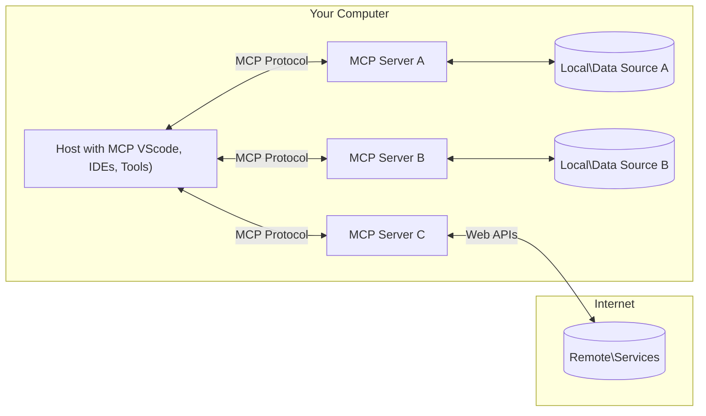

<!--
CO_OP_TRANSLATOR_METADATA:
{
  "original_hash": "355b12a5970c5c9e6db0bee970c751ba",
  "translation_date": "2025-07-13T15:55:57+00:00",
  "source_file": "01-CoreConcepts/README.md",
  "language_code": "mr"
}
-->
# 📖 MCP कोर संकल्पना: AI एकत्रिकरणासाठी Model Context Protocol मध्ये प्रावीण्य मिळवणे

[Model Context Protocol (MCP)](https://github.com/modelcontextprotocol) हा एक सामर्थ्यशाली, मानकीकृत फ्रेमवर्क आहे जो Large Language Models (LLMs) आणि बाह्य साधने, अनुप्रयोग, आणि डेटा स्रोत यांच्यातील संवाद अधिक प्रभावी बनवतो. हा SEO-ऑप्टिमाइझ्ड मार्गदर्शक तुम्हाला MCP च्या कोर संकल्पना समजावून सांगेल, ज्यामुळे तुम्हाला त्याची क्लायंट-सर्व्हर आर्किटेक्चर, महत्त्वाचे घटक, संवाद यंत्रणा, आणि अंमलबजावणीच्या सर्वोत्तम पद्धती समजतील.

## आढावा

हा धडा Model Context Protocol (MCP) पर्यावरणाची मूलभूत रचना आणि घटक यांचा अभ्यास करतो. तुम्हाला क्लायंट-सर्व्हर आर्किटेक्चर, मुख्य घटक, आणि संवाद यंत्रणा याबद्दल शिकायला मिळेल ज्यामुळे MCP च्या संवादांना चालना मिळते.

## 👩‍🎓 मुख्य शिकण्याचे उद्दिष्टे

या धड्याच्या शेवटी, तुम्ही:

- MCP क्लायंट-सर्व्हर आर्किटेक्चर समजून घेणार.
- Hosts, Clients, आणि Servers यांच्या भूमिका आणि जबाबदाऱ्या ओळखणार.
- MCP ला लवचिक एकत्रिकरण स्तर बनवणाऱ्या मुख्य वैशिष्ट्यांचे विश्लेषण करणार.
- MCP पर्यावरणात माहिती कशी प्रवाहित होते हे शिकणार.
- .NET, Java, Python, आणि JavaScript मधील कोड उदाहरणांद्वारे व्यावहारिक अंतर्दृष्टी मिळवणार.

## 🔎 MCP आर्किटेक्चर: सखोल पाहणी

MCP पर्यावरण क्लायंट-सर्व्हर मॉडेलवर आधारित आहे. ही मॉड्युलर रचना AI अनुप्रयोगांना साधने, डेटाबेस, API, आणि संदर्भात्मक संसाधनांशी प्रभावीपणे संवाद साधण्याची परवानगी देते. चला या आर्किटेक्चरचे मुख्य घटक समजून घेऊया.

MCP चा मूलभूत भाग क्लायंट-सर्व्हर आर्किटेक्चर आहे जिथे एक होस्ट अनुप्रयोग अनेक सर्व्हर्सशी कनेक्ट होऊ शकतो:



- **MCP Hosts**: VSCode, Claude Desktop, IDEs, किंवा AI साधने जी MCP द्वारे डेटा ऍक्सेस करू इच्छितात
- **MCP Clients**: प्रोटोकॉल क्लायंट जे सर्व्हर्सशी 1:1 कनेक्शन राखतात
- **MCP Servers**: हलक्या वजनाचे प्रोग्राम जे मानकीकृत Model Context Protocol द्वारे विशिष्ट क्षमता प्रदान करतात
- **स्थानिक डेटा स्रोत**: तुमच्या संगणकावरील फाइल्स, डेटाबेस, आणि सेवा ज्यांना MCP सर्व्हर्स सुरक्षितपणे ऍक्सेस करू शकतात
- **दूरस्थ सेवा**: इंटरनेटवर उपलब्ध बाह्य प्रणाली ज्या MCP सर्व्हर्स API द्वारे कनेक्ट होऊ शकतात.

MCP प्रोटोकॉल हा सतत विकसित होणारा मानक आहे, त्यातील नवीनतम अद्यतने तुम्ही [protocol specification](https://modelcontextprotocol.io/specification/2025-06-18/) येथे पाहू शकता.

### 1. Hosts

Model Context Protocol (MCP) मध्ये Hosts ही मुख्य भूमिका बजावतात कारण वापरकर्ते प्रोटोकॉलशी संवाद साधण्यासाठी याच्याद्वारे संपर्क करतात. Hosts हे अनुप्रयोग किंवा वातावरण आहेत जे MCP सर्व्हर्सशी कनेक्शन सुरू करतात जेणेकरून डेटा, साधने, आणि प्रॉम्प्ट्स ऍक्सेस करता येतील. Hosts चे उदाहरण म्हणजे Visual Studio Code सारखे एकत्रित विकास वातावरण (IDEs), Claude Desktop सारखी AI साधने, किंवा विशिष्ट कामांसाठी तयार केलेले कस्टम एजंट्स.

**Hosts** हे LLM अनुप्रयोग आहेत जे कनेक्शन सुरू करतात. ते:

- AI मॉडेल्सशी संवाद साधून प्रतिसाद तयार करतात.
- MCP सर्व्हर्सशी कनेक्शन सुरू करतात.
- संभाषणाचा प्रवाह आणि वापरकर्ता इंटरफेस व्यवस्थापित करतात.
- परवानगी आणि सुरक्षा निर्बंध नियंत्रित करतात.
- डेटा शेअरिंग आणि साधन कार्यान्वयनासाठी वापरकर्त्याची संमती हाताळतात.

### 2. Clients

Clients हे महत्त्वाचे घटक आहेत जे Hosts आणि MCP सर्व्हर्समधील संवाद सुलभ करतात. Clients मध्यस्थ म्हणून काम करतात, Hosts ला MCP सर्व्हर्सकडून दिल्या जाणाऱ्या कार्यक्षमतेचा वापर करण्यास मदत करतात. ते MCP आर्किटेक्चरमध्ये सुरळीत संवाद आणि कार्यक्षम डेटा देवाणघेवाण सुनिश्चित करतात.

**Clients** हे होस्ट अनुप्रयोगातील कनेक्टर्स आहेत. ते:

- सर्व्हर्सकडे प्रॉम्प्ट्स/सूचना पाठवतात.
- सर्व्हर्सशी क्षमता याबाबत वाटाघाटी करतात.
- मॉडेल्सकडून साधन कार्यान्वयन विनंत्या व्यवस्थापित करतात.
- वापरकर्त्यांना प्रतिसाद प्रक्रिया करून दाखवतात.

### 3. Servers

Servers हे MCP क्लायंट्सकडून येणाऱ्या विनंत्यांना हाताळतात आणि योग्य प्रतिसाद देतात. ते डेटा पुनर्प्राप्ती, साधन कार्यान्वयन, आणि प्रॉम्प्ट निर्मिती यांसारख्या विविध ऑपरेशन्सचे व्यवस्थापन करतात. Servers हे सुनिश्चित करतात की क्लायंट्स आणि Hosts मधील संवाद कार्यक्षम आणि विश्वासार्ह आहे, आणि संवाद प्रक्रियेची अखंडता राखतात.

**Servers** हे सेवा आहेत जे संदर्भ आणि क्षमता पुरवतात. ते:

- उपलब्ध वैशिष्ट्ये (संसाधने, प्रॉम्प्ट्स, साधने) नोंदवतात
- क्लायंटकडून साधन कॉल्स स्वीकारतात आणि कार्यान्वित करतात
- मॉडेल प्रतिसाद सुधारण्यासाठी संदर्भात्मक माहिती पुरवतात
- आउटपुट क्लायंटकडे परत पाठवतात
- आवश्यक असल्यास संवाद दरम्यान स्थिती राखतात

Servers कोणत्याही व्यक्तीने विकसित केले जाऊ शकतात जेणेकरून मॉडेलच्या क्षमतांमध्ये विशेष कार्यक्षमता वाढवता येईल.

### 4. Server Features

Model Context Protocol (MCP) मधील Servers हे मूलभूत घटक पुरवतात जे क्लायंट्स, Hosts, आणि भाषा मॉडेल्स यांच्यात समृद्ध संवाद सक्षम करतात. हे वैशिष्ट्ये MCP च्या क्षमतांना वाढवण्यासाठी रचलेले संदर्भ, साधने, आणि प्रॉम्प्ट्स प्रदान करतात.

MCP सर्व्हर्स खालीलपैकी कोणतीही वैशिष्ट्ये देऊ शकतात:

#### 📑 Resources

Model Context Protocol (MCP) मधील Resources म्हणजे विविध प्रकारचे संदर्भ आणि डेटा जे वापरकर्ते किंवा AI मॉडेल्स वापरू शकतात. यात समाविष्ट आहे:

- **संदर्भात्मक डेटा**: माहिती आणि संदर्भ जे वापरकर्ते किंवा AI मॉडेल्स निर्णय घेण्यासाठी आणि कार्ये पार पाडण्यासाठी वापरू शकतात.
- **ज्ञान भांडार आणि दस्तऐवज संच**: संरचित आणि असंरचित डेटा संच, जसे की लेख, मॅन्युअल्स, आणि संशोधन पेपर्स, जे मौल्यवान अंतर्दृष्टी आणि माहिती पुरवतात.
- **स्थानिक फाइल्स आणि डेटाबेस**: उपकरणांवर किंवा डेटाबेसमध्ये स्थानिकरित्या संग्रहित डेटा, जो प्रक्रिया आणि विश्लेषणासाठी उपलब्ध आहे.
- **API आणि वेब सेवा**: बाह्य इंटरफेस आणि सेवा ज्या अतिरिक्त डेटा आणि कार्यक्षमता पुरवतात, विविध ऑनलाइन संसाधने आणि साधनांसह एकत्रिकरण सक्षम करतात.

एखाद्या resource चे उदाहरण म्हणजे डेटाबेस स्कीमा किंवा फाइल जी अशा प्रकारे ऍक्सेस केली जाऊ शकते:

```text
file://log.txt
database://schema
```

### 🤖 Prompts

Model Context Protocol (MCP) मधील Prompts मध्ये विविध पूर्वनिर्धारित टेम्पलेट्स आणि संवाद नमुने असतात जे वापरकर्त्याच्या कार्यप्रवाहाला सुलभ करतात आणि संवाद सुधारतात. यात समाविष्ट आहे:

- **टेम्पलेटेड संदेश आणि कार्यप्रवाह**: पूर्वरचित संदेश आणि प्रक्रिया जे वापरकर्त्यांना विशिष्ट कार्ये आणि संवादांमध्ये मार्गदर्शन करतात.
- **पूर्वनिर्धारित संवाद नमुने**: क्रिया आणि प्रतिसादांची मानकीकृत साखळी जी सातत्यपूर्ण आणि कार्यक्षम संवाद सुलभ करते.
- **विशेषीकृत संभाषण टेम्पलेट्स**: विशिष्ट प्रकारच्या संभाषणांसाठी सानुकूल टेम्पलेट्स, जे संबंधित आणि संदर्भानुसार योग्य संवाद सुनिश्चित करतात.

प्रॉम्प्ट टेम्पलेट असे दिसू शकते:

```markdown
Generate a product slogan based on the following {{product}} with the following {{keywords}}
```

#### ⛏️ Tools

Model Context Protocol (MCP) मधील Tools म्हणजे AI मॉडेल विशिष्ट कार्ये पार पाडण्यासाठी वापरू शकणाऱ्या फंक्शन्स. ही साधने AI मॉडेलच्या क्षमतांना वाढवण्यासाठी रचलेली आणि विश्वासार्ह ऑपरेशन्स पुरवतात. मुख्य बाबी:

- **AI मॉडेलसाठी कार्यान्वित करण्यायोग्य फंक्शन्स**: Tools हे executable फंक्शन्स आहेत जे AI मॉडेल विविध कार्ये करण्यासाठी कॉल करू शकते.
- **अद्वितीय नाव आणि वर्णन**: प्रत्येक साधनाचे वेगळे नाव आणि त्याचा उद्देश व कार्यक्षमता स्पष्ट करणारे तपशीलवार वर्णन असते.
- **पॅरामीटर्स आणि आउटपुट्स**: Tools विशिष्ट पॅरामीटर्स स्वीकारतात आणि रचनेत आउटपुट्स परत करतात, ज्यामुळे परिणाम सातत्यपूर्ण आणि अपेक्षित राहतात.
- **स्वतंत्र फंक्शन्स**: Tools वेब शोध, गणना, आणि डेटाबेस क्वेरीज सारखी स्वतंत्र कार्ये पार पाडतात.

एखादे साधन असे दिसू शकते:

```typescript
server.tool(
  "GetProducts",
  {
    pageSize: z.string().optional(),
    pageCount: z.string().optional()
  }, () => {
    // return results from API
  }
)
```

## Client Features

Model Context Protocol (MCP) मध्ये, clients सर्व्हर्सना अनेक महत्त्वाच्या वैशिष्ट्ये देतात, ज्यामुळे प्रोटोकॉलमधील एकूण कार्यक्षमता आणि संवाद सुधारतो. त्यापैकी एक महत्त्वाचे वैशिष्ट्य म्हणजे Sampling.

### 👉 Sampling

- **सर्व्हर-प्रेरित एजंटिक वर्तन**: Clients सर्व्हर्सना विशिष्ट क्रिया किंवा वर्तन स्वयंचलितपणे सुरू करण्याची परवानगी देतात, ज्यामुळे प्रणालीच्या गतिशील क्षमतांमध्ये वाढ होते.
- **Recursive LLM संवाद**: हे वैशिष्ट्य मोठ्या भाषा मॉडेल्सशी पुनरावृत्ती संवाद सक्षम करते, ज्यामुळे अधिक गुंतागुंतीचे आणि पुनरावृत्ती प्रक्रियात्मक कार्य करता येते.
- **अतिरिक्त मॉडेल पूर्णता विनंती करणे**: सर्व्हर्स मॉडेलकडून अतिरिक्त पूर्णता मागू शकतात, ज्यामुळे प्रतिसाद सखोल आणि संदर्भानुसार योग्य राहतो.

## MCP मधील माहिती प्रवाह

Model Context Protocol (MCP) मध्ये Hosts, Clients, Servers, आणि मॉडेल्स यांच्यात माहितीचा रचनेत प्रवाह निश्चित केला आहे. हा प्रवाह समजल्याने वापरकर्त्याच्या विनंत्या कशा प्रक्रिया केल्या जातात आणि बाह्य साधने व डेटा कसे मॉडेल प्रतिसादात समाकलित होतात हे स्पष्ट होते.

- **Host कनेक्शन सुरू करतो**  
  Host अनुप्रयोग (जसे की IDE किंवा चॅट इंटरफेस) MCP सर्व्हरशी कनेक्शन स्थापित करतो, सहसा STDIO, WebSocket, किंवा इतर समर्थित ट्रान्सपोर्टद्वारे.

- **क्षमता वाटाघाटी**  
  क्लायंट (जो होस्टमध्ये एम्बेडेड असतो) आणि सर्व्हर त्यांच्या समर्थित वैशिष्ट्ये, साधने, संसाधने, आणि प्रोटोकॉल आवृत्त्यांबाबत माहिती देवाणघेवाण करतात. यामुळे दोन्ही बाजूंना सत्रासाठी उपलब्ध क्षमता समजतात.

- **वापरकर्ता विनंती**  
  वापरकर्ता होस्टशी संवाद साधतो (उदा. प्रॉम्प्ट किंवा कमांड टाकतो). होस्ट हा इनपुट गोळा करून क्लायंटकडे पाठवतो.

- **संसाधन किंवा साधन वापर**  
  - क्लायंट सर्व्हरकडून अतिरिक्त संदर्भ किंवा संसाधने (जसे की फाइल्स, डेटाबेस नोंदी, किंवा ज्ञान भांडार लेख) मागू शकतो ज्यामुळे मॉडेलची समज वाढते.
  - जर मॉडेलला साधन वापरण्याची गरज वाटली (उदा. डेटा मिळवणे, गणना करणे, किंवा API कॉल करणे), तर क्लायंट सर्व्हरकडे साधन कॉल विनंती पाठवतो, ज्यात साधनाचे नाव आणि पॅरामीटर्स असतात.

- **सर्व्हर कार्यान्वयन**  
  सर्व्हर संसाधन किंवा साधन विनंती स्वीकारतो, आवश्यक ऑपरेशन्स (जसे की फंक्शन चालवणे, डेटाबेस क्वेरी करणे, किंवा फाइल मिळवणे) पार पाडतो, आणि परिणाम संरचित स्वरूपात क्लायंटकडे परत पाठवतो.

- **प्रतिसाद निर्मिती**  
  क्लायंट सर्व्हरच्या प्रतिसादांना (संसाधन डेटा, साधन आउटपुट्स, इ.) चालू मॉडेल संवादात समाकलित करतो. मॉडेल या माहितीचा वापर करून सखोल आणि संदर्भानुसार योग्य प्रतिसाद तयार करतो.

- **परिणाम सादरीकरण**  
  होस्ट अंतिम आउटपुट क्लायंटकडून प्राप्त करतो आणि वापरकर्त्यास सादर करतो, ज्यामध्ये मॉडेलने तयार केलेला मजकूर आणि साधन कार्यान्वयन किंवा संसाधन शोधाचे निकाल दोन्ही असू शकतात.

हा प्रवाह MCP ला प्रगत, संवादात्मक, आणि संदर्भ-जाणणाऱ्या AI अनुप्रयोगांना समर्थन देण्यास सक्षम करतो, ज्यामुळे मॉडेल्स सहजपणे बाह्य साधने आणि डेटा स्रोतांशी जोडले जातात.

## प्रोटोकॉल तपशील

MCP (Model Context Protocol) [JSON-RPC 2.0](https://www.jsonrpc.org/) वर आधारित आहे, जे होस्ट्स, क्लायंट्स, आणि सर्व्हर्समधील संवादासाठी मानकीकृत, भाषा-स्वतंत्र संदेश स्वरूप पुरवते. हे पाया विविध प्लॅटफॉर्म्स आणि प्रोग्रामिंग भाषांमध्ये विश्वासार्ह, रचनेत, आणि विस्तारक्षम संवाद सक्षम करतो.

### मुख्य प्रोटोकॉल वैशिष्ट्ये

MCP JSON-RPC 2.0 मध्ये साधन कॉल, संसाधन ऍक्सेस, आणि प्रॉम्प्ट व्यवस्थापनासाठी अतिरिक्त नियम जोडतो. हे अनेक ट्रान्सपोर्ट लेयर्स (STDIO, WebSocket, SSE) समर्थित करते आणि घटकांमधील सुरक्षित, विस्तारक्षम, आणि भाषा-स्वतंत्र संवाद सक्षम करते.

#### 🧢 बेस प्रोटोकॉल

- **JSON-RPC संदेश स्वरूप**: सर्व विनंत्या आणि प्रतिसाद JSON-RPC 2.0 स्पेसिफिकेशन वापरतात, ज्यामुळे मेथड कॉल्स, पॅरामीटर्स, निकाल, आणि त्रुटी हाताळणीसाठी सातत्यपूर्ण रचना मिळते.
- **स्थितीपूर्ण कनेक्शन्स**: MCP सत्र अनेक विनंत्यांमध्ये स्थिती राखतात, सतत संभाषणे, संदर्भ संचय, आणि संसाधन व्यवस्थापनासाठी समर्थन देतात.
- **क्षमता वाटाघाटी**: कनेक्शन सेटअप दरम्यान, क्लायंट्स आणि सर्व्हर्स त्यांच्या समर्थित वैशिष्ट्ये, प्रोटोकॉल आवृत्त्या, उपलब्ध साधने, आणि संसाधने याबाबत माहिती देवाणघेवाण करतात. यामुळे दोन्ही बाजूंना एकमेकांच्या क्षमतांची जाणीव होते आणि ते त्यानुसार जुळवून घेतात.

#### ➕ अतिरिक्त उपयुक्तता

खाली MCP काही अतिरिक्त उपयुक्तता आणि प्रोटोकॉल विस्तार देतो जे विकासकांच्या अनुभवाला सुधारतात आणि प्रगत परिस्थिती सक्षम करतात:

- **कॉन्फिगरेशन पर्याय**: MCP सत्र पॅरामीटर्स जसे की साधन परवानग्या, संसाधन ऍक्सेस, आणि मॉडेल सेटिंग्ज डायनॅमिकली कॉन्फिगर करण्याची परवानगी देतो, प्रत्येक संवादासाठी सानुकूलित.
- **प्रगती ट्रॅकिंग**: दीर्घकालीन ऑपरेशन्स प्रगती अद्यतने देऊ शकतात, ज्यामुळे वापरकर्ता इंटरफेस प्रतिसादक्षम आणि जटिल कार्यांमध्ये चांगला अनुभव मिळतो.
- **विनंती रद्द करणे**: क्लायंट्स प्रवाहित विनंत्या रद्द करू शकतात, ज्यामुळे वापरकर्ते अनावश्यक किंवा जास्त वेळ घेणाऱ्या ऑपरेशन्स थांबवू शकतात.
- **त्रुटी अहवाल**: मानकीकृत त्रुटी संदेश आणि कोड्स समस्या निदान, अपयश हाताळणी, आणि वापरकर्ते व विकासकांसाठी उपयुक्त अभिप्राय पुरवतात.
- **लॉगिंग**: क्लायंट्स आणि सर्व्हर्स दोघेही प्रोटोकॉल संवादांसाठी ऑडिटिंग, डीबगिंग, आणि मॉनिटरिंगसाठी संरचित लॉग्स तयार करू शकतात.

या प्रोटोकॉल वैशिष्ट्यांचा वापर करून, MCP भाषा मॉडेल्स आणि बाह्य साधने किंवा डेटा स्रोतांमधील संवादाला मजबूत, सुरक्षित, आणि लवचिक बनवतो.

### 🔐 सुरक्षा विचार

MCP अंमलबजावणी करताना सुरक्षित आणि विश्वासार्ह संवाद सुनिश्चित करण्यासाठी काही महत्त्वाच्या सुरक्षा तत्त्वांचे पालन करणे आवश्यक आहे:

- **वापरकर्ता संमती आणि नियंत्रण**: कोणताही डेटा ऍक्सेस करण्यापूर्वी किंवा ऑपरेशन्स करण्यापूर्वी वापरकर्त्याची स्पष्ट संमती आवश्यक आहे. वापरकर्त्यांक
MCP मध्ये प्रोटोकॉलच्या संपूर्ण प्रक्रियेत सुरक्षा आणि अधिकृतता व्यवस्थापित करण्यासाठी अनेक अंगभूत संकल्पना आणि यंत्रणा समाविष्ट आहेत:

1. **टूल परवानगी नियंत्रण**:  
  क्लायंट्स सत्रादरम्यान कोणते टूल्स मॉडेल वापरू शकते हे निर्दिष्ट करू शकतात. यामुळे फक्त स्पष्टपणे अधिकृत टूल्सना प्रवेश मिळतो, ज्यामुळे अनपेक्षित किंवा असुरक्षित क्रियांचा धोका कमी होतो. परवानग्या वापरकर्त्याच्या पसंती, संस्थात्मक धोरणे किंवा संवादाच्या संदर्भानुसार गतिशीलपणे सेट केल्या जाऊ शकतात.

2. **प्रमाणीकरण**:  
  सर्व्हर टूल्स, संसाधने किंवा संवेदनशील क्रियांना प्रवेश देण्यापूर्वी प्रमाणीकरणाची मागणी करू शकतात. यात API कीज, OAuth टोकन्स किंवा इतर प्रमाणीकरण योजना असू शकतात. योग्य प्रमाणीकरणामुळे फक्त विश्वासार्ह क्लायंट्स आणि वापरकर्त्यांना सर्व्हर-साइड क्षमता वापरण्याची परवानगी मिळते.

3. **वैधता तपासणी**:  
  सर्व टूल कॉलसाठी पॅरामीटरची वैधता तपासली जाते. प्रत्येक टूल त्याच्या पॅरामीटर्ससाठी अपेक्षित प्रकार, स्वरूप आणि बंधने निश्चित करते, आणि सर्व्हर येणाऱ्या विनंत्यांची त्यानुसार पडताळणी करतो. यामुळे चुकीचा किंवा हानिकारक इनपुट टूलच्या अंमलबजावणीपर्यंत पोहोचू शकत नाही आणि ऑपरेशन्सची अखंडता राखली जाते.

4. **रेट लिमिटिंग**:  
  गैरवापर टाळण्यासाठी आणि सर्व्हर संसाधनांचा न्याय्य वापर सुनिश्चित करण्यासाठी, MCP सर्व्हर टूल कॉल्स आणि संसाधन प्रवेशासाठी रेट लिमिटिंग लागू करू शकतात. रेट लिमिट्स वापरकर्त्याप्रमाणे, सत्रानुसार किंवा जागतिक पातळीवर लागू केल्या जाऊ शकतात, ज्यामुळे डिनायल-ऑफ-सर्व्हिस हल्ले किंवा संसाधनांचा अतिरेक टाळता येतो.

या यंत्रणांचा संगम करून, MCP भाषा मॉडेल्सना बाह्य टूल्स आणि डेटा स्रोतांसह सुरक्षितपणे जोडण्याचा पाया तयार करतो, तसेच वापरकर्ते आणि विकसकांना प्रवेश आणि वापरावर सूक्ष्म नियंत्रण देतो.

## प्रोटोकॉल संदेश

MCP संवादासाठी क्लायंट, सर्व्हर आणि मॉडेल यांच्यात स्पष्ट आणि विश्वासार्ह संवाद साधण्यासाठी संरचित JSON संदेशांचा वापर होतो. मुख्य संदेश प्रकारांमध्ये समाविष्ट आहेत:

- **क्लायंट विनंती**  
  क्लायंटकडून सर्व्हरकडे पाठवलेला हा संदेश सामान्यतः यांचा समावेश करतो:  
  - वापरकर्त्याचा प्रॉम्प्ट किंवा आदेश  
  - संदर्भासाठी संभाषणाचा इतिहास  
  - टूल कॉन्फिगरेशन आणि परवानग्या  
  - अतिरिक्त मेटाडेटा किंवा सत्र माहिती

- **मॉडेल प्रतिसाद**  
  मॉडेलकडून (क्लायंटमार्फत) परत येणारा हा संदेश यांचा समावेश करतो:  
  - प्रॉम्प्ट आणि संदर्भावर आधारित तयार केलेला मजकूर किंवा पूर्णता  
  - जर मॉडेलने ठरवले की टूल वापरायचे आहे तर पर्यायी टूल कॉल सूचना  
  - आवश्यकतेनुसार संसाधने किंवा अतिरिक्त संदर्भ

- **टूल विनंती**  
  जेव्हा टूल चालवायचे असते तेव्हा क्लायंटकडून सर्व्हरकडे पाठवलेला संदेश. यात समाविष्ट आहे:  
  - कॉल करायच्या टूलचे नाव  
  - टूलच्या स्कीमेनुसार पडताळणी केलेले आवश्यक पॅरामीटर्स  
  - विनंती ट्रॅक करण्यासाठी संदर्भात्मक माहिती किंवा ओळखपत्रे

- **टूल प्रतिसाद**  
  टूल अंमलात आणल्यानंतर सर्व्हरकडून परत येणारा संदेश. यात समाविष्ट आहे:  
  - टूल अंमलबजावणीचे निकाल (संरचित डेटा किंवा सामग्री)  
  - टूल कॉल अयशस्वी झाल्यास त्रुटी किंवा स्थिती माहिती  
  - पर्यायीपणे, अंमलबजावणीशी संबंधित अतिरिक्त मेटाडेटा किंवा लॉग्स

हे संरचित संदेश MCP कार्यप्रवाहातील प्रत्येक टप्पा स्पष्ट, ट्रेस करण्यायोग्य आणि विस्तारण्यायोग्य बनवतात, ज्यामुळे मल्टी-टर्न संभाषणे, टूल चेनिंग आणि मजबूत त्रुटी हाताळणीसारख्या प्रगत परिस्थितींचा आधार मिळतो.

## मुख्य मुद्दे

- MCP मॉडेल्सना बाह्य क्षमता जोडण्यासाठी क्लायंट-सर्व्हर आर्किटेक्चर वापरतो  
- या परिसंस्थेत क्लायंट्स, होस्ट्स, सर्व्हर्स, टूल्स आणि डेटा स्रोतांचा समावेश आहे  
- संवाद STDIO, SSE किंवा WebSockets द्वारे होऊ शकतो  
- टूल्स हे मॉडेल्ससाठी उपलब्ध केलेले मूलभूत कार्यात्मक घटक आहेत  
- संरचित संवाद प्रोटोकॉल सतत आणि सुसंगत संवाद सुनिश्चित करतात

## सराव

तुमच्या क्षेत्रात उपयुक्त ठरू शकणारे एक सोपे MCP टूल डिझाइन करा. ठरवा:  
1. टूलचे नाव काय असेल  
2. कोणते पॅरामीटर्स ते स्वीकारेल  
3. कोणता आउटपुट ते परत करेल  
4. वापरकर्त्यांच्या समस्या सोडवण्यासाठी मॉडेल कसे हे टूल वापरू शकते

---

## पुढे काय

पुढे: [Chapter 2: Security](../02-Security/README.md)

**अस्वीकरण**:  
हा दस्तऐवज AI अनुवाद सेवा [Co-op Translator](https://github.com/Azure/co-op-translator) वापरून अनुवादित केला आहे. आम्ही अचूकतेसाठी प्रयत्नशील असलो तरी, कृपया लक्षात घ्या की स्वयंचलित अनुवादांमध्ये चुका किंवा अचूकतेची कमतरता असू शकते. मूळ दस्तऐवज त्याच्या स्थानिक भाषेत अधिकृत स्रोत मानला जावा. महत्त्वाच्या माहितीसाठी व्यावसायिक मानवी अनुवाद करण्याची शिफारस केली जाते. या अनुवादाच्या वापरामुळे उद्भवलेल्या कोणत्याही गैरसमजुती किंवा चुकीच्या अर्थलागी आम्ही जबाबदार नाही.