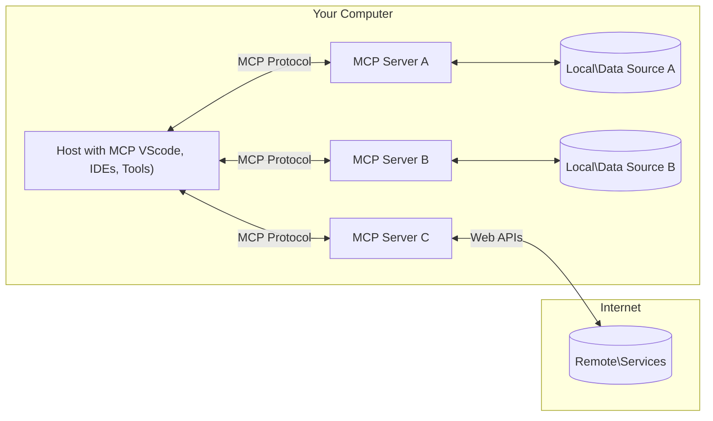

<!--
CO_OP_TRANSLATOR_METADATA:
{
  "original_hash": "b3b4a6ad10c3c0edbf7fa7cfa0ec496b",
  "translation_date": "2025-07-02T07:06:41+00:00",
  "source_file": "01-CoreConcepts/README.md",
  "language_code": "mr"
}
-->
# 📖 MCP कोर संकल्पना: AI एकत्रीकरणासाठी Model Context Protocol चे प्रभुत्व मिळवणे

[Model Context Protocol (MCP)](https://github.com/modelcontextprotocol) हा एक शक्तिशाली, मानकीकृत फ्रेमवर्क आहे जो मोठ्या भाषा मॉडेल्स (LLMs) आणि बाह्य साधने, अनुप्रयोग, आणि डेटा स्रोत यांच्यातील संवाद अधिक प्रभावी करतो. हा SEO-अनुकूल मार्गदर्शक तुम्हाला MCP चे कोर संकल्पना समजावून सांगेल, ज्यामुळे तुम्हाला त्याच्या क्लायंट-सर्व्हर आर्किटेक्चर, महत्त्वाच्या घटकां, संवाद यंत्रणा, आणि अंमलबजावणीच्या सर्वोत्तम पद्धती समजतील.

## आढावा

हा धडा Model Context Protocol (MCP) परिसंस्थेची मूलभूत रचना आणि घटक यांचा अभ्यास करतो. तुम्हाला क्लायंट-सर्व्हर आर्किटेक्चर, मुख्य घटक, आणि संवाद यंत्रणा याबद्दल शिकायला मिळेल ज्यामुळे MCP च्या संवादांना चालना मिळते.

## 👩‍🎓 मुख्य शिकण्याचे उद्दिष्ट

या धड्याच्या शेवटी, तुम्ही:

- MCP क्लायंट-सर्व्हर आर्किटेक्चर समजून घ्याल.
- Hosts, Clients, आणि Servers चे भूमिका आणि जबाबदाऱ्या ओळखाल.
- MCP ला लवचिक एकत्रीकरण स्तर बनवणाऱ्या मुख्य वैशिष्ट्यांचे विश्लेषण कराल.
- MCP परिसंस्थेमध्ये माहिती कशी वाहते ते शिकाल.
- .NET, Java, Python, आणि JavaScript मधील कोड उदाहरणांद्वारे व्यावहारिक अंतर्दृष्टी मिळवाल.

## 🔎 MCP आर्किटेक्चर: सखोल पाहणी

MCP परिसंस्था क्लायंट-सर्व्हर मॉडेलवर आधारित आहे. ही विभागणी AI अनुप्रयोगांना साधने, डेटाबेस, API, आणि संदर्भ संसाधनांसोबत कार्यक्षमतेने संवाद साधण्याची परवानगी देते. चला या आर्किटेक्चरचे मुख्य घटक पाहूया.

मूलत: MCP क्लायंट-सर्व्हर आर्किटेक्चरचे पालन करते जिथे एक host application अनेक servers शी कनेक्ट होऊ शकते:



- **MCP Hosts**: VSCode, Claude Desktop, IDEs किंवा AI साधने जी MCP द्वारे डेटा वापरू इच्छितात
- **MCP Clients**: प्रोटोकॉल क्लायंट जे सर्व्हरशी 1:1 कनेक्शन राखतात
- **MCP Servers**: हलक्या प्रोग्राम्स जे प्रत्येकाने Model Context Protocol द्वारे विशिष्ट क्षमता प्रदर्शित करतात
- **स्थानिक डेटा स्रोत**: तुमच्या संगणकावरील फाइल्स, डेटाबेस, आणि सेवा ज्यांना MCP सर्व्हर सुरक्षितपणे प्रवेश करू शकतात
- **दूरस्थ सेवा**: इंटरनेटवर उपलब्ध बाह्य प्रणाली ज्यांना MCP सर्व्हर API द्वारे कनेक्ट करू शकतात.

MCP प्रोटोकॉल एक सतत विकसित होणारा मानक आहे, त्यातील नवीनतम अद्यतने तुम्ही [protocol specification](https://modelcontextprotocol.io/specification/2025-06-18/) येथे पाहू शकता.

### 1. Hosts

Model Context Protocol (MCP) मध्ये Hosts महत्त्वाची भूमिका बजावतात कारण ते वापरकर्त्यांना प्रोटोकॉलशी संवाद साधण्याची प्राथमिक जागा देतात. Hosts हे अनुप्रयोग किंवा वातावरणे आहेत जे MCP सर्व्हरशी कनेक्शन सुरू करतात जेणेकरून डेटा, साधने, आणि प्रॉम्प्ट्स वापरता येतील. Hosts च्या उदाहरणांमध्ये Visual Studio Code सारखी एकात्मिक विकास वातावरणे (IDEs), Claude Desktop सारखी AI साधने, किंवा विशिष्ट कामांसाठी तयार केलेले कस्टम एजंट्स यांचा समावेश होतो.

**Hosts** हे LLM अनुप्रयोग आहेत जे कनेक्शन सुरू करतात. ते:

- AI मॉडेल्सवर कार्य करतात किंवा संवाद साधून प्रतिसाद तयार करतात.
- MCP सर्व्हरशी कनेक्शन सुरू करतात.
- संभाषणाचा प्रवाह आणि वापरकर्ता इंटरफेस नियंत्रित करतात.
- परवानगी आणि सुरक्षा मर्यादा नियंत्रित करतात.
- डेटा शेअरिंग आणि साधन कार्यान्वयनासाठी वापरकर्त्याची संमती हाताळतात.

### 2. Clients

Clients हे आवश्यक घटक आहेत जे Hosts आणि MCP सर्व्हरमधील संवाद सुलभ करतात. Clients मध्यस्थ म्हणून काम करतात, Hosts ना MCP सर्व्हरद्वारे दिल्या जाणाऱ्या कार्यक्षमतेचा उपयोग करण्याची परवानगी देतात. ते MCP आर्किटेक्चरमध्ये सुरळीत संवाद आणि कार्यक्षम डेटा देवाणघेवाण सुनिश्चित करतात.

**Clients** हे host application मधील कनेक्टर्स आहेत. ते:

- सर्व्हरकडे प्रॉम्प्ट्स/सूचना सहित विनंत्या पाठवतात.
- सर्व्हरशी क्षमता यावर चर्चा करतात.
- मॉडेलकडून साधन कार्यान्वयन विनंत्यांचे व्यवस्थापन करतात.
- वापरकर्त्यांना प्रतिसाद प्रक्रिया करून दाखवतात.

### 3. Servers

Servers हे MCP clients कडून येणाऱ्या विनंत्यांचे व्यवस्थापन करतात आणि योग्य प्रतिसाद देतात. ते डेटा पुनर्प्राप्ती, साधन कार्यान्वयन, आणि प्रॉम्प्ट निर्मिती यांसारख्या विविध ऑपरेशन्स हाताळतात. Servers सुनिश्चित करतात की clients आणि Hosts यांच्यातील संवाद कार्यक्षम आणि विश्वासार्ह असेल, ज्यामुळे संवाद प्रक्रियेची अखंडता राखली जाते.

**Servers** हे सेवा आहेत जे संदर्भ आणि क्षमता पुरवतात. ते:

- उपलब्ध वैशिष्ट्ये (संसाधने, प्रॉम्प्ट्स, साधने) नोंदणी करतात
- क्लायंटकडून साधन कॉल्स स्वीकारतात आणि कार्यान्वित करतात
- मॉडेल प्रतिसाद सुधारण्यासाठी संदर्भ माहिती पुरवतात
- आउटपुट क्लायंटकडे परत करतात
- आवश्यकतेनुसार संवादांदरम्यान स्थिती राखतात

सर्व्हर कोणताही व्यक्ती विकसित करू शकतो जेणेकरून मॉडेल क्षमतांचा विस्तार विशिष्ट कार्यक्षमतेसह करता येईल.

### 4. Server Features

Model Context Protocol (MCP) मधील Servers क्लायंट्स, Hosts, आणि भाषा मॉडेल्स यांच्यात समृद्ध संवाद सक्षम करणारे मूलभूत घटक पुरवतात. ही वैशिष्ट्ये MCP च्या क्षमतांना सुधारण्यासाठी रचनेत संदर्भ, साधने, आणि प्रॉम्प्ट्स ऑफर करतात.

MCP सर्व्हर खालीलपैकी कोणतीही वैशिष्ट्ये देऊ शकतात:

#### 📑 Resources 

Model Context Protocol (MCP) मधील Resources मध्ये विविध प्रकारचा संदर्भ आणि डेटा समाविष्ट आहे जो वापरकर्ते किंवा AI मॉडेल्स वापरू शकतात. यात समाविष्ट आहे:

- **संदर्भात्मक डेटा**: माहिती आणि संदर्भ जे वापरकर्ते किंवा AI मॉडेल्स निर्णय घेण्यासाठी आणि कार्ये पार पाडण्यासाठी वापरू शकतात.
- **ज्ञानसंग्रह आणि दस्तऐवज संग्रह**: रचलेल्या आणि अनरचलेल्या डेटाचा संग्रह, जसे की लेख, मॅन्युअल्स, आणि संशोधन पेपर्स, जे मौल्यवान अंतर्दृष्टी आणि माहिती पुरवतात.
- **स्थानिक फाइल्स आणि डेटाबेस**: उपकरणांवर किंवा डेटाबेसमध्ये स्थानिकरीत्या साठवलेला डेटा, जो प्रक्रिया आणि विश्लेषणासाठी उपलब्ध आहे.
- **API आणि वेब सेवा**: बाह्य इंटरफेस आणि सेवा ज्या अतिरिक्त डेटा आणि कार्यक्षमता पुरवतात, विविध ऑनलाइन संसाधने आणि साधनांसह एकत्रीकरण सक्षम करतात.

संसाधनाचे उदाहरण म्हणजे डेटाबेस स्कीमा किंवा अशी फाइल जी अशाप्रकारे प्रवेश करता येते:

```text
file://log.txt
database://schema
```

### 🤖 Prompts

Model Context Protocol (MCP) मधील Prompts मध्ये विविध पूर्वनिर्धारित टेम्प्लेट्स आणि संवाद नमुने असतात जे वापरकर्त्याच्या कार्यप्रवाहाला सुलभ करतात आणि संवाद सुधारतात. यात समाविष्ट आहे:

- **टेम्प्लेटेड संदेश आणि कार्यप्रवाह**: पूर्वरचलेल्या संदेशां आणि प्रक्रियां जे वापरकर्त्यांना विशिष्ट कार्ये आणि संवादांमध्ये मार्गदर्शन करतात.
- **पूर्वनिर्धारित संवाद नमुने**: क्रियांची आणि प्रतिसादांची मानकीकृत मालिका ज्यामुळे सातत्यपूर्ण आणि कार्यक्षम संवाद साधता येतो.
- **विशेषीकृत संभाषण टेम्प्लेट्स**: विशिष्ट संभाषण प्रकारांसाठी सानुकूलित टेम्प्लेट्स, जे संबंधित आणि संदर्भानुसार योग्य संवाद सुनिश्चित करतात.

प्रॉम्प्ट टेम्प्लेट असे दिसू शकते:

```markdown
Generate a product slogan based on the following {{product}} with the following {{keywords}}
```

#### ⛏️ Tools

Model Context Protocol (MCP) मधील Tools हे फंक्शन्स आहेत जे AI मॉडेल विशिष्ट कार्ये करण्यासाठी चालवू शकते. ही साधने AI मॉडेलच्या क्षमतांना सुधारण्यासाठी रचलेली आणि विश्वासार्ह ऑपरेशन्स पुरवतात. मुख्य बाबी:

- **AI मॉडेलसाठी चालवायच्या फंक्शन्स**: साधने ही executable फंक्शन्स आहेत ज्या AI मॉडेल विविध कार्ये करण्यासाठी वापरू शकते.
- **अद्वितीय नाव आणि वर्णन**: प्रत्येक साधनाचे वेगळे नाव आणि त्याचे उद्दिष्ट आणि कार्यक्षमता स्पष्ट करणारे सविस्तर वर्णन असते.
- **पॅरामीटर्स आणि आउटपुट्स**: साधने विशिष्ट पॅरामीटर्स स्वीकारतात आणि रचलेले आउटपुट्स परत करतात, ज्यामुळे सतत आणि अपेक्षित परिणाम मिळतात.
- **स्वतंत्र फंक्शन्स**: साधने वेब शोध, गणना, आणि डेटाबेस क्वेरीज सारखी स्वतंत्र फंक्शन्स पार पाडतात.

उदाहरण साधन असे दिसू शकते:

```typescript
server.tool(
  "GetProducts",
  {
    pageSize: z.string().optional(),
    pageCount: z.string().optional()
  }, () => {
    // return results from API
  }
)
```

## Client Features

Model Context Protocol (MCP) मध्ये, clients सर्व्हर्ससाठी काही प्रमुख वैशिष्ट्ये देतात, ज्यामुळे प्रोटोकॉलमधील एकूण कार्यक्षमता आणि संवाद सुधारतो. त्यापैकी एक महत्त्वाचे वैशिष्ट्य म्हणजे Sampling.

### 👉 Sampling

- **सर्व्हर-प्रेरित एजेंटिक वर्तन**: क्लायंट्स सर्व्हर्सना विशिष्ट क्रिया किंवा वर्तन स्वायत्तपणे सुरू करण्याची परवानगी देतात, ज्यामुळे प्रणालीच्या गतिशील क्षमतांमध्ये वाढ होते.
- **Recursive LLM संवाद**: हे वैशिष्ट्य मोठ्या भाषा मॉडेल्स (LLMs) सोबत पुनरावृत्ती संवादासाठी परवानगी देते, ज्यामुळे अधिक गुंतागुंतीचे आणि पुनरावृत्तीने प्रक्रिया होणारी कार्ये शक्य होतात.
- **अधिक मॉडेल पूर्णता विनंती करणे**: सर्व्हर्स मॉडेलकडून अतिरिक्त पूर्णता मागू शकतात, ज्यामुळे प्रतिसाद सखोल आणि संदर्भानुसार संबंधित राहतात.

## MCP मधील माहिती प्रवाह

Model Context Protocol (MCP) मध्ये hosts, clients, servers, आणि मॉडेल्स यांच्यातील माहितीचा संरचित प्रवाह निश्चित केला आहे. हा प्रवाह समजल्यास वापरकर्त्याच्या विनंत्या कशा प्रक्रिया होतात आणि बाह्य साधने व डेटा कसे मॉडेल प्रतिसादांमध्ये समाकलित होतात हे स्पष्ट होते.

- **Host कनेक्शन सुरू करतो**  
  Host अनुप्रयोग (जसे IDE किंवा चॅट इंटरफेस) साधारणतः STDIO, WebSocket, किंवा इतर समर्थित ट्रान्सपोर्टद्वारे MCP सर्व्हरशी कनेक्शन स्थापन करतो.

- **क्षमता वाटाघाटी**  
  क्लायंट (host मध्ये एम्बेड केलेला) आणि सर्व्हर त्यांच्या समर्थित वैशिष्ट्ये, साधने, संसाधने, आणि प्रोटोकॉल आवृत्त्यांबाबत माहिती देवाणघेवाण करतात. यामुळे दोन्ही बाजूंना सत्रासाठी उपलब्ध क्षमतांची स्पष्ट कल्पना होते.

- **वापरकर्ता विनंती**  
  वापरकर्ता host शी संवाद साधतो (उदा. प्रॉम्प्ट किंवा आदेश टाकतो). host हा इनपुट गोळा करून क्लायंटकडे प्रक्रिया करण्यासाठी पाठवतो.

- **संसाधन किंवा साधन वापर**  
  - क्लायंट अतिरिक्त संदर्भ किंवा संसाधने (उदा. फाइल्स, डेटाबेस नोंदी, ज्ञानसंग्रह लेख) सर्व्हरकडून मागू शकतो ज्यामुळे मॉडेलची समज वाढते.
  - जर मॉडेलला साधन आवश्यक वाटले (उदा. डेटा आणणे, गणना करणे, API कॉल करणे), तर क्लायंट सर्व्हरकडे साधन कॉल विनंती पाठवतो, ज्यात साधनाचे नाव आणि पॅरामीटर्स दिलेले असतात.

- **सर्व्हर कार्यान्वयन**  
  सर्व्हर संसाधन किंवा साधन विनंती प्राप्त करतो, आवश्यक ऑपरेशन्स (जसे फंक्शन चालवणे, डेटाबेस क्वेरी करणे, फाइल मिळवणे) पार पाडतो, आणि परिणाम संरचित स्वरूपात क्लायंटकडे परत करतो.

- **प्रतिसाद निर्मिती**  
  क्लायंट सर्व्हरचे प्रतिसाद (संसाधन डेटा, साधन आउटपुट इ.) चालू मॉडेल संवादात समाकलित करतो. मॉडेल या माहितीचा वापर करून व्यापक आणि संदर्भानुसार संबंधित प्रतिसाद तयार करतो.

- **परिणाम सादरीकरण**  
  host क्लायंटकडून अंतिम आउटपुट प्राप्त करतो आणि ते वापरकर्त्याला दाखवतो, ज्यात बहुधा मॉडेलने तयार केलेला मजकूर आणि साधन कार्यान्वयन किंवा संसाधन शोध परिणाम दोन्ही असतात.

हा प्रवाह MCP ला प्रगत, संवादात्मक, आणि संदर्भ-समजूतदार AI अनुप्रयोगांना समर्थन देतो, ज्यामुळे मॉडेल्स सहजपणे बाह्य साधने आणि डेटा स्रोतांशी जोडले जातात.

## प्रोटोकॉल तपशील

MCP (Model Context Protocol) [JSON-RPC 2.0](https://www.jsonrpc.org/) वर आधारित आहे, जे hosts, clients, आणि servers यांच्यातील संवादासाठी एक मानकीकृत, भाषा-स्वतंत्र संदेश स्वरूप पुरवते. हे पाया विविध प्लॅटफॉर्म्स आणि प्रोग्रामिंग भाषांमध्ये विश्वासार्ह, रचनेत आणि विस्तृत संवाद सक्षम करतो.

### मुख्य प्रोटोकॉल वैशिष्ट्ये

MCP JSON-RPC 2.0 मध्ये साधन कॉल, संसाधन प्रवेश, आणि प्रॉम्प्ट व्यवस्थापनासाठी अतिरिक्त नियम जोडतो. हे अनेक ट्रान्सपोर्ट स्तरांना (STDIO, WebSocket, SSE) समर्थन देते आणि घटकांमध्ये सुरक्षित, विस्तृत, आणि भाषा-स्वतंत्र संवाद सक्षम करते.

#### 🧢 बेस प्रोटोकॉल

- **JSON-RPC संदेश स्वरूप**: सर्व विनंत्या आणि प्रतिसाद JSON-RPC 2.0 स्पेसिफिकेशन वापरतात, ज्यामुळे मेथड कॉल्स, पॅरामीटर्स, परिणाम, आणि त्रुटी हाताळणीसाठी सातत्यपूर्ण रचना मिळते.
- **स्थितीपूर्ण कनेक्शन**: MCP सत्र अनेक विनंत्यांदरम्यान स्थिती राखतात, सतत संभाषणे, संदर्भ संचय, आणि संसाधन व्यवस्थापन समर्थन करतात.
- **क्षमता वाटाघाटी**: कनेक्शन सेटअप दरम्यान, क्लायंट्स आणि सर्व्हर्स त्यांच्या समर्थित वैशिष्ट्ये, प्रोटोकॉल आवृत्त्या, उपलब्ध साधने, आणि संसाधने याबाबत माहिती देवाणघेवाण करतात. यामुळे दोन्ही बाजूंना एकमेकांच्या क्षमतांची जाणीव होते आणि ते तदनुसार अनुकूल होऊ शकतात.

#### ➕ अतिरिक्त उपयुक्तता

खाली MCP काही अतिरिक्त उपयुक्तता आणि प्रोटोकॉल विस्तार देतो जे विकासक अनुभव सुधारतात आणि प्रगत परिस्थिती सक्षम करतात:

- **कॉन्फिगरेशन पर्याय**: MCP सत्र पॅरामीटर्सची गतिशील कॉन्फिगरेशन परवानगी देतो, जसे की साधन परवानग्या, संसाधन प्रवेश, आणि मॉडेल सेटिंग्ज, प्रत्येक संवादासाठी सानुकूलित.
- **प्रगती ट्रॅकिंग**: दीर्घकालीन ऑपरेशन्स प्रगती अद्यतने देऊ शकतात, ज्यामुळे जटिल कार्ये करताना प्रतिसादक्षम वापरकर्ता इंटरफेस आणि चांगला वापरकर्ता अनुभव मिळतो.
- **विनंती रद्द करणे**: क्लायंट्स प्रवाही विनंत्या रद्द करू शकतात, ज्यामुळे वापरकर्ते अनावश्यक किंवा खूप वेळ घेणाऱ्या ऑपरेशन्स थांबवू शकतात.
- **त्रुटी अहवाल**: मानकीकृत त्रुटी संदेश आणि कोड्स समस्या ओळखण्यात, अपयश हाताळण्यात, आणि वापरकर्ते व विकासकांना क्रियाशील अभिप्राय देण्यात मदत करतात.
- **लॉगिंग**: क्लायंट्स आणि सर्व्हर्स दोघेही प्रोटोकॉल संवादांसाठी ऑडिटिंग, डिबगिंग, आणि मॉनिटरिंगसाठी संरचित लॉग्स तयार करू शकतात.

या प्रोटोकॉल वैशिष्ट्यांचा वापर करून MCP भाषा मॉडेल्स आणि बाह्य साधने किंवा डेटा स्रोतांमधील संवाद मजबूत, सुरक्षित, आणि लवचिक बनवतो.

### 🔐 सुरक्षा विचार

MCP अंमलबजावणी सुरक्षित आणि विश्वासार्ह संवादासाठी काही महत्त्वाच्या सुरक्षा तत्त्वांचे पालन करणे आवश्यक आहे:

- **वापरकर्ता संमती आणि नियंत्रण**: कोणताही डेटा प्रवेश करण्यापूर्वी किंवा ऑपरेशन्स करण्यापूर्वी वापरकर्त्याची स्पष्ट संमती आवश्यक आहे. वापरकर्त्यांकडे काय डेटा शेअर करायचा आहे आणि कोणती क्रिया अधिकृत करायची आहे यावर स्पष्ट नियंत्रण असावे, ज्यासाठी पुनरावलोकन

**अस्वीकरण**:  
हा दस्तऐवज AI भाषांतर सेवा [Co-op Translator](https://github.com/Azure/co-op-translator) वापरून अनुवादित केला आहे. आम्ही अचूकतेसाठी प्रयत्न करतो, तरी कृपया लक्षात घ्या की स्वयंचलित भाषांतरांमध्ये चुका किंवा अचूकतेची कमतरता असू शकते. मूळ दस्तऐवज त्याच्या स्थानिक भाषेत अधिकृत स्रोत मानला जावा. महत्त्वाच्या माहितीसाठी व्यावसायिक मानवी भाषांतर करण्याचा सल्ला दिला जातो. या भाषांतराच्या वापरामुळे होणाऱ्या कोणत्याही गैरसमजुती किंवा चुकीच्या अर्थ लावणीसाठी आम्ही जबाबदार नाही.