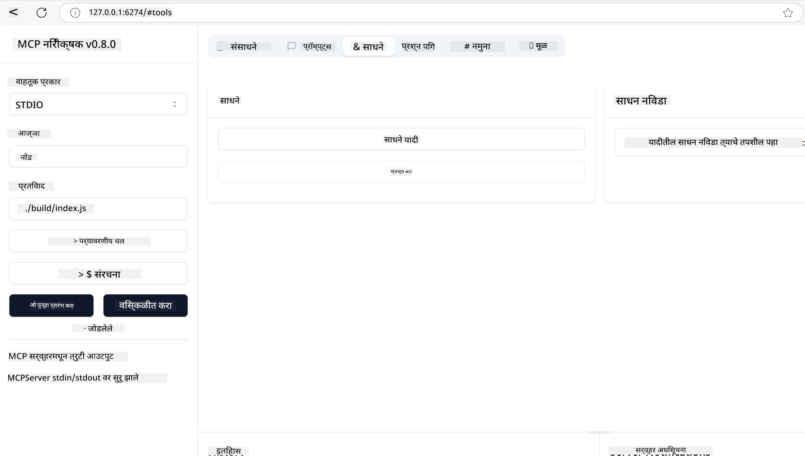

<!--
CO_OP_TRANSLATOR_METADATA:
{
  "original_hash": "5331ffd328a54b90f76706c52b673e27",
  "translation_date": "2025-05-17T08:28:41+00:00",
  "source_file": "03-GettingStarted/01-first-server/README.md",
  "language_code": "mr"
}
-->
# MCP सह प्रारंभ करा

मॉडेल कॉन्टेक्स्ट प्रोटोकॉल (MCP) सह तुमच्या पहिल्या पावलांमध्ये आपले स्वागत आहे! MCP मध्ये नवीन असो किंवा तुमची समज वाढवायची असो, हा मार्गदर्शक तुम्हाला आवश्यक सेटअप आणि विकास प्रक्रियेतून मार्गदर्शन करेल. MCP एआय मॉडेल्स आणि ऍप्लिकेशन्समधील अखंड एकत्रीकरण सक्षम कसे करते हे तुम्ही शोधाल आणि MCP-सक्षम उपाय तयार करण्यासाठी आणि चाचणीसाठी तुमचे वातावरण पटकन तयार कसे करावे हे शिकाल.

> TLDR; जर तुम्ही AI ऍप्स तयार करता, तर तुम्हाला माहित आहे की तुम्ही तुमच्या LLM (मोठ्या भाषा मॉडेल) मध्ये साधने आणि इतर संसाधने जोडू शकता, जेणेकरून LLM अधिक ज्ञानी होईल. तथापि, जर तुम्ही ती साधने आणि संसाधने सर्व्हरवर ठेवली तर ऍप आणि सर्व्हर क्षमतांचा वापर कोणत्याही क्लायंटद्वारे LLM सह/विना केला जाऊ शकतो.

## विहंगावलोकन

हे धडे MCP वातावरण सेट करण्यासाठी आणि तुमचे पहिले MCP ऍप्लिकेशन्स तयार करण्यासाठी व्यावहारिक मार्गदर्शन प्रदान करते. तुम्ही आवश्यक साधने आणि फ्रेमवर्क कसे सेट करावे, मूलभूत MCP सर्व्हर्स तयार करावे, होस्ट ऍप्लिकेशन्स तयार करावे आणि तुमच्या अंमलबजावणीची चाचणी कशी करावी हे शिकाल.

मॉडेल कॉन्टेक्स्ट प्रोटोकॉल (MCP) एक खुला प्रोटोकॉल आहे जो LLMs ला संदर्भ कसा द्यायचा हे प्रमाणित करतो. MCP ला AI ऍप्लिकेशन्ससाठी USB-C पोर्टसारखे विचार करा - हे AI मॉडेल्सना वेगवेगळ्या डेटा स्रोत आणि साधनांशी जोडण्याचा प्रमाणित मार्ग प्रदान करते.

## शिकण्याची उद्दिष्टे

या धड्याच्या शेवटी, तुम्ही सक्षम असाल:

- C#, Java, Python, TypeScript आणि JavaScript मध्ये MCP साठी विकास वातावरण सेट करा
- सानुकूल वैशिष्ट्यांसह मूलभूत MCP सर्व्हर्स तयार आणि तैनात करा (संसाधने, प्रॉम्प्ट्स आणि साधने)
- MCP सर्व्हर्सशी जोडणारे होस्ट ऍप्लिकेशन्स तयार करा
- MCP अंमलबजावणीची चाचणी आणि डिबग करा

## तुमचे MCP वातावरण सेट करणे

MCP सह काम करण्यास सुरुवात करण्यापूर्वी, तुमचे विकास वातावरण तयार करणे आणि मूलभूत कार्यप्रवाह समजून घेणे महत्त्वाचे आहे. MCP सह सुरळीत सुरुवात सुनिश्चित करण्यासाठी प्रारंभिक सेटअप चरणांद्वारे मार्गदर्शन करण्यासाठी हा विभाग आहे.

### पूर्वापेक्षा

MCP विकासात प्रवेश करण्यापूर्वी, खात्री करा की तुमच्याकडे आहे:

- **विकास वातावरण**: तुमच्या निवडलेल्या भाषेसाठी (C#, Java, Python, TypeScript किंवा JavaScript)
- **IDE/Editor**: Visual Studio, Visual Studio Code, IntelliJ, Eclipse, PyCharm किंवा कोणतेही आधुनिक कोड संपादक
- **पॅकेज मॅनेजर्स**: NuGet, Maven/Gradle, pip किंवा npm/yarn
- **API कीज**: तुमच्या होस्ट ऍप्लिकेशन्समध्ये वापरण्याची योजना आखलेल्या कोणत्याही AI सेवांसाठी

## मूलभूत MCP सर्व्हर संरचना

MCP सर्व्हरमध्ये सहसा समाविष्ट असते:

- **सर्व्हर कॉन्फिगरेशन**: पोर्ट सेटअप, प्रमाणीकरण आणि इतर सेटिंग्ज
- **संसाधने**: LLMs साठी उपलब्ध डेटा आणि संदर्भ
- **साधने**: मॉडेल्स वापरू शकणारी कार्यक्षमता
- **प्रॉम्प्ट्स**: मजकूर तयार करण्यासाठी किंवा संरचना तयार करण्यासाठी टेम्पलेट्स

TypeScript मधील एक साधा उदाहरण येथे आहे:

```typescript
import { Server, Tool, Resource } from "@modelcontextprotocol/typescript-server-sdk";

// Create a new MCP server
const server = new Server({
  port: 3000,
  name: "Example MCP Server",
  version: "1.0.0"
});

// Register a tool
server.registerTool({
  name: "calculator",
  description: "Performs basic calculations",
  parameters: {
    expression: {
      type: "string",
      description: "The math expression to evaluate"
    }
  },
  handler: async (params) => {
    const result = eval(params.expression);
    return { result };
  }
});

// Start the server
server.start();
```

वरील कोडमध्ये आम्ही:

- MCP TypeScript SDK मधून आवश्यक वर्ग आयात करा.
- नवीन MCP सर्व्हर उदाहरण तयार करा आणि कॉन्फिगर करा.
- हँडलर फंक्शनसह सानुकूल साधन (`calculator`) नोंदणी करा.
- येणाऱ्या MCP विनंत्यांसाठी सर्व्हर ऐकण्यासाठी प्रारंभ करा.

## चाचणी आणि डिबगिंग

तुमचा MCP सर्व्हर चाचणी करण्यास सुरुवात करण्यापूर्वी, उपलब्ध साधने आणि डिबगिंगसाठी सर्वोत्तम पद्धती समजून घेणे महत्त्वाचे आहे. प्रभावी चाचणी सुनिश्चित करते की तुमचा सर्व्हर अपेक्षेप्रमाणे वागतो आणि तुम्हाला समस्यांचे जलद ओळखण्यात आणि निराकरण करण्यात मदत करते. खालील विभाग तुमच्या MCP अंमलबजावणीची पडताळणी करण्यासाठी शिफारस केलेल्या पद्धतींचे रेखाटन करते.

MCP तुम्हाला तुमचे सर्व्हर्स चाचणी आणि डिबग करण्यास मदत करण्यासाठी साधने प्रदान करते:

- **Inspector tool**, हे ग्राफिकल इंटरफेस तुम्हाला तुमच्या सर्व्हरशी कनेक्ट करण्यास आणि तुमची साधने, प्रॉम्प्ट्स आणि संसाधने चाचणी करण्यास अनुमती देते.
- **curl**, तुम्ही curl सारख्या कमांड लाइन टूलचा वापर करून किंवा HTTP कमांड तयार करू शकणाऱ्या इतर क्लायंट्स वापरून तुमच्या सर्व्हरशी देखील कनेक्ट करू शकता.

### MCP Inspector वापरणे

[MCP Inspector](https://github.com/modelcontextprotocol/inspector) हे एक दृश्य चाचणी साधन आहे जे तुम्हाला मदत करते:

1. **सर्व्हर क्षमता शोधा**: उपलब्ध संसाधने, साधने आणि प्रॉम्प्ट्स आपोआप शोधा
2. **टूल अंमलबजावणीची चाचणी करा**: वेगवेगळे पॅरामीटर्स वापरून पहा आणि प्रत्यक्ष वेळेत प्रतिसाद पहा
3. **सर्व्हर मेटाडेटा पहा**: सर्व्हर माहिती, स्कीमास आणि कॉन्फिगरेशन्स तपासा

```bash
# ex TypeScript, installing and running MCP Inspector
npx @modelcontextprotocol/inspector node build/index.js
```

तुम्ही वरील कमांड्स चालवता तेव्हा, MCP Inspector तुमच्या ब्राउझरमध्ये स्थानिक वेब इंटरफेस लॉन्च करेल. तुम्ही तुमचे नोंदणीकृत MCP सर्व्हर्स, त्यांची उपलब्ध साधने, संसाधने आणि प्रॉम्प्ट्स प्रदर्शित करणारे डॅशबोर्ड पाहण्याची अपेक्षा करू शकता. इंटरफेस तुम्हाला साधन अंमलबजावणी परस्परपणे चाचणी करण्यास, सर्व्हर मेटाडेटा तपासण्यास आणि प्रत्यक्ष वेळेत प्रतिसाद पाहण्यास अनुमती देते, ज्यामुळे तुमच्या MCP सर्व्हर अंमलबजावणीची पडताळणी आणि डिबग करणे सोपे होते.

हे कसे दिसू शकते याचे स्क्रीनशॉट येथे आहे:



## सामान्य सेटअप समस्या आणि उपाय

| समस्या | संभाव्य उपाय |
|-------|-------------------|
| कनेक्शन नाकारले | तपासा की सर्व्हर चालू आहे आणि पोर्ट योग्य आहे |
| टूल अंमलबजावणी त्रुटी | पॅरामीटर पडताळणी आणि त्रुटी हाताळणी पुनरावलोकन करा |
| प्रमाणीकरण अपयश | API कीज आणि अनुमती सत्यापित करा |
| स्कीमा पडताळणी त्रुटी | खात्री करा की पॅरामीटर्स परिभाषित स्कीमाशी जुळतात |
| सर्व्हर सुरू होत नाही | पोर्ट संघर्ष किंवा अनुपस्थित अवलंबन तपासा |
| CORS त्रुटी | क्रॉस-ओरिजिन विनंत्यांसाठी योग्य CORS हेडर्स कॉन्फिगर करा |
| प्रमाणीकरण समस्या | टोकन वैधता आणि अनुमती सत्यापित करा |

## स्थानिक विकास

स्थानिक विकास आणि चाचणीसाठी, तुम्ही MCP सर्व्हर्स थेट तुमच्या मशीनवर चालवू शकता:

1. **सर्व्हर प्रक्रिया प्रारंभ करा**: तुमची MCP सर्व्हर ऍप्लिकेशन चालवा
2. **नेटवर्किंग कॉन्फिगर करा**: सर्व्हर अपेक्षित पोर्टवर प्रवेशयोग्य आहे याची खात्री करा
3. **क्लायंट्स कनेक्ट करा**: `http://localhost:3000` सारख्या स्थानिक कनेक्शन URLs वापरा

```bash
# Example: Running a TypeScript MCP server locally
npm run start
# Server running at http://localhost:3000
```

## तुमचा पहिला MCP सर्व्हर तयार करणे

आम्ही मागील धड्यात [Core concepts](/01-CoreConcepts/README.md) कव्हर केले आहे, आता त्या ज्ञानाचा वापर करण्याची वेळ आली आहे.

### सर्व्हर काय करू शकतो

आम्ही कोड लिहायला सुरुवात करण्यापूर्वी, चला आपल्याला आठवण करून देऊया की सर्व्हर काय करू शकतो:

उदाहरणार्थ, MCP सर्व्हर करू शकतो:

- स्थानिक फाइल्स आणि डेटाबेसमध्ये प्रवेश करा
- दूरस्थ API शी कनेक्ट करा
- गणना करा
- इतर साधने आणि सेवांसह एकत्रित करा
- संवादासाठी वापरकर्ता इंटरफेस प्रदान करा

छान, आता आम्हाला त्यासाठी काय करता येईल हे माहित आहे, चला कोडिंग सुरू करूया.

## सराव: सर्व्हर तयार करणे

सर्व्हर तयार करण्यासाठी, तुम्हाला खालील चरणांचे अनुसरण करणे आवश्यक आहे:

- MCP SDK स्थापित करा.
- एक प्रकल्प तयार करा आणि प्रकल्प संरचना सेट करा.
- सर्व्हर कोड लिहा.
- सर्व्हरची चाचणी करा.

### -1- SDK स्थापित करा

तुमच्या निवडलेल्या रनटाइमनुसार हे थोडे वेगळे आहे, त्यामुळे खालील रनटाइमपैकी एक निवडा:

जेनरेटिव्ह एआय मजकूर, प्रतिमा आणि अगदी कोड तयार करू शकतो.
तुम्हाला ऑक्टोबर 2023 पर्यंत डेटावर प्रशिक्षण दिले जाते.

### -2- प्रकल्प तयार करा

आता तुमच्याकडे तुमचे SDK स्थापित आहे, चला पुढे प्रकल्प तयार करूया:

### -3- प्रकल्प फाइल्स तयार करा

### -4- सर्व्हर कोड तयार करा

### -5- साधन आणि संसाधन जोडणे

खालील कोड जोडून साधन आणि संसाधन जोडा:

### -6 अंतिम कोड

आपणास आवश्यक असलेला शेवटचा कोड जोडूया जेणेकरून सर्व्हर सुरू होईल:

### -7- सर्व्हरची चाचणी करा

खालील कमांडसह सर्व्हर प्रारंभ करा:

### -8- निरीक्षक वापरून चालवा

निरीक्षक हे एक उत्तम साधन आहे जे तुमचा सर्व्हर सुरू करू शकते आणि तुम्हाला त्याच्याशी संवाद साधण्याची परवानगी देते जेणेकरून तुम्ही ते कार्य करत असल्याचे तपासू शकता. चला ते सुरू करूया:

> [!NOTE]
> "command" फील्डमध्ये वेगळे दिसू शकते कारण त्यात तुमच्या विशिष्ट रनटाइमसह सर्व्हर चालवण्यासाठी कमांड आहे

तुम्हाला खालील वापरकर्ता इंटरफेस दिसावा:


1. कनेक्ट बटण निवडून सर्व्हरशी कनेक्ट करा 
  एकदा तुम्ही सर्व्हरशी कनेक्ट झाल्यावर, तुम्हाला आता खालील दिसावे:

  

1. "Tools" आणि "listTools" निवडा, तुम्हाला "Add" दिसावे, "Add" निवडा आणि पॅरामीटर मूल्ये भरा.

  तुम्हाला खालील प्रतिसाद दिसावा, म्हणजेच "add" टूलमधून एक परिणाम:

  

अभिनंदन, तुम्ही तुमचा पहिला सर्व्हर तयार केला आणि चालवला आहे!

### अधिकृत SDKs

MCP अनेक भाषांसाठी अधिकृत SDKs प्रदान करते:
- [C# SDK](https://github.com/modelcontextprotocol/csharp-sdk) - Microsoft सह सहयोगाने देखरेख केलेले
- [Java SDK](https://github.com/modelcontextprotocol/java-sdk) - Spring AI सह सहयोगाने देखरेख केलेले
- [TypeScript SDK](https://github.com/modelcontextprotocol/typescript-sdk) - अधिकृत TypeScript अंमलबजावणी
- [Python SDK](https://github.com/modelcontextprotocol/python-sdk) - अधिकृत Python अंमलबजावणी
- [Kotlin SDK](https://github.com/modelcontextprotocol/kotlin-sdk) - अधिकृत Kotlin अंमलबजावणी
- [Swift SDK](https://github.com/modelcontextprotocol/swift-sdk) - Loopwork AI सह सहयोगाने देखरेख केलेले
- [Rust SDK](https://github.com/modelcontextprotocol/rust-sdk) - अधिकृत Rust अंमलबजावणी

## मुख्य मुद्दे

- MCP विकास वातावरण सेट करणे भाषे-विशिष्ट SDKs सह सरळ आहे
- MCP सर्व्हर्स तयार करणे आणि स्पष्ट स्कीमासह साधने नोंदणी करणे समाविष्ट आहे
- विश्वसनीय MCP अंमलबजावणीसाठी चाचणी आणि डिबगिंग आवश्यक आहे

## नमुने 

- [Java Calculator](../samples/java/calculator/README.md)
- [.Net Calculator](../../../../03-GettingStarted/samples/csharp)
- [JavaScript Calculator](../samples/javascript/README.md)
- [TypeScript Calculator](../samples/typescript/README.md)
- [Python Calculator](../../../../03-GettingStarted/samples/python)

## असाइनमेंट

तुमच्या पसंतीच्या साधनासह एक साधा MCP सर्व्हर तयार करा:
1. तुमच्या पसंतीच्या भाषेत (.NET, Java, Python किंवा JavaScript) साधन अंमलबजावणी करा.
2. इनपुट पॅरामीटर्स आणि परत मूल्ये परिभाषित करा.
3. सर्व्हर अपेक्षेप्रमाणे कार्य करत असल्याची खात्री करण्यासाठी निरीक्षक साधन चालवा.
4. विविध इनपुटसह अंमलबजावणीची चाचणी करा.

## समाधान

[Solution](./solution/README.md)

## अतिरिक्त संसाधने

- [MCP GitHub Repository](https://github.com/microsoft/mcp-for-beginners)

## पुढे काय आहे

पुढे: [MCP क्लायंटसह प्रारंभ करा](/03-GettingStarted/02-client/README.md)

**अस्वीकृती**:  
हा दस्तऐवज एआय अनुवाद सेवा [Co-op Translator](https://github.com/Azure/co-op-translator) वापरून अनुवादित केला गेला आहे. आम्ही अचूकतेसाठी प्रयत्नशील असलो तरी कृपया जाणून घ्या की स्वयंचलित अनुवादांमध्ये त्रुटी किंवा अपूर्णता असू शकते. मूळ भाषेतील मूळ दस्तऐवज अधिकृत स्रोत मानला पाहिजे. महत्त्वपूर्ण माहितीसाठी, व्यावसायिक मानवी अनुवादाची शिफारस केली जाते. या अनुवादाच्या वापरामुळे उद्भवलेल्या कोणत्याही गैरसमज किंवा चुकीच्या अर्थासाठी आम्ही जबाबदार नाही.