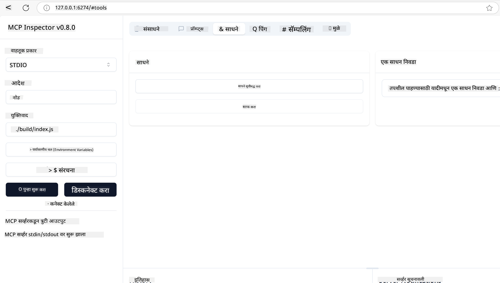
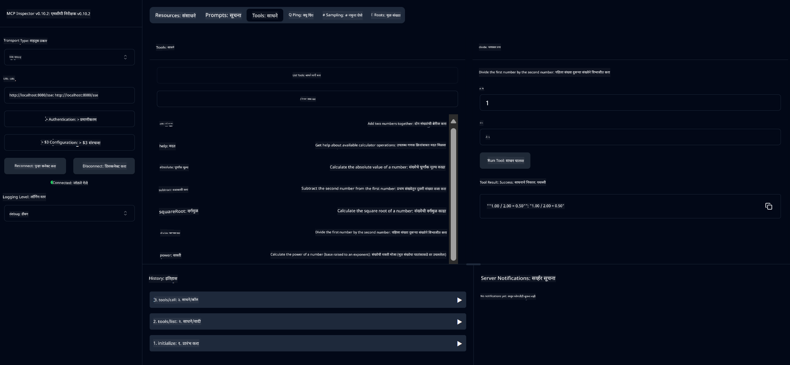
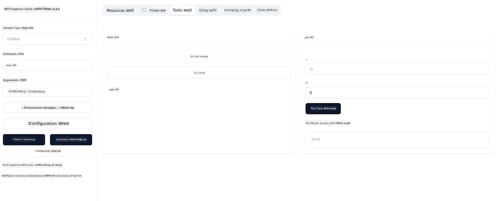

<!--
CO_OP_TRANSLATOR_METADATA:
{
  "original_hash": "ec11ee93f31fdadd94facd3e3d22f9e6",
  "translation_date": "2025-09-09T21:38:52+00:00",
  "source_file": "03-GettingStarted/01-first-server/README.md",
  "language_code": "mr"
}
-->
# MCP सुरू करण्यासाठी मार्गदर्शक

Model Context Protocol (MCP) सह तुमच्या पहिल्या पायऱ्यांमध्ये स्वागत आहे! तुम्ही MCP मध्ये नवीन असाल किंवा तुमची समज वाढवण्याचा प्रयत्न करत असाल, हा मार्गदर्शक तुम्हाला आवश्यक सेटअप आणि विकास प्रक्रियेतून मार्गदर्शन करेल. MCP कसे AI मॉडेल्स आणि अ‍ॅप्लिकेशन्समध्ये अखंडपणे समाकलित होते हे तुम्हाला समजेल आणि MCP-सक्षम सोल्यूशन्स तयार करण्यासाठी आणि चाचणीसाठी तुमचे वातावरण जलद तयार कसे करावे हे शिकाल.

> TLDR; जर तुम्ही AI अ‍ॅप्स तयार करत असाल, तर तुम्हाला माहित आहे की तुम्ही LLM (large language model) अधिक ज्ञानवान बनवण्यासाठी त्यामध्ये टूल्स आणि इतर संसाधने जोडू शकता. परंतु जर तुम्ही ती टूल्स आणि संसाधने सर्व्हरवर ठेवली, तर अ‍ॅप आणि सर्व्हरची क्षमता कोणत्याही क्लायंटद्वारे LLM सह किंवा LLM शिवाय वापरली जाऊ शकते.

## आढावा

या धड्यात MCP वातावरण सेट करण्यासाठी आणि तुमचे पहिले MCP अ‍ॅप्लिकेशन्स तयार करण्यासाठी व्यावहारिक मार्गदर्शन दिले आहे. तुम्ही आवश्यक टूल्स आणि फ्रेमवर्क सेट करणे, मूलभूत MCP सर्व्हर तयार करणे, होस्ट अ‍ॅप्लिकेशन्स तयार करणे आणि तुमच्या अंमलबजावणीची चाचणी घेणे शिकाल.

Model Context Protocol (MCP) हा एक ओपन प्रोटोकॉल आहे जो अ‍ॅप्लिकेशन्स LLM ला संदर्भ कसा प्रदान करतात याचे मानकीकरण करतो. MCP ला AI अ‍ॅप्लिकेशन्ससाठी USB-C पोर्टसारखे समजा - हे AI मॉडेल्सना विविध डेटा स्रोत आणि टूल्सशी कनेक्ट करण्याचा मानक मार्ग प्रदान करते.

## शिकण्याचे उद्दिष्ट

या धड्याच्या शेवटी, तुम्ही खालील गोष्टी करण्यात सक्षम असाल:

- C#, Java, Python, TypeScript, आणि Rust मध्ये MCP साठी विकास वातावरण सेट करणे
- सानुकूल वैशिष्ट्यांसह (संसाधने, प्रॉम्प्ट्स, आणि टूल्स) मूलभूत MCP सर्व्हर तयार करणे आणि तैनात करणे
- MCP सर्व्हर्सशी कनेक्ट होणारी होस्ट अ‍ॅप्लिकेशन्स तयार करणे
- MCP अंमलबजावणीची चाचणी घेणे आणि डीबग करणे

## तुमचे MCP वातावरण सेट करणे

MCP सह काम करण्यास सुरुवात करण्यापूर्वी, तुमचे विकास वातावरण तयार करणे आणि मूलभूत कार्यप्रवाह समजून घेणे महत्त्वाचे आहे. MCP सह सुरुवात करण्यासाठी गुळगुळीत सुरुवात सुनिश्चित करण्यासाठी प्रारंभिक सेटअप चरणांद्वारे तुम्हाला मार्गदर्शन केले जाईल.

### पूर्वतयारी

MCP विकासात जाण्यापूर्वी, खात्री करा की तुमच्याकडे खालील गोष्टी आहेत:

- **विकास वातावरण**: तुमच्या निवडलेल्या भाषेसाठी (C#, Java, Python, TypeScript, किंवा Rust)
- **IDE/Editor**: Visual Studio, Visual Studio Code, IntelliJ, Eclipse, PyCharm, किंवा कोणताही आधुनिक कोड एडिटर
- **पॅकेज मॅनेजर्स**: NuGet, Maven/Gradle, pip, npm/yarn, किंवा Cargo
- **API Keys**: तुमच्या होस्ट अ‍ॅप्लिकेशन्समध्ये वापरण्याची योजना असलेल्या कोणत्याही AI सेवांसाठी

## मूलभूत MCP सर्व्हर संरचना

MCP सर्व्हरमध्ये सामान्यतः खालील गोष्टी असतात:

- **सर्व्हर कॉन्फिगरेशन**: पोर्ट, प्रमाणीकरण, आणि इतर सेटिंग्ज सेट करणे
- **संसाधने**: LLM ला उपलब्ध करून दिलेला डेटा आणि संदर्भ
- **टूल्स**: मॉडेल्स जे कार्य करू शकतात
- **प्रॉम्प्ट्स**: मजकूर तयार करण्यासाठी किंवा संरचना करण्यासाठी टेम्पलेट्स

TypeScript मधील एक साधा उदाहरण येथे आहे:

```typescript
import { McpServer, ResourceTemplate } from "@modelcontextprotocol/sdk/server/mcp.js";
import { StdioServerTransport } from "@modelcontextprotocol/sdk/server/stdio.js";
import { z } from "zod";

// Create an MCP server
const server = new McpServer({
  name: "Demo",
  version: "1.0.0"
});

// Add an addition tool
server.tool("add",
  { a: z.number(), b: z.number() },
  async ({ a, b }) => ({
    content: [{ type: "text", text: String(a + b) }]
  })
);

// Add a dynamic greeting resource
server.resource(
  "file",
  // The 'list' parameter controls how the resource lists available files. Setting it to undefined disables listing for this resource.
  new ResourceTemplate("file://{path}", { list: undefined }),
  async (uri, { path }) => ({
    contents: [{
      uri: uri.href,
      text: `File, ${path}!`
    }]
  })
);

// Add a file resource that reads the file contents
server.resource(
  "file",
  new ResourceTemplate("file://{path}", { list: undefined }),
  async (uri, { path }) => {
    let text;
    try {
      text = await fs.readFile(path, "utf8");
    } catch (err) {
      text = `Error reading file: ${err.message}`;
    }
    return {
      contents: [{
        uri: uri.href,
        text
      }]
    };
  }
);

server.prompt(
  "review-code",
  { code: z.string() },
  ({ code }) => ({
    messages: [{
      role: "user",
      content: {
        type: "text",
        text: `Please review this code:\n\n${code}`
      }
    }]
  })
);

// Start receiving messages on stdin and sending messages on stdout
const transport = new StdioServerTransport();
await server.connect(transport);
```

वरील कोडमध्ये आम्ही:

- MCP TypeScript SDK मधून आवश्यक वर्ग आयात केले.
- नवीन MCP सर्व्हर उदाहरण तयार केले आणि कॉन्फिगर केले.
- सानुकूल टूल (`calculator`) एक हँडलर फंक्शनसह नोंदवले.
- येणाऱ्या MCP विनंत्यांसाठी सर्व्हर सुरू केला.

## चाचणी आणि डीबगिंग

तुमचा MCP सर्व्हर चाचणी घेण्यास सुरुवात करण्यापूर्वी, उपलब्ध टूल्स आणि डीबगिंगसाठी सर्वोत्तम पद्धती समजून घेणे महत्त्वाचे आहे. प्रभावी चाचणी तुमचा सर्व्हर अपेक्षेप्रमाणे वागतो याची खात्री करते आणि तुम्हाला समस्या पटकन ओळखण्यात आणि सोडवण्यात मदत करते. खालील विभाग MCP अंमलबजावणीची पडताळणी करण्यासाठी शिफारस केलेल्या पद्धतींचे वर्णन करतो.

MCP तुम्हाला तुमचे सर्व्हर्स चाचणी घेण्यासाठी आणि डीबग करण्यासाठी टूल्स प्रदान करते:

- **Inspector tool**, हे ग्राफिकल इंटरफेस तुम्हाला तुमच्या सर्व्हरशी कनेक्ट होऊन टूल्स, प्रॉम्प्ट्स आणि संसाधने चाचणी घेण्यास अनुमती देते.
- **curl**, तुम्ही कमांड लाइन टूल curl किंवा HTTP कमांड तयार आणि चालवू शकणाऱ्या इतर क्लायंट्स वापरून तुमच्या सर्व्हरशी कनेक्ट होऊ शकता.

### MCP Inspector वापरणे

[MCP Inspector](https://github.com/modelcontextprotocol/inspector) हा एक व्हिज्युअल चाचणी टूल आहे जो तुम्हाला मदत करतो:

1. **सर्व्हर क्षमता शोधा**: उपलब्ध संसाधने, टूल्स, आणि प्रॉम्प्ट्स आपोआप शोधा
2. **टूल अंमलबजावणी चाचणी**: विविध पॅरामीटर्स वापरून प्रत्यक्ष प्रतिसाद पहा
3. **सर्व्हर मेटाडेटा पहा**: सर्व्हर माहिती, स्कीमाज, आणि कॉन्फिगरेशन्स तपासा

```bash
# ex TypeScript, installing and running MCP Inspector
npx @modelcontextprotocol/inspector node build/index.js
```

वरील कमांड्स चालवल्यावर, MCP Inspector तुमच्या ब्राउझरमध्ये स्थानिक वेब इंटरफेस सुरू करेल. तुम्हाला तुमच्या नोंदणीकृत MCP सर्व्हर्स, त्यांचे उपलब्ध टूल्स, संसाधने, आणि प्रॉम्प्ट्स दर्शवणारा डॅशबोर्ड दिसेल. इंटरफेस तुम्हाला संवादात्मकपणे टूल अंमलबजावणी चाचणी घेण्यास, सर्व्हर मेटाडेटा तपासण्यास, आणि प्रत्यक्ष प्रतिसाद पाहण्यास अनुमती देते, ज्यामुळे तुमच्या MCP सर्व्हर अंमलबजावणीची पडताळणी आणि डीबग करणे सोपे होते.

येथे एक स्क्रीनशॉट आहे की ते कसे दिसू शकते:



## सामान्य सेटअप समस्या आणि उपाय

| समस्या | संभाव्य उपाय |
|-------|-------------------|
| कनेक्शन नाकारले | सर्व्हर चालू आहे आणि पोर्ट योग्य आहे का ते तपासा |
| टूल अंमलबजावणी त्रुटी | पॅरामीटर पडताळणी आणि त्रुटी हाताळणी पुनरावलोकन करा |
| प्रमाणीकरण अपयश | API कीज आणि परवानग्या सत्यापित करा |
| स्कीमा पडताळणी त्रुटी | पॅरामीटर्स परिभाषित स्कीमाशी जुळत आहेत याची खात्री करा |
| सर्व्हर सुरू होत नाही | पोर्ट संघर्ष किंवा हरवलेली अवलंबन तपासा |
| CORS त्रुटी | क्रॉस-ऑरिजिन विनंत्यांसाठी योग्य CORS हेडर्स कॉन्फिगर करा |
| प्रमाणीकरण समस्या | टोकन वैधता आणि परवानग्या सत्यापित करा |

## स्थानिक विकास

स्थानिक विकास आणि चाचणीसाठी, तुम्ही MCP सर्व्हर्स थेट तुमच्या मशीनवर चालवू शकता:

1. **सर्व्हर प्रक्रिया सुरू करा**: तुमचे MCP सर्व्हर अ‍ॅप्लिकेशन चालवा
2. **नेटवर्किंग कॉन्फिगर करा**: सर्व्हर अपेक्षित पोर्टवर प्रवेशयोग्य आहे याची खात्री करा
3. **क्लायंट्स कनेक्ट करा**: `http://localhost:3000` सारख्या स्थानिक कनेक्शन URLs वापरा

```bash
# Example: Running a TypeScript MCP server locally
npm run start
# Server running at http://localhost:3000
```

## तुमचा पहिला MCP सर्व्हर तयार करणे

आम्ही मागील धड्यात [Core concepts](/01-CoreConcepts/README.md) कव्हर केले आहेत, आता त्या ज्ञानाचा उपयोग करण्याची वेळ आली आहे.

### सर्व्हर काय करू शकतो

कोड लिहायला सुरुवात करण्यापूर्वी, आपण फक्त आठवण करून देऊया की सर्व्हर काय करू शकतो:

MCP सर्व्हर उदाहरणार्थ:

- स्थानिक फाइल्स आणि डेटाबेसमध्ये प्रवेश करू शकतो
- रिमोट APIs शी कनेक्ट होऊ शकतो
- गणना करू शकतो
- इतर टूल्स आणि सेवांसह समाकलित होऊ शकतो
- संवादासाठी वापरकर्ता इंटरफेस प्रदान करू शकतो

छान, आता आपल्याला काय करता येईल हे माहित आहे, चला कोडिंग सुरू करूया.

## सराव: सर्व्हर तयार करणे

सर्व्हर तयार करण्यासाठी, तुम्हाला खालील चरणांचे अनुसरण करावे लागेल:

- MCP SDK स्थापित करा.
- प्रकल्प तयार करा आणि प्रकल्प संरचना सेट करा.
- सर्व्हर कोड लिहा.
- सर्व्हरची चाचणी घ्या.

### -1- प्रकल्प तयार करा

#### TypeScript

```sh
# Create project directory and initialize npm project
mkdir calculator-server
cd calculator-server
npm init -y
```

#### Python

```sh
# Create project dir
mkdir calculator-server
cd calculator-server
# Open the folder in Visual Studio Code - Skip this if you are using a different IDE
code .
```

#### .NET

```sh
dotnet new console -n McpCalculatorServer
cd McpCalculatorServer
```

#### Java

Java साठी, Spring Boot प्रकल्प तयार करा:

```bash
curl https://start.spring.io/starter.zip \
  -d dependencies=web \
  -d javaVersion=21 \
  -d type=maven-project \
  -d groupId=com.example \
  -d artifactId=calculator-server \
  -d name=McpServer \
  -d packageName=com.microsoft.mcp.sample.server \
  -o calculator-server.zip
```

झिप फाइल एक्स्ट्रॅक्ट करा:

```bash
unzip calculator-server.zip -d calculator-server
cd calculator-server
# optional remove the unused test
rm -rf src/test/java
```

तुमच्या *pom.xml* फाइलमध्ये खालील पूर्ण कॉन्फिगरेशन जोडा:

```xml
<?xml version="1.0" encoding="UTF-8"?>
<project xmlns="http://maven.apache.org/POM/4.0.0"
    xmlns:xsi="http://www.w3.org/2001/XMLSchema-instance"
    xsi:schemaLocation="http://maven.apache.org/POM/4.0.0 http://maven.apache.org/xsd/maven-4.0.0.xsd">
    <modelVersion>4.0.0</modelVersion>
    
    <!-- Spring Boot parent for dependency management -->
    <parent>
        <groupId>org.springframework.boot</groupId>
        <artifactId>spring-boot-starter-parent</artifactId>
        <version>3.5.0</version>
        <relativePath />
    </parent>

    <!-- Project coordinates -->
    <groupId>com.example</groupId>
    <artifactId>calculator-server</artifactId>
    <version>0.0.1-SNAPSHOT</version>
    <name>Calculator Server</name>
    <description>Basic calculator MCP service for beginners</description>

    <!-- Properties -->
    <properties>
        <java.version>21</java.version>
        <maven.compiler.source>21</maven.compiler.source>
        <maven.compiler.target>21</maven.compiler.target>
    </properties>

    <!-- Spring AI BOM for version management -->
    <dependencyManagement>
        <dependencies>
            <dependency>
                <groupId>org.springframework.ai</groupId>
                <artifactId>spring-ai-bom</artifactId>
                <version>1.0.0-SNAPSHOT</version>
                <type>pom</type>
                <scope>import</scope>
            </dependency>
        </dependencies>
    </dependencyManagement>

    <!-- Dependencies -->
    <dependencies>
        <dependency>
            <groupId>org.springframework.ai</groupId>
            <artifactId>spring-ai-starter-mcp-server-webflux</artifactId>
        </dependency>
        <dependency>
            <groupId>org.springframework.boot</groupId>
            <artifactId>spring-boot-starter-actuator</artifactId>
        </dependency>
        <dependency>
         <groupId>org.springframework.boot</groupId>
         <artifactId>spring-boot-starter-test</artifactId>
         <scope>test</scope>
      </dependency>
    </dependencies>

    <!-- Build configuration -->
    <build>
        <plugins>
            <plugin>
                <groupId>org.springframework.boot</groupId>
                <artifactId>spring-boot-maven-plugin</artifactId>
            </plugin>
            <plugin>
                <groupId>org.apache.maven.plugins</groupId>
                <artifactId>maven-compiler-plugin</artifactId>
                <configuration>
                    <release>21</release>
                </configuration>
            </plugin>
        </plugins>
    </build>

    <!-- Repositories for Spring AI snapshots -->
    <repositories>
        <repository>
            <id>spring-milestones</id>
            <name>Spring Milestones</name>
            <url>https://repo.spring.io/milestone</url>
            <snapshots>
                <enabled>false</enabled>
            </snapshots>
        </repository>
        <repository>
            <id>spring-snapshots</id>
            <name>Spring Snapshots</name>
            <url>https://repo.spring.io/snapshot</url>
            <releases>
                <enabled>false</enabled>
            </releases>
        </repository>
    </repositories>
</project>
```

#### Rust

```sh
mkdir calculator-server
cd calculator-server
cargo init
```

### -2- अवलंबन जोडा

आता तुमचा प्रकल्प तयार झाला आहे, पुढे अवलंबन जोडा:

#### TypeScript

```sh
# If not already installed, install TypeScript globally
npm install typescript -g

# Install the MCP SDK and Zod for schema validation
npm install @modelcontextprotocol/sdk zod
npm install -D @types/node typescript
```

#### Python

```sh
# Create a virtual env and install dependencies
python -m venv venv
venv\Scripts\activate
pip install "mcp[cli]"
```

#### Java

```bash
cd calculator-server
./mvnw clean install -DskipTests
```

#### Rust

```sh
cargo add rmcp --features server,transport-io
cargo add serde
cargo add tokio --features rt-multi-thread
```

### -3- प्रकल्प फाइल्स तयार करा

#### TypeScript

*package.json* फाइल उघडा आणि सर्व्हर तयार आणि चालवू शकता याची खात्री करण्यासाठी खालील सामग्रीने सामग्री बदला:

```json
{
  "name": "calculator-server",
  "version": "1.0.0",
  "main": "index.js",
  "type": "module",
  "scripts": {
    "start": "tsc && node ./build/index.js",
    "build": "tsc && node ./build/index.js"
  },
  "keywords": [],
  "author": "",
  "license": "ISC",
  "description": "A simple calculator server using Model Context Protocol",
  "dependencies": {
    "@modelcontextprotocol/sdk": "^1.16.0",
    "zod": "^3.25.76"
  },
  "devDependencies": {
    "@types/node": "^24.0.14",
    "typescript": "^5.8.3"
  }
}
```

*tsconfig.json* तयार करा खालील सामग्रीसह:

```json
{
  "compilerOptions": {
    "target": "ES2022",
    "module": "Node16",
    "moduleResolution": "Node16",
    "outDir": "./build",
    "rootDir": "./src",
    "strict": true,
    "esModuleInterop": true,
    "skipLibCheck": true,
    "forceConsistentCasingInFileNames": true
  },
  "include": ["src/**/*"],
  "exclude": ["node_modules"]
}
```

तुमच्या स्रोत कोडसाठी एक डिरेक्टरी तयार करा:

```sh
mkdir src
touch src/index.ts
```

#### Python

*server.py* नावाची फाइल तयार करा

```sh
touch server.py
```

#### .NET

आवश्यक NuGet पॅकेजेस स्थापित करा:

```sh
dotnet add package ModelContextProtocol --prerelease
dotnet add package Microsoft.Extensions.Hosting
```

#### Java

Java Spring Boot प्रकल्पांसाठी, प्रकल्प संरचना आपोआप तयार केली जाते.

#### Rust

Rust साठी, *src/main.rs* फाइल *cargo init* चालवल्यावर डीफॉल्टने तयार केली जाते. फाइल उघडा आणि डीफॉल्ट कोड हटवा.

### -4- सर्व्हर कोड तयार करा

#### TypeScript

*index.ts* नावाची फाइल तयार करा आणि खालील कोड जोडा:

```typescript
import { McpServer, ResourceTemplate } from "@modelcontextprotocol/sdk/server/mcp.js";
import { StdioServerTransport } from "@modelcontextprotocol/sdk/server/stdio.js";
import { z } from "zod";
 
// Create an MCP server
const server = new McpServer({
  name: "Calculator MCP Server",
  version: "1.0.0"
});
```

आता तुमच्याकडे सर्व्हर आहे, परंतु ते फारसे करत नाही, चला ते सुधारूया.

#### Python

```python
# server.py
from mcp.server.fastmcp import FastMCP

# Create an MCP server
mcp = FastMCP("Demo")
```

#### .NET

```csharp
using Microsoft.Extensions.DependencyInjection;
using Microsoft.Extensions.Hosting;
using Microsoft.Extensions.Logging;
using ModelContextProtocol.Server;
using System.ComponentModel;

var builder = Host.CreateApplicationBuilder(args);
builder.Logging.AddConsole(consoleLogOptions =>
{
    // Configure all logs to go to stderr
    consoleLogOptions.LogToStandardErrorThreshold = LogLevel.Trace;
});

builder.Services
    .AddMcpServer()
    .WithStdioServerTransport()
    .WithToolsFromAssembly();
await builder.Build().RunAsync();

// add features
```

#### Java

Java साठी, मुख्य सर्व्हर घटक तयार करा. प्रथम, मुख्य अ‍ॅप्लिकेशन वर्ग सुधारित करा:

*src/main/java/com/microsoft/mcp/sample/server/McpServerApplication.java*:

```java
package com.microsoft.mcp.sample.server;

import org.springframework.ai.tool.ToolCallbackProvider;
import org.springframework.ai.tool.method.MethodToolCallbackProvider;
import org.springframework.boot.SpringApplication;
import org.springframework.boot.autoconfigure.SpringBootApplication;
import org.springframework.context.annotation.Bean;
import com.microsoft.mcp.sample.server.service.CalculatorService;

@SpringBootApplication
public class McpServerApplication {

    public static void main(String[] args) {
        SpringApplication.run(McpServerApplication.class, args);
    }
    
    @Bean
    public ToolCallbackProvider calculatorTools(CalculatorService calculator) {
        return MethodToolCallbackProvider.builder().toolObjects(calculator).build();
    }
}
```

*src/main/java/com/microsoft/mcp/sample/server/service/CalculatorService.java* मध्ये कॅल्क्युलेटर सेवा तयार करा:

```java
package com.microsoft.mcp.sample.server.service;

import org.springframework.ai.tool.annotation.Tool;
import org.springframework.stereotype.Service;

/**
 * Service for basic calculator operations.
 * This service provides simple calculator functionality through MCP.
 */
@Service
public class CalculatorService {

    /**
     * Add two numbers
     * @param a The first number
     * @param b The second number
     * @return The sum of the two numbers
     */
    @Tool(description = "Add two numbers together")
    public String add(double a, double b) {
        double result = a + b;
        return formatResult(a, "+", b, result);
    }

    /**
     * Subtract one number from another
     * @param a The number to subtract from
     * @param b The number to subtract
     * @return The result of the subtraction
     */
    @Tool(description = "Subtract the second number from the first number")
    public String subtract(double a, double b) {
        double result = a - b;
        return formatResult(a, "-", b, result);
    }

    /**
     * Multiply two numbers
     * @param a The first number
     * @param b The second number
     * @return The product of the two numbers
     */
    @Tool(description = "Multiply two numbers together")
    public String multiply(double a, double b) {
        double result = a * b;
        return formatResult(a, "*", b, result);
    }

    /**
     * Divide one number by another
     * @param a The numerator
     * @param b The denominator
     * @return The result of the division
     */
    @Tool(description = "Divide the first number by the second number")
    public String divide(double a, double b) {
        if (b == 0) {
            return "Error: Cannot divide by zero";
        }
        double result = a / b;
        return formatResult(a, "/", b, result);
    }

    /**
     * Calculate the power of a number
     * @param base The base number
     * @param exponent The exponent
     * @return The result of raising the base to the exponent
     */
    @Tool(description = "Calculate the power of a number (base raised to an exponent)")
    public String power(double base, double exponent) {
        double result = Math.pow(base, exponent);
        return formatResult(base, "^", exponent, result);
    }

    /**
     * Calculate the square root of a number
     * @param number The number to find the square root of
     * @return The square root of the number
     */
    @Tool(description = "Calculate the square root of a number")
    public String squareRoot(double number) {
        if (number < 0) {
            return "Error: Cannot calculate square root of a negative number";
        }
        double result = Math.sqrt(number);
        return String.format("√%.2f = %.2f", number, result);
    }

    /**
     * Calculate the modulus (remainder) of division
     * @param a The dividend
     * @param b The divisor
     * @return The remainder of the division
     */
    @Tool(description = "Calculate the remainder when one number is divided by another")
    public String modulus(double a, double b) {
        if (b == 0) {
            return "Error: Cannot divide by zero";
        }
        double result = a % b;
        return formatResult(a, "%", b, result);
    }

    /**
     * Calculate the absolute value of a number
     * @param number The number to find the absolute value of
     * @return The absolute value of the number
     */
    @Tool(description = "Calculate the absolute value of a number")
    public String absolute(double number) {
        double result = Math.abs(number);
        return String.format("|%.2f| = %.2f", number, result);
    }

    /**
     * Get help about available calculator operations
     * @return Information about available operations
     */
    @Tool(description = "Get help about available calculator operations")
    public String help() {
        return "Basic Calculator MCP Service\n\n" +
               "Available operations:\n" +
               "1. add(a, b) - Adds two numbers\n" +
               "2. subtract(a, b) - Subtracts the second number from the first\n" +
               "3. multiply(a, b) - Multiplies two numbers\n" +
               "4. divide(a, b) - Divides the first number by the second\n" +
               "5. power(base, exponent) - Raises a number to a power\n" +
               "6. squareRoot(number) - Calculates the square root\n" + 
               "7. modulus(a, b) - Calculates the remainder of division\n" +
               "8. absolute(number) - Calculates the absolute value\n\n" +
               "Example usage: add(5, 3) will return 5 + 3 = 8";
    }

    /**
     * Format the result of a calculation
     */
    private String formatResult(double a, String operator, double b, double result) {
        return String.format("%.2f %s %.2f = %.2f", a, operator, b, result);
    }
}
```

**उत्पादन-तयार सेवेसाठी पर्यायी घटक:**

*src/main/java/com/microsoft/mcp/sample/server/config/StartupConfig.java* मध्ये स्टार्टअप कॉन्फिगरेशन तयार करा:

```java
package com.microsoft.mcp.sample.server.config;

import org.springframework.boot.CommandLineRunner;
import org.springframework.context.annotation.Bean;
import org.springframework.context.annotation.Configuration;

@Configuration
public class StartupConfig {
    
    @Bean
    public CommandLineRunner startupInfo() {
        return args -> {
            System.out.println("\n" + "=".repeat(60));
            System.out.println("Calculator MCP Server is starting...");
            System.out.println("SSE endpoint: http://localhost:8080/sse");
            System.out.println("Health check: http://localhost:8080/actuator/health");
            System.out.println("=".repeat(60) + "\n");
        };
    }
}
```

*src/main/java/com/microsoft/mcp/sample/server/controller/HealthController.java* मध्ये हेल्थ कंट्रोलर तयार करा:

```java
package com.microsoft.mcp.sample.server.controller;

import org.springframework.http.ResponseEntity;
import org.springframework.web.bind.annotation.GetMapping;
import org.springframework.web.bind.annotation.RestController;
import java.time.LocalDateTime;
import java.util.HashMap;
import java.util.Map;

@RestController
public class HealthController {
    
    @GetMapping("/health")
    public ResponseEntity<Map<String, Object>> healthCheck() {
        Map<String, Object> response = new HashMap<>();
        response.put("status", "UP");
        response.put("timestamp", LocalDateTime.now().toString());
        response.put("service", "Calculator MCP Server");
        return ResponseEntity.ok(response);
    }
}
```

*src/main/java/com/microsoft/mcp/sample/server/exception/GlobalExceptionHandler.java* मध्ये अपवाद हँडलर तयार करा:

```java
package com.microsoft.mcp.sample.server.exception;

import org.springframework.http.HttpStatus;
import org.springframework.http.ResponseEntity;
import org.springframework.web.bind.annotation.ExceptionHandler;
import org.springframework.web.bind.annotation.RestControllerAdvice;

@RestControllerAdvice
public class GlobalExceptionHandler {

    @ExceptionHandler(IllegalArgumentException.class)
    public ResponseEntity<ErrorResponse> handleIllegalArgumentException(IllegalArgumentException ex) {
        ErrorResponse error = new ErrorResponse(
            "Invalid_Input", 
            "Invalid input parameter: " + ex.getMessage());
        return new ResponseEntity<>(error, HttpStatus.BAD_REQUEST);
    }

    public static class ErrorResponse {
        private String code;
        private String message;

        public ErrorResponse(String code, String message) {
            this.code = code;
            this.message = message;
        }

        // Getters
        public String getCode() { return code; }
        public String getMessage() { return message; }
    }
}
```

*src/main/resources/banner.txt* मध्ये कस्टम बॅनर तयार करा:

```text
_____      _            _       _             
 / ____|    | |          | |     | |            
| |     __ _| | ___ _   _| | __ _| |_ ___  _ __ 
| |    / _` | |/ __| | | | |/ _` | __/ _ \| '__|
| |___| (_| | | (__| |_| | | (_| | || (_) | |   
 \_____\__,_|_|\___|\__,_|_|\__,_|\__\___/|_|   
                                                
Calculator MCP Server v1.0
Spring Boot MCP Application
```

#### Rust

*src/main.rs* फाइलच्या शीर्षस्थानी खालील कोड जोडा. हे तुमच्या MCP सर्व्हरसाठी आवश्यक लायब्ररी आणि मॉड्यूल्स आयात करते.

```rust
use rmcp::{
    handler::server::{router::tool::ToolRouter, tool::Parameters},
    model::{ServerCapabilities, ServerInfo},
    schemars, tool, tool_handler, tool_router,
    transport::stdio,
    ServerHandler, ServiceExt,
};
use std::error::Error;
```

कॅल्क्युलेटर सर्व्हर दोन संख्या एकत्र जोडू शकतो. कॅल्क्युलेटर विनंतीचे प्रतिनिधित्व करण्यासाठी एक स्ट्रक तयार करूया.

```rust
#[derive(Debug, serde::Deserialize, schemars::JsonSchema)]
pub struct CalculatorRequest {
    pub a: f64,
    pub b: f64,
}
```

पुढे, कॅल्क्युलेटर सर्व्हरचे प्रतिनिधित्व करण्यासाठी एक स्ट्रक तयार करा. हा स्ट्रक टूल राउटर ठेवेल, जो टूल्स नोंदवण्यासाठी वापरला जातो.

```rust
#[derive(Debug, Clone)]
pub struct Calculator {
    tool_router: ToolRouter<Self>,
}
```

आता, आम्ही `Calculator` स्ट्रक अंमलात आणू शकतो जेणेकरून सर्व्हरची नवीन उदाहरणे तयार करता येतील आणि सर्व्हर हँडलर अंमलात आणता येईल.

```rust
#[tool_router]
impl Calculator {
    pub fn new() -> Self {
        Self {
            tool_router: Self::tool_router(),
        }
    }
}

#[tool_handler]
impl ServerHandler for Calculator {
    fn get_info(&self) -> ServerInfo {
        ServerInfo {
            instructions: Some("A simple calculator tool".into()),
            capabilities: ServerCapabilities::builder().enable_tools().build(),
            ..Default::default()
        }
    }
}
```

शेवटी, सर्व्हर सुरू करण्यासाठी मुख्य फंक्शन अंमलात आणणे आवश्यक आहे. हे फंक्शन `Calculator` स्ट्रकचे उदाहरण तयार करेल आणि ते मानक इनपुट/आउटपुटवर सर्व्ह करेल.

```rust
#[tokio::main]
async fn main() -> Result<(), Box<dyn Error>> {
    let service = Calculator::new().serve(stdio()).await?;
    service.waiting().await?;
    Ok(())
}
```

सर्व्हर आता स्वतःबद्दल मूलभूत माहिती प्रदान करण्यासाठी सेट आहे. पुढे, आम्ही एक टूल जोडू जे बेरीज करेल.

### -5- टूल आणि संसाधन जोडणे

टूल आणि संसाधन जोडण्यासाठी खालील कोड जोडा:

#### TypeScript

```typescript
server.tool(
  "add",
  { a: z.number(), b: z.number() },
  async ({ a, b }) => ({
    content: [{ type: "text", text: String(a + b) }]
  })
);

server.resource(
  "greeting",
  new ResourceTemplate("greeting://{name}", { list: undefined }),
  async (uri, { name }) => ({
    contents: [{
      uri: uri.href,
      text: `Hello, ${name}!`
    }]
  })
);
```

तुमचे टूल `a` आणि `b` पॅरामीटर्स घेतात आणि एक फंक्शन चालवते जे प्रतिसाद तयार करते:

```typescript
{
  contents: [{
    type: "text", content: "some content"
  }]
}
```

तुमचे संसाधन "greeting" स्ट्रिंगद्वारे प्रवेश केले जाते आणि `name` पॅरामीटर घेतात आणि टूलसारखा प्रतिसाद तयार करते:

```typescript
{
  uri: "<href>",
  text: "a text"
}
```

#### Python

```python
# Add an addition tool
@mcp.tool()
def add(a: int, b: int) -> int:
    """Add two numbers"""
    return a + b


# Add a dynamic greeting resource
@mcp.resource("greeting://{name}")
def get_greeting(name: str) -> str:
    """Get a personalized greeting"""
    return f"Hello, {name}!"
```

वरील कोडमध्ये आम्ही:

- `add` नावाचे टूल परिभाषित केले आहे जे दोन पूर्णांक पॅरामीटर्स `a` आणि `p` घेतात.
- `greeting` नावाचे संसाधन तयार केले आहे जे `name` पॅरामीटर घेतात.

#### .NET

तुमच्या Program.cs फाइलमध्ये हे जोडा:

```csharp
[McpServerToolType]
public static class CalculatorTool
{
    [McpServerTool, Description("Adds two numbers")]
    public static string Add(int a, int b) => $"Sum {a + b}";
}
```

#### Java

टूल्स आधीच मागील चरणात तयार केले गेले आहेत.

#### Rust

`impl Calculator` ब्लॉकमध्ये नवीन टूल जोडा:

```rust
#[tool(description = "Adds a and b")]
async fn add(
    &self,
    Parameters(CalculatorRequest { a, b }): Parameters<CalculatorRequest>,
) -> String {
    (a + b).to_string()
}
```

### -6- अंतिम कोड

चला शेवटचा कोड जोडूया जेणेकरून सर्व्हर सुरू होऊ शकेल:

#### TypeScript

```typescript
// Start receiving messages on stdin and sending messages on stdout
const transport = new StdioServerTransport();
await server.connect(transport);
```

पूर्ण कोड येथे आहे:

```typescript
// index.ts
import { McpServer, ResourceTemplate } from "@modelcontextprotocol/sdk/server/mcp.js";
import { StdioServerTransport } from "@modelcontextprotocol/sdk/server/stdio.js";
import { z } from "zod";

// Create an MCP server
const server = new McpServer({
  name: "Calculator MCP Server",
  version: "1.0.0"
});

// Add an addition tool
server.tool(
  "add",
  { a: z.number(), b: z.number() },
  async ({ a, b }) => ({
    content: [{ type: "text", text: String(a + b) }]
  })
);

// Add a dynamic greeting resource
server.resource(
  "greeting",
  new ResourceTemplate("greeting://{name}", { list: undefined }),
  async (uri, { name }) => ({
    contents: [{
      uri: uri.href,
      text: `Hello, ${name}!`
    }]
  })
);

// Start receiving messages on stdin and sending messages on stdout
const transport = new StdioServerTransport();
server.connect(transport);
```

#### Python

```python
# server.py
from mcp.server.fastmcp import FastMCP

# Create an MCP server
mcp = FastMCP("Demo")


# Add an addition tool
@mcp.tool()
def add(a: int, b: int) -> int:
    """Add two numbers"""
    return a + b


# Add a dynamic greeting resource
@mcp.resource("greeting://{name}")
def get_greeting(name: str) -> str:
    """Get a personalized greeting"""
    return f"Hello, {name}!"

# Main execution block - this is required to run the server
if __name__ == "__main__":
    mcp.run()
```

#### .NET

Program.cs फाइल तयार करा खालील सामग्रीसह:

```csharp
using Microsoft.Extensions.DependencyInjection;
using Microsoft.Extensions.Hosting;
using Microsoft.Extensions.Logging;
using ModelContextProtocol.Server;
using System.ComponentModel;

var builder = Host.CreateApplicationBuilder(args);
builder.Logging.AddConsole(consoleLogOptions =>
{
    // Configure all logs to go to stderr
    consoleLogOptions.LogToStandardErrorThreshold = LogLevel.Trace;
});

builder.Services
    .AddMcpServer()
    .WithStdioServerTransport()
    .WithToolsFromAssembly();
await builder.Build().RunAsync();

[McpServerToolType]
public static class CalculatorTool
{
    [McpServerTool, Description("Adds two numbers")]
    public static string Add(int a, int b) => $"Sum {a + b}";
}
```

#### Java

तुमचा पूर्ण मुख्य अ‍ॅप्लिकेशन वर्ग असा दिसायला हवा:

```java
// McpServerApplication.java
package com.microsoft.mcp.sample.server;

import org.springframework.ai.tool.ToolCallbackProvider;
import org.springframework.ai.tool.method.MethodToolCallbackProvider;
import org.springframework.boot.SpringApplication;
import org.springframework.boot.autoconfigure.SpringBootApplication;
import org.springframework.context.annotation.Bean;
import com.microsoft.mcp.sample.server.service.CalculatorService;

@SpringBootApplication
public class McpServerApplication {

    public static void main(String[] args) {
        SpringApplication.run(McpServerApplication.class, args);
    }
    
    @Bean
    public ToolCallbackProvider calculatorTools(CalculatorService calculator) {
        return MethodToolCallbackProvider.builder().toolObjects(calculator).build();
    }
}
```

#### Rust

Rust सर्व्हरसाठी अंतिम कोड असा दिसायला हवा:

```rust
use rmcp::{
    ServerHandler, ServiceExt,
    handler::server::{router::tool::ToolRouter, tool::Parameters},
    model::{ServerCapabilities, ServerInfo},
    schemars, tool, tool_handler, tool_router,
    transport::stdio,
};
use std::error::Error;

#[derive(Debug, serde::Deserialize, schemars::JsonSchema)]
pub struct CalculatorRequest {
    pub a: f64,
    pub b: f64,
}

#[derive(Debug, Clone)]
pub struct Calculator {
    tool_router: ToolRouter<Self>,
}

#[tool_router]
impl Calculator {
    pub fn new() -> Self {
        Self {
            tool_router: Self::tool_router(),
        }
    }
    
    #[tool(description = "Adds a and b")]
    async fn add(
        &self,
        Parameters(CalculatorRequest { a, b }): Parameters<CalculatorRequest>,
    ) -> String {
        (a + b).to_string()
    }
}

#[tool_handler]
impl ServerHandler for Calculator {
    fn get_info(&self) -> ServerInfo {
        ServerInfo {
            instructions: Some("A simple calculator tool".into()),
            capabilities: ServerCapabilities::builder().enable_tools().build(),
            ..Default::default()
        }
    }
}

#[tokio::main]
async fn main() -> Result<(), Box<dyn Error>> {
    let service = Calculator::new().serve(stdio()).await?;
    service.waiting().await?;
    Ok(())
}
```

### -7- सर्व्हरची चाचणी घ्या

खालील कमांडसह सर्व्हर सुरू करा:

#### TypeScript

```sh
npm run build
```

#### Python

```sh
mcp run server.py
```

> MCP Inspector वापरण्यासाठी, `mcp dev server.py` वापरा जे आपोआप Inspector सुरू करते आणि आवश्यक प्रॉक्सी सेशन टोकन प्रदान करते. जर तुम्ही `mcp run server.py` वापरत असाल, तर तुम्हाला Inspector मॅन्युअली सुरू करावा लागेल आणि कनेक्शन कॉन्फिगर करावे लागेल.

#### .NET

तुमच्या प्रकल्प डिरेक्टरीमध्ये असल्याची खात्री करा:

```sh
cd McpCalculatorServer
dotnet run
```

#### Java

```bash
./mvnw clean install -DskipTests
java -jar target/calculator-server-0.0.1-SNAPSHOT.jar
```

#### Rust

सर्व्हर फॉरमॅट आणि चालवण्यासाठी खालील कमांड्स चालवा:

```sh
cargo fmt
cargo run
```

### -8- Inspector वापरून चालवा

Inspector एक उत्कृष्ट टूल आहे जे तुमचा सर्व्हर सुरू करू शकते आणि तुम्हाला त्याच्याशी संवाद साधण्याची परवानगी देते जेणेकरून तुम्ही त्याची कार्यक्षमता तपासू शकता. चला ते सुरू करूया:

> [!NOTE]
> "command" फील्डमध्ये तुमच्या विशिष्ट रनटाइमसह सर्व्हर चालवण्यासाठी कमांड असू शकते.

#### TypeScript

```sh
npx @modelcontextprotocol/inspector node build/index.js
```

किंवा तुमच्या *package.json* मध्ये असे जोडा: `"inspector": "npx @modelcontextprotocol/inspector node build/index.js"` आणि नंतर `npm run inspector` चालवा.

Python एक Node.js टूल inspector वापरतो. खालीलप्रमाणे टूल कॉल करणे शक्य आहे:




**तुम्ही आता सर्व्हरशी कनेक्ट झाले आहात**
**Java सर्व्हर चाचणी विभाग आता पूर्ण झाला आहे**

पुढील विभाग सर्व्हरशी संवाद साधण्याबद्दल आहे.

तुम्हाला खालील वापरकर्ता इंटरफेस दिसायला हवा:


1. कनेक्ट बटण निवडून सर्व्हरशी कनेक्ट करा  
   एकदा तुम्ही सर्व्हरशी कनेक्ट झाल्यावर, तुम्हाला खालील दिसायला हवे:

   

1. "Tools" आणि "listTools" निवडा, तुम्हाला "Add" दिसेल, "Add" निवडा आणि पॅरामीटर मूल्ये भरा.

   तुम्हाला खालील प्रतिसाद दिसेल, म्हणजेच "add" टूलचा परिणाम:

   

अभिनंदन, तुम्ही तुमचा पहिला सर्व्हर तयार करून चालवला आहे!

#### Rust

MCP Inspector CLI वापरून Rust सर्व्हर चालवण्यासाठी खालील कमांड वापरा:

```sh
npx @modelcontextprotocol/inspector cargo run --cli --method tools/call --tool-name add --tool-arg a=1 b=2
```

### अधिकृत SDKs

MCP अनेक भाषांसाठी अधिकृत SDKs प्रदान करते:

- [C# SDK](https://github.com/modelcontextprotocol/csharp-sdk) - Microsoft सह सहयोगाने व्यवस्थापित
- [Java SDK](https://github.com/modelcontextprotocol/java-sdk) - Spring AI सह सहयोगाने व्यवस्थापित
- [TypeScript SDK](https://github.com/modelcontextprotocol/typescript-sdk) - अधिकृत TypeScript अंमलबजावणी
- [Python SDK](https://github.com/modelcontextprotocol/python-sdk) - अधिकृत Python अंमलबजावणी
- [Kotlin SDK](https://github.com/modelcontextprotocol/kotlin-sdk) - अधिकृत Kotlin अंमलबजावणी
- [Swift SDK](https://github.com/modelcontextprotocol/swift-sdk) - Loopwork AI सह सहयोगाने व्यवस्थापित
- [Rust SDK](https://github.com/modelcontextprotocol/rust-sdk) - अधिकृत Rust अंमलबजावणी

## मुख्य मुद्दे

- MCP विकास वातावरण सेट करणे भाषा-विशिष्ट SDKs सह सोपे आहे
- MCP सर्व्हर तयार करणे म्हणजे स्पष्ट स्कीमासह टूल्स तयार करणे आणि नोंदणी करणे
- विश्वसनीय MCP अंमलबजावणीसाठी चाचणी आणि डीबगिंग आवश्यक आहे

## नमुने

- [Java कॅल्क्युलेटर](../samples/java/calculator/README.md)
- [.Net कॅल्क्युलेटर](../../../../03-GettingStarted/samples/csharp)
- [JavaScript कॅल्क्युलेटर](../samples/javascript/README.md)
- [TypeScript कॅल्क्युलेटर](../samples/typescript/README.md)
- [Python कॅल्क्युलेटर](../../../../03-GettingStarted/samples/python)
- [Rust कॅल्क्युलेटर](../../../../03-GettingStarted/samples/rust)

## असाइनमेंट

तुमच्या पसंतीच्या टूलसह एक साधा MCP सर्व्हर तयार करा:

1. तुमच्या पसंतीच्या भाषेत टूल अंमलात आणा (.NET, Java, Python, TypeScript, किंवा Rust).
2. इनपुट पॅरामीटर्स आणि परताव्याचे मूल्ये परिभाषित करा.
3. सर्व्हर अपेक्षेप्रमाणे कार्य करत असल्याची खात्री करण्यासाठी इंस्पेक्टर टूल चालवा.
4. विविध इनपुटसह अंमलबजावणीची चाचणी करा.

## समाधान

[समाधान](./solution/README.md)

## अतिरिक्त संसाधने

- [Azure वर Model Context Protocol वापरून एजंट्स तयार करा](https://learn.microsoft.com/azure/developer/ai/intro-agents-mcp)
- [Azure Container Apps सह Remote MCP (Node.js/TypeScript/JavaScript)](https://learn.microsoft.com/samples/azure-samples/mcp-container-ts/mcp-container-ts/)
- [.NET OpenAI MCP Agent](https://learn.microsoft.com/samples/azure-samples/openai-mcp-agent-dotnet/openai-mcp-agent-dotnet/)

## पुढे काय

पुढे: [MCP क्लायंट्ससह सुरुवात करा](../02-client/README.md)

---

**अस्वीकरण**:  
हा दस्तऐवज AI भाषांतर सेवा [Co-op Translator](https://github.com/Azure/co-op-translator) वापरून भाषांतरित करण्यात आला आहे. आम्ही अचूकतेसाठी प्रयत्नशील असलो तरी कृपया लक्षात ठेवा की स्वयंचलित भाषांतरांमध्ये त्रुटी किंवा अचूकतेचा अभाव असू शकतो. मूळ भाषेतील दस्तऐवज हा अधिकृत स्रोत मानला जावा. महत्त्वाच्या माहितीसाठी व्यावसायिक मानवी भाषांतराची शिफारस केली जाते. या भाषांतराचा वापर करून निर्माण होणाऱ्या कोणत्याही गैरसमज किंवा चुकीच्या अर्थासाठी आम्ही जबाबदार राहणार नाही.