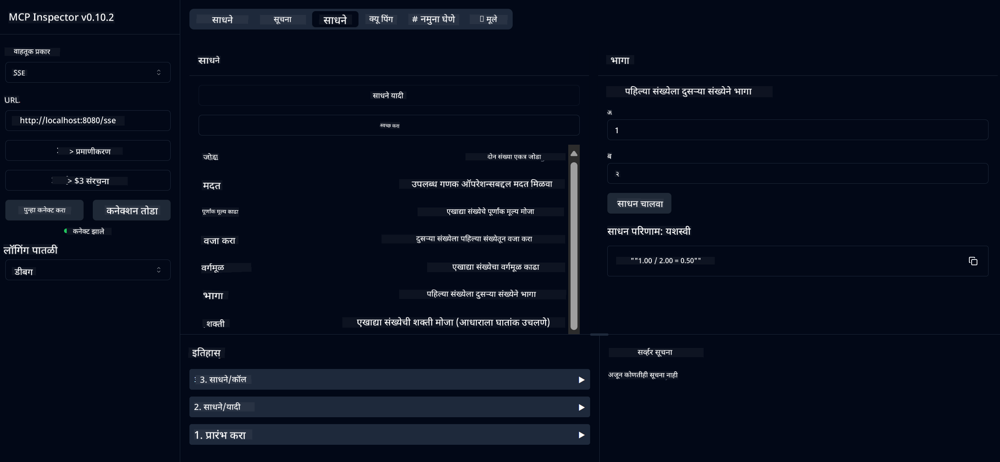

<!--
CO_OP_TRANSLATOR_METADATA:
{
  "original_hash": "ed9cab32cc67c12d8969b407aa47100a",
  "translation_date": "2025-07-13T17:53:24+00:00",
  "source_file": "03-GettingStarted/01-first-server/solution/java/README.md",
  "language_code": "mr"
}
-->
# बेसिक कॅल्क्युलेटर MCP सेवा

ही सेवा Model Context Protocol (MCP) द्वारे बेसिक कॅल्क्युलेटर ऑपरेशन्स प्रदान करते, जी Spring Boot सह WebFlux ट्रान्सपोर्ट वापरून तयार केली आहे. ही सेवा MCP अंमलबजावणी शिकणाऱ्या नवशिक्यांसाठी एक सोपा उदाहरण म्हणून डिझाइन केली आहे.

अधिक माहितीसाठी, [MCP Server Boot Starter](https://docs.spring.io/spring-ai/reference/api/mcp/mcp-server-boot-starter-docs.html) संदर्भ दस्तऐवज पहा.


## सेवेचा वापर

ही सेवा MCP प्रोटोकॉलद्वारे खालील API एंडपॉइंट्स उपलब्ध करून देते:

- `add(a, b)`: दोन संख्या एकत्र जोडा
- `subtract(a, b)`: दुसरी संख्या पहिल्यापासून वजा करा
- `multiply(a, b)`: दोन संख्या गुणा करा
- `divide(a, b)`: पहिली संख्या दुसऱ्या संख्येने भागा (शून्य तपासणीसह)
- `power(base, exponent)`: एखाद्या संख्येची घातांक काढा
- `squareRoot(number)`: वर्गमूळ काढा (नकारात्मक संख्या तपासणीसह)
- `modulus(a, b)`: भागाकारानंतर उरलेली शिल्लक काढा
- `absolute(number)`: संख्येचे पूर्णांक मूल्य काढा

## अवलंबित्वे

या प्रोजेक्टसाठी खालील मुख्य अवलंबित्वे आवश्यक आहेत:

```xml
<dependency>
    <groupId>org.springframework.ai</groupId>
    <artifactId>spring-ai-starter-mcp-server-webflux</artifactId>
</dependency>
```

## प्रोजेक्ट बिल्ड करणे

Maven वापरून प्रोजेक्ट बिल्ड करा:
```bash
./mvnw clean install -DskipTests
```

## सर्व्हर चालविणे

### Java वापरून

```bash
java -jar target/calculator-server-0.0.1-SNAPSHOT.jar
```

### MCP Inspector वापरून

MCP Inspector हा MCP सेवांशी संवाद साधण्यासाठी उपयुक्त साधन आहे. या कॅल्क्युलेटर सेवेबरोबर वापरण्यासाठी:

1. **MCP Inspector इन्स्टॉल करा आणि नवीन टर्मिनल विंडोमध्ये चालवा:**
   ```bash
   npx @modelcontextprotocol/inspector
   ```

2. **वेब UI मध्ये प्रवेश करा** - अ‍ॅपद्वारे दर्शविलेल्या URL वर क्लिक करा (साधारणपणे http://localhost:6274)

3. **कनेक्शन कॉन्फिगर करा:**
   - ट्रान्सपोर्ट प्रकार "SSE" सेट करा
   - URL आपल्या चालू सर्व्हरच्या SSE एंडपॉइंटवर सेट करा: `http://localhost:8080/sse`
   - "Connect" वर क्लिक करा

4. **साधने वापरा:**
   - उपलब्ध कॅल्क्युलेटर ऑपरेशन्स पाहण्यासाठी "List Tools" क्लिक करा
   - एखादे साधन निवडा आणि ऑपरेशन चालविण्यासाठी "Run Tool" क्लिक करा



**अस्वीकरण**:  
हा दस्तऐवज AI अनुवाद सेवा [Co-op Translator](https://github.com/Azure/co-op-translator) वापरून अनुवादित केला आहे. आम्ही अचूकतेसाठी प्रयत्नशील असलो तरी, कृपया लक्षात घ्या की स्वयंचलित अनुवादांमध्ये चुका किंवा अचूकतेची कमतरता असू शकते. मूळ दस्तऐवज त्याच्या स्थानिक भाषेत अधिकृत स्रोत मानला जावा. महत्त्वाच्या माहितीसाठी व्यावसायिक मानवी अनुवाद करण्याची शिफारस केली जाते. या अनुवादाच्या वापरामुळे उद्भवणाऱ्या कोणत्याही गैरसमजुती किंवा चुकीच्या अर्थलागी आम्ही जबाबदार नाही.