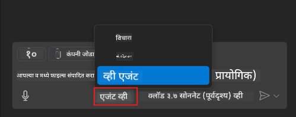
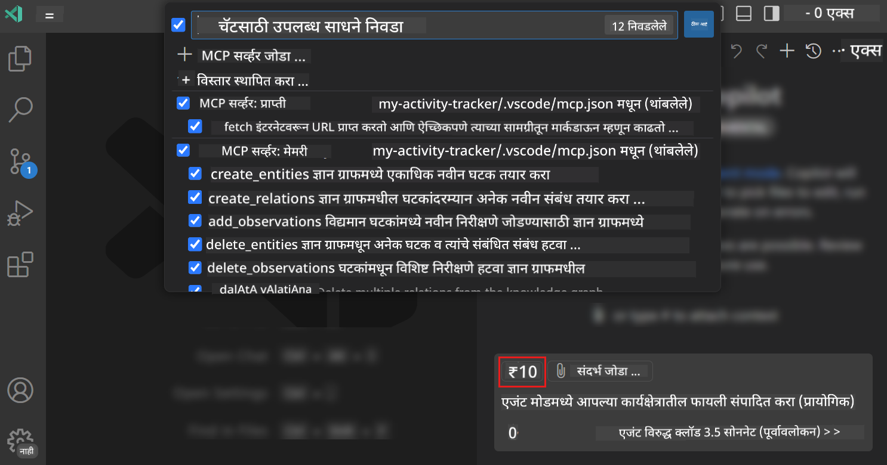
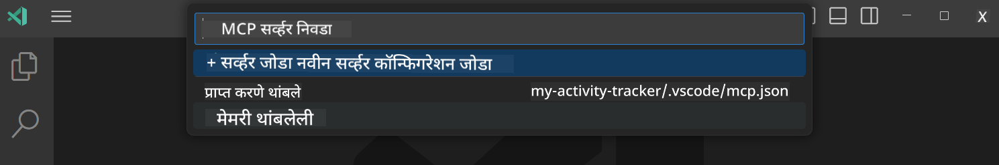
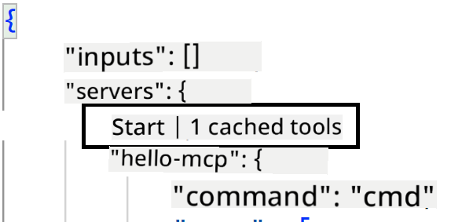
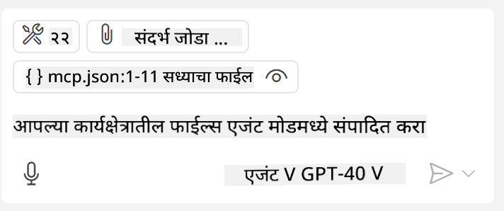

<!--
CO_OP_TRANSLATOR_METADATA:
{
  "original_hash": "d940b5e0af75e3a3a4d1c3179120d1d9",
  "translation_date": "2025-08-26T17:30:23+00:00",
  "source_file": "03-GettingStarted/04-vscode/README.md",
  "language_code": "mr"
}
-->
# GitHub Copilot Agent मोडमधून सर्व्हर वापरणे

Visual Studio Code आणि GitHub Copilot हे क्लायंट म्हणून काम करू शकतात आणि MCP Server वापरू शकतात. तुम्ही विचाराल, असे का करायचे? कारण MCP Server मध्ये असलेल्या सर्व फीचर्स आता तुमच्या IDE मधून वापरता येतील. उदाहरणार्थ, GitHub चा MCP Server जोडल्यास, टर्मिनलमध्ये विशिष्ट कमांड टाइप करण्याऐवजी GitHub ला प्रॉम्प्टद्वारे नियंत्रित करता येईल. किंवा तुमच्या डेव्हलपर अनुभवाला सुधारण्यासाठी काहीही नैसर्गिक भाषेद्वारे नियंत्रित करता येईल. आता तुम्हाला याचा फायदा लक्षात येतोय, बरोबर?

## आढावा

या धड्यात Visual Studio Code आणि GitHub Copilot च्या Agent मोडचा MCP Server साठी क्लायंट म्हणून वापर कसा करायचा हे शिकवले आहे.

## शिकण्याची उद्दिष्टे

या धड्याच्या शेवटी, तुम्ही हे करू शकाल:

- Visual Studio Code च्या माध्यमातून MCP Server वापरणे.
- GitHub Copilot च्या मदतीने टूल्ससारख्या क्षमता चालवणे.
- Visual Studio Code कॉन्फिगर करून MCP Server शोधणे आणि व्यवस्थापित करणे.

## वापर

तुम्ही तुमच्या MCP Server ला दोन वेगवेगळ्या प्रकारे नियंत्रित करू शकता:

- युजर इंटरफेस, याबद्दल पुढील भागात अधिक माहिती मिळेल.
- टर्मिनल, `code` executable वापरून टर्मिनलमधून गोष्टी नियंत्रित करणे शक्य आहे:

  तुमच्या युजर प्रोफाइलमध्ये MCP Server जोडण्यासाठी, --add-mcp कमांड लाइन पर्याय वापरा आणि JSON सर्व्हर कॉन्फिगरेशन {\"name\":\"server-name\",\"command\":...} स्वरूपात प्रदान करा.

  ```
  code --add-mcp "{\"name\":\"my-server\",\"command\": \"uvx\",\"args\": [\"mcp-server-fetch\"]}"
  ```

### स्क्रीनशॉट्स

  
  
  

पुढील विभागांमध्ये आपण व्हिज्युअल इंटरफेसचा वापर कसा करतो याबद्दल अधिक चर्चा करू.

## दृष्टिकोन

उच्च स्तरावर आपण हे कसे करायचे:

- MCP Server शोधण्यासाठी फाइल कॉन्फिगर करा.
- सर्व्हर सुरू करा/कनेक्ट करा आणि त्याच्या क्षमता सूचीबद्ध करा.
- GitHub Copilot Chat इंटरफेसद्वारे त्या क्षमतांचा वापर करा.

छान, आता आपल्याला प्रवाह समजला आहे, चला Visual Studio Code च्या माध्यमातून MCP Server वापरण्याचा सराव करू.

## सराव: सर्व्हर वापरणे

या सरावात, आपण Visual Studio Code कॉन्फिगर करून MCP Server शोधू आणि GitHub Copilot Chat इंटरफेसद्वारे वापरू.

### -0- पूर्वतयारी, MCP Server शोध सक्षम करा

तुम्हाला MCP Server शोध सक्षम करणे आवश्यक असू शकते.

1. Visual Studio Code मध्ये `File -> Preferences -> Settings` वर जा.

1. "MCP" शोधा आणि settings.json फाइलमध्ये `chat.mcp.discovery.enabled` सक्षम करा.

### -1- कॉन्फिग फाइल तयार करा

तुमच्या प्रोजेक्ट रूटमध्ये कॉन्फिग फाइल तयार करा, तुम्हाला MCP.json नावाची फाइल तयार करावी लागेल आणि ती .vscode नावाच्या फोल्डरमध्ये ठेवावी लागेल. ती अशा प्रकारे दिसेल:

```text
.vscode
|-- mcp.json
```

पुढे, आपण सर्व्हर एंट्री कशी जोडायची ते पाहू.

### -2- सर्व्हर कॉन्फिगर करा

*mcp.json* मध्ये खालील सामग्री जोडा:

```json
{
    "inputs": [],
    "servers": {
       "hello-mcp": {
           "command": "node",
           "args": [
               "build/index.js"
           ]
       }
    }
}
```

वरील उदाहरणात Node.js मध्ये लिहिलेला सर्व्हर सुरू करण्याचा साधा मार्ग दिला आहे. इतर रनटाइमसाठी, `command` आणि `args` वापरून सर्व्हर सुरू करण्यासाठी योग्य कमांड नमूद करा.

### -3- सर्व्हर सुरू करा

आता तुम्ही एंट्री जोडली आहे, चला सर्व्हर सुरू करूया:

1. *mcp.json* मध्ये तुमची एंट्री शोधा आणि "play" आयकॉन शोधा:

    

1. "play" आयकॉनवर क्लिक करा, तुम्हाला GitHub Copilot Chat मध्ये उपलब्ध टूल्सची संख्या वाढलेली दिसेल. तुम्ही त्या टूल्स आयकॉनवर क्लिक केल्यास, नोंदणीकृत टूल्सची यादी दिसेल. तुम्ही प्रत्येक टूल तपासू/अनचेक करू शकता, GitHub Copilot ने त्यांना संदर्भ म्हणून वापरावे की नाही:

  

1. टूल चालवण्यासाठी, तुमच्या टूल्सच्या वर्णनाशी जुळणारा प्रॉम्प्ट टाइप करा, उदाहरणार्थ "add 22 to 1" असा प्रॉम्प्ट:

  

  तुम्हाला 23 असे उत्तर दिसेल.

## असाइनमेंट

तुमच्या *mcp.json* फाइलमध्ये सर्व्हर एंट्री जोडण्याचा प्रयत्न करा आणि सर्व्हर सुरू/थांबवण्याची खात्री करा. GitHub Copilot Chat इंटरफेसद्वारे तुमच्या सर्व्हरवरील टूल्सशी संवाद साधण्याची खात्री करा.

## समाधान

[समाधान](./solution/README.md)

## मुख्य मुद्दे

या धड्याचे मुख्य मुद्दे खालीलप्रमाणे आहेत:

- Visual Studio Code हे एक उत्कृष्ट क्लायंट आहे जे अनेक MCP Servers आणि त्यांच्या टूल्सचा वापर करू देते.
- GitHub Copilot Chat इंटरफेस हे सर्व्हर्सशी संवाद साधण्याचे माध्यम आहे.
- तुम्ही API की सारख्या इनपुटसाठी युजरला प्रॉम्प्ट करू शकता, जे *mcp.json* फाइलमध्ये सर्व्हर एंट्री कॉन्फिगर करताना MCP Server ला पास करता येतात.

## नमुने

- [Java Calculator](../samples/java/calculator/README.md)  
- [.Net Calculator](../../../../03-GettingStarted/samples/csharp)  
- [JavaScript Calculator](../samples/javascript/README.md)  
- [TypeScript Calculator](../samples/typescript/README.md)  
- [Python Calculator](../../../../03-GettingStarted/samples/python)  

## अतिरिक्त संसाधने

- [Visual Studio docs](https://code.visualstudio.com/docs/copilot/chat/mcp-servers)

## पुढे काय?

- पुढील: [Creating a stdio Server](../05-stdio-server/README.md)  

---

**अस्वीकरण**:  
हा दस्तऐवज AI भाषांतर सेवा [Co-op Translator](https://github.com/Azure/co-op-translator) वापरून भाषांतरित करण्यात आला आहे. आम्ही अचूकतेसाठी प्रयत्नशील असलो तरी कृपया लक्षात ठेवा की स्वयंचलित भाषांतरांमध्ये त्रुटी किंवा अचूकतेचा अभाव असू शकतो. मूळ भाषेतील दस्तऐवज हा अधिकृत स्रोत मानला जावा. महत्त्वाच्या माहितीसाठी व्यावसायिक मानवी भाषांतराची शिफारस केली जाते. या भाषांतराचा वापर करून निर्माण होणाऱ्या कोणत्याही गैरसमज किंवा चुकीच्या अर्थासाठी आम्ही जबाबदार राहणार नाही.