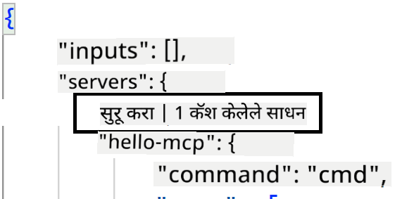
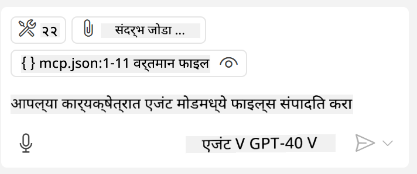

<!--
CO_OP_TRANSLATOR_METADATA:
{
  "original_hash": "c37fabfbc0dcbc9a4afb6d17e7d3be9f",
  "translation_date": "2025-05-17T11:04:51+00:00",
  "source_file": "03-GettingStarted/04-vscode/README.md",
  "language_code": "mr"
}
-->
आम्ही पुढील विभागांमध्ये व्हिज्युअल इंटरफेस कसा वापरायचा याबद्दल अधिक चर्चा करू.

## दृष्टिकोन

आम्हाला उच्च स्तरावर कसे पुढे जायचे आहे ते येथे दिले आहे:

- आमच्या MCP सर्व्हरचा शोध घेण्यासाठी फाइल कॉन्फिगर करा.
- त्याच्या क्षमतांची यादी करण्यासाठी सांगितलेला सर्व्हर सुरू/कनेक्ट करा.
- GitHub Copilot च्या चॅट इंटरफेसद्वारे त्या क्षमतांचा वापर करा.

छान, आता आम्ही प्रवाह समजून घेतला आहे, चला Visual Studio Code द्वारे MCP सर्व्हर वापरण्याचा प्रयत्न करू.

## व्यायाम: सर्व्हर वापरणे

या व्यायामात, आम्ही GitHub Copilot च्या चॅट इंटरफेसमधून वापरता येईल असा MCP सर्व्हर शोधण्यासाठी Visual Studio Code कॉन्फिगर करू.

### -0- पूर्वपाऊल, MCP सर्व्हर शोध सक्षम करा

तुम्हाला MCP सर्व्हरचा शोध सक्षम करावा लागेल.

1. `File -> Preferences -> Settings` in Visual Studio Code.

1. Search for "MCP" and enable `chat.mcp.discovery.enabled` ला settings.json फाइलमध्ये जा.

### -1- कॉन्फिग फाइल तयार करा

तुमच्या प्रकल्पाच्या मूळमध्ये कॉन्फिग फाइल तयार करून सुरू करा, तुम्हाला MCP.json नावाची फाइल हवी असेल आणि ती .vscode नावाच्या फोल्डरमध्ये ठेवावी लागेल. हे असे दिसले पाहिजे:

```text
.vscode
|-- mcp.json
```

पुढे, आपण सर्व्हर प्रवेश कसा जोडू शकतो ते पाहूया.

### -2- सर्व्हर कॉन्फिगर करा

*mcp.json* मध्ये खालील सामग्री जोडा:

```json
{
    "inputs": [],
    "servers": {
       "hello-mcp": {
           "command": "cmd",
           "args": [
               "/c", "node", "<absolute path>\\build\\index.js"
           ]
       }
    }
}
```

Node.js मध्ये लिहिलेल्या सर्व्हरला कसे सुरू करायचे याचा एक साधा उदाहरण आहे, इतर रनटाइमसाठी `command` and `args` वापरून सर्व्हर सुरू करण्यासाठी योग्य आदेश ठळक करा.

### -3- सर्व्हर सुरू करा

आता तुम्ही एक प्रवेश जोडला आहे, चला सर्व्हर सुरू करूया:

1. *mcp.json* मध्ये तुमचा प्रवेश शोधा आणि तुम्हाला "प्ले" चिन्ह मिळते याची खात्री करा:

    

1. "प्ले" चिन्हावर क्लिक करा, तुम्ही GitHub Copilot च्या चॅटमध्ये उपलब्ध साधनांची संख्या वाढताना पाहायला पाहिजे. जर तुम्ही त्या साधनांच्या चिन्हावर क्लिक केले तर, तुम्हाला नोंदणीकृत साधनांची यादी दिसेल. तुम्ही प्रत्येक साधनाची तपासणी/अतपासणी करू शकता, जर तुम्हाला GitHub Copilot ला त्यांचा संदर्भ म्हणून वापरायचा असेल तर:

  

1. साधन चालवण्यासाठी, तुमच्या साधनांच्या वर्णनाशी जुळणारा प्रॉम्प्ट टाइप करा, उदाहरणार्थ "22 ला 1 मध्ये जोडा" असे प्रॉम्प्ट:

  

  तुम्हाला 23 असे उत्तर दिसायला पाहिजे.

## असाइनमेंट

तुमच्या *mcp.json* फाइलमध्ये सर्व्हर प्रवेश जोडण्याचा प्रयत्न करा आणि तुम्ही सर्व्हर सुरू/थांबवू शकता याची खात्री करा. GitHub Copilot च्या चॅट इंटरफेसद्वारे तुमच्या सर्व्हरवरील साधनांशी संवाद साधू शकता याची खात्री करा.

## समाधान

[समाधान](./solution/README.md)

## मुख्य मुद्दे

या अध्यायातील मुख्य मुद्दे हे आहेत:

- Visual Studio Code एक उत्तम क्लायंट आहे जो तुम्हाला अनेक MCP सर्व्हर आणि त्यांची साधने वापरू देतो.
- GitHub Copilot चा चॅट इंटरफेस म्हणजे तुम्ही सर्व्हरशी संवाद साधता.
- तुम्ही API कीज सारख्या इनपुटसाठी वापरकर्त्याला प्रॉम्प्ट करू शकता ज्यांना *mcp.json* फाइलमध्ये सर्व्हर प्रवेश कॉन्फिगर करताना MCP सर्व्हरला पाठवले जाऊ शकते.

## नमुने

- [Java Calculator](../samples/java/calculator/README.md)
- [.Net Calculator](../../../../03-GettingStarted/samples/csharp)
- [JavaScript Calculator](../samples/javascript/README.md)
- [TypeScript Calculator](../samples/typescript/README.md)
- [Python Calculator](../../../../03-GettingStarted/samples/python) 

## अतिरिक्त संसाधने

- [Visual Studio docs](https://code.visualstudio.com/docs/copilot/chat/mcp-servers)

## पुढे काय

- पुढे: [SSE सर्व्हर तयार करणे](/03-GettingStarted/05-sse-server/README.md)

**अस्वीकृती**:  
हे दस्तऐवज AI अनुवाद सेवा [Co-op Translator](https://github.com/Azure/co-op-translator) वापरून अनुवादित केले गेले आहे. आम्ही अचूकतेसाठी प्रयत्न करतो, परंतु कृपया लक्षात ठेवा की स्वयंचलित अनुवादांमध्ये त्रुटी किंवा अचूकतेचा अभाव असू शकतो. मूळ भाषेतील मूळ दस्तऐवज अधिकृत स्रोत मानला जावा. महत्त्वाच्या माहितीसाठी, व्यावसायिक मानव अनुवादाची शिफारस केली जाते. या अनुवादाच्या वापरामुळे उद्भवणाऱ्या कोणत्याही गैरसमज किंवा चुकीच्या अर्थासाठी आम्ही जबाबदार नाही.