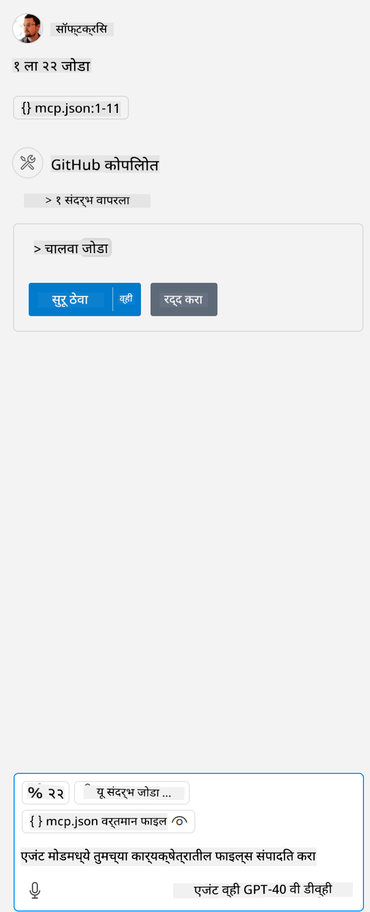

<!--
CO_OP_TRANSLATOR_METADATA:
{
  "original_hash": "96e08a8c1049dab757deb64cce4ea1e8",
  "translation_date": "2025-05-17T11:19:41+00:00",
  "source_file": "03-GettingStarted/04-vscode/solution/README.md",
  "language_code": "mr"
}
-->
# नमुना चालवणे

येथे आम्ही गृहित धरतो की तुमच्याकडे आधीपासून कार्यरत सर्व्हर कोड आहे. कृपया आधीच्या अध्यायांमधून एक सर्व्हर शोधा.

## mcp.json सेट करा

हा एक संदर्भासाठी वापरण्याचा फाइल आहे, [mcp.json](../../../../../03-GettingStarted/04-vscode/solution/mcp.json).

सर्व्हर एंट्री आवश्यकतेनुसार बदला, ज्यामध्ये सर्व्हर चालविण्यासाठी आवश्यक पूर्ण आदेशांसह तुमच्या सर्व्हरचा पूर्ण पथ दर्शविला आहे.

वरील उदाहरण फाइलमध्ये सर्व्हर एंट्री अशी दिसते:

```json
"hello-mcp": {
    "command": "cmd",
    "args": [
        "/c", "node", "<absolute path>\\build\\index.js"
    ]
}
```

हे अशा प्रकारे आदेश चालविण्यासाठी सुसंगत आहे: `cmd /c node <absolute path>\\build\index.js`. 

- Change this server entry to fit where your server file is located or to what's needed to startup your server depending on your chosen runtime and server location.

## Consume the features in the server

- Click the `play` icon, once you've added *mcp.json* to *./vscode* folder, 

    Observe the tooling icon change to increase the number of available tools. Tooling icon is located right above the chat field in GitHub Copilot.

## Run a tool

- Type a prompt in your chat window that matches the description of your tool. For example to trigger the tool `add` असे काहीतरी टाइप करा "3 ला 20 मध्ये जोडा".

    तुम्हाला चॅट टेक्स्ट बॉक्सच्या वर एक साधन सादर केलेले दिसेल, जे तुम्हाला साधन चालविण्यासाठी निवडण्याचे निर्देश देते, जसे की या दृश्यात:

    

    साधन निवडल्यास संख्यात्मक परिणाम "23" असे सांगेल, जर तुमचा प्रॉम्प्ट जसा आम्ही आधी सांगितला होता तसा असेल.

**अस्वीकृती**:
हा दस्तऐवज AI भाषांतर सेवा [Co-op Translator](https://github.com/Azure/co-op-translator) वापरून अनुवादित केला आहे. आम्ही अचूकतेसाठी प्रयत्नशील असलो तरी कृपया लक्षात ठेवा की स्वयंचलित अनुवादात चुका किंवा अचूकतेचा अभाव असू शकतो. मूळ भाषेतील दस्तऐवज हा प्राधिकृत स्रोत मानला पाहिजे. महत्त्वपूर्ण माहितीसाठी, व्यावसायिक मानवी अनुवादाची शिफारस केली जाते. या भाषांतराचा वापर करून उद्भवणाऱ्या कोणत्याही गैरसमज किंवा चुकीच्या अर्थासाठी आम्ही जबाबदार नाही.