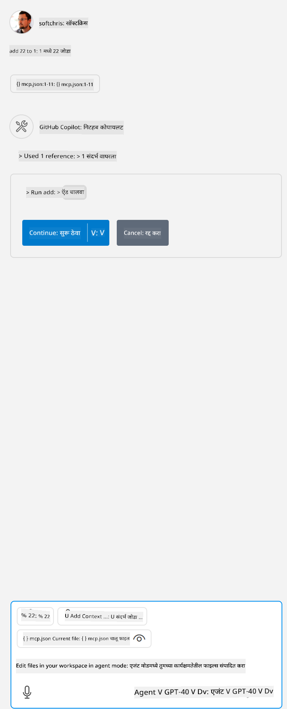

<!--
CO_OP_TRANSLATOR_METADATA:
{
  "original_hash": "5ef8f5821c1a04f7b1fc4f15098ecab8",
  "translation_date": "2025-07-13T19:41:08+00:00",
  "source_file": "03-GettingStarted/04-vscode/solution/README.md",
  "language_code": "mr"
}
-->
हे खालीलप्रमाणे कमांड चालवण्याशी संबंधित आहे: `node build/index.js`.

- तुमच्या सर्व्हर फाइलचा स्थान किंवा तुमच्या निवडलेल्या रनटाइम आणि सर्व्हर स्थानानुसार सर्व्हर सुरू करण्यासाठी आवश्यक असलेली पूर्ण कमांड दाखवण्यासाठी या सर्व्हर एंट्रीमध्ये बदल करा.

## सर्व्हरमध्ये फिचर्स वापरा

- एकदा तुम्ही *mcp.json* फाइल *./vscode* फोल्डरमध्ये जोडल्यावर, `play` आयकॉनवर क्लिक करा,

    टूलिंग आयकॉन बदलताना पाहा ज्यामुळे उपलब्ध टूल्सची संख्या वाढेल. टूलिंग आयकॉन GitHub Copilot मधील चॅट फील्डच्या वरच्याच भागात असतो.

## टूल चालवा

- तुमच्या चॅट विंडोमध्ये तुमच्या टूलच्या वर्णनाशी जुळणारा प्रॉम्प्ट टाइप करा. उदाहरणार्थ, `add` टूल चालवण्यासाठी "add 3 to 20" असे काहीतरी टाइप करा.

    तुम्हाला चॅट टेक्स्ट बॉक्सच्या वर टूल प्रदर्शित होताना दिसेल ज्यामुळे तुम्हाला टूल निवडून चालवता येईल, खालील चित्रात दाखवल्याप्रमाणे:

    

    टूल निवडल्यानंतर जर तुमचा प्रॉम्प्ट वरीलप्रमाणे असेल तर "23" असा संख्यात्मक निकाल दिसेल.

**अस्वीकरण**:  
हा दस्तऐवज AI अनुवाद सेवा [Co-op Translator](https://github.com/Azure/co-op-translator) वापरून अनुवादित केला आहे. आम्ही अचूकतेसाठी प्रयत्नशील असलो तरी, कृपया लक्षात घ्या की स्वयंचलित अनुवादांमध्ये चुका किंवा अचूकतेची कमतरता असू शकते. मूळ दस्तऐवज त्याच्या स्थानिक भाषेत अधिकृत स्रोत मानला जावा. महत्त्वाच्या माहितीसाठी व्यावसायिक मानवी अनुवाद करण्याची शिफारस केली जाते. या अनुवादाच्या वापरामुळे उद्भवलेल्या कोणत्याही गैरसमजुती किंवा चुकीच्या अर्थलागी आम्ही जबाबदार नाही.