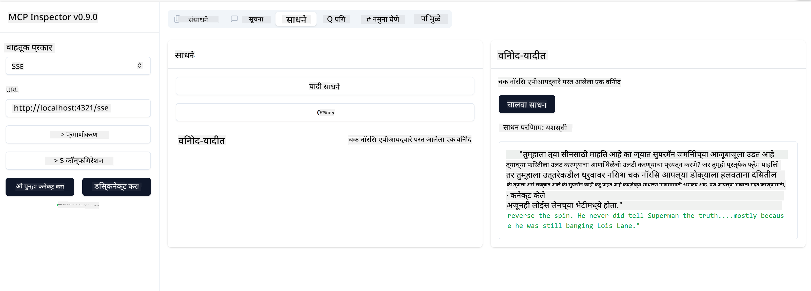

<!--
CO_OP_TRANSLATOR_METADATA:
{
  "original_hash": "0a8086dc4bf89448f83e7936db972c42",
  "translation_date": "2025-05-17T11:30:57+00:00",
  "source_file": "03-GettingStarted/05-sse-server/README.md",
  "language_code": "mr"
}
-->
# SSE सर्व्हर

SSE (Server Sent Events) हे सर्व्हर-टू-क्लायंट स्ट्रीमिंगसाठी एक मानक आहे, ज्यामुळे सर्व्हर HTTP वरून क्लायंटला रिअल-टाइम अपडेट्स पुश करू शकतात. हे विशेषतः अशा अनुप्रयोगांसाठी उपयुक्त आहे ज्यांना थेट अपडेट्सची आवश्यकता असते, जसे की चॅट अनुप्रयोग, सूचना किंवा रिअल-टाइम डेटा फीड्स. तसेच, तुमचा सर्व्हर एकाच वेळी अनेक क्लायंटद्वारे वापरला जाऊ शकतो कारण तो सर्व्हरवर चालतो जो उदाहरणार्थ क्लाउडमध्ये कुठेही चालवला जाऊ शकतो.

## विहंगावलोकन

हे धडे SSE सर्व्हर तयार करणे आणि वापरणे यावर कव्हर करतात.

## शिकण्याची उद्दिष्टे

या धड्याच्या शेवटी, आपण सक्षम असाल:

- SSE सर्व्हर तयार करा.
- इंस्पेक्टर वापरून SSE सर्व्हर डीबग करा.
- Visual Studio Code वापरून SSE सर्व्हर वापरा.

## SSE, कसे कार्य करते

SSE हे दोन समर्थित ट्रान्सपोर्ट प्रकारांपैकी एक आहे. तुम्ही आधीच्या धड्यांमध्ये वापरलेला पहिला stdio पाहिला आहे. फरक खालीलप्रमाणे आहे:

- SSE साठी तुम्हाला दोन गोष्टी हाताळण्याची आवश्यकता आहे: कनेक्शन आणि संदेश.
- कारण हा एक सर्व्हर आहे जो कुठेही राहू शकतो, तुम्हाला ते इंस्पेक्टर आणि Visual Studio सारख्या साधनांसह काम करताना प्रतिबिंबित करणे आवश्यक आहे. याचा अर्थ असा की सर्व्हर कसे सुरू करायचे हे सांगण्याऐवजी, तुम्ही त्याऐवजी त्या एन्डपॉइंटकडे निर्देश करता जिथे ते कनेक्शन स्थापन करू शकते. खालील उदाहरण कोड पहा:
तुम्हाला ऑक्टोबर 2023 पर्यंत डेटा प्रशिक्षण दिले आहे.

आता आपल्याला SSE बद्दल थोडे अधिक माहित आहे, पुढे एक SSE सर्व्हर तयार करूया.

## व्यायाम: SSE सर्व्हर तयार करणे

आपला सर्व्हर तयार करण्यासाठी, आपल्याला दोन गोष्टी लक्षात ठेवाव्या लागतील:

- कनेक्शन आणि संदेशांसाठी एन्डपॉइंट्स उघड करण्यासाठी आपल्याला वेब सर्व्हर वापरण्याची आवश्यकता आहे.
- stdio वापरत असताना आपण जसे साधने, संसाधने आणि प्रॉम्प्ट्ससह सामान्यतः करतो तसेच आपला सर्व्हर तयार करा.

### -1- सर्व्हर उदाहरण तयार करा

आपला सर्व्हर तयार करण्यासाठी, आम्ही stdio प्रमाणेच प्रकार वापरतो. तथापि, वाहतुकीसाठी, आम्हाला SSE निवडण्याची आवश्यकता आहे.

चला आवश्यक मार्ग पुढे जोडूया.

### -2- मार्ग जोडा

चला पुढे मार्ग जोडूया जे कनेक्शन आणि येणारे संदेश हाताळतात:

चला पुढे सर्व्हरला क्षमता देऊया.

### -3- सर्व्हर क्षमता जोडणे

आता जेव्हा आपण SSE विशिष्ट सर्वकाही परिभाषित केले आहे, चला साधने, प्रॉम्प्ट्स आणि संसाधने यांसारख्या सर्व्हर क्षमतांचा समावेश करूया.

तुम्ही पूर्ण कोड खालीलप्रमाणे दिसायला हवा:

छान, आपल्याकडे SSE वापरणारा सर्व्हर आहे, चला पुढे त्याची चाचणी घेऊया.

## व्यायाम: इंस्पेक्टरसह SSE सर्व्हर डीबग करणे

इंस्पेक्टर एक उत्तम साधन आहे जे आम्ही एका मागील धड्यात पाहिले [तुमचा पहिला सर्व्हर तयार करणे](/03-GettingStarted/01-first-server/README.md). चला पाहूया आपण येथेही इंस्पेक्टर वापरू शकतो का:

### -1- इंस्पेक्टर चालवणे

इंस्पेक्टर चालवण्यासाठी, प्रथम तुमच्याकडे SSE सर्व्हर चालू असणे आवश्यक आहे, चला पुढे ते करूया:

1. सर्व्हर चालवा

1. इंस्पेक्टर चालवा

    > ![NOTE]
    > हे सर्व्हर चालू असलेल्या वेगळ्या टर्मिनल विंडोमध्ये चालवा. तसेच लक्षात ठेवा, तुमच्या सर्व्हरच्या URL ला फिट करण्यासाठी खालील कमांड समायोजित करणे आवश्यक आहे.

    ```sh
    npx @modelcontextprotocol/inspector --cli http://localhost:8000/sse --method tools/list
    ```

    इंस्पेक्टर चालवणे सर्व रनटाइममध्ये एकसारखे दिसते. लक्षात घ्या की आपण आमच्या सर्व्हरचा मार्ग आणि सर्व्हर सुरू करण्यासाठी कमांड पास करण्याऐवजी आम्ही सर्व्हर चालू असलेल्या URL ला पास करतो आणि आम्ही `/sse` मार्ग देखील निर्दिष्ट करतो.

### -2- साधनाची चाचणी घेणे

ड्रॉपलिस्टमध्ये SSE निवडून सर्व्हरशी कनेक्ट करा आणि तुमचा सर्व्हर चालू असलेल्या URL फील्डमध्ये भरा, उदाहरणार्थ http:localhost:4321/sse. आता "कनेक्ट" बटणावर क्लिक करा. पूर्वीप्रमाणे, साधने सूचीबद्ध करण्यासाठी निवडा, साधन निवडा आणि इनपुट मूल्ये प्रदान करा. तुम्हाला खालीलप्रमाणे परिणाम दिसेल:



छान, तुम्ही इंस्पेक्टरसह काम करू शकता, चला पुढे पाहूया की आपण Visual Studio Code सह कसे काम करू शकतो.

## असाइनमेंट

तुमचा सर्व्हर अधिक क्षमतांसह तयार करण्याचा प्रयत्न करा. [या पृष्ठावर](https://api.chucknorris.io/) पाहा उदाहरणार्थ API कॉल करणारे साधन जोडण्यासाठी, तुम्ही ठरवा की सर्व्हर कसा दिसायला हवा. मजा करा :)

## उपाय

[उपाय](./solution/README.md) येथे कार्यरत कोडसह एक संभाव्य उपाय आहे.

## मुख्य मुद्दे

या अध्यायातील मुख्य मुद्दे खालीलप्रमाणे आहेत:

- SSE हे stdio नंतरचे दुसरे समर्थित ट्रान्सपोर्ट आहे.
- SSE ला समर्थन देण्यासाठी, तुम्हाला वेब फ्रेमवर्क वापरून येणारे कनेक्शन आणि संदेश व्यवस्थापित करणे आवश्यक आहे.
- तुम्ही इंस्पेक्टर आणि Visual Studio Code दोन्ही वापरून SSE सर्व्हर वापरू शकता, जसे stdio सर्व्हर्ससाठी. लक्षात घ्या की stdio आणि SSE मध्ये थोडा फरक आहे. SSE साठी, तुम्हाला सर्व्हर वेगळे सुरू करावे लागेल आणि नंतर तुमचे इंस्पेक्टर साधन चालवावे लागेल. इंस्पेक्टर साधनासाठी, काही फरक देखील आहेत ज्यामध्ये तुम्हाला URL निर्दिष्ट करणे आवश्यक आहे.

## नमुने 

- [Java कॅल्क्युलेटर](../samples/java/calculator/README.md)
- [.Net कॅल्क्युलेटर](../../../../03-GettingStarted/samples/csharp)
- [JavaScript कॅल्क्युलेटर](../samples/javascript/README.md)
- [TypeScript कॅल्क्युलेटर](../samples/typescript/README.md)
- [Python कॅल्क्युलेटर](../../../../03-GettingStarted/samples/python) 

## अतिरिक्त संसाधने

- [SSE](https://developer.mozilla.org/en-US/docs/Web/API/Server-sent_events)

## पुढे काय

- पुढे: [VSCode साठी AI टूलकिटसह प्रारंभ](/03-GettingStarted/06-aitk/README.md)

**अस्वीकृती**:  
हा दस्तऐवज AI अनुवाद सेवा [Co-op Translator](https://github.com/Azure/co-op-translator) वापरून अनुवादित केला आहे. आम्ही अचूकतेसाठी प्रयत्नशील असलो तरी कृपया लक्षात घ्या की स्वयंचलित अनुवादांमध्ये त्रुटी किंवा अचूकतेचा अभाव असू शकतो. मूळ भाषेतील मूळ दस्तऐवज हा अधिकारिक स्रोत मानला जावा. महत्त्वाच्या माहितीसाठी, व्यावसायिक मानव अनुवादाची शिफारस केली जाते. या अनुवादाचा वापर करून उद्भवणाऱ्या कोणत्याही गैरसमजुती किंवा चुकीच्या अर्थासाठी आम्ही जबाबदार नाही.