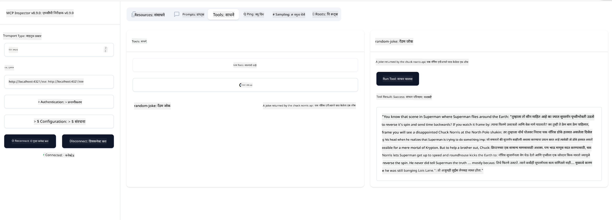

<!--
CO_OP_TRANSLATOR_METADATA:
{
  "original_hash": "d90ca3d326c48fab2ac0ebd3a9876f59",
  "translation_date": "2025-07-04T16:38:46+00:00",
  "source_file": "03-GettingStarted/05-sse-server/README.md",
  "language_code": "mr"
}
-->
आता आपल्याला SSE बद्दल थोडे अधिक माहिती मिळाल्यामुळे, चला पुढे SSE सर्व्हर तयार करूया.

## व्यायाम: SSE सर्व्हर तयार करणे

आपला सर्व्हर तयार करण्यासाठी, आपल्याला दोन गोष्टी लक्षात ठेवाव्या लागतील:

- कनेक्शन आणि संदेशांसाठी एंडपॉइंट्स उघडण्यासाठी वेब सर्व्हर वापरावा लागेल.
- आपला सर्व्हर साधारणपणे stdio वापरताना जसे तयार केला होता तसेच साधने, संसाधने आणि प्रॉम्प्टसह तयार करावा.

### -1- सर्व्हर इंस्टन्स तयार करा

आपला सर्व्हर तयार करण्यासाठी, आपण stdio प्रमाणेच प्रकार वापरतो. मात्र, ट्रान्सपोर्टसाठी आपल्याला SSE निवडावे लागेल.

---

चला आता आवश्यक रूट्स जोडूया.

### -2- रूट्स जोडा

चला असे रूट्स जोडूया जे कनेक्शन आणि येणाऱ्या संदेशांना हाताळतील:

---

चला आता सर्व्हरमध्ये क्षमता वाढवूया.

### -3- सर्व्हर क्षमता वाढवणे

आता जे SSE संबंधित सर्व काही परिभाषित केले आहे, त्यानंतर साधने, प्रॉम्प्टस आणि संसाधने यांसारख्या सर्व्हर क्षमताही जोडा.

---

आपला पूर्ण कोड खालीलप्रमाणे दिसायला हवा:

---

छान, आपल्याकडे SSE वापरून एक सर्व्हर आहे, चला आता त्याचा वापर करून पाहूया.

## व्यायाम: Inspector वापरून SSE सर्व्हर डिबग करणे

Inspector हा एक छान साधन आहे ज्याला आपण मागील धड्यात पाहिले होते [Creating your first server](/03-GettingStarted/01-first-server/README.md). चला पाहूया की आपण Inspector इथेही वापरू शकतो का:

### -1- Inspector चालू करणे

Inspector चालवण्यासाठी, आपल्याकडे आधी SSE सर्व्हर चालू असणे आवश्यक आहे, तर चला ते आधी करूया:

1. सर्व्हर चालवा

---

1. Inspector चालवा

    > ![NOTE]
    > हा कमांड सर्व्हर चालू असलेल्या टर्मिनल विंडोपासून वेगळ्या टर्मिनल विंडोमध्ये चालवा. तसेच, खालील कमांडमध्ये आपला सर्व्हर कुठे चालतो त्या URL नुसार बदल करणे आवश्यक आहे.

    ```sh
    npx @modelcontextprotocol/inspector --cli http://localhost:8000/sse --method tools/list
    ```

    Inspector चालवणे सर्व रनटाइममध्ये सारखेच दिसते. लक्षात घ्या की आपण सर्व्हर सुरू करण्यासाठी पथ आणि कमांड देण्याऐवजी, आपण सर्व्हर चालू असलेल्या URL आणि `/sse` रूट निर्दिष्ट करतो.

### -2- साधन वापरून पाहणे

ड्रॉपलिस्टमधून SSE निवडा आणि URL फील्डमध्ये आपला सर्व्हर चालू असलेला URL भरा, उदाहरणार्थ http:localhost:4321/sse. नंतर "Connect" बटणावर क्लिक करा. आधीप्रमाणे, साधने यादीतून निवडा, साधन निवडा आणि इनपुट मूल्ये द्या. आपल्याला खालीलप्रमाणे परिणाम दिसेल:



छान, आपण Inspector सह काम करू शकता, चला पाहूया Visual Studio Code सह आपण कसे काम करू शकतो.

## असाइनमेंट

आपला सर्व्हर अधिक क्षमतांसह तयार करण्याचा प्रयत्न करा. उदाहरणार्थ, API कॉल करणारे साधन जोडण्यासाठी [ही पृष्ठ](https://api.chucknorris.io/) पहा. सर्व्हर कसा दिसावा हे आपण ठरवा. मजा करा :)

## सोल्यूशन

[सोल्यूशन](./solution/README.md) येथे कार्यरत कोडसह एक शक्य सोल्यूशन आहे.

## मुख्य मुद्दे

या प्रकरणातील मुख्य मुद्दे खालीलप्रमाणे आहेत:

- SSE हा stdio नंतरचा दुसरा समर्थित ट्रान्सपोर्ट प्रकार आहे.
- SSE साठी, आपल्याला येणाऱ्या कनेक्शन्स आणि संदेशांचे व्यवस्थापन वेब फ्रेमवर्क वापरून करावे लागते.
- आपण Inspector आणि Visual Studio Code दोन्ही वापरून SSE सर्व्हर वापरू शकता, अगदी stdio सर्व्हरप्रमाणेच. लक्षात घ्या की stdio आणि SSE मध्ये थोडा फरक आहे. SSE साठी, आपल्याला सर्व्हर स्वतंत्रपणे सुरू करावा लागतो आणि नंतर Inspector साधन चालवावे लागते. Inspector साधनासाठी, URL निर्दिष्ट करणे आवश्यक आहे.

## नमुने

- [Java Calculator](../samples/java/calculator/README.md)
- [.Net Calculator](../../../../03-GettingStarted/samples/csharp)
- [JavaScript Calculator](../samples/javascript/README.md)
- [TypeScript Calculator](../samples/typescript/README.md)
- [Python Calculator](../../../../03-GettingStarted/samples/python)

## अतिरिक्त संसाधने

- [SSE](https://developer.mozilla.org/en-US/docs/Web/API/Server-sent_events)

## पुढे काय

- पुढे: [MCP सह HTTP स्ट्रीमिंग (Streamable HTTP)](../06-http-streaming/README.md)

**अस्वीकरण**:  
हा दस्तऐवज AI अनुवाद सेवा [Co-op Translator](https://github.com/Azure/co-op-translator) वापरून अनुवादित केला आहे. आम्ही अचूकतेसाठी प्रयत्नशील असलो तरी, कृपया लक्षात घ्या की स्वयंचलित अनुवादांमध्ये चुका किंवा अचूकतेची कमतरता असू शकते. मूळ दस्तऐवज त्याच्या स्थानिक भाषेत अधिकृत स्रोत मानला जावा. महत्त्वाच्या माहितीसाठी व्यावसायिक मानवी अनुवाद करण्याची शिफारस केली जाते. या अनुवादाच्या वापरामुळे उद्भवलेल्या कोणत्याही गैरसमजुती किंवा चुकीच्या अर्थलागी आम्ही जबाबदार नाही.