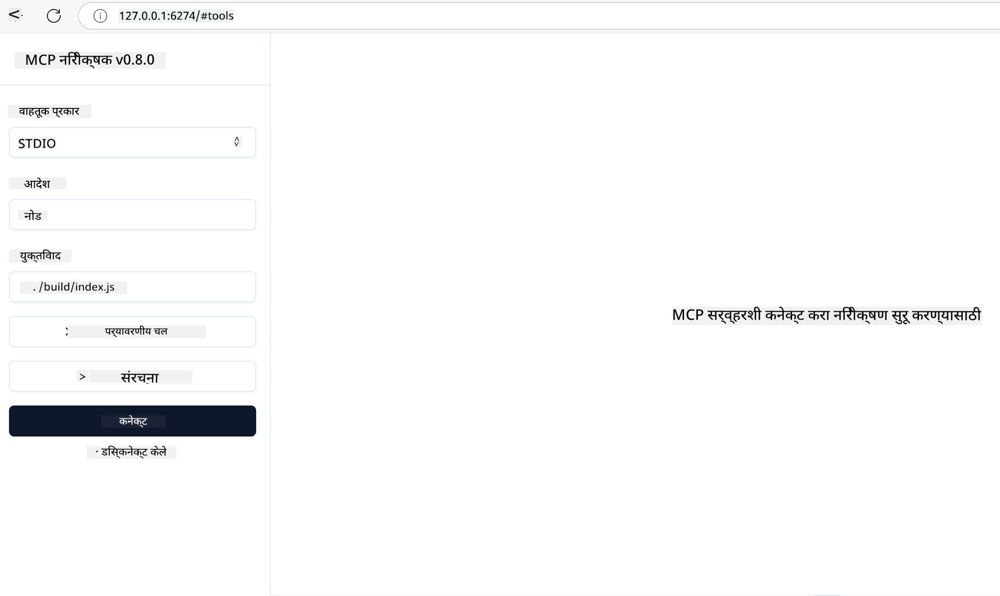

<!--
CO_OP_TRANSLATOR_METADATA:
{
  "original_hash": "717f34718a773f6cf52d8445e40a96bf",
  "translation_date": "2025-05-17T12:41:32+00:00",
  "source_file": "03-GettingStarted/07-testing/README.md",
  "language_code": "mr"
}
-->
## चाचणी आणि डिबगिंग

आपला MCP सर्व्हर चाचणी करण्यापूर्वी, डिबगिंगसाठी उपलब्ध साधने आणि सर्वोत्तम पद्धती समजून घेणे महत्त्वाचे आहे. प्रभावी चाचणी सुनिश्चित करते की आपला सर्व्हर अपेक्षेप्रमाणे कार्य करतो आणि आपल्याला समस्या पटकन ओळखण्यास आणि सोडवण्यास मदत करते. पुढील विभागात आपल्या MCP अंमलबजावणीसाठी सत्यापन करण्याच्या शिफारसी केलेल्या पद्धतींचा आढावा दिला आहे.

## आढावा

या धड्यात योग्य चाचणी पद्धती निवडणे आणि सर्वात प्रभावी चाचणी साधन कसे निवडावे यावर चर्चा केली आहे.

## शिकण्याची उद्दिष्टे

या धड्याच्या शेवटी, आपण सक्षम असाल:

- चाचणीसाठी विविध पद्धती वर्णन करा.
- आपल्या कोडची प्रभावीपणे चाचणी घेण्यासाठी विविध साधने वापरा.

## MCP सर्व्हर्सची चाचणी

MCP आपल्याला आपल्या सर्व्हर्सची चाचणी घेण्यास आणि डिबग करण्यास मदत करणारी साधने प्रदान करते:

- **MCP निरीक्षक**: एक कमांड लाइन साधन जे CLI साधन म्हणून आणि दृश्य साधन म्हणून चालवता येते.
- **मॅन्युअल चाचणी**: आपण curl सारख्या साधनाचा वापर करून वेब विनंत्या चालवू शकता, परंतु HTTP चालवण्यास सक्षम असलेले कोणतेही साधन चालेल.
- **युनिट चाचणी**: सर्व्हर आणि क्लायंट दोन्हीची वैशिष्ट्ये चाचणी घेण्यासाठी आपला पसंतीचा चाचणी फ्रेमवर्क वापरणे शक्य आहे.

### MCP निरीक्षक वापरणे

आम्ही या साधनाचा वापर मागील धड्यांमध्ये वर्णन केला आहे परंतु चला थोड्या उंच पातळीवर याबद्दल बोलूया. हे एक Node.js मध्ये तयार केलेले साधन आहे आणि आपण `npx` कार्यान्वित करून वापरू शकता जे साधन डाउनलोड आणि तात्पुरते स्थापित करेल आणि आपल्या विनंती चालवून पूर्ण झाल्यावर स्वतःला साफ करेल.

[MCP निरीक्षक](https://github.com/modelcontextprotocol/inspector) आपल्याला मदत करतो:

- **सर्व्हर क्षमतांची शोध**: उपलब्ध संसाधने, साधने, आणि प्रॉम्प्ट्स आपोआप शोधा
- **साधन कार्यवाही चाचणी**: विविध पॅरामीटर्स वापरून आणि वास्तविक-वेळ प्रतिसाद पाहून चाचणी करा
- **सर्व्हर मेटाडेटा पाहा**: सर्व्हर माहिती, स्कीमास, आणि कॉन्फिगरेशन्स तपासा

साधनाची एक सामान्य रन अशी दिसते:

```bash
npx @modelcontextprotocol/inspector node build/index.js
```

वरील कमांड MCP आणि त्याचे दृश्य इंटरफेस सुरू करते आणि आपल्या ब्राउझरमध्ये एक स्थानिक वेब इंटरफेस लाँच करते. आपण आपल्या नोंदणीकृत MCP सर्व्हर्स, त्यांच्या उपलब्ध साधने, संसाधने, आणि प्रॉम्प्ट्स दर्शवणारा डॅशबोर्ड अपेक्षित करू शकता. इंटरफेस आपल्याला साधन कार्यवाही परस्पर चाचणी घेण्यास, सर्व्हर मेटाडेटा तपासण्यास, आणि वास्तविक-वेळ प्रतिसाद पाहण्यास अनुमती देतो, ज्यामुळे आपल्या MCP सर्व्हर अंमलबजावणी सत्यापित आणि डिबग करणे सोपे होते.

हे असे दिसू शकते: 

आपण हे साधन CLI मोडमध्ये देखील चालवू शकता ज्यामध्ये आपण `--cli` विशेषता जोडता. येथे "CLI" मोडमध्ये साधन चालवण्याचे एक उदाहरण आहे जे सर्व्हरवरील सर्व साधने यादी करते:

```sh
npx @modelcontextprotocol/inspector --cli node build/index.js --method tools/list
```

### मॅन्युअल चाचणी

सर्व्हर क्षमतांची चाचणी घेण्यासाठी निरीक्षक साधन चालवण्याशिवाय, आणखी एक समान पद्धत म्हणजे HTTP वापरण्यास सक्षम असलेला क्लायंट चालवणे जसे उदाहरणार्थ curl.

curl वापरून, आपण MCP सर्व्हर्सची थेट HTTP विनंत्या वापरून चाचणी घेऊ शकता:

```bash
# Example: Test server metadata
curl http://localhost:3000/v1/metadata

# Example: Execute a tool
curl -X POST http://localhost:3000/v1/tools/execute \
  -H "Content-Type: application/json" \
  -d '{"name": "calculator", "parameters": {"expression": "2+2"}}'
```

वरील curl वापरावरून आपण पाहू शकता की आपण POST विनंती वापरून साधनाला त्याच्या नावाच्या साधन आणि त्याच्या पॅरामीटर्सचा समावेश असलेल्या पेलोडचा वापर करून आमंत्रित करता. आपल्यासाठी सर्वोत्तम पद्धत निवडा. CLI साधने सामान्यतः वापरण्यास जलद असतात आणि स्क्रिप्ट करण्यायोग्य असतात ज्यामुळे CI/CD वातावरणात उपयुक्त ठरू शकते.

### युनिट चाचणी

आपली साधने आणि संसाधने अपेक्षेप्रमाणे कार्य करतात हे सुनिश्चित करण्यासाठी त्यांचे युनिट चाचण्या तयार करा. येथे काही उदाहरण चाचणी कोड आहे.

```python
import pytest

from mcp.server.fastmcp import FastMCP
from mcp.shared.memory import (
    create_connected_server_and_client_session as create_session,
)

# Mark the whole module for async tests
pytestmark = pytest.mark.anyio


async def test_list_tools_cursor_parameter():
    """Test that the cursor parameter is accepted for list_tools.

    Note: FastMCP doesn't currently implement pagination, so this test
    only verifies that the cursor parameter is accepted by the client.
    """

 server = FastMCP("test")

    # Create a couple of test tools
    @server.tool(name="test_tool_1")
    async def test_tool_1() -> str:
        """First test tool"""
        return "Result 1"

    @server.tool(name="test_tool_2")
    async def test_tool_2() -> str:
        """Second test tool"""
        return "Result 2"

    async with create_session(server._mcp_server) as client_session:
        # Test without cursor parameter (omitted)
        result1 = await client_session.list_tools()
        assert len(result1.tools) == 2

        # Test with cursor=None
        result2 = await client_session.list_tools(cursor=None)
        assert len(result2.tools) == 2

        # Test with cursor as string
        result3 = await client_session.list_tools(cursor="some_cursor_value")
        assert len(result3.tools) == 2

        # Test with empty string cursor
        result4 = await client_session.list_tools(cursor="")
        assert len(result4.tools) == 2
    
```

पूर्वीच्या कोडात खालील गोष्टी केल्या जातात:

- pytest फ्रेमवर्कचा लाभ घेतो ज्यामुळे आपण कार्ये म्हणून चाचण्या तयार करू शकता आणि assert विधाने वापरू शकता.
- दोन वेगवेगळ्या साधनांसह MCP सर्व्हर तयार करते.
- assert विधाने वापरून काही अटी पूर्ण झाल्या आहेत हे तपासते.

पूर्ण फाइल येथे पहा [full file here](https://github.com/modelcontextprotocol/python-sdk/blob/main/tests/client/test_list_methods_cursor.py)

वरील फाइल दिली आहे, आपण आपला स्वतःचा सर्व्हर चाचणी घेऊ शकता जेणेकरून क्षमतांची निर्मिती अपेक्षेप्रमाणे होते.

सर्व प्रमुख SDK मध्ये समान चाचणी विभाग आहेत त्यामुळे आपण आपल्या निवडलेल्या रनटाइमशी समायोजित करू शकता.

## नमुने

- [Java कॅल्क्युलेटर](../samples/java/calculator/README.md)
- [.Net कॅल्क्युलेटर](../../../../03-GettingStarted/samples/csharp)
- [JavaScript कॅल्क्युलेटर](../samples/javascript/README.md)
- [TypeScript कॅल्क्युलेटर](../samples/typescript/README.md)
- [Python कॅल्क्युलेटर](../../../../03-GettingStarted/samples/python)

## अतिरिक्त संसाधने

- [Python SDK](https://github.com/modelcontextprotocol/python-sdk)

## पुढे काय

- पुढे: [डिप्लॉयमेंट](/03-GettingStarted/08-deployment/README.md)

**अस्वीकरण**:  
हा दस्तऐवज AI भाषांतर सेवा [Co-op Translator](https://github.com/Azure/co-op-translator) वापरून अनुवादित करण्यात आला आहे. आम्ही अचूकतेसाठी प्रयत्नशील असलो तरी, कृपया लक्षात ठेवा की स्वयंचलित भाषांतरे त्रुटी किंवा अचूकतेमध्ये चुक असू शकतात. मूळ भाषेतील मूळ दस्तऐवज अधिकृत स्रोत मानला पाहिजे. अत्यावश्यक माहितीच्या बाबतीत, व्यावसायिक मानव भाषांतराची शिफारस केली जाते. या भाषांतराचा वापर करून उद्भवणार्‍या कोणत्याही गैरसमज किंवा चुकीच्या अर्थासाठी आम्ही जबाबदार नाही.