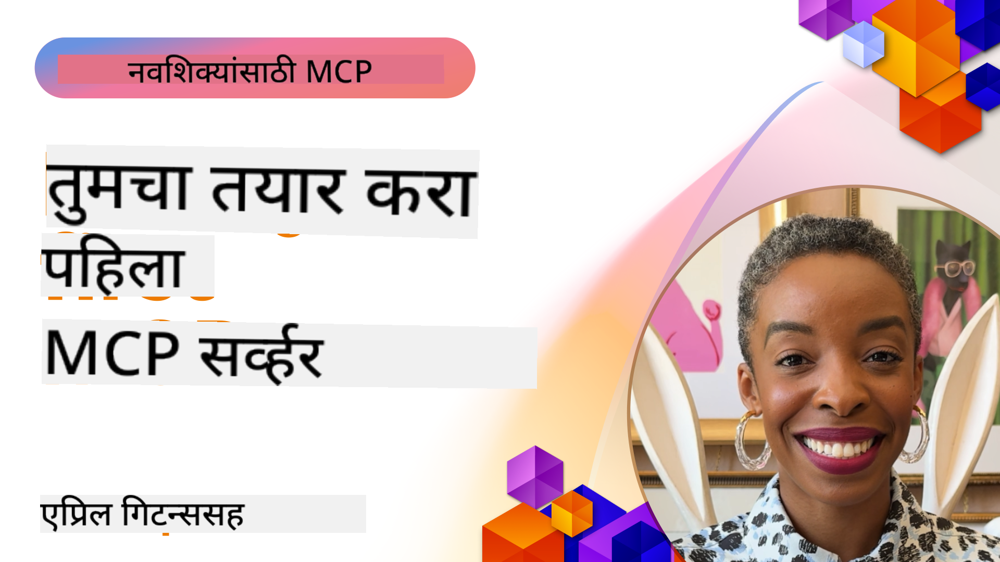

<!--
CO_OP_TRANSLATOR_METADATA:
{
  "original_hash": "1197b6dbde36773e04a5ae826557fdb9",
  "translation_date": "2025-08-26T17:29:58+00:00",
  "source_file": "03-GettingStarted/README.md",
  "language_code": "mr"
}
-->
## सुरुवात  

_(वरील प्रतिमेवर क्लिक करून या धड्याचा व्हिडिओ पहा)_

या विभागात अनेक धडे समाविष्ट आहेत:

- **1 तुमचा पहिला सर्व्हर**, या पहिल्या धड्यात तुम्ही तुमचा पहिला सर्व्हर कसा तयार करायचा आणि निरीक्षक साधनाचा वापर करून त्याची तपासणी कशी करायची हे शिकाल, तुमचा सर्व्हर चाचणी आणि डीबग करण्याचा एक उपयुक्त मार्ग, [धड्याला जा](01-first-server/README.md)

- **2 क्लायंट**, या धड्यात तुम्ही तुमच्या सर्व्हरशी कनेक्ट होणारा क्लायंट कसा लिहायचा हे शिकाल, [धड्याला जा](02-client/README.md)

- **3 LLM सह क्लायंट**, क्लायंट लिहिण्याचा आणखी चांगला मार्ग म्हणजे त्यात LLM जोडणे, ज्यामुळे तो तुमच्या सर्व्हरशी "वाटाघाट" करू शकेल की काय करायचे आहे, [धड्याला जा](03-llm-client/README.md)

- **4 Visual Studio Code मध्ये GitHub Copilot Agent मोड वापरून सर्व्हर चालवणे**. येथे, आम्ही Visual Studio Code मधून आमचा MCP सर्व्हर चालवण्याचा विचार करत आहोत, [धड्याला जा](04-vscode/README.md)

- **5 stdio Transport Server** stdio transport हे सध्याच्या विशिष्टतेमध्ये MCP सर्व्हर-टू-क्लायंट संवादासाठी शिफारस केलेले मानक आहे, जे सुरक्षित उपप्रक्रिया-आधारित संवाद प्रदान करते [धड्याला जा](05-stdio-server/README.md)

- **6 MCP सह HTTP स्ट्रीमिंग (Streamable HTTP)**. आधुनिक HTTP स्ट्रीमिंग, प्रगती सूचना, आणि Streamable HTTP वापरून स्केलेबल, रिअल-टाइम MCP सर्व्हर आणि क्लायंट कसे अंमलात आणायचे ते जाणून घ्या. [धड्याला जा](06-http-streaming/README.md)

- **7 VSCode साठी AI Toolkit वापरणे** MCP क्लायंट्स आणि सर्व्हर वापरण्यासाठी आणि चाचणीसाठी [धड्याला जा](07-aitk/README.md)

- **8 चाचणी**. येथे आम्ही विशेषतः आमचा सर्व्हर आणि क्लायंट वेगवेगळ्या प्रकारे कसे चाचणी करू शकतो यावर लक्ष केंद्रित करू, [धड्याला जा](08-testing/README.md)

- **9 वितरण**. या प्रकरणात तुमचे MCP सोल्यूशन्स वितरित करण्याचे वेगवेगळे मार्ग पाहिले जातील, [धड्याला जा](09-deployment/README.md)

मॉडेल कॉन्टेक्स्ट प्रोटोकॉल (MCP) हा एक ओपन प्रोटोकॉल आहे जो अनुप्रयोग LLMs ला संदर्भ कसा प्रदान करतात याचे मानकीकरण करतो. MCP ला AI अनुप्रयोगांसाठी USB-C पोर्टसारखे समजा - हे AI मॉडेल्सना वेगवेगळ्या डेटा स्रोतांशी आणि साधनांशी कनेक्ट करण्याचा मानकीकृत मार्ग प्रदान करते.

## शिकण्याची उद्दिष्टे

या धड्याच्या शेवटी, तुम्ही हे करू शकाल:

- C#, Java, Python, TypeScript, आणि JavaScript मध्ये MCP साठी विकास वातावरण सेट करा
- सानुकूल वैशिष्ट्यांसह (संसाधने, प्रॉम्प्ट्स, आणि साधने) मूलभूत MCP सर्व्हर तयार करा आणि तैनात करा
- MCP सर्व्हरशी कनेक्ट होणारे होस्ट अनुप्रयोग तयार करा
- MCP अंमलबजावणीची चाचणी आणि डीबग करा
- सामान्य सेटअप आव्हाने आणि त्यांचे उपाय समजून घ्या
- तुमच्या MCP अंमलबजावणीला लोकप्रिय LLM सेवांशी कनेक्ट करा

## तुमचे MCP वातावरण सेट करणे

MCP सह काम करण्यास सुरुवात करण्यापूर्वी, तुमचे विकास वातावरण तयार करणे आणि मूलभूत कार्यप्रवाह समजून घेणे महत्त्वाचे आहे. MCP सह सुरळीत सुरुवात सुनिश्चित करण्यासाठी प्रारंभिक सेटअप चरणांद्वारे तुम्हाला मार्गदर्शन केले जाईल.

### पूर्वतयारी

MCP विकासात जाण्यापूर्वी, तुमच्याकडे खालील गोष्टी असाव्यात:

- **विकास वातावरण**: तुमच्या निवडलेल्या भाषेसाठी (C#, Java, Python, TypeScript, किंवा JavaScript)
- **IDE/संपादक**: Visual Studio, Visual Studio Code, IntelliJ, Eclipse, PyCharm, किंवा कोणताही आधुनिक कोड संपादक
- **पॅकेज व्यवस्थापक**: NuGet, Maven/Gradle, pip, किंवा npm/yarn
- **API कीज**: तुमच्या होस्ट अनुप्रयोगांमध्ये वापरण्याची योजना असलेल्या कोणत्याही AI सेवांसाठी

### अधिकृत SDKs

आगामी प्रकरणांमध्ये तुम्ही Python, TypeScript, Java आणि .NET वापरून तयार केलेले सोल्यूशन्स पाहाल. येथे सर्व अधिकृतपणे समर्थित SDKs आहेत.

MCP अनेक भाषांसाठी अधिकृत SDKs प्रदान करते:
- [C# SDK](https://github.com/modelcontextprotocol/csharp-sdk) - Microsoft सह सहयोगाने देखरेख केली जाते
- [Java SDK](https://github.com/modelcontextprotocol/java-sdk) - Spring AI सह सहयोगाने देखरेख केली जाते
- [TypeScript SDK](https://github.com/modelcontextprotocol/typescript-sdk) - अधिकृत TypeScript अंमलबजावणी
- [Python SDK](https://github.com/modelcontextprotocol/python-sdk) - अधिकृत Python अंमलबजावणी
- [Kotlin SDK](https://github.com/modelcontextprotocol/kotlin-sdk) - अधिकृत Kotlin अंमलबजावणी
- [Swift SDK](https://github.com/modelcontextprotocol/swift-sdk) - Loopwork AI सह सहयोगाने देखरेख केली जाते
- [Rust SDK](https://github.com/modelcontextprotocol/rust-sdk) - अधिकृत Rust अंमलबजावणी

## मुख्य मुद्दे

- MCP विकास वातावरण सेट करणे भाषेसाठी विशिष्ट SDKs सह सोपे आहे
- MCP सर्व्हर तयार करणे स्पष्ट स्कीमासह साधने तयार करणे आणि नोंदणी करणे यामध्ये समाविष्ट आहे
- MCP क्लायंट्स सर्व्हर आणि मॉडेल्सशी कनेक्ट होतात जेणेकरून विस्तारित क्षमता वापरता येतील
- विश्वासार्ह MCP अंमलबजावणीसाठी चाचणी आणि डीबग करणे आवश्यक आहे
- वितरण पर्याय स्थानिक विकासापासून क्लाउड-आधारित सोल्यूशन्सपर्यंत आहेत

## सराव

आमच्याकडे नमुन्यांचा संच आहे जो तुम्हाला या विभागातील सर्व प्रकरणांमध्ये दिसणाऱ्या व्यायामांना पूरक आहे. याशिवाय प्रत्येक प्रकरणात स्वतःचे व्यायाम आणि असाइनमेंट्स देखील आहेत.

- [Java कॅल्क्युलेटर](./samples/java/calculator/README.md)
- [.Net कॅल्क्युलेटर](../../../03-GettingStarted/samples/csharp)
- [JavaScript कॅल्क्युलेटर](./samples/javascript/README.md)
- [TypeScript कॅल्क्युलेटर](./samples/typescript/README.md)
- [Python कॅल्क्युलेटर](../../../03-GettingStarted/samples/python)

## अतिरिक्त संसाधने

- [Azure वर Model Context Protocol वापरून एजंट्स तयार करा](https://learn.microsoft.com/azure/developer/ai/intro-agents-mcp)
- [Azure Container Apps सह Remote MCP (Node.js/TypeScript/JavaScript)](https://learn.microsoft.com/samples/azure-samples/mcp-container-ts/mcp-container-ts/)
- [.NET OpenAI MCP Agent](https://learn.microsoft.com/samples/azure-samples/openai-mcp-agent-dotnet/openai-mcp-agent-dotnet/)

## पुढे काय

पुढे: [तुमचा पहिला MCP सर्व्हर तयार करणे](01-first-server/README.md)

---

**अस्वीकरण**:  
हा दस्तऐवज AI भाषांतर सेवा [Co-op Translator](https://github.com/Azure/co-op-translator) वापरून भाषांतरित करण्यात आला आहे. आम्ही अचूकतेसाठी प्रयत्नशील असलो तरी कृपया लक्षात ठेवा की स्वयंचलित भाषांतरांमध्ये त्रुटी किंवा अचूकतेचा अभाव असू शकतो. मूळ भाषेतील दस्तऐवज हा अधिकृत स्रोत मानला जावा. महत्त्वाच्या माहितीसाठी व्यावसायिक मानवी भाषांतराची शिफारस केली जाते. या भाषांतराचा वापर करून निर्माण होणाऱ्या कोणत्याही गैरसमज किंवा चुकीच्या अर्थासाठी आम्ही जबाबदार राहणार नाही.