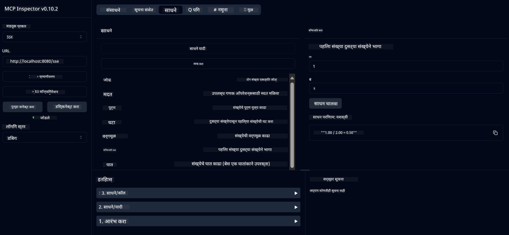

<!--
CO_OP_TRANSLATOR_METADATA:
{
  "original_hash": "13231e9951b68efd9df8c56bd5cdb27e",
  "translation_date": "2025-05-17T13:08:25+00:00",
  "source_file": "03-GettingStarted/samples/java/calculator/README.md",
  "language_code": "mr"
}
-->
# बेसिक कॅल्क्युलेटर MCP सेवा

ही सेवा मॉडेल कॉन्टेक्स्ट प्रोटोकॉल (MCP) च्या माध्यमातून बेसिक कॅल्क्युलेटर ऑपरेशन्स प्रदान करते, ज्यासाठी Spring Boot सह WebFlux ट्रान्सपोर्ट वापरले जाते. MCP अंमलबजावणी शिकणाऱ्या नवशिक्यांसाठी हे एक साधे उदाहरण म्हणून डिझाइन केलेले आहे.

अधिक माहितीसाठी, [MCP Server Boot Starter](https://docs.spring.io/spring-ai/reference/api/mcp/mcp-server-boot-starter-docs.html) संदर्भ दस्तऐवज पहा.

## विहंगावलोकन

सेवा दर्शवते:
- SSE (Server-Sent Events) साठी समर्थन
- Spring AI च्या `@Tool` अॅनोटेशनद्वारे स्वयंचलित टूल नोंदणी
- बेसिक कॅल्क्युलेटर फंक्शन्स:
  - बेरीज, वजाबाकी, गुणाकार, भागाकार
  - घातांक गणना आणि वर्गमूळ
  - मॉड्युलस (शेष) आणि परिपूर्ण मूल्य
  - ऑपरेशन वर्णनांसाठी मदत फंक्शन

## वैशिष्ट्ये

या कॅल्क्युलेटर सेवेमध्ये खालील क्षमता आहेत:

1. **बेसिक अंकगणितीय ऑपरेशन्स**:
   - दोन संख्यांची बेरीज
   - एका संख्येतून दुसऱ्या संख्येची वजाबाकी
   - दोन संख्यांचा गुणाकार
   - एका संख्येचा दुसऱ्या संख्येने भागाकार (शून्य भागाकार तपासणीसह)

2. **प्रगत ऑपरेशन्स**:
   - घातांक गणना (बेसला घातांकापर्यंत उचलणे)
   - वर्गमूळ गणना (नकारात्मक संख्या तपासणीसह)
   - मॉड्युलस (शेष) गणना
   - परिपूर्ण मूल्य गणना

3. **मदत प्रणाली**:
   - सर्व उपलब्ध ऑपरेशन्सची स्पष्टीकरण करणारी अंगभूत मदत फंक्शन

## सेवा वापरणे

सेवा MCP प्रोटोकॉलद्वारे खालील API एन्डपॉइंट्स प्रदर्शित करते:

- `add(a, b)`: दोन संख्यांची बेरीज करा
- `subtract(a, b)`: दुसरी संख्या पहिल्यापासून वजा करा
- `multiply(a, b)`: दोन संख्यांचा गुणाकार करा
- `divide(a, b)`: पहिली संख्या दुसऱ्याने भाग करा (शून्य तपासणीसह)
- `power(base, exponent)`: संख्येचा घातांक गणना करा
- `squareRoot(number)`: वर्गमूळ गणना करा (नकारात्मक संख्या तपासणीसह)
- `modulus(a, b)`: भागाकार करताना शेष गणना करा
- `absolute(number)`: परिपूर्ण मूल्य गणना करा
- `help()`: उपलब्ध ऑपरेशन्सची माहिती मिळवा

## टेस्ट क्लायंट

`com.microsoft.mcp.sample.client` पॅकेजमध्ये एक साधा टेस्ट क्लायंट समाविष्ट आहे. `SampleCalculatorClient` वर्ग कॅल्क्युलेटर सेवेमधील उपलब्ध ऑपरेशन्सचे प्रदर्शन करते.

## LangChain4j क्लायंट वापरणे

प्रकल्प `com.microsoft.mcp.sample.client.LangChain4jClient` मध्ये LangChain4j उदाहरण क्लायंट समाविष्ट करतो, जो कॅल्क्युलेटर सेवेला LangChain4j आणि GitHub मॉडेल्ससह एकत्रित कसे करावे हे दर्शवतो:

### पूर्वापेक्षा

1. **GitHub टोकन सेटअप**:
   
   GitHub च्या AI मॉडेल्स (जसे की phi-4) वापरण्यासाठी, तुम्हाला GitHub वैयक्तिक प्रवेश टोकन आवश्यक आहे:

   a. तुमच्या GitHub खात्याच्या सेटिंग्जमध्ये जा: https://github.com/settings/tokens
   
   b. "Generate new token" → "Generate new token (classic)" क्लिक करा
   
   c. तुमच्या टोकनला एक वर्णनात्मक नाव द्या
   
   d. खालील स्कोप्स निवडा:
      - `repo` (खाजगी रेपॉझिटरीचे पूर्ण नियंत्रण)
      - `read:org` (संघटना आणि टीम सदस्यता वाचणे, संघटना प्रकल्प वाचणे)
      - `gist` (गिस्ट तयार करा)
      - `user:email` (वापरकर्ता ईमेल पत्ते ऍक्सेस करा (फक्त वाचन))
   
   e. "Generate token" क्लिक करा आणि तुमचे नवीन टोकन कॉपी करा
   
   f. ते पर्यावरणीय चल म्हणून सेट करा:
      
      विंडोजवर:
      ```
      set GITHUB_TOKEN=your-github-token
      ```
      
      macOS/Linux वर:
      ```bash
      export GITHUB_TOKEN=your-github-token
      ```

   g. स्थायी सेटअपसाठी, ते तुमच्या पर्यावरणीय चलांमध्ये सिस्टम सेटिंग्जद्वारे जोडा

2. तुमच्या प्रकल्पात LangChain4j GitHub अवलंबित्व जोडा (पहिलेच pom.xml मध्ये समाविष्ट):
   ```xml
   <dependency>
       <groupId>dev.langchain4j</groupId>
       <artifactId>langchain4j-github</artifactId>
       <version>${langchain4j.version}</version>
   </dependency>
   ```

3. सुनिश्चित करा की कॅल्क्युलेटर सर्व्हर `localhost:8080` वर चालू आहे

### LangChain4j क्लायंट चालवणे

हे उदाहरण दर्शवते:
- SSE ट्रान्सपोर्टद्वारे कॅल्क्युलेटर MCP सर्व्हरशी कनेक्ट करणे
- LangChain4j वापरून एक चॅट बॉट तयार करणे, जो कॅल्क्युलेटर ऑपरेशन्सचा उपयोग करतो
- GitHub AI मॉडेल्ससह एकत्रित करणे (आता phi-4 मॉडेल वापरत आहे)

क्लायंट खालील नमुना क्वेरी पाठवतो, ज्याद्वारे कार्यक्षमता दर्शवली जाते:
1. दोन संख्यांची बेरीज गणना करणे
2. संख्येचे वर्गमूळ शोधणे
3. उपलब्ध कॅल्क्युलेटर ऑपरेशन्सबद्दल मदत माहिती मिळवणे

उदाहरण चालवा आणि कन्सोल आउटपुट तपासा, ज्यामध्ये AI मॉडेल कॅल्क्युलेटर टूल्स वापरून क्वेरीस प्रतिसाद देते.

### GitHub मॉडेल कॉन्फिगरेशन

LangChain4j क्लायंट GitHub च्या phi-4 मॉडेलसह खालील सेटिंग्जसह कॉन्फिगर केले आहे:

```java
ChatLanguageModel model = GitHubChatModel.builder()
    .apiKey(System.getenv("GITHUB_TOKEN"))
    .timeout(Duration.ofSeconds(60))
    .modelName("phi-4")
    .logRequests(true)
    .logResponses(true)
    .build();
```

विविध GitHub मॉडेल्स वापरण्यासाठी, फक्त `modelName` पॅरामीटरला दुसऱ्या समर्थित मॉडेलमध्ये बदला (उदा., "claude-3-haiku-20240307", "llama-3-70b-8192", इ.).

## अवलंबित्व

प्रकल्पासाठी खालील प्रमुख अवलंबित्व आवश्यक आहेत:

```xml
<!-- For MCP Server -->
<dependency>
    <groupId>org.springframework.ai</groupId>
    <artifactId>spring-ai-starter-mcp-server-webflux</artifactId>
</dependency>

<!-- For LangChain4j integration -->
<dependency>
    <groupId>dev.langchain4j</groupId>
    <artifactId>langchain4j-mcp</artifactId>
    <version>${langchain4j.version}</version>
</dependency>

<!-- For GitHub models support -->
<dependency>
    <groupId>dev.langchain4j</groupId>
    <artifactId>langchain4j-github</artifactId>
    <version>${langchain4j.version}</version>
</dependency>
```

## प्रकल्प तयार करणे

Maven वापरून प्रकल्प तयार करा:
```bash
./mvnw clean install -DskipTests
```

## सर्व्हर चालवणे

### Java वापरून

```bash
java -jar target/calculator-server-0.0.1-SNAPSHOT.jar
```

### MCP निरीक्षक वापरून

MCP निरीक्षक MCP सेवांसह संवाद साधण्यासाठी एक उपयुक्त साधन आहे. या कॅल्क्युलेटर सेवेसह वापरण्यासाठी:

1. **MCP निरीक्षक स्थापित आणि चालवा** नवीन टर्मिनल विंडोमध्ये:
   ```bash
   npx @modelcontextprotocol/inspector
   ```

2. **वेब UI ऍक्सेस करा** अॅपद्वारे प्रदर्शित URL वर क्लिक करून (सामान्यतः http://localhost:6274)

3. **कनेक्शन कॉन्फिगर करा**:
   - ट्रान्सपोर्ट प्रकार "SSE" म्हणून सेट करा
   - URL तुमच्या चालू असलेल्या सर्व्हरच्या SSE एन्डपॉइंटवर सेट करा: `http://localhost:8080/sse`
   - "Connect" क्लिक करा

4. **टूल्स वापरा**:
   - उपलब्ध कॅल्क्युलेटर ऑपरेशन्स पाहण्यासाठी "List Tools" क्लिक करा
   - टूल निवडा आणि ऑपरेशन चालवण्यासाठी "Run Tool" क्लिक करा



### Docker वापरून

प्रकल्पात कंटेनराइज्ड डिप्लॉयमेंटसाठी Dockerfile समाविष्ट आहे:

1. **Docker इमेज तयार करा**:
   ```bash
   docker build -t calculator-mcp-service .
   ```

2. **Docker कंटेनर चालवा**:
   ```bash
   docker run -p 8080:8080 calculator-mcp-service
   ```

हे करेल:
- Maven 3.9.9 आणि Eclipse Temurin 24 JDK सह मल्टी-स्टेज Docker इमेज तयार करा
- एक ऑप्टिमाइझ्ड कंटेनर इमेज तयार करा
- सेवा पोर्ट 8080 वर उघडा
- कंटेनरमध्ये MCP कॅल्क्युलेटर सेवा सुरू करा

कंटेनर चालू झाल्यावर तुम्ही `http://localhost:8080` वर सेवा ऍक्सेस करू शकता.

## समस्या निवारण

### GitHub टोकनसह सामान्य समस्या

1. **टोकन परवानगी समस्या**: जर तुम्हाला 403 Forbidden त्रुटी मिळाली, तर तुमच्या टोकनला पूर्वापेक्षेत दिलेल्या योग्य परवानग्या आहेत की नाहीत हे तपासा.

2. **टोकन सापडले नाही**: जर तुम्हाला "No API key found" त्रुटी मिळाली, तर GITHUB_TOKEN पर्यावरणीय चल योग्यरित्या सेट आहे की नाही हे सुनिश्चित करा.

3. **रेट लिमिटिंग**: GitHub API ला रेट लिमिट्स आहेत. जर तुम्हाला रेट लिमिट त्रुटी (स्टेटस कोड 429) मिळाली, तर काही मिनिटे थांबा आणि पुन्हा प्रयत्न करा.

4. **टोकन कालबाह्यता**: GitHub टोकन्स कालबाह्य होऊ शकतात. काही वेळानंतर तुम्हाला प्रमाणीकरण त्रुटी मिळाल्यास, नवीन टोकन तयार करा आणि तुमच्या पर्यावरणीय चल अपडेट करा.

जर तुम्हाला आणखी मदतीची आवश्यकता असेल, तर [LangChain4j दस्तऐवज](https://github.com/langchain4j/langchain4j) किंवा [GitHub API दस्तऐवज](https://docs.github.com/en/rest) पहा.

**अस्वीकरण**:  
हा दस्तऐवज AI भाषांतर सेवा [Co-op Translator](https://github.com/Azure/co-op-translator) वापरून भाषांतरित केला आहे. आम्ही अचूकतेसाठी प्रयत्नशील असलो तरी कृपया लक्षात घ्या की स्वयंचलित भाषांतरांमध्ये त्रुटी किंवा अपूर्णता असू शकते. मूळ दस्तऐवज त्याच्या मूळ भाषेत अधिकारिक स्रोत म्हणून विचारात घेतला पाहिजे. महत्त्वपूर्ण माहितीसाठी, व्यावसायिक मानवी भाषांतराची शिफारस केली जाते. या भाषांतराचा वापर करून उद्भवलेल्या कोणत्याही गैरसमज किंवा चुकीच्या अर्थासाठी आम्ही जबाबदार नाही.