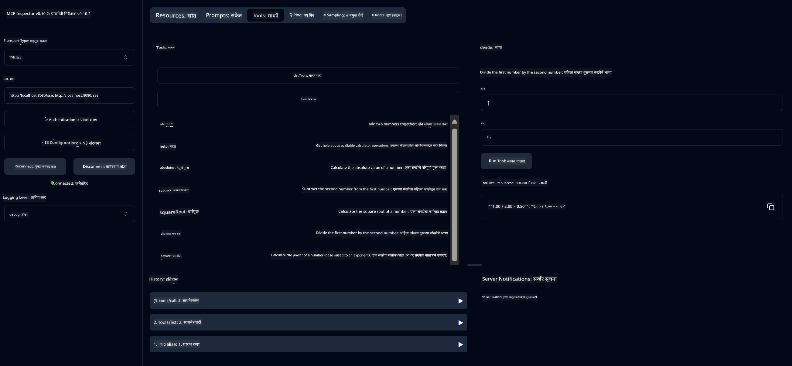

<!--
CO_OP_TRANSLATOR_METADATA:
{
  "original_hash": "13231e9951b68efd9df8c56bd5cdb27e",
  "translation_date": "2025-07-13T22:24:27+00:00",
  "source_file": "03-GettingStarted/samples/java/calculator/README.md",
  "language_code": "mr"
}
-->
# Basic Calculator MCP सेवा

ही सेवा Model Context Protocol (MCP) द्वारे मूलभूत कॅल्क्युलेटर ऑपरेशन्स प्रदान करते, जी Spring Boot सह WebFlux ट्रान्सपोर्ट वापरून तयार केली आहे. हे MCP अंमलबजावणी शिकणाऱ्या नवशिक्यांसाठी एक सोपा उदाहरण म्हणून डिझाइन केले आहे.

अधिक माहितीसाठी, [MCP Server Boot Starter](https://docs.spring.io/spring-ai/reference/api/mcp/mcp-server-boot-starter-docs.html) संदर्भ दस्तऐवज पहा.

## आढावा

ही सेवा खालील गोष्टी दाखवते:
- SSE (Server-Sent Events) साठी समर्थन
- Spring AI च्या `@Tool` अ‍ॅनोटेशनचा वापर करून स्वयंचलित टूल नोंदणी
- मूलभूत कॅल्क्युलेटर फंक्शन्स:
  - बेरीज, वजाबाकी, गुणाकार, भागाकार
  - घातांक गणना आणि वर्गमूळ
  - शेष (मॉड्यूलस) आणि पूर्णांक मूल्य
  - ऑपरेशन वर्णनांसाठी मदत फंक्शन

## वैशिष्ट्ये

ही कॅल्क्युलेटर सेवा खालील क्षमता देते:

1. **मूलभूत अंकगणितीय ऑपरेशन्स**:
   - दोन संख्यांची बेरीज
   - एका संख्येतून दुसरी संख्या वजा करणे
   - दोन संख्यांचा गुणाकार
   - एका संख्येचे दुसऱ्या संख्येने भागाकार (शून्याने भागाकार तपासणीसह)

2. **प्रगत ऑपरेशन्स**:
   - घातांक गणना (बेसला एक्स्पोनेंटवर उचलणे)
   - वर्गमूळ गणना (नकारात्मक संख्या तपासणीसह)
   - शेष (मॉड्यूलस) गणना
   - पूर्णांक मूल्य गणना

3. **मदत प्रणाली**:
   - उपलब्ध सर्व ऑपरेशन्सचे स्पष्टीकरण देणारे अंगभूत मदत फंक्शन

## सेवेचा वापर

ही सेवा MCP प्रोटोकॉलद्वारे खालील API एंडपॉइंट्स उपलब्ध करून देते:

- `add(a, b)`: दोन संख्या एकत्र करा
- `subtract(a, b)`: दुसरी संख्या पहिल्या संख्येतून वजा करा
- `multiply(a, b)`: दोन संख्यांचा गुणाकार करा
- `divide(a, b)`: पहिल्या संख्येचे दुसऱ्या संख्येने भागाकार करा (शून्य तपासणीसह)
- `power(base, exponent)`: संख्येचा घातांक काढा
- `squareRoot(number)`: वर्गमूळ काढा (नकारात्मक संख्या तपासणीसह)
- `modulus(a, b)`: भागाकारानंतर उरलेला शेष काढा
- `absolute(number)`: पूर्णांक मूल्य काढा
- `help()`: उपलब्ध ऑपरेशन्सची माहिती मिळवा

## टेस्ट क्लायंट

`com.microsoft.mcp.sample.client` पॅकेजमध्ये एक सोपा टेस्ट क्लायंट समाविष्ट आहे. `SampleCalculatorClient` क्लास कॅल्क्युलेटर सेवेच्या उपलब्ध ऑपरेशन्सचे प्रदर्शन करतो.

## LangChain4j क्लायंटचा वापर

प्रकल्पात `com.microsoft.mcp.sample.client.LangChain4jClient` मध्ये LangChain4j चे उदाहरण क्लायंट आहे, जे कॅल्क्युलेटर सेवा LangChain4j आणि GitHub मॉडेल्ससह कसे एकत्र करायचे हे दाखवते:

### पूर्वअटी

1. **GitHub टोकन सेटअप**:

   GitHub चे AI मॉडेल्स (जसे की phi-4) वापरण्यासाठी, तुम्हाला GitHub वैयक्तिक प्रवेश टोकन आवश्यक आहे:

   a. तुमच्या GitHub खात्याच्या सेटिंग्जवर जा: https://github.com/settings/tokens

   b. "Generate new token" → "Generate new token (classic)" क्लिक करा

   c. तुमच्या टोकनला एक वर्णनात्मक नाव द्या

   d. खालील स्कोप निवडा:
      - `repo` (खाजगी रिपॉझिटरीजवर पूर्ण नियंत्रण)
      - `read:org` (संस्था आणि टीम सदस्यत्व वाचणे, संस्था प्रोजेक्ट्स वाचणे)
      - `gist` (गिस्ट तयार करणे)
      - `user:email` (वापरकर्त्याचा ईमेल पत्ता वाचणे (फक्त वाचन))

   e. "Generate token" क्लिक करा आणि तुमचा नवीन टोकन कॉपी करा

   f. ते पर्यावरण चल म्हणून सेट करा:

      Windows वर:
      ```
      set GITHUB_TOKEN=your-github-token
      ```

      macOS/Linux वर:
      ```bash
      export GITHUB_TOKEN=your-github-token
      ```

   g. कायमस्वरूपी सेटअपसाठी, ते सिस्टम सेटिंग्जमधून पर्यावरण चलांमध्ये जोडा

2. तुमच्या प्रकल्पात LangChain4j GitHub अवलंबित्व जोडा (pom.xml मध्ये आधीच समाविष्ट आहे):
   ```xml
   <dependency>
       <groupId>dev.langchain4j</groupId>
       <artifactId>langchain4j-github</artifactId>
       <version>${langchain4j.version}</version>
   </dependency>
   ```

3. कॅल्क्युलेटर सर्व्हर `localhost:8080` वर चालू असल्याची खात्री करा

### LangChain4j क्लायंट चालवणे

हे उदाहरण दाखवते:
- SSE ट्रान्सपोर्टद्वारे कॅल्क्युलेटर MCP सर्व्हरशी कनेक्ट होणे
- LangChain4j वापरून कॅल्क्युलेटर ऑपरेशन्सचा वापर करणारा चॅट बॉट तयार करणे
- GitHub AI मॉडेल्ससह एकत्रीकरण (आता phi-4 मॉडेल वापरून)

क्लायंट खालील नमुना क्वेरीज पाठवतो जे कार्यक्षमता दर्शवतात:
1. दोन संख्यांची बेरीज काढणे
2. एका संख्येचा वर्गमूळ काढणे
3. उपलब्ध कॅल्क्युलेटर ऑपरेशन्सबाबत मदत माहिती मिळवणे

उदाहरण चालवा आणि कन्सोल आउटपुट तपासा की AI मॉडेल कसे कॅल्क्युलेटर टूल्स वापरून क्वेरीजना प्रतिसाद देते.

### GitHub मॉडेल कॉन्फिगरेशन

LangChain4j क्लायंट GitHub च्या phi-4 मॉडेलसह खालील सेटिंग्जसह कॉन्फिगर केलेले आहे:

```java
ChatLanguageModel model = GitHubChatModel.builder()
    .apiKey(System.getenv("GITHUB_TOKEN"))
    .timeout(Duration.ofSeconds(60))
    .modelName("phi-4")
    .logRequests(true)
    .logResponses(true)
    .build();
```

वेगवेगळे GitHub मॉडेल वापरण्यासाठी, `modelName` पॅरामीटर दुसऱ्या समर्थित मॉडेलवर बदला (उदा. "claude-3-haiku-20240307", "llama-3-70b-8192", इत्यादी).

## अवलंबित्वे

प्रकल्पासाठी खालील मुख्य अवलंबित्वे आवश्यक आहेत:

```xml
<!-- For MCP Server -->
<dependency>
    <groupId>org.springframework.ai</groupId>
    <artifactId>spring-ai-starter-mcp-server-webflux</artifactId>
</dependency>

<!-- For LangChain4j integration -->
<dependency>
    <groupId>dev.langchain4j</groupId>
    <artifactId>langchain4j-mcp</artifactId>
    <version>${langchain4j.version}</version>
</dependency>

<!-- For GitHub models support -->
<dependency>
    <groupId>dev.langchain4j</groupId>
    <artifactId>langchain4j-github</artifactId>
    <version>${langchain4j.version}</version>
</dependency>
```

## प्रकल्प बांधणी

Maven वापरून प्रकल्प बांधा:
```bash
./mvnw clean install -DskipTests
```

## सर्व्हर चालवणे

### Java वापरून

```bash
java -jar target/calculator-server-0.0.1-SNAPSHOT.jar
```

### MCP Inspector वापरून

MCP Inspector हा MCP सेवांशी संवाद साधण्यासाठी उपयुक्त टूल आहे. या कॅल्क्युलेटर सेवेबरोबर वापरण्यासाठी:

1. **MCP Inspector इंस्टॉल करा आणि नवीन टर्मिनल विंडोमध्ये चालवा:**
   ```bash
   npx @modelcontextprotocol/inspector
   ```

2. **वेब UI मध्ये प्रवेश करा** (साधारणपणे http://localhost:6274) जेव्हा अ‍ॅप URL दाखवेल तेव्हा क्लिक करा

3. **कनेक्शन कॉन्फिगर करा**:
   - ट्रान्सपोर्ट प्रकार "SSE" सेट करा
   - तुमच्या चालू सर्व्हरचा SSE एंडपॉइंट URL सेट करा: `http://localhost:8080/sse`
   - "Connect" क्लिक करा

4. **टूल्स वापरा**:
   - "List Tools" क्लिक करून उपलब्ध कॅल्क्युलेटर ऑपरेशन्स पहा
   - टूल निवडा आणि "Run Tool" क्लिक करून ऑपरेशन चालवा



### Docker वापरून

प्रकल्पात कंटेनरायझेशनसाठी Dockerfile समाविष्ट आहे:

1. **Docker इमेज तयार करा**:
   ```bash
   docker build -t calculator-mcp-service .
   ```

2. **Docker कंटेनर चालवा**:
   ```bash
   docker run -p 8080:8080 calculator-mcp-service
   ```

हे करेल:
- Maven 3.9.9 आणि Eclipse Temurin 24 JDK सह मल्टी-स्टेज Docker इमेज तयार करेल
- ऑप्टिमाइझ्ड कंटेनर इमेज तयार करेल
- सेवा पोर्ट 8080 वर उपलब्ध करेल
- कंटेनरमध्ये MCP कॅल्क्युलेटर सेवा सुरू करेल

कंटेनर चालू झाल्यावर तुम्ही `http://localhost:8080` वर सेवा वापरू शकता.

## समस्या निवारण

### GitHub टोकनसंबंधी सामान्य समस्या

1. **टोकन परवानग्या समस्या**: जर तुम्हाला 403 Forbidden त्रुटी आली, तर खात्री करा की तुमच्या टोकनमध्ये पूर्वनिर्धारित योग्य परवानग्या आहेत.

2. **टोकन सापडले नाही**: "No API key found" त्रुटी आल्यास, GITHUB_TOKEN पर्यावरण चल योग्यरित्या सेट केले आहे का ते तपासा.

3. **रेट लिमिटिंग**: GitHub API वर रेट लिमिट्स आहेत. जर तुम्हाला 429 त्रुटी आली, तर काही मिनिटे थांबा आणि पुन्हा प्रयत्न करा.

4. **टोकन कालबाह्यता**: GitHub टोकन्स कालबाह्य होऊ शकतात. काही वेळानंतर प्रमाणीकरण त्रुटी आल्यास नवीन टोकन तयार करा आणि पर्यावरण चल अपडेट करा.

अधिक मदतीसाठी, [LangChain4j दस्तऐवज](https://github.com/langchain4j/langchain4j) किंवा [GitHub API दस्तऐवज](https://docs.github.com/en/rest) पहा.

**अस्वीकरण**:  
हा दस्तऐवज AI अनुवाद सेवा [Co-op Translator](https://github.com/Azure/co-op-translator) वापरून अनुवादित केला आहे. आम्ही अचूकतेसाठी प्रयत्नशील असलो तरी, कृपया लक्षात घ्या की स्वयंचलित अनुवादांमध्ये चुका किंवा अचूकतेची कमतरता असू शकते. मूळ दस्तऐवज त्याच्या स्थानिक भाषेत अधिकृत स्रोत मानला जावा. महत्त्वाच्या माहितीसाठी व्यावसायिक मानवी अनुवाद करण्याची शिफारस केली जाते. या अनुवादाच्या वापरामुळे उद्भवलेल्या कोणत्याही गैरसमजुती किंवा चुकीच्या अर्थलागी आम्ही जबाबदार नाही.