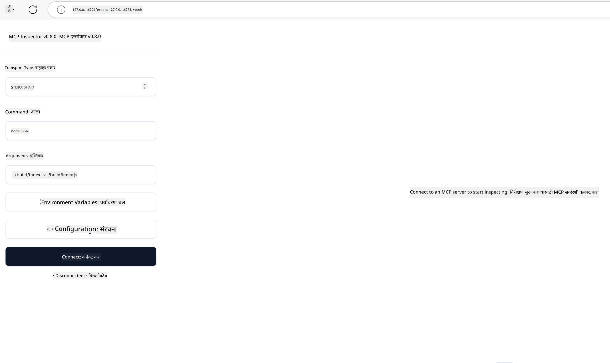

<!--
CO_OP_TRANSLATOR_METADATA:
{
  "original_hash": "83efa75a69bc831277263a6f1ae53669",
  "translation_date": "2025-08-18T15:30:00+00:00",
  "source_file": "04-PracticalImplementation/README.md",
  "language_code": "mr"
}
-->
# व्यावहारिक अंमलबजावणी

[](https://youtu.be/vCN9-mKBDfQ)

_(वरील प्रतिमेवर क्लिक करून या धड्याचा व्हिडिओ पहा)_

व्यावहारिक अंमलबजावणी ही मॉडेल कॉन्टेक्स्ट प्रोटोकॉल (MCP) ची खरी ताकद अनुभवण्याची जागा आहे. MCP च्या सिद्धांत आणि आर्किटेक्चर समजून घेणे महत्त्वाचे असले तरी, वास्तविक मूल्य तेव्हा दिसून येते जेव्हा तुम्ही या संकल्पनांचा उपयोग करून वास्तविक समस्यांचे निराकरण करणारे उपाय तयार करता, चाचणी करता आणि तैनात करता. हे प्रकरण संकल्पनात्मक ज्ञान आणि प्रत्यक्ष विकास यामधील अंतर भरून काढते, MCP-आधारित अ‍ॅप्लिकेशन्स प्रत्यक्षात आणण्याच्या प्रक्रियेत तुम्हाला मार्गदर्शन करते.

तुम्ही बुद्धिमान सहाय्यक विकसित करत असाल, व्यवसाय कार्यप्रवाहांमध्ये AI समाकलित करत असाल किंवा डेटा प्रक्रिया करण्यासाठी सानुकूल साधने तयार करत असाल, MCP एक लवचिक पाया प्रदान करते. त्याचे भाषा-निरपेक्ष डिझाइन आणि लोकप्रिय प्रोग्रामिंग भाषांसाठी अधिकृत SDKs विविध विकसकांसाठी सुलभ बनवतात. या SDKs चा उपयोग करून तुम्ही वेगाने प्रोटोटाइप तयार करू शकता, पुनरावृत्ती करू शकता आणि तुमचे उपाय विविध प्लॅटफॉर्म आणि वातावरणांमध्ये स्केल करू शकता.

पुढील विभागांमध्ये, तुम्हाला व्यावहारिक उदाहरणे, नमुना कोड आणि तैनाती धोरणे सापडतील जी C#, Java with Spring, TypeScript, JavaScript आणि Python मध्ये MCP अंमलबजावणी कशी करावी हे दाखवतात. तुम्ही MCP सर्व्हर्स डिबग आणि चाचणी कसे करायचे, API व्यवस्थापित कसे करायचे आणि Azure वापरून उपाय क्लाउडवर कसे तैनात करायचे हे देखील शिकाल. हे प्रत्यक्ष संसाधने तुमच्या शिक्षणाला गती देण्यासाठी आणि मजबूत, उत्पादन-तयार MCP अ‍ॅप्लिकेशन्स आत्मविश्वासाने तयार करण्यासाठी डिझाइन केले आहेत.

## आढावा

हा धडा विविध प्रोग्रामिंग भाषांमध्ये MCP अंमलबजावणीच्या व्यावहारिक पैलूंवर केंद्रित आहे. आम्ही C#, Java with Spring, TypeScript, JavaScript आणि Python मध्ये MCP SDKs वापरून मजबूत अ‍ॅप्लिकेशन्स कसे तयार करायचे, MCP सर्व्हर्स डिबग आणि चाचणी कसे करायचे आणि पुनर्वापरयोग्य संसाधने, प्रॉम्प्ट्स आणि साधने कशी तयार करायची याचा अभ्यास करू.

## शिकण्याची उद्दिष्टे

या धड्याच्या शेवटी, तुम्ही खालील गोष्टी करण्यात सक्षम असाल:

- विविध प्रोग्रामिंग भाषांमध्ये अधिकृत SDKs वापरून MCP उपाय अंमलात आणणे
- पद्धतशीरपणे MCP सर्व्हर्स डिबग आणि चाचणी करणे
- सर्व्हर वैशिष्ट्ये तयार करणे आणि वापरणे (संसाधने, प्रॉम्प्ट्स आणि साधने)
- जटिल कार्यांसाठी प्रभावी MCP कार्यप्रवाह डिझाइन करणे
- कार्यक्षमता आणि विश्वसनीयतेसाठी MCP अंमलबजावणी ऑप्टिमाइझ करणे

## अधिकृत SDK संसाधने

मॉडेल कॉन्टेक्स्ट प्रोटोकॉल अनेक भाषांसाठी अधिकृत SDKs प्रदान करते:

- [C# SDK](https://github.com/modelcontextprotocol/csharp-sdk)
- [Java with Spring SDK](https://github.com/modelcontextprotocol/java-sdk) **टीप:** [Project Reactor](https://projectreactor.io) वर अवलंबून आहे. ([चर्चा मुद्दा 246](https://github.com/orgs/modelcontextprotocol/discussions/246) पहा.)
- [TypeScript SDK](https://github.com/modelcontextprotocol/typescript-sdk)
- [Python SDK](https://github.com/modelcontextprotocol/python-sdk)
- [Kotlin SDK](https://github.com/modelcontextprotocol/kotlin-sdk)

## MCP SDKs सह काम करणे

या विभागात विविध प्रोग्रामिंग भाषांमध्ये MCP अंमलबजावणीची व्यावहारिक उदाहरणे दिली आहेत. तुम्हाला `samples` डिरेक्टरीमध्ये भाषेनुसार आयोजित नमुना कोड सापडेल.

### उपलब्ध नमुने

रेपॉझिटरीमध्ये खालील भाषांमध्ये [नमुना अंमलबजावणी](../../../04-PracticalImplementation/samples) समाविष्ट आहे:

- [C#](./samples/csharp/README.md)
- [Java with Spring](./samples/java/containerapp/README.md)
- [TypeScript](./samples/typescript/README.md)
- [JavaScript](./samples/javascript/README.md)
- [Python](./samples/python/README.md)

प्रत्येक नमुना त्या विशिष्ट भाषा आणि इकोसिस्टमसाठी महत्त्वाचे MCP संकल्पना आणि अंमलबजावणी नमुने दाखवतो.

## मुख्य सर्व्हर वैशिष्ट्ये

MCP सर्व्हर्स खालील वैशिष्ट्यांपैकी कोणत्याही संयोजनाची अंमलबजावणी करू शकतात:

### संसाधने

संसाधने वापरकर्त्याला किंवा AI मॉडेलला वापरण्यासाठी संदर्भ आणि डेटा प्रदान करतात:

- दस्तऐवज संग्रह
- ज्ञान तळ
- संरचित डेटा स्रोत
- फाइल प्रणाली

### प्रॉम्प्ट्स

प्रॉम्प्ट्स वापरकर्त्यांसाठी टेम्पलेटेड संदेश आणि कार्यप्रवाह आहेत:

- पूर्व-परिभाषित संभाषण टेम्पलेट्स
- मार्गदर्शित संवाद नमुने
- विशेष संवाद संरचना

### साधने

साधने AI मॉडेलसाठी कार्ये अंमलात आणण्यासाठी आहेत:

- डेटा प्रक्रिया उपयुक्तता
- बाह्य API समाकलन
- संगणकीय क्षमता
- शोध कार्यक्षमता

## नमुना अंमलबजावणी: C# अंमलबजावणी

अधिकृत C# SDK रेपॉझिटरीमध्ये MCP च्या विविध पैलू दाखवणारी अनेक नमुना अंमलबजावणी समाविष्ट आहे:

- **मूलभूत MCP क्लायंट**: MCP क्लायंट तयार कसा करायचा आणि साधनांना कॉल कसे करायचे याचे सोपे उदाहरण
- **मूलभूत MCP सर्व्हर**: मूलभूत साधन नोंदणीसह किमान सर्व्हर अंमलबजावणी
- **प्रगत MCP सर्व्हर**: साधन नोंदणी, प्रमाणीकरण आणि त्रुटी हाताळणीसह पूर्ण-वैशिष्ट्यीकृत सर्व्हर
- **ASP.NET समाकलन**: ASP.NET Core सह समाकलन दर्शवणारी उदाहरणे
- **साधन अंमलबजावणी नमुने**: वेगवेगळ्या जटिलतेच्या पातळींसह साधने अंमलात आणण्यासाठी विविध नमुने

C# MCP SDK प्रिव्ह्यूमध्ये आहे आणि APIs बदलू शकतात. SDK विकसित होत असताना आम्ही सतत हा ब्लॉग अपडेट करू.

### मुख्य वैशिष्ट्ये

- [C# MCP Nuget ModelContextProtocol](https://www.nuget.org/packages/ModelContextProtocol)
- तुमचा [पहिला MCP सर्व्हर तयार करणे](https://devblogs.microsoft.com/dotnet/build-a-model-context-protocol-mcp-server-in-csharp/).

पूर्ण C# अंमलबजावणी नमुन्यांसाठी, [अधिकृत C# SDK नमुने रेपॉझिटरी](https://github.com/modelcontextprotocol/csharp-sdk) ला भेट द्या.

## नमुना अंमलबजावणी: Java with Spring अंमलबजावणी

Java with Spring SDK एंटरप्राइझ-ग्रेड वैशिष्ट्यांसह मजबूत MCP अंमलबजावणी पर्याय ऑफर करते.

### मुख्य वैशिष्ट्ये

- Spring Framework समाकलन
- मजबूत प्रकार सुरक्षा
- प्रतिक्रियाशील प्रोग्रामिंग समर्थन
- व्यापक त्रुटी हाताळणी

पूर्ण Java with Spring अंमलबजावणी नमुन्यासाठी, `samples` डिरेक्टरीतील [Java with Spring नमुना](samples/java/containerapp/README.md) पहा.

## नमुना अंमलबजावणी: JavaScript अंमलबजावणी

JavaScript SDK MCP अंमलबजावणीसाठी हलके आणि लवचिक दृष्टिकोन प्रदान करते.

### मुख्य वैशिष्ट्ये

- Node.js आणि ब्राउझर समर्थन
- प्रॉमिस-आधारित API
- Express आणि इतर फ्रेमवर्कसह सोपे समाकलन
- स्ट्रीमिंगसाठी WebSocket समर्थन

पूर्ण JavaScript अंमलबजावणी नमुन्यासाठी, `samples` डिरेक्टरीतील [JavaScript नमुना](samples/javascript/README.md) पहा.

## नमुना अंमलबजावणी: Python अंमलबजावणी

Python SDK उत्कृष्ट ML फ्रेमवर्क समाकलनासह Python-आधारित MCP अंमलबजावणी प्रदान करते.

### मुख्य वैशिष्ट्ये

- asyncio सह Async/await समर्थन
- FastAPI समाकलन
- सोपी साधन नोंदणी
- लोकप्रिय ML लायब्ररींसह मूळ समाकलन

पूर्ण Python अंमलबजावणी नमुन्यासाठी, `samples` डिरेक्टरीतील [Python नमुना](samples/python/README.md) पहा.

## API व्यवस्थापन

Azure API Management MCP सर्व्हर्स सुरक्षित करण्यासाठी उत्कृष्ट उपाय आहे. कल्पना अशी आहे की तुमच्या MCP सर्व्हरसमोर Azure API Management instance ठेवावी आणि ती खालील वैशिष्ट्ये हाताळेल:

- दर मर्यादित करणे
- टोकन व्यवस्थापन
- निरीक्षण
- लोड संतुलन
- सुरक्षा

### Azure नमुना

Azure API Management सह सुरक्षित MCP सर्व्हर तयार करण्यासाठी [Azure नमुना](https://github.com/Azure-Samples/remote-mcp-apim-functions-python) पहा.

खालील प्रतिमेत अधिकृतता प्रवाह कसा होतो ते दाखवले आहे:


वरील प्रतिमेत, खालील प्रक्रिया होते:

- Microsoft Entra वापरून प्रमाणीकरण/अधिकृतता होते.
- Azure API Management गेटवे म्हणून कार्य करते आणि धोरणांचा वापर करून ट्रॅफिकचे व्यवस्थापन करते.
- Azure Monitor सर्व विनंत्यांचे लॉग ठेवते पुढील विश्लेषणासाठी.

#### अधिकृतता प्रवाह

आधिकृतता प्रवाह अधिक तपशीलात पाहूया:


#### MCP अधिकृतता तपशील

[MCP अधिकृतता तपशील](https://modelcontextprotocol.io/specification/2025-03-26/basic/authorization#2-10-third-party-authorization-flow) बद्दल अधिक जाणून घ्या.

## Azure वर Remote MCP Server तैनात करणे

आम्ही यापूर्वी उल्लेख केलेला नमुना तैनात करूया:

1. रेपो क्लोन करा

    ```bash
    git clone https://github.com/Azure-Samples/remote-mcp-apim-functions-python.git
    cd remote-mcp-apim-functions-python
    ```

1. `Microsoft.App` संसाधन प्रदाता नोंदणी करा.

   - तुम्ही Azure CLI वापरत असल्यास, `az provider register --namespace Microsoft.App --wait` चालवा.
   - तुम्ही Azure PowerShell वापरत असल्यास, `Register-AzResourceProvider -ProviderNamespace Microsoft.App` चालवा. नोंदणी पूर्ण झाली आहे का ते तपासण्यासाठी `(Get-AzResourceProvider -ProviderNamespace Microsoft.App).RegistrationState` चालवा.

1. API व्यवस्थापन सेवा, फंक्शन अ‍ॅप (कोडसह) आणि इतर आवश्यक Azure संसाधने तयार करण्यासाठी [azd](https://aka.ms/azd) कमांड चालवा:

    ```shell
    azd up
    ```

    ही कमांड Azure वर सर्व क्लाउड संसाधने तैनात करेल.

### MCP Inspector सह तुमचा सर्व्हर चाचणी करणे

1. **नवीन टर्मिनल विंडो** मध्ये MCP Inspector इंस्टॉल करा आणि चालवा:

    ```shell
    npx @modelcontextprotocol/inspector
    ```

    तुम्हाला खालीलप्रमाणे इंटरफेस दिसेल:

    

1. MCP Inspector वेब अ‍ॅप लोड करण्यासाठी अ‍ॅपद्वारे प्रदर्शित URL वर CTRL क्लिक करा (उदा. [http://127.0.0.1:6274/#resources](http://127.0.0.1:6274/#resources))
1. ट्रान्सपोर्ट प्रकार `SSE` सेट करा.
1. तुमच्या चालू असलेल्या API Management SSE endpoint चा URL सेट करा जो `azd up` नंतर प्रदर्शित होतो आणि **Connect**:

    ```shell
    https://<apim-servicename-from-azd-output>.azure-api.net/mcp/sse
    ```

1. **List Tools**. एखाद्या साधनावर क्लिक करा आणि **Run Tool**.

जर सर्व चरण यशस्वी झाले असतील, तर तुम्ही MCP सर्व्हरशी कनेक्ट केले आहे आणि तुम्ही साधनाला कॉल करू शकला आहात.

## Azure साठी MCP सर्व्हर्स

[Remote-mcp-functions](https://github.com/Azure-Samples/remote-mcp-functions-dotnet): हे रेपॉझिटरी Azure Functions वापरून Python, C# .NET किंवा Node/TypeScript सह सानुकूल Remote MCP (Model Context Protocol) सर्व्हर्स तयार आणि तैनात करण्यासाठी जलद प्रारंभ टेम्पलेट आहेत.

नमुने विकसकांना खालील गोष्टी करण्याची परवानगी देतात:

- स्थानिकपणे तयार करा आणि चालवा: स्थानिक मशीनवर MCP सर्व्हर विकसित करा आणि डिबग करा.
- Azure वर तैनात करा: सोप्या `azd up` कमांडसह क्लाउडवर सहज तैनात करा.
- क्लायंट्समधून कनेक्ट करा: VS Code च्या Copilot agent mode आणि MCP Inspector tool सह विविध क्लायंट्समधून MCP सर्व्हरशी कनेक्ट करा.

### मुख्य वैशिष्ट्ये

- डिझाइनद्वारे सुरक्षा: MCP सर्व्हर की आणि HTTPS वापरून सुरक्षित आहे.
- प्रमाणीकरण पर्याय: अंगभूत प्रमाणीकरण आणि/किंवा API Management वापरून OAuth समर्थन.
- नेटवर्क वेगळेपणा: Azure Virtual Networks (VNET) वापरून नेटवर्क वेगळेपणा सक्षम करते.
- सर्व्हरलेस आर्किटेक्चर: स्केलेबल, इव्हेंट-ड्रिव्हन अंमलबजावणीसाठी Azure Functions चा उपयोग करते.
- स्थानिक विकास: व्यापक स्थानिक विकास आणि डिबगिंग समर्थन.
- सोपी तैनाती: Azure वर तैनात करण्यासाठी सुलभ प्रक्रिया.

रेपॉझिटरीमध्ये उत्पादन-तयार MCP सर्व्हर अंमलबजावणीसाठी जलद प्रारंभ करण्यासाठी आवश्यक सर्व कॉन्फिगरेशन फाइल्स, स्त्रोत कोड आणि पायाभूत संरचना परिभाषा समाविष्ट आहेत.

- [Azure Remote MCP Functions Python](https://github.com/Azure-Samples/remote-mcp-functions-python) - Python वापरून MCP च्या नमुना अंमलबजावणी.

- [Azure Remote MCP Functions .NET](https://github.com/Azure-Samples/remote-mcp-functions-dotnet) - C# .NET वापरून MCP च्या नमुना अंमलबजावणी.

- [Azure Remote MCP Functions Node/Typescript](https://github.com/Azure-Samples/remote-mcp-functions-typescript) - Node/TypeScript वापरून MCP च्या नमुना अंमलबजावणी.

## मुख्य मुद्दे

- MCP SDKs मजबूत MCP उपाय अंमलबजावणीसाठी भाषा-विशिष्ट साधने प्रदान करतात.
- विश्वसनीय MCP अ‍ॅप्लिकेशन्ससाठी डिबगिंग आणि चाचणी प्रक्रिया महत्त्वाची आहे.
- पुनर्वापरयोग्य प्रॉम्प्ट टेम्पलेट्स सुसंगत AI संवाद सक्षम करतात.
- चांगल्या प्रकारे डिझाइन केलेले कार्यप्रवाह अनेक साधनांचा वापर करून जटिल कार्ये समन्वयित करू शकतात.
- MCP उपाय अंमलबजावणी करताना सुरक्षा, कार्यक्षमता आणि त्रुटी हाताळणी विचारात घेणे आवश्यक आहे.

## व्यायाम

तुमच्या क्षेत्रातील वास्तविक समस्येचे निराकरण करणारा व्यावहारिक MCP कार्यप्रवाह डिझाइन करा:

1. या समस्येचे निराकरण करण्यासाठी उपयुक्त असलेली 3-4 साधने ओळखा.
2. या साधनांचा परस्परसंवाद कसा होतो हे दाखवणारा कार्यप्रवाह आकृती तयार करा.
3. तुमच्या पसंतीच्या भाषेचा वापर करून साधनांपैकी एकाचे मूलभूत आवृत्ती अंमलात आणा.
4. तुमचे साधन प्रभावीपणे वापरण्यासाठी मॉडेलला मदत करणारा प्रॉम्प्ट टेम्पलेट तयार करा.

## अतिरिक्त संसाधने

---

पुढे: [प्रगत विषय](../05-AdvancedTopics/README.md)

**अस्वीकरण**:  
हा दस्तऐवज AI भाषांतर सेवा [Co-op Translator](https://github.com/Azure/co-op-translator) वापरून भाषांतरित करण्यात आला आहे. आम्ही अचूकतेसाठी प्रयत्नशील असलो तरी, कृपया लक्षात ठेवा की स्वयंचलित भाषांतरे त्रुटी किंवा अचूकतेच्या अभावाने युक्त असू शकतात. मूळ भाषेतील दस्तऐवज हा अधिकृत स्रोत मानला जावा. महत्त्वाच्या माहितीसाठी, व्यावसायिक मानवी भाषांतराची शिफारस केली जाते. या भाषांतराचा वापर करून उद्भवलेल्या कोणत्याही गैरसमज किंवा चुकीच्या अर्थासाठी आम्ही जबाबदार राहणार नाही.