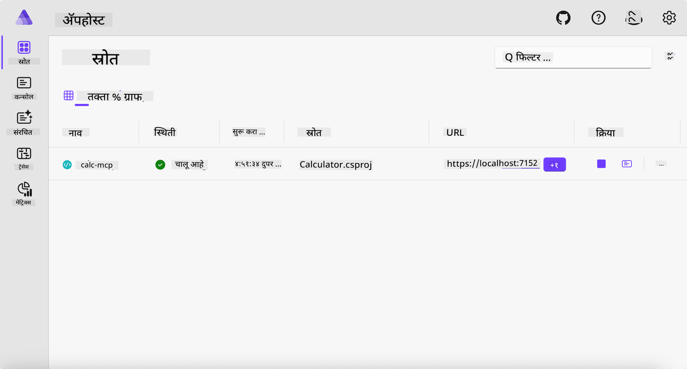
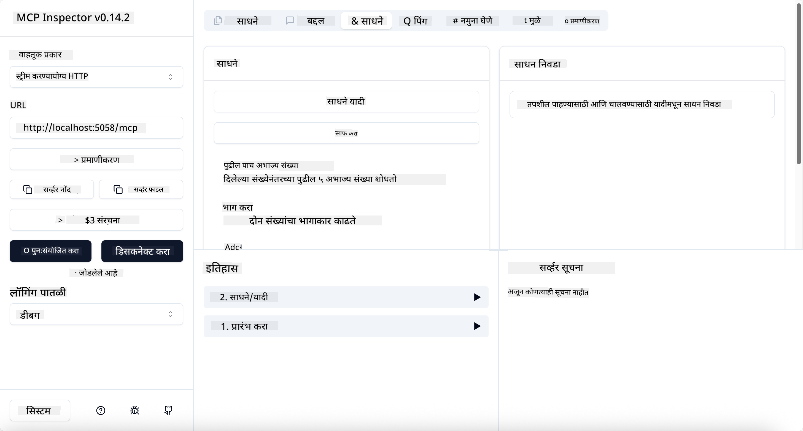
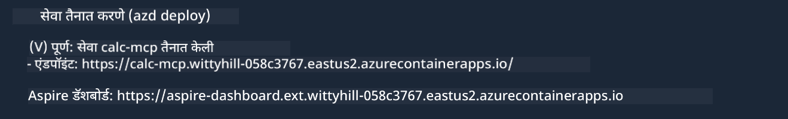

<!--
CO_OP_TRANSLATOR_METADATA:
{
  "original_hash": "0bc7bd48f55f1565f1d95ccb2c16f728",
  "translation_date": "2025-07-13T23:05:35+00:00",
  "source_file": "04-PracticalImplementation/samples/csharp/README.md",
  "language_code": "mr"
}
-->
# नमुना

मागील उदाहरणात स्थानिक .NET प्रोजेक्ट `stdio` प्रकारासह कसा वापरायचा हे दाखवले आहे. आणि कंटेनरमध्ये स्थानिकपणे सर्व्हर कसा चालवायचा हेही. अनेक परिस्थितींमध्ये हे एक चांगले समाधान आहे. मात्र, सर्व्हर क्लाउड सारख्या रिमोट वातावरणात चालवणे उपयुक्त ठरू शकते. यासाठी `http` प्रकार वापरला जातो.

`04-PracticalImplementation` फोल्डरमधील सोल्यूशन पाहिल्यास, ते मागील उदाहरणापेक्षा जास्त गुंतागुंतीचे वाटू शकते. पण प्रत्यक्षात तसे नाही. प्रोजेक्ट `src/Calculator` जवळून पाहिल्यास, तो मुख्यतः मागील उदाहरणातील सारखाच कोड आहे. फरक इतकाच की HTTP विनंत्या हाताळण्यासाठी आपण वेगळ्या लायब्ररी `ModelContextProtocol.AspNetCore` चा वापर करत आहोत. आणि `IsPrime` मेथड खाजगी (private) केली आहे, जे दाखवण्यासाठी की तुमच्या कोडमध्ये खाजगी मेथड्स असू शकतात. बाकीचा कोड अगदी पूर्वीसारखा आहे.

इतर प्रोजेक्ट्स [.NET Aspire](https://learn.microsoft.com/dotnet/aspire/get-started/aspire-overview) मधील आहेत. सोल्यूशनमध्ये .NET Aspire असणे विकासकाच्या अनुभवाला सुधारते, विकास आणि चाचणी करताना मदत करते आणि निरीक्षणक्षमतेसाठी उपयुक्त आहे. सर्व्हर चालवण्यासाठी ते आवश्यक नाही, पण चांगली सवय म्हणून ते सोल्यूशनमध्ये ठेवणे फायदेशीर आहे.

## स्थानिकपणे सर्व्हर सुरू करा

1. VS Code (C# DevKit विस्तारासह) मध्ये `04-PracticalImplementation/samples/csharp` निर्देशिकेत जा.
1. सर्व्हर सुरू करण्यासाठी खालील कमांड चालवा:

   ```bash
    dotnet watch run --project ./src/AppHost
   ```

1. जेव्हा वेब ब्राउझरमध्ये .NET Aspire डॅशबोर्ड उघडेल, तेव्हा `http` URL लक्षात ठेवा. ते साधारणपणे `http://localhost:5058/` सारखे असावे.

   

## MCP Inspector सह Streamable HTTP चाचणी करा

जर तुमच्याकडे Node.js 22.7.5 किंवा त्याहून अधिक आवृत्ती असेल, तर तुम्ही MCP Inspector वापरून तुमचा सर्व्हर तपासू शकता.

सर्व्हर सुरू करा आणि टर्मिनलमध्ये खालील कमांड चालवा:

```bash
npx @modelcontextprotocol/inspector http://localhost:5058
```



- Transport प्रकार म्हणून `Streamable HTTP` निवडा.
- Url फील्डमध्ये आधी लक्षात ठेवलेला सर्व्हरचा URL टाका आणि त्याच्या शेवटी `/mcp` जोडा. तो `http` (https नाही) असावा, उदा. `http://localhost:5058/mcp`.
- Connect बटणावर क्लिक करा.

Inspector ची एक चांगली गोष्ट म्हणजे तो काय चालू आहे यावर चांगली दृश्यता देतो.

- उपलब्ध टूल्सची यादी पाहण्याचा प्रयत्न करा
- काही टूल्स वापरून पहा, ते पूर्वीसारखेच काम करायला हवे.

## VS Code मधील GitHub Copilot Chat सह MCP Server ची चाचणी करा

Streamable HTTP ट्रान्सपोर्ट GitHub Copilot Chat मध्ये वापरण्यासाठी, आधी तयार केलेल्या `calc-mcp` सर्व्हरची कॉन्फिगरेशन खालीलप्रमाणे बदला:

```jsonc
// .vscode/mcp.json
{
  "servers": {
    "calc-mcp": {
      "type": "http",
      "url": "http://localhost:5058/mcp"
    }
  }
}
```

काही चाचण्या करा:

- "3 prime numbers after 6780" असा प्रश्न विचारा. लक्षात ठेवा की Copilot नवीन टूल्स `NextFivePrimeNumbers` वापरेल आणि फक्त पहिले 3 प्राइम नंबर परत करेल.
- "7 prime numbers after 111" असा प्रश्न विचारा, काय होते ते पाहा.
- "John कडे 24 लॉली आहेत आणि तो त्यांना त्याच्या 3 मुलांमध्ये वाटू इच्छितो. प्रत्येक मुलाला किती लॉली मिळतील?" असा प्रश्न विचारा, काय होते ते पाहा.

## सर्व्हर Azure वर तैनात करा

सर्व्हर Azure वर तैनात करूया जेणेकरून अधिक लोक त्याचा वापर करू शकतील.

टर्मिनलमधून `04-PracticalImplementation/samples/csharp` फोल्डरमध्ये जा आणि खालील कमांड चालवा:

```bash
azd up
```

तैनाती पूर्ण झाल्यावर, तुम्हाला खालीलप्रमाणे संदेश दिसेल:



URL घेऊन ते MCP Inspector आणि GitHub Copilot Chat मध्ये वापरा.

```jsonc
// .vscode/mcp.json
{
  "servers": {
    "calc-mcp": {
      "type": "http",
      "url": "https://calc-mcp.gentleriver-3977fbcf.australiaeast.azurecontainerapps.io/mcp"
    }
  }
}
```

## पुढे काय?

आपण वेगवेगळ्या ट्रान्सपोर्ट प्रकारांची आणि चाचणी साधनांची चाचणी केली. तसेच तुमचा MCP सर्व्हर Azure वर तैनात केला. पण जर आपल्याला सर्व्हरला खाजगी संसाधनांपर्यंत प्रवेश हवा असेल तर? उदा. डेटाबेस किंवा खाजगी API? पुढील अध्यायात आपण पाहू की आपल्या सर्व्हरची सुरक्षा कशी सुधारता येईल.

**अस्वीकरण**:  
हा दस्तऐवज AI अनुवाद सेवा [Co-op Translator](https://github.com/Azure/co-op-translator) वापरून अनुवादित केला आहे. आम्ही अचूकतेसाठी प्रयत्नशील असलो तरी, कृपया लक्षात घ्या की स्वयंचलित अनुवादांमध्ये चुका किंवा अचूकतेची कमतरता असू शकते. मूळ दस्तऐवज त्याच्या स्थानिक भाषेत अधिकृत स्रोत मानला जावा. महत्त्वाच्या माहितीसाठी व्यावसायिक मानवी अनुवाद करण्याची शिफारस केली जाते. या अनुवादाच्या वापरामुळे उद्भवलेल्या कोणत्याही गैरसमजुती किंवा चुकीच्या अर्थलागी आम्ही जबाबदार नाही.